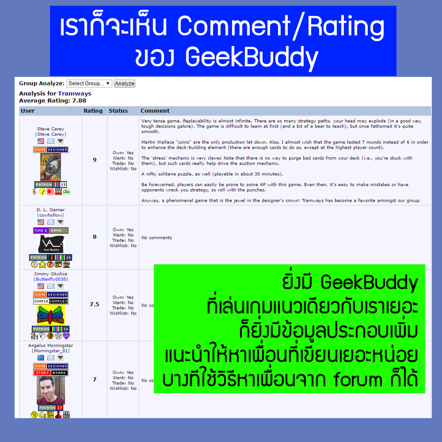

#bgg_tips คิดว่าเป็นทริคที่หลายคนน่าจะใช้อยู่แล้ว คือไปดู comment ที่คนอื่นเขียนถึงเกมนั้นๆ  ลองไปอ่านดูก็มักจะเจอข้อคิดเห็นในหลายแง่มุมดีนะ ข้อมูลจะค่อนข้างดิบแต่ว่าตรงไปตรงมา
.
ส่วน geek buddy นี้เป็นระบบที่เพื่มขึ้นมาอีกขั้น ไม่ค่อยเห็นคนใช้กันเท่าไรแต่ส่วนตัวผมคิดว่าสะดวกดี อย่างน้อยก็เป็นการ filter comment อย่างรวดเร็ว คัดเฉพาะคนที่เรารู้แนวอยู่แล้ว คือรู้สึกว่ามันดีกว่าไปตั้งกระทู้ถาม "เกม zzz นี้สนุกปล่าวครับ" เยอะเลย
.
แนะนำว่าไม่ต้องรีบร้อนอะไรก็ดูๆไปเรื่อยๆ add ไปเรื่อยๆ ปกติเวลาอ่านตาม comment หลายเกมคุณน่าจะสะดุดกับ comment ของ user หน้าเดิมๆบ่อยกว่าที่คุณคิด :)
.
ถ้าเห็นโพสนี้ครั้งแรกอย่าลืมแวะไปอ่าน "วิธีใช้งาน BGG Subscriptions" : https://goo.gl/ARSqQ4

