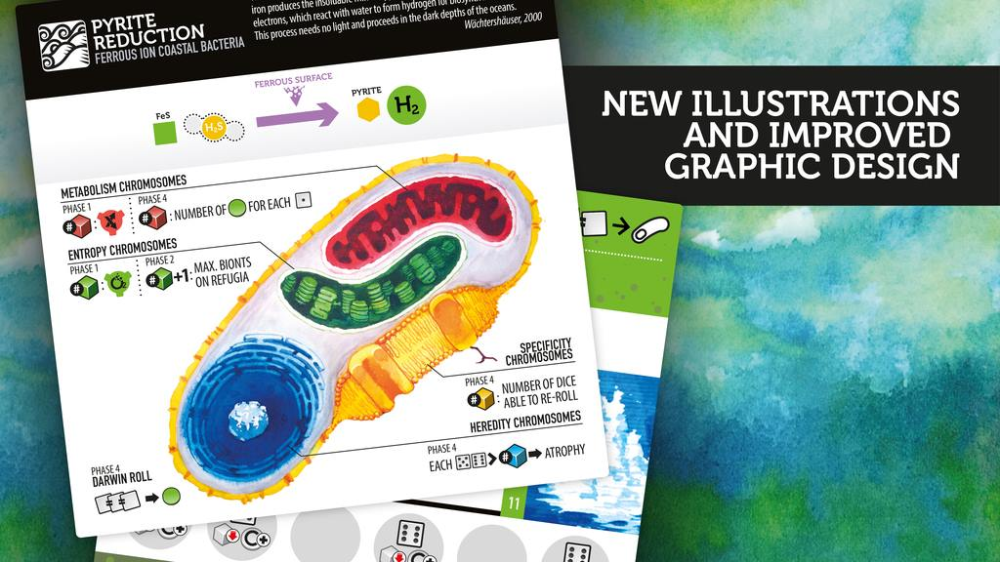
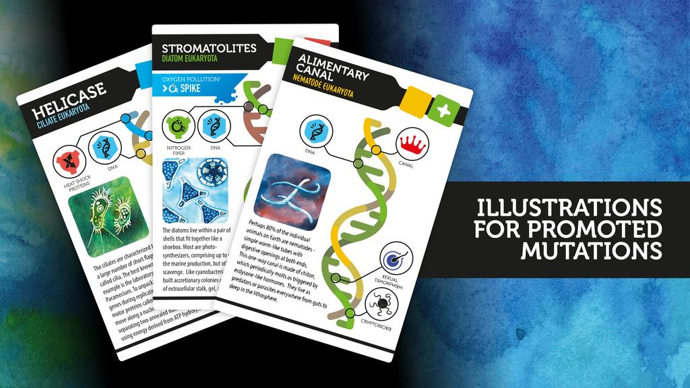

#news #ks เดี๋ยวเดือนนี้ (ประมาณวันที่ 12 เมษา ถ้าไม่มีอะไรพลาด) Bios : Genesis จะทำ KS ของฉบับ Second edition ออกมา ตัวเกมจับเอาเรื่องราวตอนกำเนิดโลกเราเล่นเป็นพระเจ้าหรืออะไรประมาณนั้นที่พยายามสร้างสิ่งมีชีวิตเซลเดี่ยวขึ้นมาพร้อมกับพยายาม จับเอาสารเคมีต่างๆมาเพื่อพัฒนาตัวเอง imho เกมนี้ค่อนข้างหนักไปทาง simulator มากกว่าเกม (อันเป็นปกติของ Phil Eklund)และค่อนข้างเหมาะไปทาง #ทีมโดดเดี่ยว (แต่เล่นได้หลายคนนะ)

- usd19 - ชุด upgrade จาก 1st edition
- usd39 - Bios : Genesis 1 ชุด
- usd58 - เกมพร้อมลายเซ็น + ชื่อลงหนังสือ
- usd59 - Bios : Genesis 1 ชุด + Pax Renaissance 1 ชุด 

ที่เอามาลงเพราะเห็นว่ามีชุด +Pax ด้วยราคาค่อนข้างคุ้มเผื่อใครอ่านรีวิวผมรอบก่อนแล้วสนใจ 

ต้องออกตัวไว้ก่อนว่าถึงผมจะชอบเกมของนักออกแบบคนนี้หลายเกม (เอาจริงๆก็สนุกตอนอ่านนะเปิดกะโหลกกะลามาก) แต่เกมของ Phil Eklund ก็เหมาะกับผู้เล่นเฉพาะกลุ่มมากๆ เพราะเกมมันเหมือนแบบจำลองที่เราไปยุ่งๆแตะๆมันได้นิดๆหน่อย พอเพลินๆ เนื้อหาลงลึก ถ้าไม่สนใจพอ(หรือไม่เก็ท)จะรู้สึกว่าเสียเวลาชีวิตมาก ว่ามาเล่นเกมเหี้ยไรเนี่ย แต่ถ้าอินแล้วจะสนุกมาก ในอีกแง่หนึ่ง Bios : Genesis อาจจะห่างไกลสำหรับ'เกมแรก' สำหรับนักออกแบบคนนี้ไปเยอะอยู่นอกจากว่าจะมีความรู้พื้นฐานทางสายนี้มาแน่นพอ

พ่วงนิดหน่อยว่า Bios : Megafuna 2 ที่จำลองการวิวัฒนาการของไดโนเสาร์เอามาทำใหม่แบบที่ให้มีสัดส่วนความเป็นเกมเพื่มขึ้นก็กำลังจะมาเช่นกัน (นึกภาพเกม Evolution ที่เนื้อหาลงลึกสัดๆ น่าจะใกล้เคียง) ตัวเก่านี้ยังไม่ทำอะไรอุกกาบาทตกใส่โลกรัวๆ เพลินดีแต่ก็อย่างที่บอกมันไม่ใช่เกม

รีวิว Pax Renaissance เงินตราขับเคลื่อนโลก : https://goo.gl/llk3qb

ที่มาข่าว : https://boardgamegeek.com/thread/1760523/kickstarter-coming-week-likely-date-wednesday-12th
รูปประกอบโดย : bgg user Caezar Al-Jassar.

