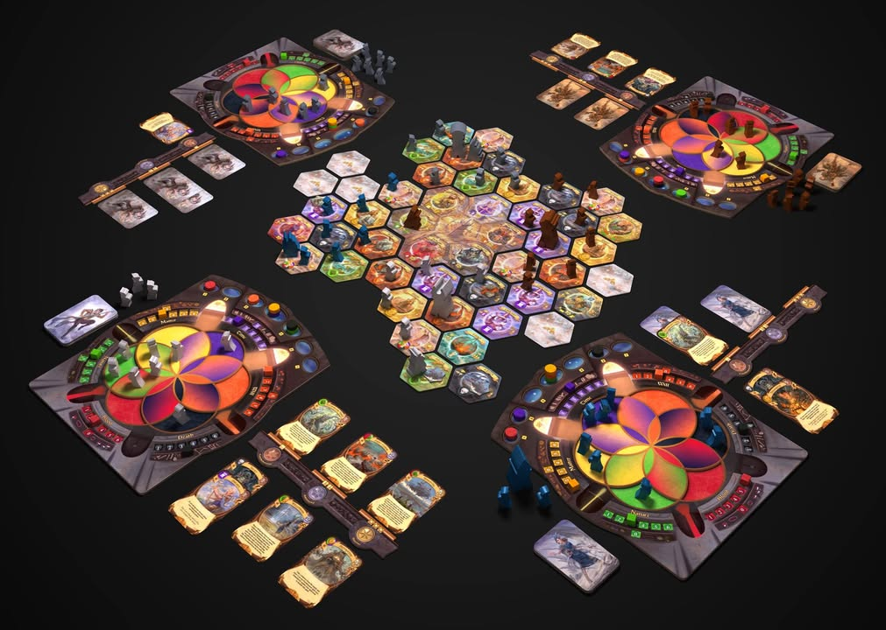

#เรื่อยเปื่อย #ks Archmage เป็นหนึ่งในเกมที่ผมกำลังเล็งๆอยู่ว่าจะจัดดีปล่าว คือมันเป็นเกมลักษณะที่ดูแล้วเชื่อได้ว่าถ้าไม่ back ตอนนี้ ตอนเกมออกมาไม่น่ามีร้านในเมืองไทยเอามาขาย (พูดยังกะปกติซื้อของจากร้าน) แต่ถ้า back ตอนนี้ก็รอไปเหอะ.....มาปีหน้าเลย
 
 
เท่าที่โหลดกติกามาอ่านผ่านๆก็คือเป็น Area control ที่เราต้องมายึดพื้นที่กัน ระหว่างเล่นก็สาดเวทมนต์ใส่ไล่ที่กันไป ที่ดูแล้วสะดุดตาจนอยาก back ก็คือระบบ tech tree ที่เป็นวงล้อ 6 อันซ้อนกัน ถ้าเรา up tech ไว้ตรงไหนจะ unlock การ์ดเวทมนต์ใบนั้นๆได้ จะเล่น level 2 ก็ต้องเอาเวทย์พื้นฐานสองอันมารวมกันขึ้นไป แต่การจะได้อันใหม่ที่แรงขึ้นมาแต่เราก็จะเสียอันพื้นฐานทั้งสองอันไปด้วย 
 
 
ส่วนระบบการโจมตีก็ไม่ได้ยุ่งยากเอาแค่ยอมเสียแต้มเดินแล้วก็ยกอีกฝ่ายออกเท่านั้นเอง จากที่อ่านก็คิดว่าตอนเล่นน่าจะไม่ยากมั้ง พอดีไม่รู้เวทย์มันใช้งานยังไงบ้างเลยไม่รู้ว่ามันจะสนุกไหม แต่คิดว่าไดนามิคหลักของเกมก็น่าจะเกิดจากการ up tech ผสมสายเป็นหลัก แต่การจะไปทางไหนได้ก็จะมีเรื่องของพื้นที่ที่ถูกสุ่มขึ้นมาประกอบด้วย (แผนที่ขนาดดูค่อนข้างเล็กน่าจะมี interact กันเยอะอยู่)
 
 
KS เกมนี้มี plague manager ด้วย ส่วนตัวผมคง back ทิ้งไว้ 1usd มั้งแล้วพอใกล้ๆส่งค่อยเพิ่มตัง น่าจะเสี่ยงน้อยสุด :P
 
 
ไม่รู้คิดไปเองไหมแต่เดี๋ยวนี้รู้สึกเหมือนร้านจะเอาเกม ks ยูโรใหม่ๆมาน้อยมาก หลายๆเกมดีๆนี้ไม่เห็นเงากล่อง ต้องใช้ช่องทางสั่งตรงกันตลอด ทั้งๆที่ผู้เล่นมีเยอะขึ้น เดาเอาเองว่าคงเพราะหน้าใหม่ยังอยู่ตรงระดับ family เป็นหลักไม่เหมาะจะ stock เกมระดับเกมเมอร์เท่าไร หรืออาจจะเพราะแค่เม็ดเงินมันไม่ค่อยคุ้มเท่าไรก็ได้  (เอาจริงๆอาจจะมีเยอะ แต่พอดีผมไม่ได้ตาม fb page ร้านเองก็ได้ ฮาๆ) 
 
 
link KS : https://www.kickstarter.com/projects/gamesalute/archmage/description

https://boardgamegeek.com/image/3578050/archmage

https://boardgamegeek.com/image/3584022/archmage

