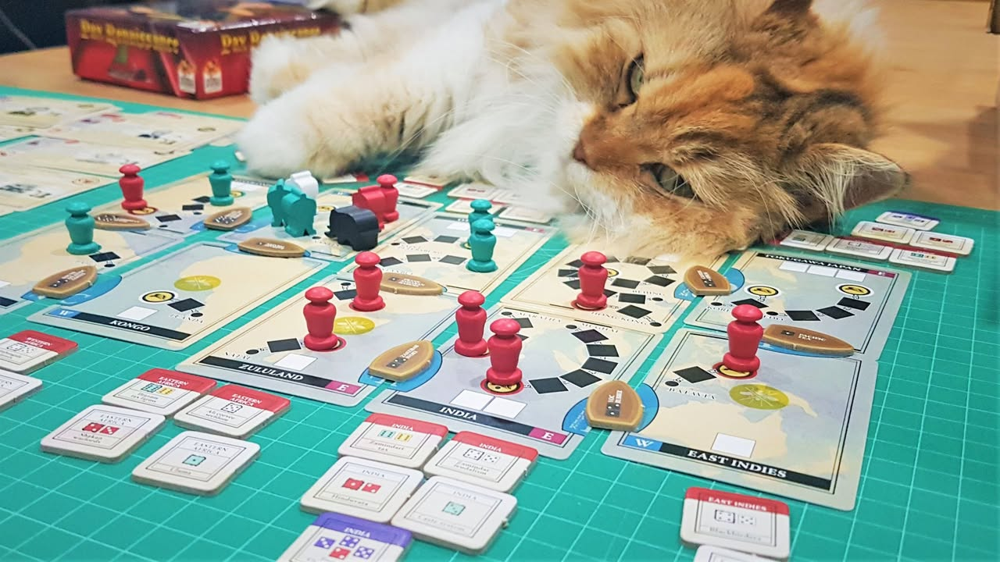

Pax Emancipation: ปลดโซ่ตรวนสู่อิสรภาพ #thought
ย่อหน้าค่อนข้างเยอะ แนะนำอ่านใน blog : https://wp.me/p7TSgy-2By
 
เกมในซี่รี่ย์ Pax รอบนี้ที่จะนำเราไปสู่ยุคเรืองปัญญา (Age of Enlightenment) ในศตวรรษที่ 18 ที่ความคิดเกี่ยวกับ 'สิทธิและเสรีภาพ' ของผู้คนในยุโรปกำลังผลิบาน ในขณะที่ช่วงเวลานั้นยังมีผู้คนมากมายถูกพรากสิ่งที่เรียกว่า 'เสรีภาพ' ออกไปและถูกกระทำในฐานะสิ่งของและแรงงานที่เรียกว่า 'ทาส' เราจะได้รับบทเป็นกลุ่มคนที่จะมาช่วยมอบอิสรภาพแก่ทาสทั่วโลกผ่านการทำลายกฎหมายอันไม่ชอบธรรม กำจัดนักค้าทาส สนับสนุนเส้นทางหลบหนี รวมไปถึงมีส่วนในการออกกฎหมายเพื่อสนับสนุนสิทธิของผู้คน ผลงานของ Phil Eklund (Pax Series , Bios Series, High Frontier)
 
 
--------------------------------------
Disclaimer 
 
(1) ผมเป็น 'ติ่ง' ของทั้งค่ายและตัวนักออกแบบ ซื้อเกือบทุกเกมที่ออกมา โปรดระวังอคติจากข้อคิดเห็น เนื่องจากเกมนี้ต้องเล่นด้วย mindset ที่แตกต่างจากเกมยูโรทั่วไปเป็นอย่างมากเช่นเดียวกับเกมอื่นๆของค่ายนี้ 
 
 
(2) ณ ตอนที่บทความนี้ออกมาผมกำลังเปิดรับ preorder เกมอื่นจากทางค่าย แต่ข้อเขียนนี้ไม่ได้ทำมาเพื่อจุดประสงค์ทางการค้า (ถ้าสนใจให้สั่งตรงที่เวบผู้ผลิตได้เลย) แต่เขียนเพียงเพื่อนำเสนอความคิดของตัวเองเช่นเดียวกับข้อเขียนอื่นที่เคยทำมา
--------------------------------------
 
 
"มนุษย์ทุกคนล้วนเป็นเจ้าแก่ตนเอง ไม่อาจมีใครช่วงชิงสิ่งนี้ไปจากตนได้" - จอห์น ล็อก
.
"Every man has a property in his own person. This nobody has a right to, but himself." - John Locke 
.
(นักปรัชญาชาวอังกฤษ แนวคิดของเค้ามีผลกระทบหลายอย่างต่อกฎหมายในยุคปัจจุบัน)
-------------------------------------- 
 
เกมนี้เป็นเกมแนวช่วยกันเล่น (co-op) ที่สามารถเล่นแข่งกันได้ด้วย สนามของเกมคือแผนที่โลกยุคศตวรรต 18 ที่ยังมีทาสอยู่ทั่วโลก เราก็ผลัดกันทำแอคชั่นเพื่อส่งเสริมให้ทาสถูกปลดปล่อย พอการ์ดหมดกองเป็นอันจบยุคก็ดูว่าผู้เล่นแต่ล่ะคนผ่านเงื่อนไขขั้นต่ำของเองไหมถ้ามีคนหนึ่งไม่ถึงก็แพ้หมด ถ้าเราเล่นแบบแข่งขันกันก็จะมีเล่นต่ออีกนิดนึงเพื่อดูหลังจากผ่านพ้นยุคสมัยนี้ไปแล้วใครช่วยสนับสนุนการปลดปล่อยทาสได้ดีกว่ากัน (คล้ายๆร่วมกันป้องกันโลกร้อนจากมลพิษใน CO2 ของ Vital)
 
 
ในภาพรวมเกมนี้ชวนให้นึกถึง Pandemic แบบกลับทิศทางนิดหน่อย คือในเกมนั้นจะมีเชื้อโรคมาแล้วเราต้องไปลดมันใช่มะ แต่เกมนี้เราจะมีที่ว่างๆแทนเสมือนว่ามีทาสอยู่ แล้วเราต้องไปหาทางเอาคนงานสีของเราไปวางแทนเพื่อบอกว่าเราเป็นคนช่วยปลดทาสที่ตรงนี้ พอจบรอบจะมีการทอยเต๋าเช็คในพื้นที่ที่เราเข้าไปยุ่งดูว่าจะเกิดเหตุการณ์อะไร ซึ่งในแต่ล่ะพื้นที่ก็จะมีของที่ทำให้เราลำบากอย่างพวกกฎหมายที่สนับสนุนการค้าทาส ผลที่เกิดก็จะเป็นจำพวกทาสที่เราปล่อยมาหายไป หรือมีการต่อต้านเกิดขึ้นในพื้นที่นั้น ถ้ามีมากพอมันก็จะลามกระจายไปพื้นที่ข้างๆ (เหมือน Outbreak ใน Pandemic) ระหว่างเล่นเราจะค่อยๆกำจัดมันออกไปเพื่อทำให้เรามอบอิสรภาพได้ง่ายขึ้น
-------------------------------------- 
 
บทบาทที่เราจะได้รับมีอยู่สามแบบ (เกมเล่นได้หนึ่งถึงสามคน)
 
 
รัฐสภาอังกฤษ : ฝ่ายเดียวที่สามารถผลิตทหารเรือ อันเป็นสิ่งเดียวที่สามารถเอาไว้ทำสิ่งที่เรียกว่า Gunboat Diplomacy ซึ่งเป็นการทูต(?)แบบที่ใช้เอาเรือรบมาจอดกดดันเพื่อบังคับให้ฝ่ายตรงข้ามยอมทำตาม ในมุมของเกมเราทำเพื่อปลดปล่อยทาส (เอาจริงๆมันก็ต้องมีเรื่องอื่นมาพ่วงด้วยแหละ) แต่ในมุมประวัติศาสตร์ประเทศที่โดนก็แน่นอนว่าย่อมไม่ฟิลกู๊ดเป็นแน่ อย่างเรือดำของเพอรี่ที่มาจอดที่ญี่ปุ่นงี้ หรือกระทั้่งตอนที่ฝรั่งเศสเอาเรือมาปิดอ่าวสมัย ร.5 เป้าหมายขั้นต่ำคือการที่เราต้องมีเจ้าหน้าที่ประจำการในแผนที่ให้มากกว่าเรือนักค้าทาส 
 
 
ศาสนจักร : เหล่ามิชชันนารีที่มีเป้าหมายในการปลดปลอยทาสในเชิงศาสนา (มนุษย์ถูกสร้างมาอย่างเท่าเทียมกัน) โดยปกติแล้วการส่งเจ้าหน้าที่ไปประจำการจะต้องมีค่าใช้จ่ายในเกมจำนวนมาก แต่ว่าเหล่านักบวชสามารถพาตัวเองลงไปในพื้นที่ได้โดยไม่เสียค่าใช้จ่าย (เป็นผลจากความอุทิศตัว และแรงสนับสนุนจากโบสถ์) เป้าหมายถือการที่ในแผนที่เราทำการปลดปล่อยทาสได้จำนวนเยอะพอ
 
 
พ่อค้าและนักปรัชญา : เหล่านักคิดมากอุดมการณ์(และมีเงิน) ข้อได้เปรียบคือการที่มีการบริหารจัดการที่ดีทำให้สามารถส่งคนไปประจำการได้โดยไม่ต้องพะวงกับเรื่องหนี้สิน เป้าหมายคือการลดกฎหมายริดรอนสิทธิ์เสรีภาพทั่วโลกให้อยู่ในจำนวนที่กำหนด
--------------------------------------
 
เวลาเล่นเอาจริงๆแล้วไม่ได้ซับซ้อนเท่าไร เราก็พยายามทำเป้าหมายเราไป ถ้ามีเวลาว่างก็ไปช่วยเงื่อนไขคนอื่นบ้าง แรกๆมันจะลำบากนิดนึงเพราะพวกกฎหมายกับเส้นทางค้าทาสมันทำให้เราเล่นยากเพราะเงื่อนไขทอยเต๋ามันจะทำร้ายเราบ่อยกับเราต้องจ่ายเงินแพงมาก พอเริ่มร่วมมือกันเก็บทิ้งตามเป้าหมายตัวเองไปบ้างคนอื่นๆก็จะเริ่มเล่นง่ายขึ้นล่ะ แอคชั่นหลักๆเลยมีแค่นี้เลย 'หาเงิน' กับ 'จ่ายเงินไปเอาของบางอย่างออก' ที่เหลือก็เป็นพวกแอคชั่นรองที่ทำให้กระแสการเล่นของเราลื่นไหลขึ้น เพราะรอบการเล่นมีจำกัดต้องพยายามใช้รอบให้คุ้ม แต่ถ้าเล่นแบบแข่งขันกันก็ต้องพยายามเอาดีเข้าตัวเยอะหน่อย เพราะพอทุกคนผ่านยุคแรกไปได้เราก็ต้องมาวัดแต้มกันต่อ  
 
 
อย่างที่บอกว่าระบบการเล่นในแต่ล่ะแอคชั่นถือว่าตรงไปตรงมามาก ความหนักของเกมจะเกิดจากการที่เราต้อง setup สภาพของกระดานให้เหมาะกับการทำแอคชั่นอื่นๆ รวมไปถึงเงื่อนไขขั้นต่ำของแต่ล่ะฝ่าย ทำให้เกิดความคิดทับซ้อนกันไปเรื่อยๆจนดูเหมือนจะไม่รู้ว่าจะทำอะไรดี เพราะด้วยลักษณะความเปิดของเกมทำให้เราหลงทางได้ง่ายพอควร แต่เกมไม่มี interlock กันสูงกันแบบไม่รู้จะไปทำตรงไหนดีไรงี้นะ
-------------------------------------- 
 
เกมมีกติกาสองแบบคือแบบธรรมดากับระดับสูงที่มีแอคชั่นให้ทำเพิ่ม ในมุมการเล่าเรื่องก็ถือว่าเข้มขึ้นไปอีกหน่อยเพราะเราต้องมาสนับสนุนแนวคิดแบบต่างๆในแต่ล่ะพื้นที่ของโลกให้เป็นไปในทิศทางที่เราต้องการ คุณจะเปลี่ยนผ่าน 13 อาณานิคม(ที่ต่อมาจะกลายเป็นสหรัฐอเมริกา) เข้าสู่ยุคใหม่ผ่านสงครามกลางเมือง (แนวคิดฝั่งขวาจัด-การปฎิวัติโดยทาส) หรือจะต่อต้านแนวคิด "ห้ามจัดเก็บภาษีหากไม่มีผู้แทน" (แนวคิดฝั่งซ้ายจัด-สิทธิและหน้าที่) ก็ได้ ในเชิงเกมก็หนุนด้านไหนก็จะมีแต้มสำหรับแต่ล่ะฝ่ายแตกต่างกันนั้นแหละ ระบบการเล่นก็งอกมาไม่มากเท่าไร แต่ถ้าไม่คล่องเกมแบบธรรมดาก็ถือว่ายึกยักหลายอย่างอยู่เหมือนกัน
-------------------------------------- 
 
เกมจะมีตั้งแต่รอบการเล่นสั้นๆสบายๆอย่าง

รัฐสภาอังกฤษมีมติให้สนับสนุนแนวคิดตลาดเสรีของ Laissez-faire กับ การพิจารณาคดีโดยลูกขุน (Trial by jury) (เอาคนงานสองตัวไปลงบนการ์ดสองใบแล้วจ่ายเงิน มีผลทำให้เราได้รับแอคชั่นของการ์ดนั้น) 
.
ผลของมันคือเราได้ทำแอคชั่นแนวคิดแบบตะวันตก (westernize) ช่วยให้เกิดการปลดปล่อยทาสได้กว่า 2 ล้านรายใน 13 อาณานิคม (การวางมีเปิ้ลไว้สองตัวบอกว่าเราเป็นคนช่วย) น่าเสียดายที่ทอยเต๋าออกมาแล้วผลออกมาว่าทาสจำนวนหนึ่งถูกทำร้ายโดย Ku Klux Klan (ไอ้ที่ใส่ชุดคลุมสีขาวๆต่อต้านคนดำในอเมริกานั้นแหละ) 
 
 
ไปจนถึง รอบที่การเล่นมี Chain ต่อเนื่องซับซ้อนอย่าง
 
 
โบสถ์ได้ส่งคนเข้าร่วมปฎิวัติในฝรั่งเศส (Lafayette - การปฏิวัติเดือนกรกฎาคม - June Rebellion หรือ the Paris Uprising of 1832) พร้อมกับส่งคนเข้าสนับสนุนองค์กรต่อต้านประชาธิปไตยตะวันตก (anti-west democracy) (เอาคนงานสองตัวไปลงบนการ์ดสองใบแล้วจ่ายเงิน) 
.
จากนั้นองค์กรที่เราส่งคนไปทำงานมีผลทำให้เราได้ทำแอคชั่น โหวต (Plebiscite) ซึ่งทางโบสถ์ได้ล๊อบบี้ให้เงื่อนไขเหมาะกับปฎิวัติในฝรั่งเศสพอดี เนื่องจากก่อการปฎิวัติสำเร็จผู้ร่วมขบวนการณ์ทุกคนจะได้รับสิทธิ์พิเศษเพิ่ม
.
เนื่องจากทางโบสถ์ที่ส่งคนเข้าร่วมไปแล้วสองคนก็ได้ขอให้เลิกกฎหมายเกลือ (Gabelle tax การลดกฎหมายจะช่วยเล่นง่ายขึ้น และนับเป็นแต้มจบเกม) พร้อมกับจมเรือค้าทาส จากนั้นฝรั่งเศสก็ได้เปลี่ยนถ่ายสู่ยุคสมัยใหม่ (Modernized) ผลคือจะมีการทอยเต๋าเช็คที่จุดนี้น้อยลง
 
 
ก็วนๆไปงี้ประมาณ 10 รอบก็จบเกมล่ะ
--------------------------------------
 
 
🐸 [กบชอบ] --  เกมนี้ยังคงเป็นส่วนผสมพิลึกๆของตำราเรียนที่ต้องอ่านประหนึ่งไปเตรียมสอบที่เอามารวมร่างกับแบบจำลองเช่นเคย แต่ว่าฝั่งเกมมันชัดเจนขึ้นเยอะ เพราะมีเป้าหมายในการเล่นที่ชัดเจนไม่เปลี่ยนไปมาไหลไปตามการ์ดแบบเกมอื่นๆของค่าย เพราะบทของผู้เล่นแต่ล่ะสีมันกำหนดมาล่ะว่าขั้นต่ำต้องผ่านเงื่อนไขอะไรบ้าง 
 
 
ถ้ามองเป็นเกมอย่างเดียวก็คือเกมบริหารเงินเอาไปทำแต้มตัวเองพร้อมกับกั๊กคนอื่นบ้างแต่ถ้าเอาเงินไปยื้อกันเยอะเราอาจจะล่มจมไม่ผ่านเงื่อนไขขั้นต่ำ (หวังว่าเราคงไม่มีคนจิตใจต่ำช้าขนาดอยากให้คนทั่วโลกยังอยู่ในระบบทาส) ที่เหลือเรื่องธีมล้วนๆ ส่วนตัวคิดว่าถ้าเล่นแบบแข่งขันกันเล่นโหมดขั้นสูงจะน่าสนใจกว่า ข้อดีคือพอเราก่อการปฎิวัติจนชาติโลกที่สามมีแนวคิดอันดีงามแล้ว เราจะสามารถออกคอมโบสร้างกฎหมายที่เอื้อประโยชน์กับเราได้ด้วย (หรือกระทั้งทำเรื่องเลวๆเชิงธีมอย่างคอรัปชั่นเพื่อแกล้งผู้เล่นอื่นในเกมแบบแข่งขัน)
 
 
ในฝั่งการเล่าเรื่องก็ถือว่าหนักแน่นเหมือนเดิมตามแบบฉบับของค่ายนี้ น่าเสียดายที่ผมไม่ค่อยอินฝั่งกฎหมายที่เกมพยายามนำเสนอมากนัก มีแนวคิดเรื่องปรัชญากับประวัติศาสตร์ฝั่งการเมืองประกอบเยอะพอดู (คิดว่าคนเล่นสายกฎหมายน่าจะอินกว่าผมมั้ง?) แต่ก็เป็นเกมที่ระหว่างอ่านรูลไปได้สามบรรทัด ต้องโดดไปอ่าน footnote สี่บรรทัดพร้อมกับตามด้วยเปิด google/wiki อีกครึ่งชั่วโมงเสมอ เพราะอยากรู้มากว่ามันเกี่ยวกับอะไร (แล้วภาษาแบบกฎหมายนี้อ่านยากฉิบ)ทุกสิ่งอย่างล้วนมีที่มาที่ไป พอเก็ทแล้วจะรู้สึกว่าเจ๋งดี 
 
 
ในแง่การเล่นแล้วเกมนี้ไม่ใช่เกมหนัก แต่กติกานี้กว่าจะย่อยได้นี้หนักอยู่ วิธีการเล่นหลักจากเข้าใจแล้ว ถือว่าตรงไปตรงมามาก แค่ทำแอคชั่นหลักอย่างส่งคนไปประจำการ / ปลดปล่อยทาส / หาเงินไปทำแอคชั่น จากนั้นก็ทอยเต๋าเช็คอะไรนิดหน่อย ก็จบรอบการเล่นแล้ว เกมมีรูลอยู่สองโหมดคือแบบธรรมดากับขั้นสูง ส่วนตัวแนะนำให้ลองเล่นธรรมดาก่อนให้พอเก็ท flow แล้วค่อยไปอ่านแบบขั้นสูงเพราะถึงวิธีการเล่นจะไม่วุ่นวาย แต่เงื่อนไขที่มันต้องการมันก็มีการแอบโยงกันไปมาพอควร
 
 
ถ้าเล่นมันในฐานะ 'เกม' อย่างเดียวก็จะพบว่ามันเป็นเกมธรรมดาๆที่มีกติการองอัดแน่นเต็มไปหมดเช่นเคย ไม่เหมาะกับคนไม่อิน แต่เช่นเดียวกับเกมอื่นในค่ายนี้ที่ความสนุกมันจะขึ้นได้ถึงขีดสุดต่อเมื่อคุณเป็นคนอ่านรูลมาเอง หรือเข้าใจจริงๆว่าทุกแอคชั่นที่เรากำลังทำมันมีผลหรือจำลองอะไรออกมาจากโลกความจริง คือถ้าไม่อินธีมก็อาจจะรู้สึกว่าช่างไม่คุ้มค่ากับเวลาที่เสียไปเลย แต่ถ้าเก็ทแล้วล่ะก็การชิงพื้นที่แก้สถานะการณ์ให้รอดพร้อมกับหาทางเป็นที่หนึ่งก็ถือว่าน่าสนใจดี 
 
 
ในแง่กติกาโดยรวมผมคิดว่าเขียนดีขึ้นกว่าเกมอื่นนิดหน่อย (แต่ก็นิดเดียวเท่านั้นแหละ) ข้อเสียแบบที่เห็นประจำของค่ายนี้คือรูลมันชอบใช้คำเฉพาะทางแปลกๆที่ไม่ได้สื่อในเชิงธีมแต่ไม่ได้อธิบายว่ามันเป็นการทำแอคชั่นอะไร แถมมันชอบจะแนะนำคำแปลกๆแบบที่ไม่ค่อยบอกอะไรเท่าไร แต่ค่อนข้างการันตีว่าถ้าทำตัวงงๆอ่านไปเรื่อยๆมันจะเฉลยในอีกสองสามหน้านั้นแหละ ตรงนี้ก็ถือเป็นส่วนสำคัญที่ทำให้คนเค้าอ่านรูลเกมนี้ช้า เพราะเราเองก็จะพยายามหาว่าไอ้คำนี้มันคืออะไรฟระต้องเปิดหาไปๆมาๆ ส่วนหนึ่งก็เกิดจากการออกแบบตัวเกมด้วยที่เฟสครึ่งแรกมักจะต้องพึ่งสถานะจากเฟสที่อยู่ครึ่งหลังของรอบก่อนหน้าตลอด
 
 
ข้อเสียเล็กๆอีกเกมหนึ่งคือตอนชนะไม่ค่อยรู้สึกว่าได้เป็นฮีโร่ผู้มอบอิสระภาพให้กับผู้คนเท่าไร (แบบใน Pandemic ที่ลุ้นเยอะหน่อยเพราะการ์ดท้ายๆเกมเรารู้ odd) ซึ่งก็น่าเสียดายนิดๆเพราะเกมมันมีเนื้อหาเยอะแยะมากมานำเสนอ แต่มาคิดอีกทีในความเป็นจริงถ้าต้องมา romanticized เรื่องแบบนี้ก็มันก็จะดูฝืนเยอะไปหน่อย สรุปก็จบอย่างที่มันเป็นอยู่ก็คือดีแล้วมั้ง
 
 
แน่นอนว่ามันไม่ใช่เกมประเภทที่ผมจะชวนใครต่อใครเล่นนอกจากจะเป็นคนที่อ่านรูลเกมนี้มาแล้วอยากหาเพื่อนเล่น อย่างที่ผมบอกอยู่ทุกครั้งว่าเกมค่ายนี้มันเป็นความสนุกเฉพาะทาง (ในเชิงเกมแล้วกติกาโคตร Overly Complex) หลายๆครั้งความสำเร็จสูงสุดของเกมค่ายนี้คือ อ่านและศึกษารูลกับพื้นหลังของเกมจนเข้าใจแล้ว จากนั้นก็ solo คนเดียวพร้อมกับความอื้อหือคิดได้ไง ก่อนจะเก็บกลับใส่กล่องไป เหมือนกับว่าสอบผ่านได้เกรดเอล่ะกลับบ้านได้ คือมันเป็นเกมแบบที่จ่ายเงินเพื่อบังคับตัวเองให้ซื้อประสบการณ์และเปิดโลกในการหาความรู้ใส่หัวที่เจ๋งมากเกมหนึ่งสำหรับผมเลยล่ะ ก็ค่อนข้างน่าเสียดายที่ผมไม่มีความรู้เชิงประวัติศาสตร์กฎหมายพอที่จะยกเกร็ดอะไรมาเขียนประกอบ เพราะมันไม่ใช่เรื่อง common sense เหมือนการดิ้นรนของสิ่งมีชีวิตอย่างเกมอื่นของค่ายนี้ 
-----------------------------------------

😍 กบโปรด - อวยไส้แตก ยากมากที่เล่นแล้วจะรู้สึกไม่สนุก
.
😁 กบชอบ - พร้อมจะเล่นตลอด
.
🙂 กบโอเค - ชอบในบางแง่มุม แต่อาจจะเล่นไม่บ่อยหรือเล่นแค่บางอารมณ์
. 
😐 กบเฉย - ไม่ได้เกลียดอะไร ถ้าไม่มีตัวเลือกอื่นก็เล่นได้อยู่
.
🖕 กบไม่เล่น - ไม่ตรงจริต ชวนไม่เล่น
.
อนึ่ง : เป็นความรู้สึกในความ "อยากจะหยิบมาเล่นไหม?" ของผมเอง ไม่ได้เกี่ยวอะไรกับคุณภาพของเกม ดูให้เป็นแค่ "อีกความคิดเห็นหนึ่ง" เท่านั้นก็พอนะครับ :)
.
ข้อเขียนที่ยาวหน่อยถ้าใน fb อ่านยากสามารถไปอ่านใน boardnbon.wordpress.com ได้ครับจะจัดหน้าดีกว่านี้
-------------------------------------------

