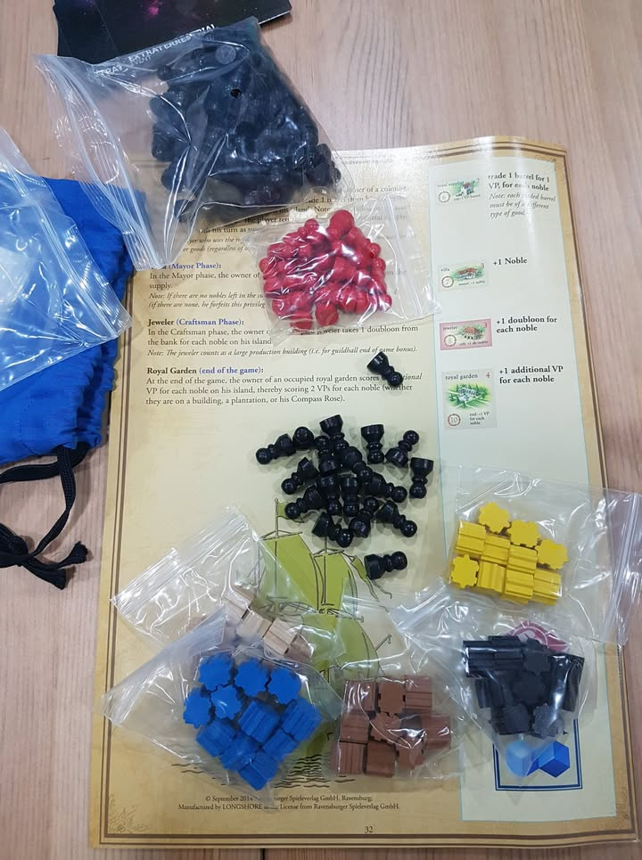
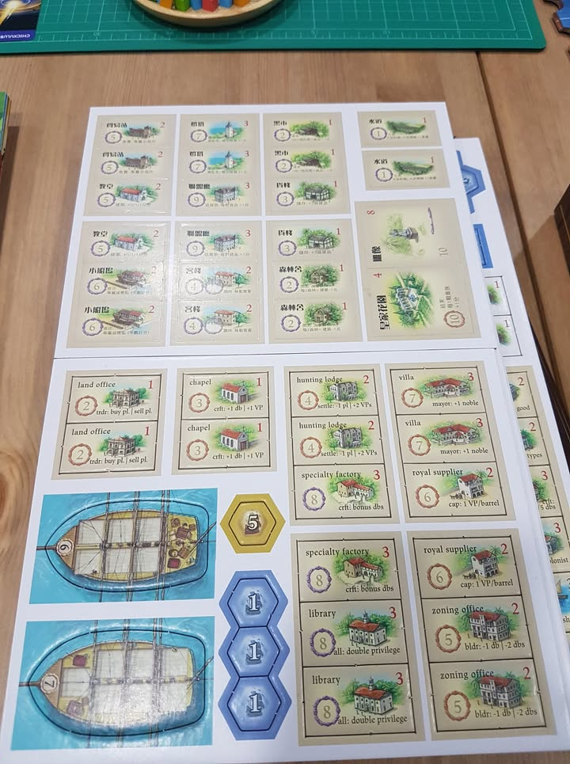
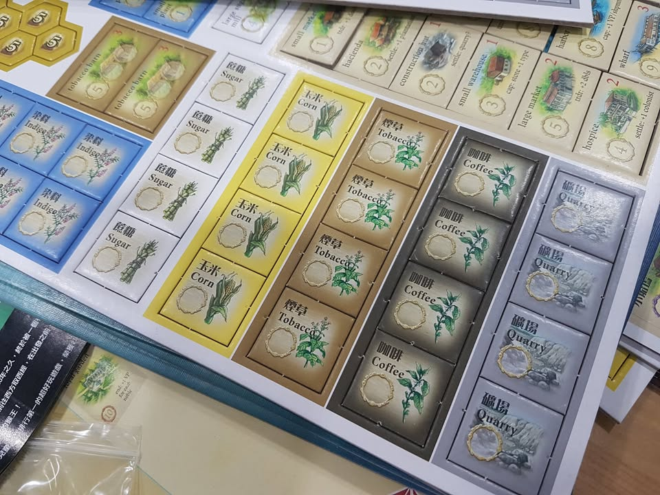
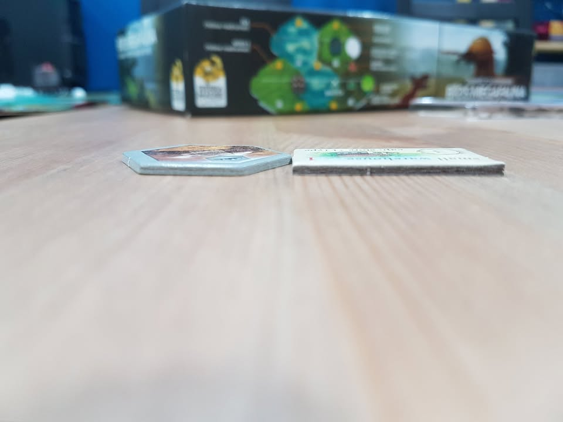

#mini_unbox Puerto Rico ลิขสิทธิ์จีน (มีสองภาษา CN/EN) 
 
 
ส่งที่ทำให้ผมสนใจฉบับนี้คือความที่มันใช้งานอาร์ทแบบเดียวกับกล่องรุ่น Deluxe ครบรอบ 10 ปีเนี่ยล่ะ (ที่ตอนนี้กล่องล่ะ 7xxx บาทเป็นอย่างน้อย) ซึ่งถือว่าสวยงามดี เกมนี้เป็นอีกเกมที่ผมเองอยากจะติดบ้านไว้ แต่ว่าพอดีเล่นตัว Deluxe ของเพื่อนแล้วเคยตัว ไม่ค่อยอยากเล่นตัวเก่าที่งานอาร์ทไม่ค่อยสวยเท่าไร (เหมือน Anachrony ใครขี่หุ่นแล้วกลับไปเล่นตัวธรรมดาไม่ได้หรอก......ฮา)
 
 
แล้วมันดีจริงไหม? ส่วนตัวคิดว่าคุ้มกับราคาที่จ่ายไปครับ เพราะได้งานอาร์ทใหม่ พร้อมกับตัวเสริมครบ งานพิมพ์คมชัด ไทล์กระดาษแข็งแรงไม่บาง
 
 
แล้วมันเหมือนรุ่น Deluxe เป๊ะๆเลยไหม? คำตอบคือ 'ไม่ครับ'
.
• มีสองภาษาด้านหนึ่งจีน ด้านหนึ่งอังกฤษ ไม่ปนกัน (ยกเว้นไทล์พืชไร่)
.
• คู่มือสองภาษา
.
• กล่องนี้ไม่มีเหรียญเหล็ก (ก็แน่ล่ะ)
.
• คุณภาพของไทล์ แม้จะถือว่าดี แต่ตัว Deluxe ก็ยังดีกว่า (ตีแบบมั่วๆก็ซัก 1.5 เท่า) คือตัว Deluxe จะมีความมันวาว และกระดาษหนากว่า
.
• ตัวคนงานฉบับจีนเหมือนจะเอาตัวเบี้ยหมากรุกฝรั่ง (พอน) ขนาดเล็กมาใช้ อันนี้ในแง่ความสวยงาม ผมคิดว่าสวยกว่าตัว Deluxe นะ (อันนั้นเป็นแท่งหกเหลี่ยม) แต่ในแง่ใช้งานมันก็กลิ้งหล่นง่ายกว่าจัดวางก็ยากกว่า
.
• 'ข้อเสีย' ของอันนี้คือตัวกล่องเหมือนมันชีลมาแน่นไป มันก็จะบีบๆเบี้ยวๆตรงนั้นนิดตรงนี้หน่อย (ผมสั่งมาสองกล่องเป็นทั้งคู่)
  
 
กล่องนี้ผมสั่งมาจากร้านเกมในฮ่องกง แต่ว่าเท่าที่ดูใน Taobao ก็มีของนะเพียบเลย ราคาของแท้กับของเก๊จะเห็นเลยว่าต่างกันลิบกดไม่ผิดแน่ๆ (ของแท้ 26x หยวน ก็ประมาณ 13xx บาท) ผมสั่งมาราคารวมส่งไม่โดนภาษีประมาณ 2 พันต้นๆ ตอนคุยก็วุ่นวายนิดนึงเพราะร้านที่คุยไม่เคยส่งของมาไทยมาก่อน แต่รวมๆก็ถือว่าราบรื่นดี (แต่เห็นว่าถ้าเอาซื้อจาก Taoboa ผ่านชิ้บปิ้งอาจจะได้แถวๆ 18xx-19xx แต่ผมไม่ยืนยันนะ เพราะไม่เคยใช้วิธีนี้เอง) ส่วนจาก aliexpress ผมเห็นแต่ของก๊อปนะ
 
 
ส่วนเรื่องคุณภาพไทล์ไว้ถ้ามีโอกาสจะถ่ายเทียบกับตัว Deluxe มาให้ดู แต่เท่าที่มันเป็นอยู่ก็สมราคาครับ ไม่ต้องกลัวว่ามันจะห่วย
  
 
Note: กล่องนี้มีแฟนเพจคนหนึ่งเคยเอามาให้ผมดู บอกว่าได้กล่องนี้มานานล่ะแต่ไม่อยากแชร์ เพราะไม่อยากตอบคำถามเรื่องแท้ไม่แท้เท่าไร แต่อันนี้ผมตรวจสอบดูแล้วว่าได้ลิขสิทธิ์แท้แน่นอนครับ 
 
 
Note: เรื่องแปลกที่ผมเองก็พึ่งรู้คือภาษาอื่นที่ไม่ใช่อังกฤษเนี่ย เค้ามีฉบับ Second Edition ที่ใช้ตัวอาร์ทสวยๆกันหมดแล้ว เกาหลี/บลาซิล/ฟินแลนด์/ฝรั่งเศส ฯลฯ ไรงี้ แถมมีกันตั้งแต่หลายปีแล้วด้วยนะ จริงๆเกมนี้ถ้ามีคนซื้อตัว Second Edition มาทำภาษาไทยผมคิดว่าเหมาะมากๆ
.
ภาษาอังกฤษจะยังไม่มีงานอาร์ทนี้ อย่างน้อยก็ในระยะเวลาใกล้ๆนี้ เกิดจากการถือลิขสิทธิ์ฉบับภาษาอังกฤษที่ Ravensburger ไม่ยอมให้ Rio Grande Games ใช้อาร์ทใหม่, ที่มา: https://goo.gl/h6wbjX 
.
ตัวอย่างภาษาโปแลนด์ของ Second Edition: https://goo.gl/quaHSS
.
ส่วนข้อมูลภาษาอื่นก็ตามนี้: https://goo.gl/mAZhMs

กระดาษสีครีมที่คาดอยู่นี้บางมาก มีไม่มีไม่ต่างกัน เอาไปทิ้งได้เลย

กล่องเป็นสองชั้น ชั้นนอกก็แข็งแรงดี

ตัวคนงานใช้ตัวหน้าตาแบบพอนในหมากรุกสากล แทนที่จะเป็นแท่งหกเหลี่ยมแบบใน Deluxe (ตัวธรรมดาเป็น disc 6mm)

ไทล์มีหน้าหลังคนล่ะภาษา

เฉพาะไทล์พืชไร่ที่จะมีสองภาษาในหน้าเดียว เพราะอีกด้านเป็นความลับ

ไทล์เทียบความหนากับของ Terraforming Mars คุณภาพกระดาษไม่แน่นเท่า แต่ก็ไม่ใช่กระดาษแบบพองๆห่วยๆนะ

