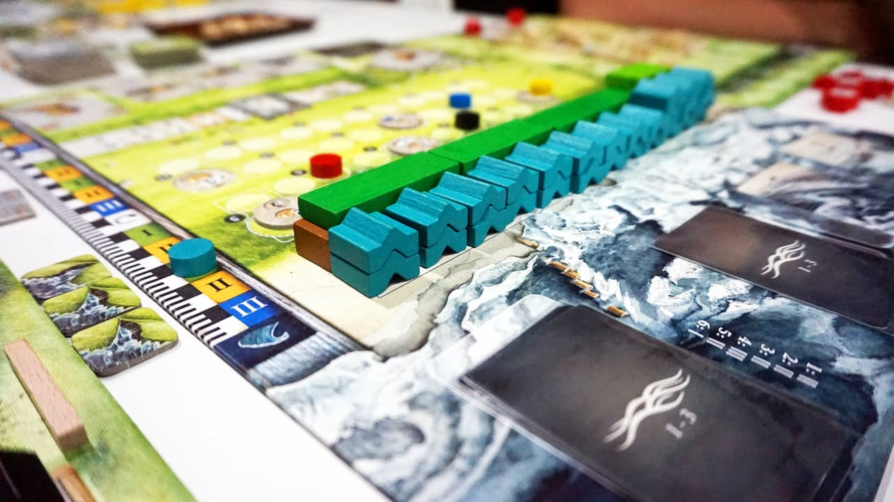

Lowland #thought #first_impression
blog link: https_://wp.me/s7TSgy-lowland

เกมยูโรระดับกลางที่จะให้เรามาทำฟาร์มเลี้ยงแกะริมทะเลในประเทศแถบยุโรปตอนเหนือ ที่ซึ่งปัญหาคือพื้นดินแถวนั้นดันต่ำกว่าระดับน้ำทะเลโคตรๆ เลยนอกจากจะต้องทำฟาร์มเลี้ยงแกะสุขสรรค์แล้วเรายังต้องคอย(ช่วยกัน)สร้างเขื่อนกั้นน้ำไม่ให้น้ำทะเลทะลักเข้ามาอันจะทำให้ฟาร์มของเราเสียหาย ผลงานจากนักออกแบบหน้าใหม่ Claudia Partenheimer และ Ralf Partenheimer
 
 
แว๊บแรกด้วยรูปลักษณ์และงานศิลป์ของเกมคุณอาจจะนึกว่าเกมนี้เป็นผลงานของ Uwe Rosenberg เพราะว่าแกะก็ใช่ ทำฟาร์มก็เหมือนจะคล้าย All Creatures Big and Small นิดหน่อย แถมดันมีทำเขื่อนกั้นน้ำแบบ Field of Arle อีกต่างหาก แต่ขอบอกเลยว่านอกจาก 'กลิ่น' แล้วตอนเล่นเกมนี้ไม่มีความรู้สึกว่ากำลังเล่นเกมของ Uwe เลยนะ
 
 
เกมนี้ถูกขับเคลื่อนด้วยระบบ Action Point Allowance (แต่ล่ะรอบมีแต้มให้เอาไปแลกทำแอคชั่นตามใจ) ที่ผู้เล่นจะมีคนงานคนละสามตัวไปทั้งเกม คนงานแต่ล่ะตัวจะมี Action Point ตั้งแต่ 2-4 แต้มเราก็พลัดๆกันเอาคนงานไปทำแอคชั่นบนบอร์ดของเราเองซึ่งมีแค่
 
 
- เอาแต้มไปจั่วการ์ดทรัพยากร (มีสามแบบ) จั่วแบบเปิดหรือไปลุ้นก็ได้ (ระบบแบบ Ticket To Ride)
- เอาการ์ดทรัพยากรไปแลกสร้างไทล์ตึก โดยตึกแต่ล่ะชนิดจะต้องการแต้มคนงานขั้นต่ำไม่เท่ากัน
- เอาการ์ดทรัพยากรไปแลกสร้างคอกเตรียมไว้เลี้ยงแกะ (ใช้อะไรก็ได้แต่ต้องซ้ำชนิดกัน)
- เอาการ์ดทรัพยากรไปช่วยกันสร้างเขื่อนกั้นน้ำ 
- ซื้อ/ขายแกะ
 
 
เราก็วนๆทำกันแค่นี้แหละ หกรอบก็จบเกมแล้ว อีกอย่างคือคอกเนี่ยก็คือการเอาไม้มาวางล้อมเป็นกรอบปิด แต่ล่ะช่องจะวางแกะได้แค่ตัวเดียว ถ้าตอนจบรอบแกะทุกคู่มันจะเกิดลูกให้หนึ่งตัว ตรงนี้เราต้องวางแผนขยายพื้นที่ว่าง หรือขายแกะทิ้งเป็นแต้มรอลูกแกะตัวใหม่เกิดเอาไว้ด้วย ความสนุกคือจำนวนรั้วมีจำกัด แต่เราสามารถอาศัยขอบของไทล์ตึกแทนรั้วได้ด้วย แล้วก็ไทล์ตึกบางแบบจำเป็นต้องให้เราเปิดพื้นที่บ่อน้ำ/ต้นไม้ ในกระดานไว้ ทำให้เกมมันไม่มีท่าตายตัวว่าควรจะล้อมรั้วยังไงดี (แนวคิดเรื่องสัตว์ต่อพื้นที่ / สัตว์เกิด ไม่เหมือนเกมสาย Agricola ซะทีเดียวแต่ไอเดียการล้อมรั้วก็คล้ายๆกัน)
 
 
เกมมีลูกเล่นฝั่ง tech tree นิดหน่อยเวลาสร้างรั้ว สร้างตึกยิ่งสร้างเยอะมันก็จะเปิดโบนัสพวก income ให้เราเพิ่ม บางทีก็จะได้คนงานผู้ช่วยที่จะช่วยเพิ่ม Action Point ให้เราเวลาเลือกทำบางแอคชั่น (เราเลือกได้ว่าจะเสริมแอคชั่นไหน)
 
 
ความน่าสนใจของเกมจะอยู่ที่จะมีช่วงที่จะมีการเปิดการ์ดระดับน้ำ เปิดได้เท่าไรก็วางโทเคนน้ำทะเลไปตามนั้น ถ้าเต็มแถวก็มีซ้อนขึ้นแถวใหม่ ตัวการ์ดเองจะเป็นการสุ่มแบบที่เราพอจะเห็นจำนวนล่วงหน้านิดหน่อยพอให้มีลุ้น พอผู้เล่นช่วยกันสร้างเขื่อนเป็นส่วนกลางก็จะเอาแท่งไม้มากั้นแล้วค่อยมาดูกันตอนท้ายรอบว่าน้ำทะเลมันทะลักเข้าฟาร์มหรือไหม  ไอเดียตรงนี้น่าสนใจดีตรงที่เกมจะแทรคที่คอยเช็คว่าผู้เล่นคนไหนทำการช่วยจ่ายทรัพยากรสร้างเขื่อนไปเท่าไร ถ้าน้ำทะลักเข้ามาบรรดาคนที่ช่วยงานน้อยก็จะโดนแต้มลบไปตามความห่างของคนที่ช่วยเยอะที่สุด
 
 
ระบบนี้ยังน่าสนใจอีกอย่างตรงที่เกมนี้มีแต้มอยู่สองหมวดคือ ราคาแกะที่จะถูกขายไปตอนท้ายและระหว่างเกม และแต้มของแทรคเขื่อนที่เราไปช่วยสร้าง ทุกครั้งที่มีการเช็คว่าน้ำทะเลท่วมเข้าฟาร์มไหม มูลค่าของสองอย่างนี้ก็จะเปลี่ยนผกผันกัน ถ้าน้ำท่วมเข้าฟาร์มราคาแกะจะตก แต่ว่าตัวคูณแทรคเขื่อนจะเพิ่มถ้าน้ำไม่ท่วมก็กลับกัน ตรงนี้เลยช่วยให้เกิดมิติการตัดสินใจระหว่างผู้เล่นว่าจะทำยังไงดีนะ จะรีบขายแกะก่อนราคาตกดี หรือไหนๆแกะน้อยอยู่แล้วปล่อยท่วมมันล่ะกัน ฯลฯ
 
 
Noise ที่เกมใส่มาเพิ่ม replyability อีกอย่างที่ช่วยเปลี่ยนจังหวะในแต่ล่ะรอบของเกมก็คือไทล์ตึกเป็นแบบสุ่ม คือมีหลายหมวดแต่เปิดมาหมวดล่ะไม่กี่ไทล์พอมีคนหยิบไปก็ถึงจะเปิดอันใหม่ขึ้นมา จังหวะเลยไหลไปเรื่อยๆ ตึกก็ความสามารถไปช่วยให้เราเก็บแกะได้มากขึ้นบ้าง ช่วยให้เราสร้างของถูกลงบ้าง ส่วนมากไอคอนก็เข้าใจง่ายนะ 
 
-----------------------------------------

🐸 [กบโอเค] -- เป็นเกมที่มีกลิ่นแบบเกมของ Uwe เต็มไปหมด แต่ดันเล่นไม่เหมือน แถมความรู้สึกที่เหมือนจะคล้ายๆเกมนั้น นี้โน้น แต่ก็ไม่เหมือนซักเกม คือเป็นเกมเรียบๆเล่นสนุกที่ผสมสัดส่วนออกมาเป็นเกมที่มีเอกลัษณ์ของตัวเองได้ดีที่เดียว (ฟังเหมือนงงๆ แต่นี้ชมนะ) เป็นตัวเลือกที่ผมน่าจะเอาไว้กางเวลาอยากได้เกมคิดๆ ก่อนกลับบ้าน แต่ไม่ได้อยากได้อะไรหนักๆ 
 
 
ส่วนตัวคิดว่าเป็นเกมระดับกลางกางง่ายอีกเกมที่สนุกดี มีคอมโบให้ทำ มี Engine ให้สร้าง ชอบตรงมันอธิบายง่าย ลำดับเฟสชัดเจน ถ้าชอบอะไรแถวๆ Glass Roads,  All Creatures Big and Small , Nusfjord, New Bedford นี้ก็แนะนำให้ลองเกมนี้ดู  (เทียบในแง่ Weight กับบรรยากาศ แต่ในแง่ฟีลลิ่งระหว่างเล่นคิดว่า Nusfjord น่าจะใกล้สุดล่ะมั้ง)
 
-----------------------------------------

😍 กบโปรด - อวยไส้แตก ยากมากที่เล่นแล้วจะรู้สึกไม่สนุก
.
😁 กบชอบ - พร้อมจะเล่นตลอด
.
🙂 กบโอเค - ชอบในบางแง่มุม แต่อาจจะเล่นไม่บ่อยหรือเล่นแค่บางอารมณ์
. 
😐 กบเฉย - ไม่ได้เกลียดอะไร ถ้าไม่มีตัวเลือกอื่นก็เล่นได้อยู่
.
🖕 กบไม่เล่น - ไม่ตรงจริต ชวนไม่เล่น
.
อนึ่ง : เป็นความรู้สึกในความ "อยากจะหยิบมาเล่นไหม?" ของผมเอง ไม่ได้เกี่ยวอะไรกับคุณภาพของเกม ดูให้เป็นแค่ "อีกความคิดเห็นหนึ่ง" เท่านั้นก็พอนะครับ :)
.
ข้อเขียนที่ยาวหน่อยถ้าใน fb อ่านยากสามารถไปอ่านใน boardnbon.wordpress.com ได้ครับจะจัดหน้าดีกว่านี้
-------------------------------------------

