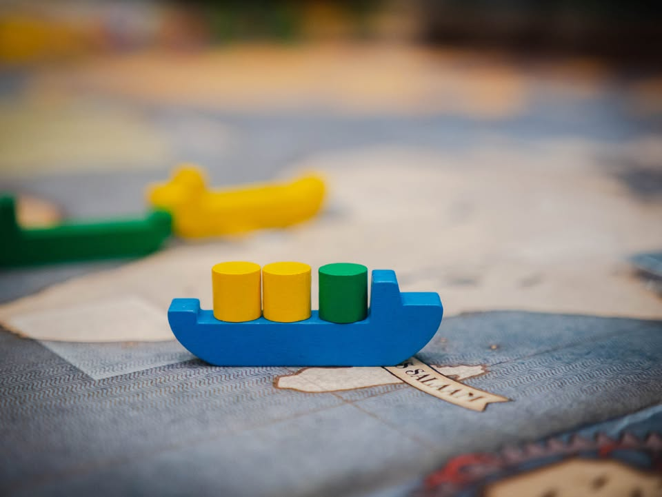
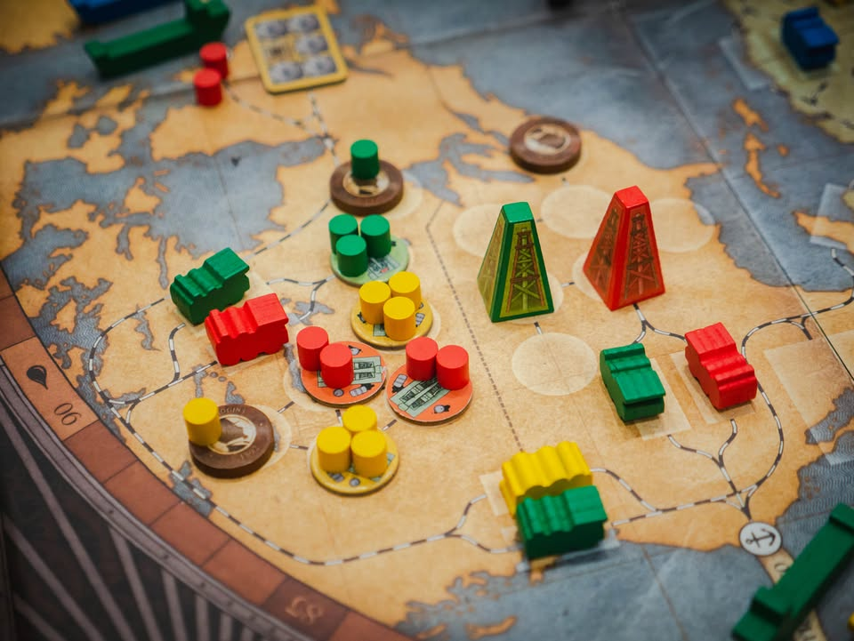
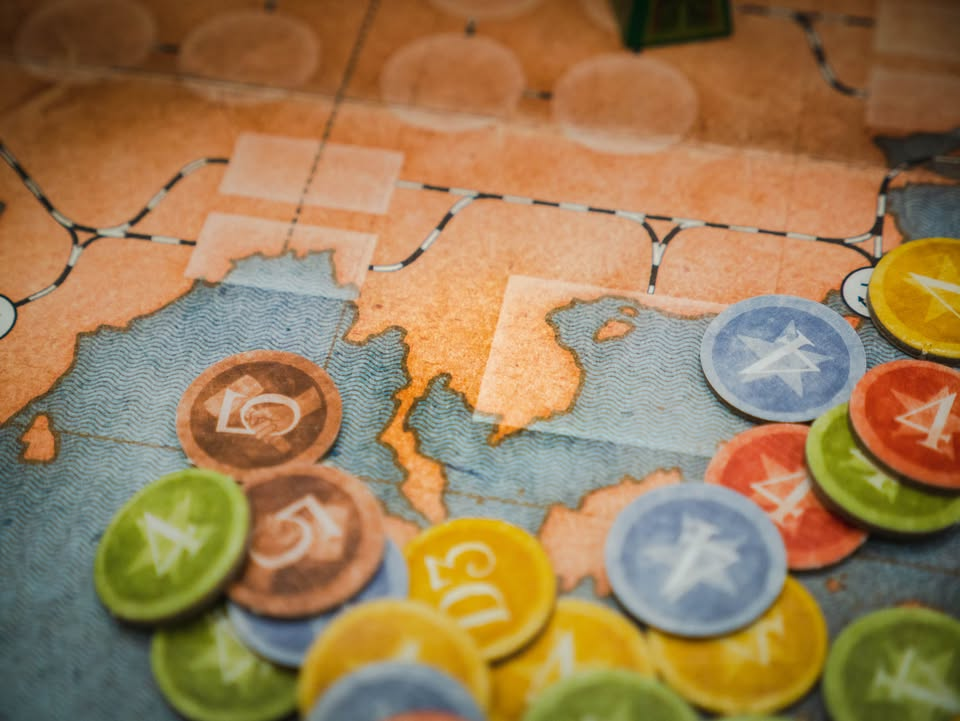
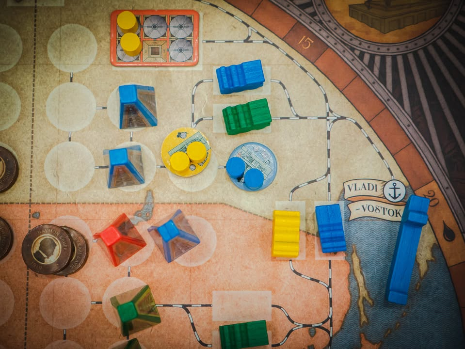
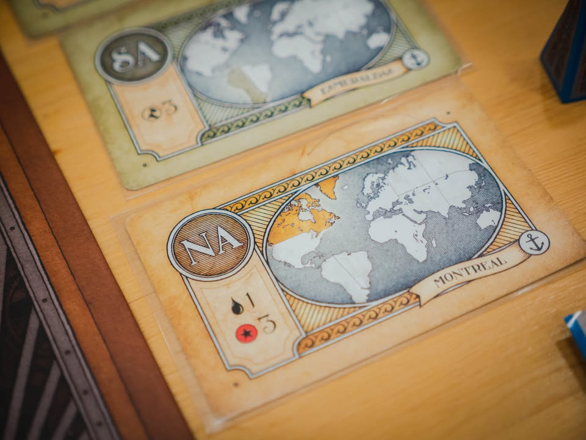
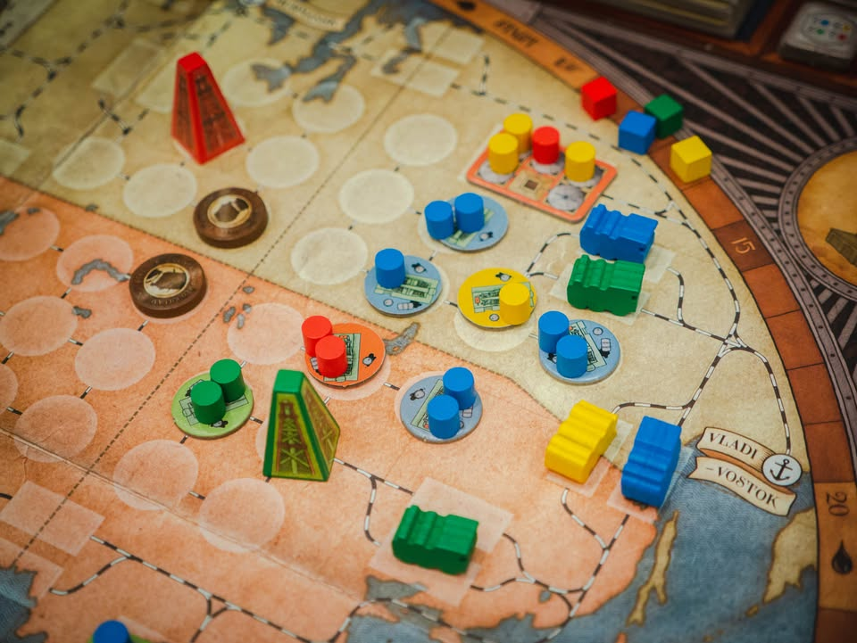
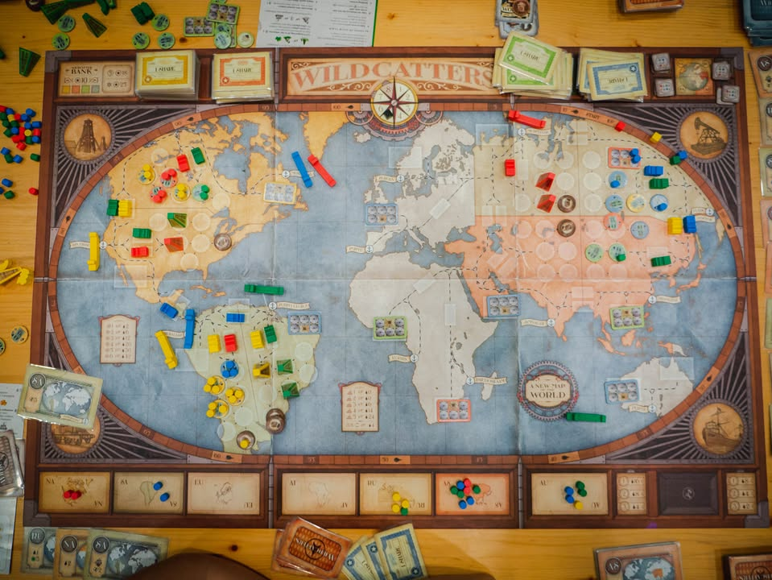
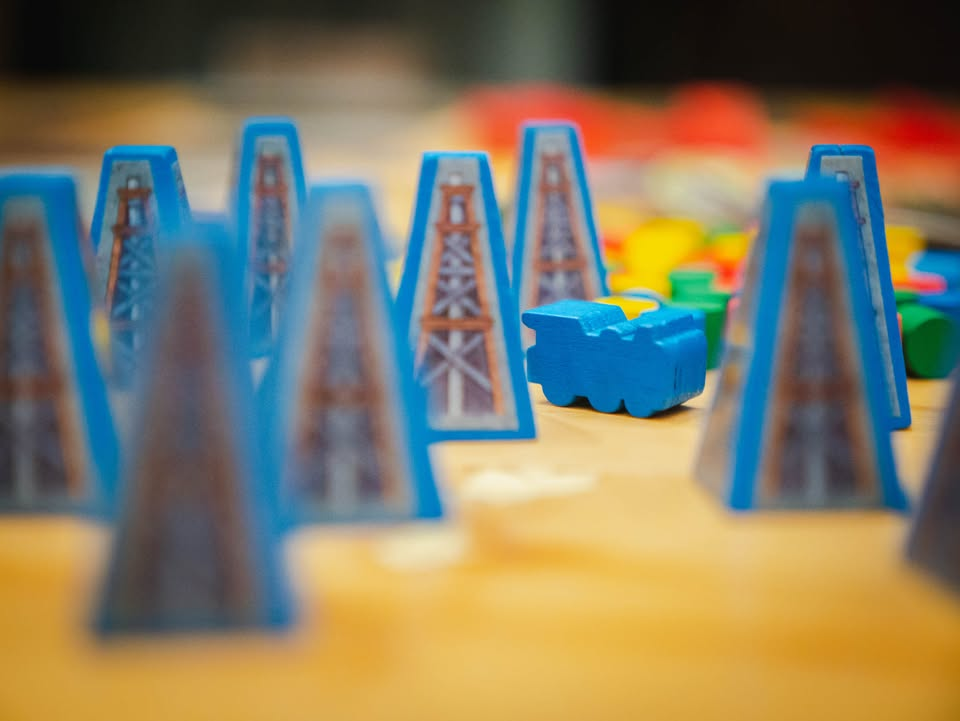
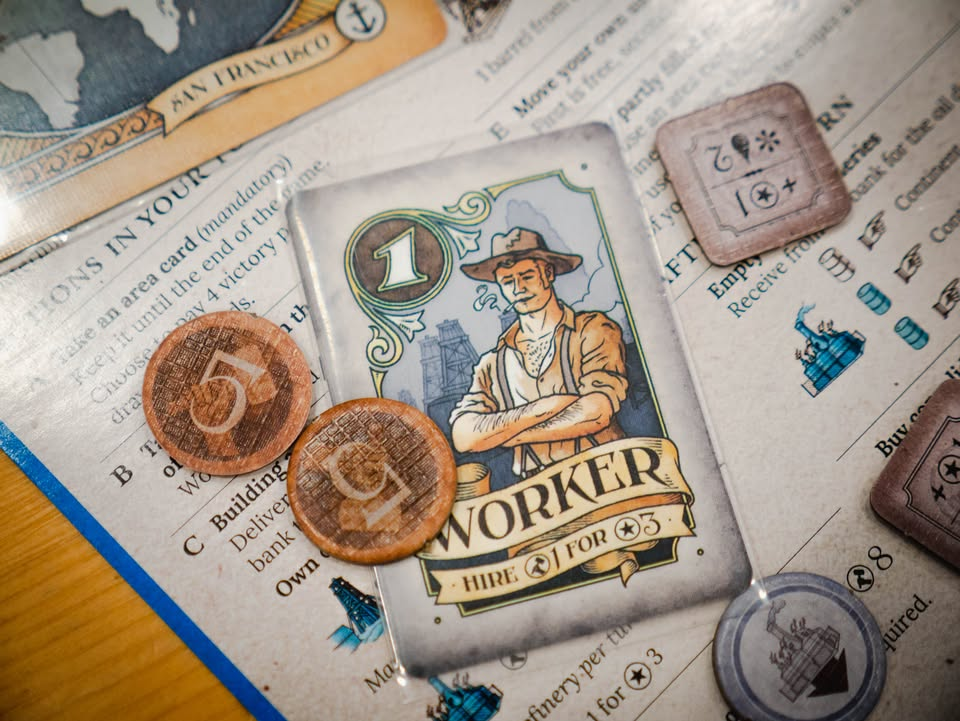

Wildcatters: Capstone Games Reprint Edition #bite_size

▪️เกมว่าด้วยการขุดเจาะน้ำมันเพื่อลำเลียงไปขายยังพื้นที่ทั่วโลก เราจะต้องสร้างแท่นขุดเจาะ สร้างเส้นทางลำเลียงผ่านรถไฟและเรือ รวมไปถึงโรงกลั่นเพื่อแปรรูปน้ำมันอีกที ความสนุกของเกมนี้คือทำเองหมดไม่ได้เพราะเงินไม่พอ แถมกิจกรรมในเกมนี้ใช้เงินแทบทุกจุดทำให้ต้องอาศัยผู้เล่นคนอื่นด้วย 
 
 
▪️อย่างในแต่ล่ะพื้นที่ถ้าจำนวนแท่นขุดเจาะไม่เยอะพอก็จะทำแอคชั่นขุดน้ำมันไม่ได้ แปลว่าต้องมีใครมาร่วมด้วยช่วยกันสร้างแท่นกับเรา แต่ด้วยจำนวนเงินให้ใช้น้อยนิดบางครั้งก็อาจจะต้องมีคนมาช่วยสร้างระบบลำเลียงน้ำมันให้ โดยแลกกับการที่เราต้องจ่าย 'หุ้น' ของบริษัทเราให้กับผู้เล่นอื่น ซึ่งใบหุ้นของชาวบ้านนี้เราต้องการด้วยล่ะเพราะจะเอาไว้แลกไทล์แต้ม การดูว่าใครจะทำอะไร แล้วเราอยากไปเกาะใคร (หรือจูงใจใคร)ให้ได้ประโยชน์สูงสุดเลยเป็นสาระสำคัญของเกมนี้
 
 
▪️ฉบับพิมพ์ใหม่มีการปรับกติกาหลายอย่างที่ส่วนตัวคิดว่าทำให้เกมสนุกและคลีนขึ้นมาก อย่างฉบับเดิมนอกจากจะแข่งจำนวนน้ำมันที่ส่งในแต่ล่ะพื้นที่แล้ว ยังต้องมาวัดจำนวนหุ้นด้วย แต่ฉบับใหม่ปรับเป็นให้เราไปซื้อไทล์แต้มที่ต้องใช้หุ้นของคนอื่นในการซื้อ ซึ่งเป็นผลให้ผู้เล่นตื่นตัวในการไป 'เสนอตัว' ให้เพื่อนมาใช้บริการมากขึ้น ซึ่งตรงนี้ก็ช่วยเสริม interaction ได้มากขึ้นโดยที่แกนเกมไม่ได้เปลี่ยนไป
 
 
▪️ในบางแง่มุมแล้วถ้าชอบ Brass เกมนี้ก็มีความคล้ายคลึงในแง่ว่าเป็นเกมธีม logistics ที่ผู้เล่นจะสร้าง demand/supply ของพื้นที่เอง และผู้เล่นทำเองคนเดียวครบวงจรไม่ได้ต้องพึ่งหรือเดาทางคนอื่น แต่ถ้าถามว่าเหมือนไหมก็ไม่เหมือนหรอกเพราะมันไม่มีสายมีท่าหรือว่ามีจังหวะการเล่นที่ต้องใช้แผนการเล่นหลายระยะ โดยใน Wildcatters จะเน้นอยู่กับการไหลไปตามกระแสของจังหวะตรงหน้ามากกว่า ทำให้บางคนอาจจะคิดว่าเกมมันเนื่อยๆไปหน่อย
 
 
▪️เกมนี้ผมเคยเขียนแบบยาวกว่านี้ไว้นานล่ะตั้งแต่เป็นฉบับพิมพ์ครั้งแรก 900 กล่อง ตัวในรูปนี้ค่าย Capstones เอามาทำใหม่ ซึ่งจริงๆก็เล่นหลายรอบล่ะ แต่ไหนๆหยิบมาเล่นกับถ่ายรูปแล้วเลยคิดว่าจะเขียนซักนิด ส่วนตัวผมคิดว่ามันเป็นเกมที่ได้รับความสนใจน้อยกว่าที่มันควรได้รับเหมือนกันนะ (ส่วนตัวให้เกมนี้ติด Top 50 of all times เลย)
 
ฉบับพิมพ์ครั้งแรกที่แกนเกมแบบเดียวกันเคยลงไว้ที่นี้ครับ : https_://wp.me/p7TSgy-Xc

--------------------------------
หมวด Bite Size (พอดีคำ) นี้กะว่าจะเขียนอะไรสั้นๆประมาณนี้ล่ะกัน ใหม่บ้าง เก่ารีรันบ้าง เกมที่ขี้เกียจเขียนยาวบ้าง  เขียนถึงตัวเสริมบ้าง

