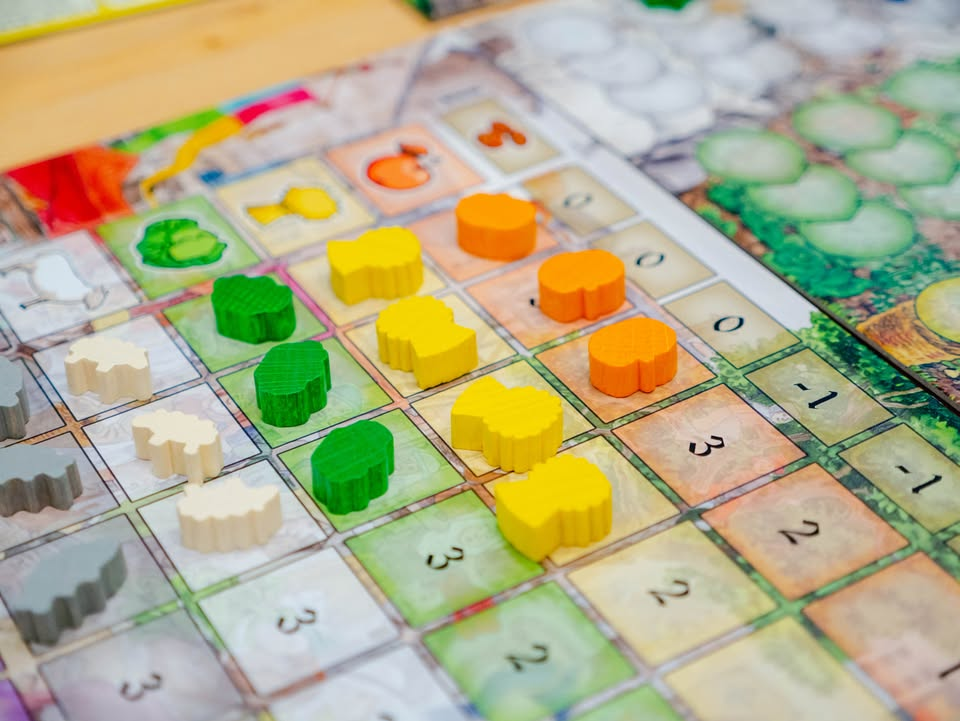
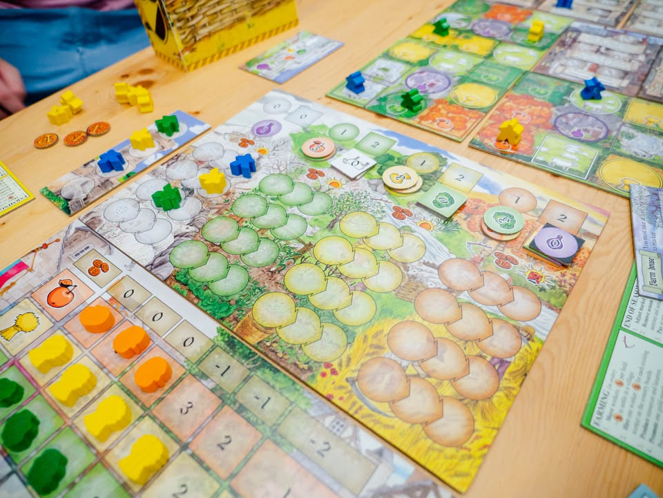
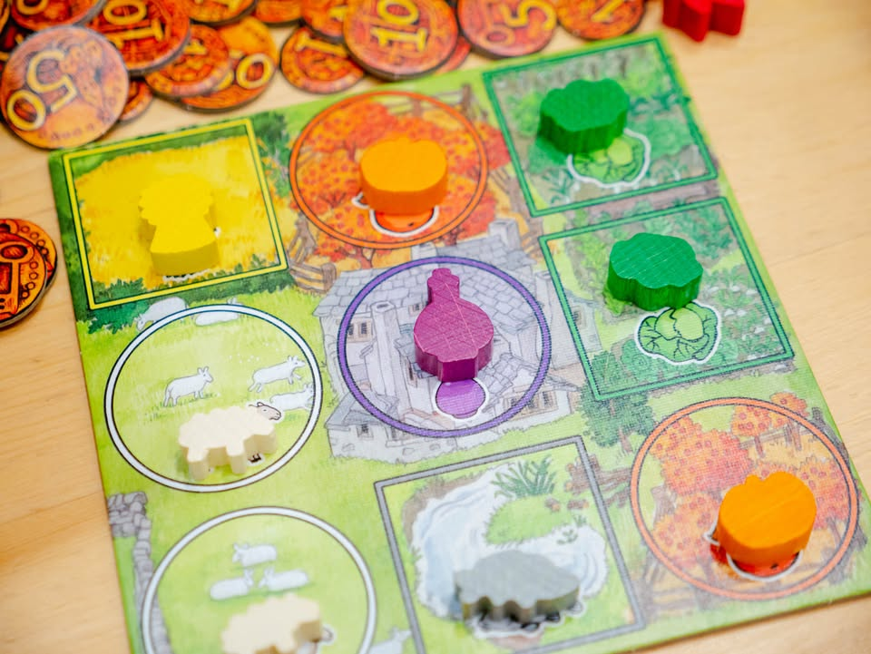
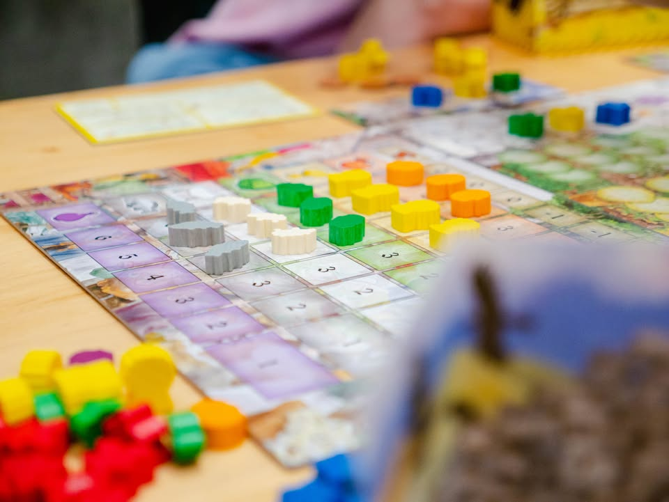
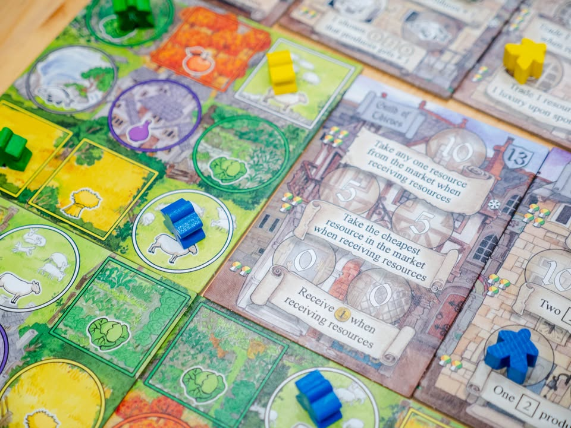
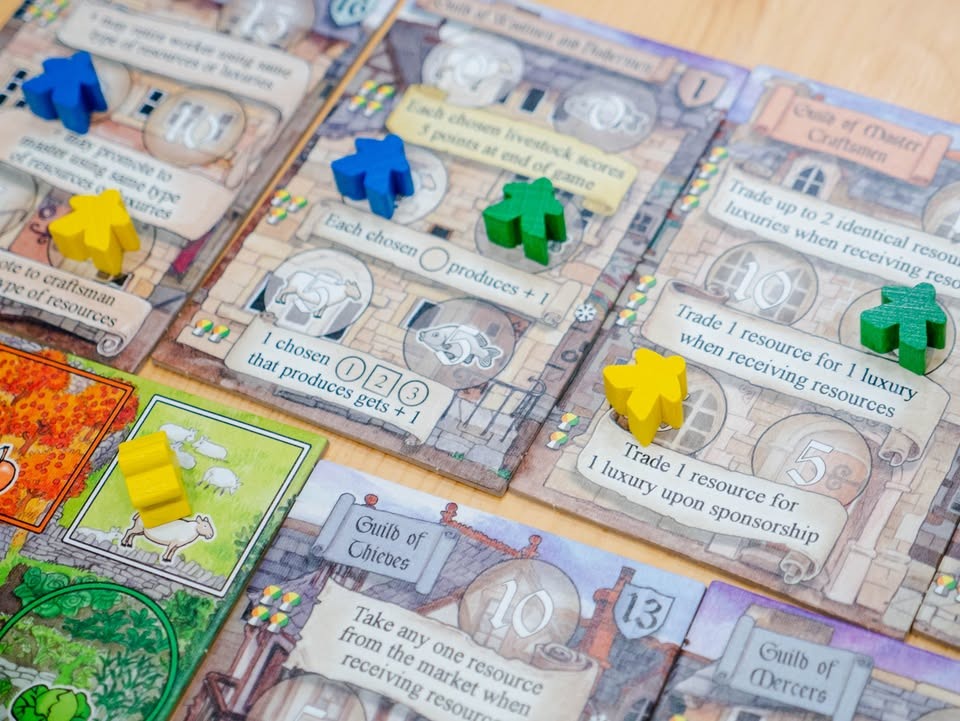
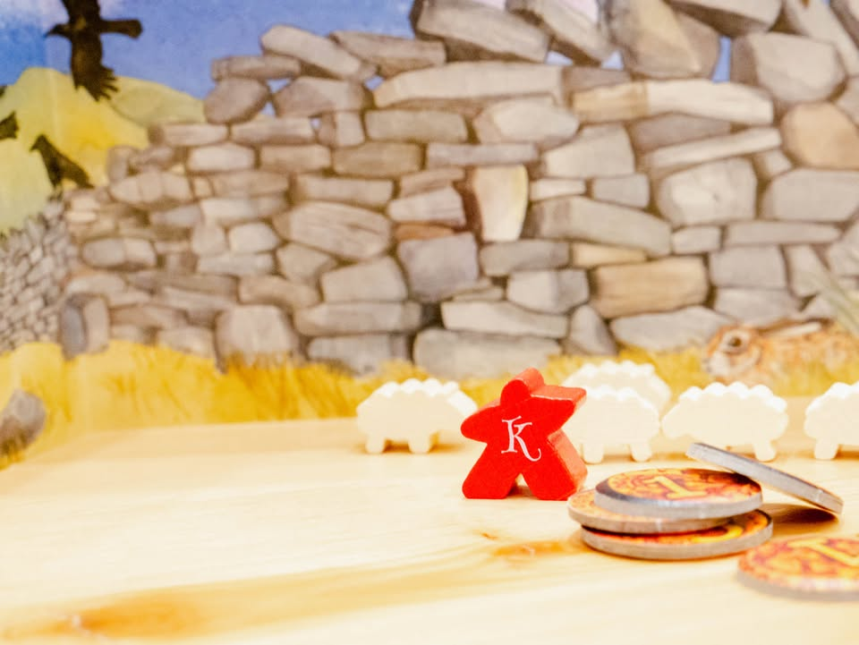

Key Market: สู่การค้าแห่งอาณาจักรคีย์
blog link: https://wp.me/p7TSgy-2Lb

▪️เกมยูโรระดับกลางหนักหนึ่งใน Key-Series ที่ทุกเกมจะขึ้นชื่อด้วย Key ที่มาจาก  Keydom (เลียนแบบ Kingdom) เอกลักษณ์คือเป็น setting วิถีชาวบ้านแบบยุคกลางและมักจะมีระบบเกี่ยวกับ 'ฤดู' มาใช้เพื่อแบ่งยุคเกมเสมอ ออกแบบโดย David Brain

--------------------
📌 side note: สำหรับ Key Market เป็นเกมลำดับที่หกของชุดนี้ แต่ว่าตีพิมพ์มาเพียง 500 กล่องขายหมดเกลี้ยงในงาน Essen 2010 อีกเกือบสิบปีต่อมา (2019) ก็ได้มีการจัดทำ KS เพื่อเอากลับมาขายใหม่อีกครั้ง และเป็น Key Series อันเดียวที่ไม่ได้ออกแบบโดย Richard Breese

เรื่องตลกอีกอย่างคือตอนแรกเจ้าของค่ายไม่ได้กะ reprint จริงจังเพราะไม่แน่ใจในดีมานด์ เลยไปบอกในฟอรั่มว่าถ้ามีคนมากดไลค์รูปปกเกมถึงพันนึงเดี๋ยวจะทำ.... ซึ่งก็มีจริงๆด้วยล่ะ ก็เลยมีเกมออกมาอย่างที่เห็นกัน
--------------------

▪️ไอเดียหลักของเกมนี้คือการส่งคนงานของเราไปฝึกวิชาชีพในสมาคมการค้าที่ถูกสุ่มขึ้นและให้ความสามารถแตกต่างกัน ซึ่งเป็นผลให้ลูกเล่นในการทำแต้มต่างกันไปในแต่ล่ะรอบ โดยแหล่งทรัพยากรของเราจะมาจากการส่งคนงานไปทำงานในไร่กลาง ที่พอจบรอบเราจะได้สินค้ามา จากนั้นก็เอาสินค้าไปแลกเป็นเงินที่ตลาดกลางแลกเปลี่ยนกันไปตามน้ำเพื่อให้มีสินค้าไว้เพียงพอต่อการส่งคนไปอัพเกรดความสามารถของเราอีกที
 
 
▪️กิมมิคที่สำคัญอย่างหนึ่งของเกมนี้คือ 'ฤดู' ที่พอจบแล้วช่องสินค้าที่คนงานเรายืนอยู่โดยปกติจะผลิตของให้ 1-2 ชิ้น แต่ว่าเกมมันจะสุ่มล่วงหน้าให้เราดูว่าในอีก 4 ตา (4 ฤดู) ช่องไหนจะโดนเปลี่ยนค่าการผลิต บางพื้นที่ก็กลายเป็นออกสามชิ้น บางที่ก็เหลือศูนย์ ตรงนี้ตอนเล่นเราเลยต้องวางแผนทำเลการเอาคนงานลงไปในกระดานล่วงหน้า เพราะการจะขยับคนงานมันต้องใช้เงิน (ตอนจบฤดูก็ต้องจ่ายเงินอีก) และเกมยังมีเรื่องกติกาการวางคนงานที่ข้ามคนงานของเราอยู่ใกล้กัน และห้ามแชร์ไร่ชนิดเดียวกับผู้เล่นคนอื่น ตรงนี้เลยมีผลต่อการวางต่ำแหน่งของคนงานเพิ่มเข้าไปอีก
 
 
▪️สินค้าในเกมจะเป็นผักหลายชนิดแต่ว่าไม่มีความแตกต่างกันเพราะในเกมเวลาใช้จะสนแค่เอาอะไรก็ได้แค่มี 2/3/4 ชนิดไม่ซ้ำกันก็พอ แต่เนื่องจากปกติเราจะผลิตเองได้แค่ 1-2 อย่าง ส่วนที่เหลือเราต้องไปซื้อเอาจากตลาดกลาง ที่เราสามารถขายของเหลือๆของเราได้ด้วย แต่ว่าเกมใช้ระบบอุปสงค์อุปทานคือขายเยอะคนที่ขายทีหลังก็ได้เงินน้อยหน่อย แต่ในทางกลับกันก็ซื้อได้ถูกด้วย
 
 
▪️เกมเล่นกันสองปี (8 ฤดู หรือ 8 รอบ) ก็จบเกม

-----------------------------------------
[🐸 Someone I know, ป้าขายตามสั่งที่ตลาดหน้าปากซอย] 
🔹 ป้าแกขายของมานานรู้จักคนเค้าไปทั่ว รับผักมาก็หลายที่  เมนูมากมายเปลี่ยนได้ทุกวัน  แต่ไม่ค่อยได้ไปกินร้านแกเท่าไรเพราะคิวแน่นเหลือหลาย สั่งอาหารกว่าจะได้ก็ยากเย็น

 
🔹โดยรวมเป็นเกมยูโรตามขนบที่หนักแน่นอีกเกม (ก็เกมมันออกมาเกือบสิบปีที่แล้วนะ) แม้จะเป็นเกมเก่าแต่เอามากางเล่นสมัยนี้ก็ไม่รู้สึกว่าระบบมันล้าหลังแต่อย่างใด (แต่แน่นอนว่าขาด wow factor จากการผสมระบบ)
 
 
🔹 ความสนุกหลักของเกมนี้ก็คือการมองหาคอมโบจากสมาคมการค้าแล้วไปฟาดฟันกับคนอื่นเพื่อเบียดให้ตัวเองพัฒนาไปตามเส้นทางอาชีพให้ได้โบนัสดีๆนั้นแหละ ในแง่นี้ path สุดเจ๋งอาจจะมีแค่อันเดียวหรือหลายทางก็ได้ แต่เท่าที่เล่นมาก็ดูมีหลากหลายพอควร แต่นอกจากตรงนี้เกมจะมีมิติที่เราต้องอยู่กับตัวคนเดียวพอควร
 
 
🔹 ความท้าทายหลักของเกม ที่ผมคิดว่ามันเป็น love it or hate it สำหรับคนส่วนมาก (ซึ่งผมก็ไม่ได้เกลียดอ่ะนะ แค่ไม่ชอบเป็นพิเศษ) คือ แอคชั่นเกมนี้แม่งน้อย แบบน้อยเหี้ยๆ ตานึงเริ่มมาเดินคนงาน เก็บของ ขายของ กับทำแอคชั่นพิเศษหนึ่งครั้ง ซึ่งไอ้หนึ่งครั้งเนี่ยมันมีความเป็นไปได้หลายอย่างที่จะเลือกแต่ล่ะอย่างนี้ปวดใจเหลือเกิน หลักๆก็คือการส่งคนงานไปในสมาคมเพื่อเพิ่มโบนัสระหว่างเล่นเกม แต่ตัวเลือกอื่นๆที่ยังไงก็ต้องทำมันก็มี อย่างซื้อของ (เพราะเราต้องการของหลายชนิด), หยิบเงิน, เกษียณคนงาน (ให้กลายเป็นแต้ม)
 
 
🔸สาเหตุที่ไม่ 'คลิก' คือผมไม่ค่อยชอบเกมที่กำไรต่อแอคชั่นบางๆ แล้วมีแอคชั่นให้ทำน้อย แต่ต้องมาคอยวนจ่ายคนงานจนหมดตัวเท่าไร เกมนี้หาเงินได้เท่าไร คนงานก็เอาไปกินซะเยอะ ไม่มี sense ของ engine building แบบที่ชอบ ความสามารถสมาคมเองแม้จะดีก็จริง แต่มันก็ไม่ได้รู้สึกตู้มต้าม! แบบที่ชอบเท่าไร 
 
 
🔸ต่อมาคือผมไม่ค่อยชอบระบบสินค้าในเกมหลายจุด อย่างแรกคือสินค้าแต่ล่ะชิ้นไม่มีความแตกต่างกันเป็นแค่สินค้าสีเฉยๆ ราคาในตลาดเองก็เป็นแบบมิติเดียว รอบไหนผลิตได้เยอะราคาก็ตก กลายเป็น turn order ท้ายๆจะเหงาอยู่เพราะขายขาดทุนเยอะ (แต่ขายก็ไม่ได้ คนงานกินดุ)  เกมใช้ระบบให้กำของในมือล่วงหน้าว่าตานี้จะขายอะไร แล้วก็ค่อยๆขายตาม turn order ส่วนตัวคิดว่ามันค่อนข้างยึกยักเกินไปหน่อย พอยิ่งในเกมสินค้ามีไว้แค่จ่ายให้แตกต่างกันมันเลยทำให้รู้สึกว่าธีมมันเบาบางเกินไป หยิบอะไรถูกๆได้ก็ไอ้นั้นแหละ 
 
 
💭 รวมๆคิดว่าเหมาะกับผู้เล่นสายชอบแอคชั่นน้อยแต่ต้องการของเยอะแบบเบียดเสียดหน่อย กับต้องวางแผนแม่นนิดๆเพื่อของไปออกคอมโบผสมท่าทำแต้ม  ส่วนแฟนๆ Key-Series อาจจะรู้สึกว่าเกมมันหนักกว่าปกติ ทั้งๆที่กติกาอ่านง่ายกว่าเยอะ  
 
----------------------------------------------------------
Compatible Level - เกมนี้เข้ากับคนเขียนได้ระดับไหนนะ!!

🐸 Family, อาจจะมีช่วงเวลาที่ไม่เข้าใจกันบ้างแต่ครอบครัวคือสิ่งที่จะอยู่กับเราตลอดไป นี้คือเกมที่จะมีพื้นที่ถาวรในชั้นวางแน่นอน!! แม้บางเกมจะเปรียบดั่งคุณปู่ใจดีที่ได้เจอกันแค่ปีล่ะครั้ง แต่อันดับในใจนั้นคือความสนุกในช่วงเวลาที่เล่น หาใช่การได้เล่นซ้ำไม่รู้เบื่อเพียงอย่างเดียว [ex. กบโปรด, กบชอบ]

🐸 Hang out friend, เพื่อนกินเที่ยว ถ้าไม่ติดธุระอันใดก็พร้อมจะออกไปพบเจอ สนุกยามได้พบปะ แต่จะให้เจอกันบ่อยๆคงใช่ที - เกมสนุกที่อยากเล่นในระดับที่อยากจะหยิบกางเป็นบางครั้ง สลับสับเปลี่ยนไปเรื่อยตามจังหวะและโอกาส แต่เราก็ไม่ได้อยากซ้ำต่อเนื่องรัวๆ [ex. กบโอเค]

🐸 Someone I know, หากบังเอิญพบเจอ ก็คงได้ทักทายไต่ถาม หากแต่ในยามปกติมิอาจนึกชื่อออก ยืนคุยก็ได้ แต่คงไม่ได้เอื่อนเอ่ยนัดกินข้าว - บางเกมเราก็ไม่ได้อยากชวนเล่น แต่ถ้าไม่มีอะไรทำแล้วมีคนชวนก็เล่นก็ได้ [ex. กบเฉย]

🐸 I Turn left, You Turn Right - เธอชอบกินเผ็ด เราชอบกินอาหารญี่ปุ่น เธอชอบคนคารมดีพาไปกินที่หรู แต่เราชอบเล่นเกมอยู่กับบ้าน แม้จะได้คุยเป็นบางคราแต่คงไม่อาจพัฒนาความสัมพันธ์ - บางเกมแม้ว่าจะดีแค่ไหน แต่ถ้ารสนิยมมันไปด้วยกันไม่ได้ก็ไม่รู้จะเล่นไปทำไม [ex. กบไม่เล่น]

