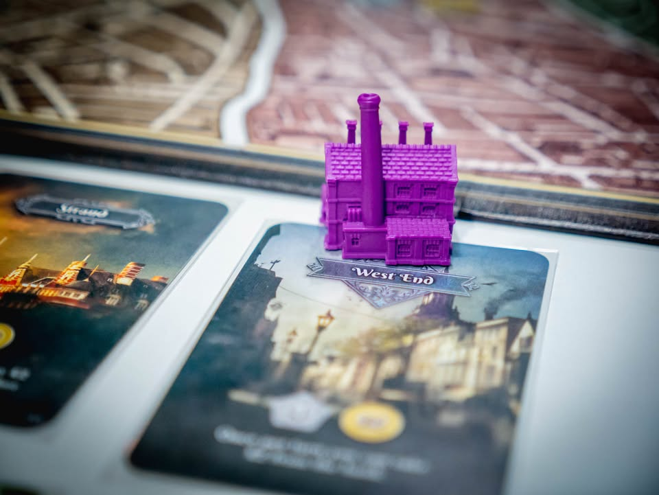
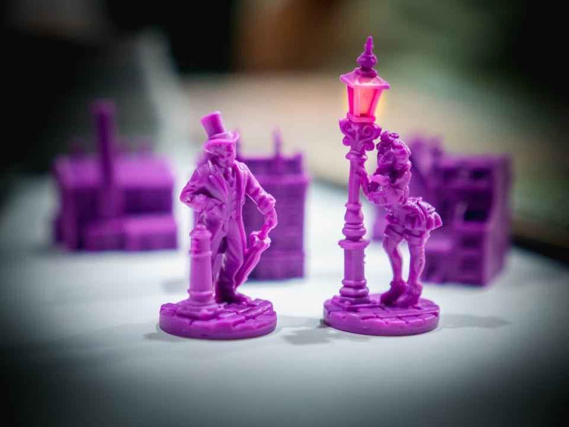
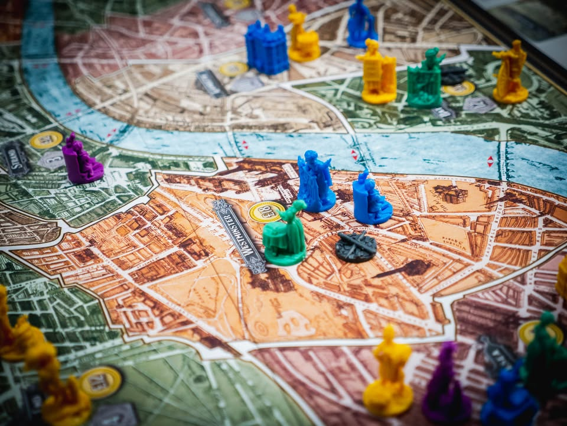
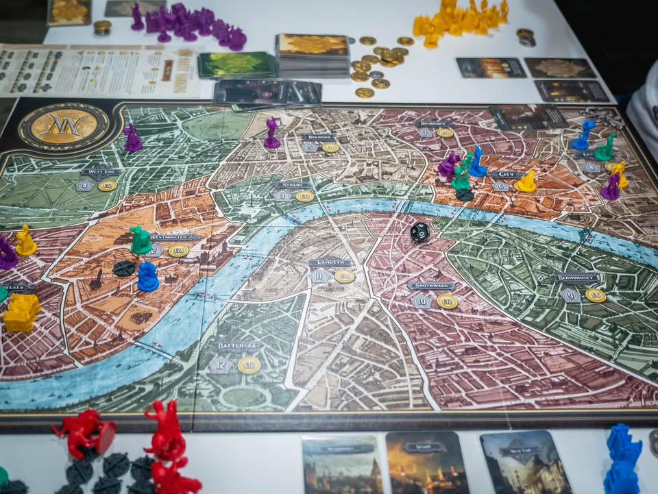
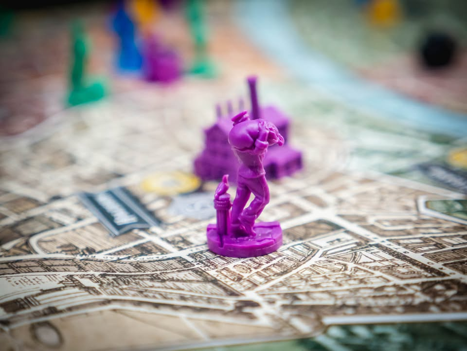
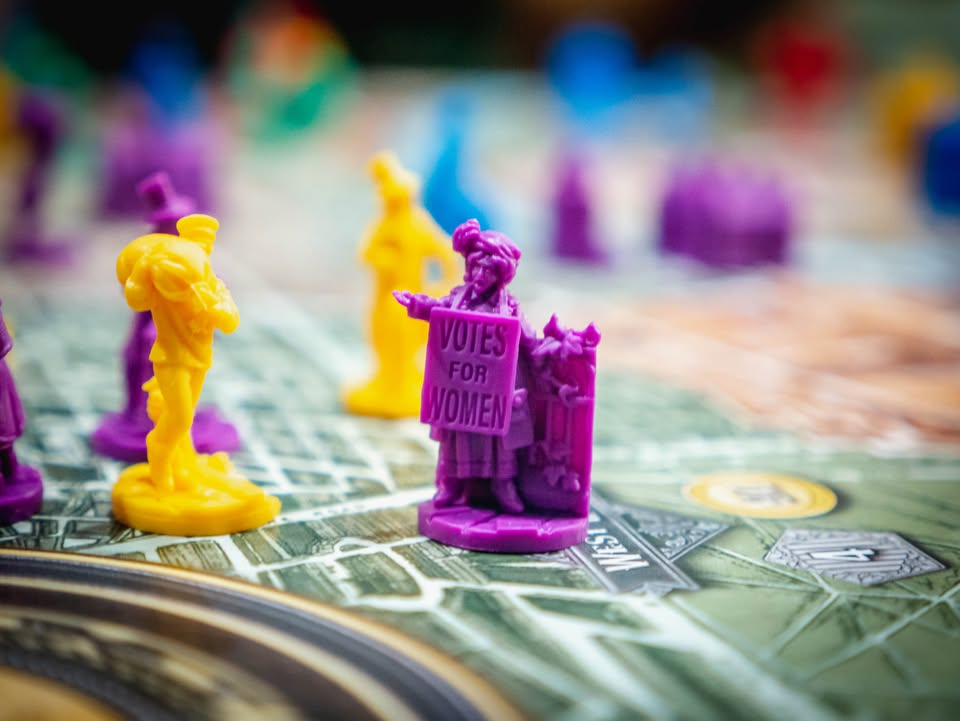
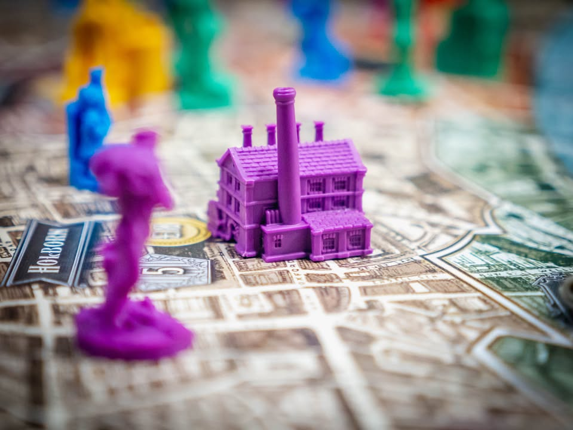

Nanty Narking #bitesize #first_impression
blog link: https://wp.me/p7TSgy-2Lo
 
🔹 เรื่องในเกมนี้มันเอานิยายของ ชาลส์ ดิกคินส์ กับ โคนัน ดอยล์มายำๆใหม่ ซึ่งถ้าไม่เก็ทก็ไม่ใช่เรื่องสำคัญอะไร (แต่ส่วนมากคงรู้จักเชอร์ล็อก โฮมส์  กันอยู่แล้ว) แต่ถ้าอ่านมาบ้างจะช่วยให้อินขึ้นเล็กน้อย
 
 
🔹ไอเดียการเล่นเกมคือผู้เล่นแต่ล่ะคนจะได้รับภาระกิจลับมา ซึ่งส่วนมากจะสไตล์ไปทาง Area Control อย่าง คุมพื้นที่ให้ได้ x จุด หรือ ส่งคนงานไปอย่างน้อย x พื้นที่ หรือ มีทรัพสินมูลค่ารวมมากพอ บลา บลา บลา ระหว่างเล่นเราก็ต้องทำเรื่องของเราไปพร้อมกับเดาว่าคนอื่นเค้าพยายามทำเงื่อนไขไหนเราก็ต้องไปรุมขัดขาซักหน่อย (ซึ่งความสนุกหลักอยู่ตรงการขัดขาเนี่ยล่ะ)
 
 
🔹รูปแบบการเล่นจะถูกควบคุมด้วยการ์ด ก็ผลัดกันเล่นตาล่ะใบ ตัวการ์ดส่วนมากจะมีแค่ icon บอกว่าจะทำอะไร ก็ตามขนบ Area Control ทั่วไป ส่งคนงานไปในพื้นที่ สร้างตึกเพื่อช่วยเสริมกำลัง กระทั้งไปคิลคนงานคนอื่น แต่ว่าคำสั่งพวกนี้มันต้องจั่วมา เราก็เลยต้องวางแผนลำดับการใช้งานหน่อยว่าเล่นยังไงถึงจะดี แล้วพาเราเข้าใกล้เป้าหมายลับของเราเอง
 
 
🔹ความสนุกของการวางแผนด้วยการ์ดในเกมคือ 'มันไม่บาลานซ์'  และไม่ซ้ำกัน (ทุกตัวมีตัวละครจากนิยายของนักเขียนสองคนประกอบ) แต่ล่ะใบมีความสามารถและจำนวนคำสั่งไม่เท่ากัน แถมหลายใบก็มี effect แสบๆกวนๆอยู่หลายอย่าง แบบเรียกตำรวจมายืนคุมทำให้พื้นที่นั้นไม่นับเป็นเงื่อนไขทำแต้มไรงี้ หรือกระทั้ง event ในเกมที่มาในแนว 'ลุ้น' เพราะจะเป็นอะไรก็ไม่รู้ เปิดมาก็ต้องทอยเต๋าลุ้นอีกต่อ อย่างเรือเหาะระเบิดทำพื้นที่หายไปเลยงี้
  
 
🔹ขั้นตอนเกเรแบบปกติ (คิล) มันจะลีลานิดๆตรงที่ต้องหาทางวางโทเคน Trouble Maker ลงไปในกระดานก่อนถึงจะไปออกแอคชั่นเก็บคนอื่นได้ ซึ่งอยู่ๆโทเคนมันไม่มาเองต้องเดินไปเจอกันแล้วจะงอกมาให้อันหนึ่ง แต่ถ้ามีใครเดินออกก็จะหายไป ไม่ก็ต้องหา effect การ์ดมาวาง แต่ความลีลาอีกนิดคือดันมีเป้าหมายลับที่ถ้า Trouble Maker เยอะมากพอก็จะชนะด้วย

 
🔹ข้อดีของเกมนี้ชนะทันทีที่เริ่มรอบแล้วเข้าเงื่อนไข ไม่มีนับแต้มไม่ต้องลีลาเยอะ แต่ด้วยความที่เกมแบบนี้ถ้าโดนเพื่อนจับไต๋ได้มันก็จะเกเรกันไม่จบ ข้อดีอีกอย่างก็เลยเป็นมีเวลาจบแน่นอน เพราะตัดจบตอนกองการ์ดหมด แถมเงื่อนไขชนะอีกแบบคือ ยื้อให้เกมจบแบบหมดกองเนี่ยล่ะ (ขัดกันไปเรื่อยโดนคนอื่นสอยไปซะงั้น)
 
 
🔹อุปกรณ์เกมนี้ดีเกินมากจนเรียกได้ว่า overproduce แต่ว่าก็ทำมาสวยละเอียดน้ำหนักดีและด้วยความที่มันไม่ซ้ำกันเลยสำหรับสีผู้เล่น ทั้งๆที่่มี function แค่สองอย่างคือคนกับตึก จนตอนเล่นกลับรู้สึกว่าเออสวยดีนะ กลายเป็นถ้ามีแต่ cube ก็น่าจะแห้งไป มีมินิกรรมมากรชีพทุกรูปแบบแม้กระทั้งโสเภณียืนตรงเสาไฟ
 
 
🔹จริงๆผมคิดว่าเกมนี้มันน่าจะแมสได้ไม่ยากเพราะ mindset ที่เหมาะกับเกมนี้ก็มีเยอะพอดู พวกสายเกเรแย่งพื้นที่ แล้วมีบลัฟหน่อยๆ  จบไว downtime ต่ำ (แต่จะไม่แมสก็เพราะราคาและอุปกรณ์ที่นำหน้า weight และเวลาเกมไปเยอะเนี่ยล่ะ ) แต่ถ้ามองว่ามันจาก Martin Wallance นักออกแบบเกมหนักที่เคยผ่านยุครุ่งโรจน์มา เกมนี้ก็ไม่ได้ระดับ comeback นะ เพราะจริงๆเป็นเกม retheme แบบ 1:1 ไม่แก้รูล ของเกมที่เคยออกมานานแล้วนั้นคือ Discworld: Ankh-Morpork (ซึ่งตอนนั้นก็ไม่ได้เล่น)
 
 
🔹ถ้าอยากหาแนว Area Control สำหรับ 4 คนแบบไม่หนัก สายเกเร ที่จบไว เกมนี้ถือว่าน่าลองอีกเกม

ขอบคุณ งงเหลือหลาย เล่นอะไรก็สนุก ที่เอาเกมที่ผมเล่นแล้วก็งงเหลือหลายนึกว่าจะเกมงั้นๆแต่ดันเล่นแล้วฮาพลิกโผ

--------------------------------
หมวด Bite Size (พอดีคำ) นี้กะว่าจะเขียนอะไรสั้นๆประมาณนี้ล่ะกัน ใหม่บ้าง ซ้ำบ้าง เกมที่ขี้เกียจเขียนบ้าง เขียนๆไว้ก่อนเผื่อมีอารมณ์อาจจะขยายไปลง Thought บ้าง จริงๆอยากเขียนสั้นกว่านี้ แต่ยังอดไม่ได้ที่จะต้องอธิบายอะไรเพิ่มตามนิสัย เดี๋ยวค่อยๆปรับไปล่ะกัน

