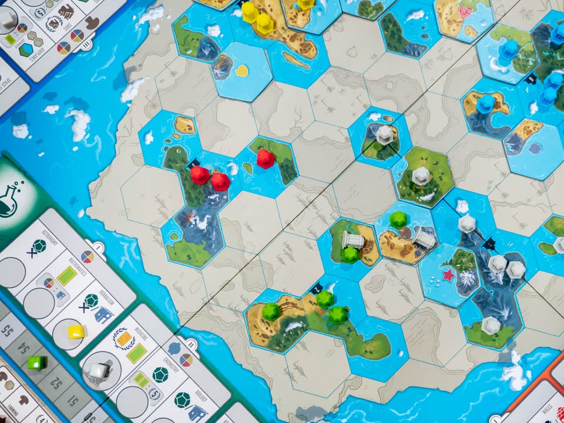
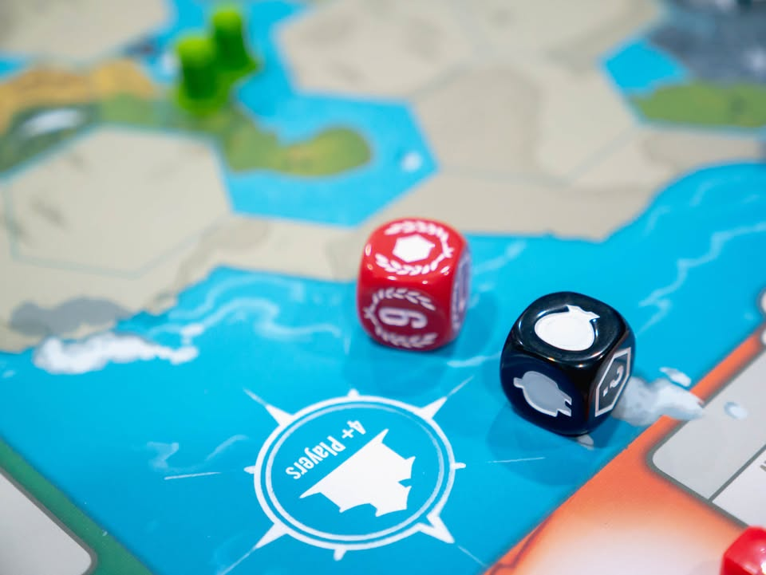
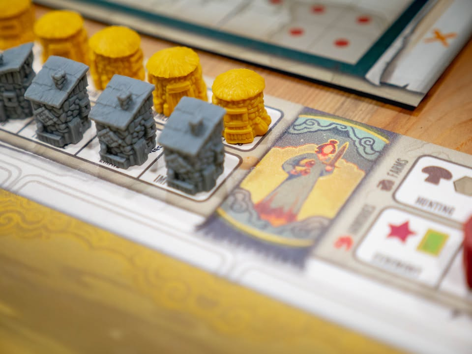
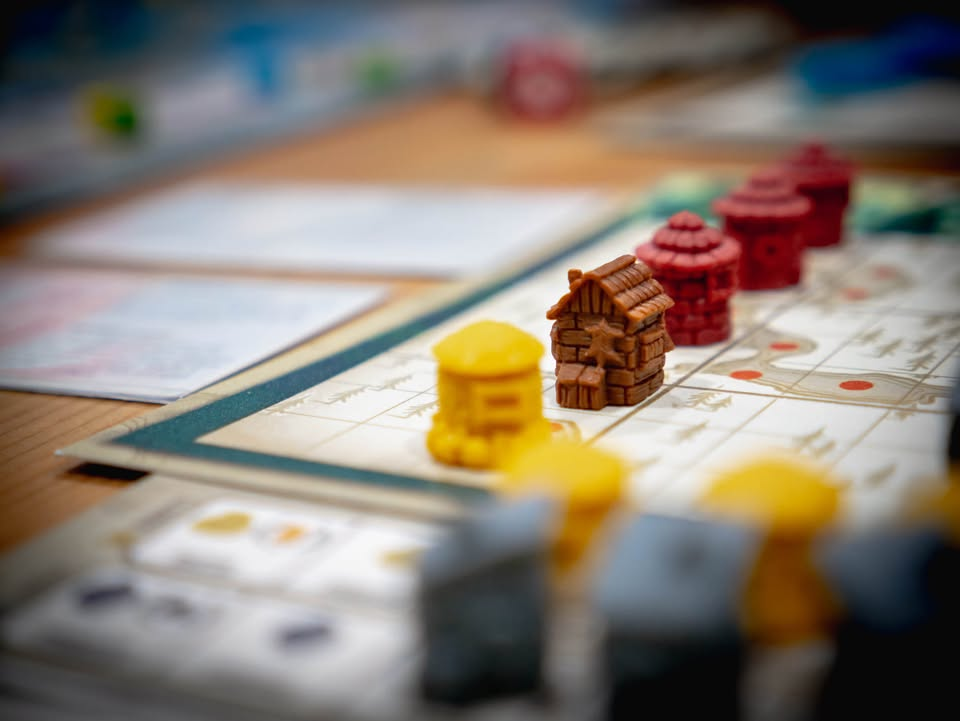
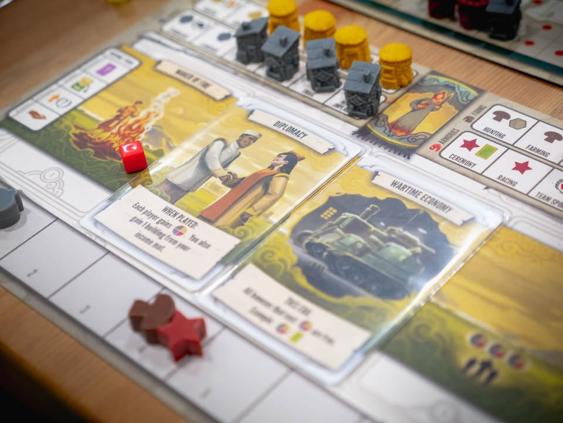
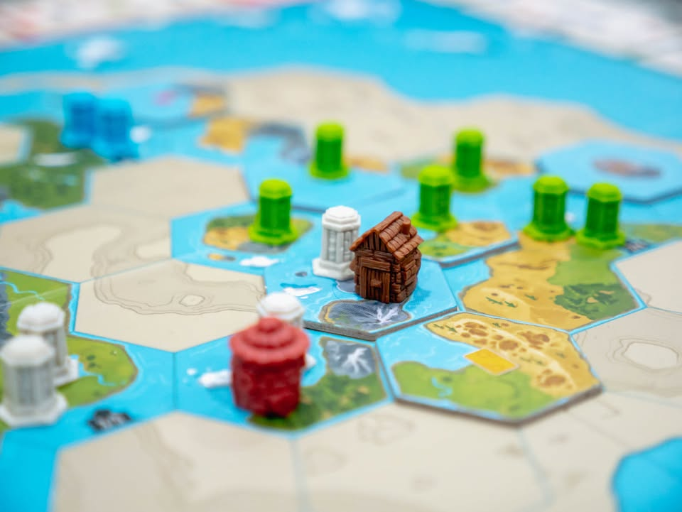
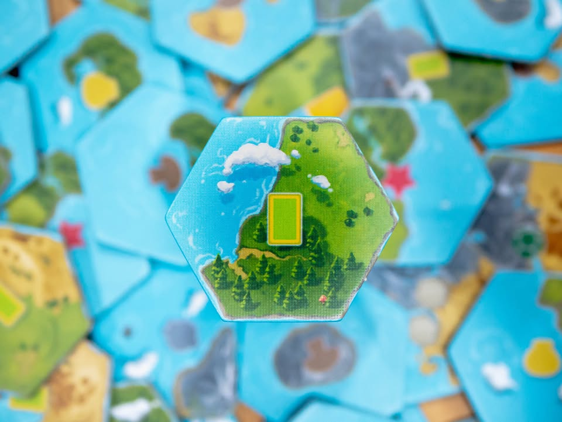

Tapestry: ถักทอสร้างชนชาติ #thought 
blog link: https://wp.me/p7TSgy-2LK

▪️ เกมยูโรระดับกลางเบาที่จะให้เรานำพาชนชาติจำลองขยายพื้นที่และสร้างอารยธรรมไปสู่ยุคสมัยใหม่ ผลงานของ Jamey Stegmaier ผู้สร้าง Scythe, Charterstone และ Viticulture
 
 
▪️ สิ่งที่ทำให้ระบบเกมนี้เตะตาแต่แรกน่าจะเป็นอุปกรณ์ที่สวยงาม และคู่มือที่มีเพียง 4 หน้าเท่านั้น ซึ่งบ่งบอกความเรียบง่ายในการเล่นได้เป็นอย่างดี ความฉลาดของเกมนี้คือสิ่งที่คุณจะทำในแต่ละตานั้นมีเพียงแอคชั่นเดียว นั้นคือ อัพเกรดแทรคในแทรคหนึ่งในสี่แทรค ได้แก่วิทยาศาสตร์, เทคโนโลยี, การทหาร และการสำรวจ แปลว่าลำดับความคิดคุณจะเหลือแค่จะเดินแทรคอะไรดี ไม่ใช่ว่าจะต้องทำแอคชั่นอะไรบ้าง
.
(ถ้าคุณสงสัยว่าทำไมมันแยกวิทยาศาสตร์กับเทคโนโลยีออกจากกัน ผมก็สงสัยเหมือนกัน แต่ในเชิงเกมมันก็คงต้องประมาณนี้แหละ)
 
 
▪️ การเดินแทรคต้องต้องใช้ทรัพยากรซึ่งมีอยู่สี่อย่าง ทุกครั้งที่เราเดินก็จะได้ทำแอคชั่นบางอย่างที่อิงกับแทรคนั้นๆ อย่างเช่นเดินแทรคทหารก็ได้วางป้อมยึดแผนที่ เดินแทรคสำรวจก็ได้เปิดแผนที่ เดินแทรควิทยาศาสตร์ก็จะช่วยเดินแทรคฟรีได้บ่อยขึ้น เดินแทรคเทคโนโลยีก็ช่วยให้เล่นการ์ดเทคโนโลยีเอาโบนัส ยิ่งเดินลึกก็ต้องใช้ทรัพยากรเยอะขึ้นแต่ก็จะได้ผลที่แรงขึ้นเช่นกัน
 
 
▪️ของเล่นอีกอย่างคือแผนที่เมืองหลวงที่แต่ล่ะคนจะมีรูปทรงแตกต่างกันเล็กน้อย ระหว่างเล่นเราจะได้หยิบตึกผลผลิตจากบอร์ดเราเอาไปใส่ ถ้าวางครบกับวางเรียงแถวตามเงื่อนไขจะได้โบนัสเพิ่ม ซึ่งถ้าเวลาเราเดินแต่ล่ะแทรคแล้วข้ามระดับเร็วกว่าคนอื่นเราจะได้ตึกพิเศษที่สามารถเติมเต็มพื้นที่ได้เยอะกว่าปกติด้วย (แต่นอกจากสวยแล้วไม่มี function อื่น)  
  
 
▪️พอเล่นไปซักพักทรัพยากรเราจะหมด เราก็มีสิทธิ์เลือกที่จะ 'จบยุค' โดยการเล่นการ์ด 'Tapestry' ที่จะช่วยให้เราได้รับ effect บางอย่างและพวกตึกผลผลิตที่เราเปิดไว้ก็จะผลิตทรัพยากรให้กับเรา ซึ่งในเกมนี้พอเราประกาศจบยุคครบสี่ครั้งก็จบเกม

-----------------------------------------------
[🐸 I Turn left, You Turn Right สาวช่างฝันเอกประวัติศาสตร์คุยสนุกที่ชอบแอบไปดูดกัญชาระหว่างคาบ] 

🔹 เธอน่ารัก เธอคุยสนุก คุยแล้วสบายใจ แต่หลายครั้งเธอก็เอาแน่เอานอนไม่เลย บางวันก็ตาเยิ้มชวนเคลิ้ม บางวันก็ตาโหลเหมือนไม่ได้นอนมาพูดจาเพ้อเจ้อหาสาระไม่ได้
 
 
🔹 เกมสนุก จังหวะการเล่นลื่นไหล มีวิธีเล่นหลากหลายจากเผ่าและการ์ดที่แตกต่างกัน เอาจริงๆถ้ามองแบบภาพรวมจากระบบแกนหลักแล้วเกมนี้น่าจะไปถึง Hang out friend (จากสาวที่เรายี้เป็นเพื่อนอ่ะคุ๊น) เลยก็ได้ เพราะวิธีการเล่นของเกมเรียบง่าย แต่มีไดนามิคในการบริหารทรัพยากรที่น่าสนใจ แม้ธีมด้าน Civilization จะยังขับออกมาบางเบาจนออกไปทางประดักประเดิดไปซักหน่อย แต่ก็ถือเป็นปัญหาที่เจอกันทั่วไปในเกมแบบ Civilization-Lite อยู่แล้ว เรื่องธีมเบาบางเลยสามารถไหลไปได้
  
 
🔹 จุดหนึ่งที่ผมคิดว่าออกแบบมาฉลาดดีคือการ 'จบยุค' ที่ไม่พร้อมกัน คือคนที่จบเร็วจบช้าก็เล่นต่อไปไม่มีสะดุด ในยุคสุดท้ายคนที่จบยุคไปก่อนแม้จะจบเกมแล้วก็จริงแต่คนอื่นก็ยังสามารถเล่นเกมตัวเองต่อไปได้เรื่อยๆจนกว่าทรัพยากรจะหมด
 
 
👁‍🗨 อนึ่งตัวเกมมี interaction ค่อนข้างต่ำเน้นอยู่กับตัวเองเสียมาก นอกจากแข่งกันเดินแทรคแล้วจะมีการ 'ตี' กันนิดนึงซึ่งมันก็แค่เอาบ้านเราไปวางร่วมกับบ้านคนอื่นที่มาก่อนแล้วเค้าเสียพื้นที่ไป แต่ตีซ้ำไม่ได้และคนโดนก็แทบไม่เสียแต้มอะไรเลย ซึ่งผมก็คิดว่าก้มหน้าพอๆกับ Scythe นั้นแหละ แต่เกมนั้นมันมีไอเดียการชิงพื้นที่เยอะกว่า แต่โดยรวมก็เป็นเกมสันติแก้ puzzle ของตัวเองไป
 
 
🔸 สิ่งที่ถ้าให้เรียกแบบสุภาพว่า 'หายนะ' ที่ทำให้ต้องบอกเลิกไปสำหรับเกมนี้ของผมคือ 'การได้มาซึ่งการ์ด Tapestry' อันเป็นการ์ดที่เราจะได้เล่นแค่สามครั้งในเกม (เล่นได้แค่ตอนจบยุค) ระหว่างเล่นจะได้จั่วเป็นระยะๆ ปัญหาคือ ความสามารถมันแตกต่างกันฉิบหายเลยสัด!! บางใบก็ก๊ากกาก บางใบก็โกงไปไหน แล้วมันแบ่งออกเป็นสองกลุ่มคือแบบที่มี effect ทั้งยุค และแบบเล่นครั้งเดียว แต่อย่าลืมนะว่าทั้งเกมเล่นได้แค่สามใบ!!
 
 
🔸 คือความเลื่อมล้ำของดวงในการเข้าถึงการ์ดดีๆมันมากจนผมใช้คำว่าจะแพ้ชนะวัดกันแค่ดวงจั่วการ์ด เพราะส่วนต่างระหว่างการ์ดที่เข้ากันได้ดีกับเผ่ากับไม่เข้านี้สูงมาก ตัด factor ความเก่งออกไปเลย เพราะเกมนี้ข้อจำกัดการเดินแทรคน้อย และแต่ละรอบก็เล่นอัพแทรคแบบเดิมๆ เผ่าแค่ช่วยในวิธีเล่นแต่ล่ะคนต่างกันไป แต่ว่าตัวบูสที่โผล่มาระหว่างเกมคือการ์ดพวกนี้แหละ ลองนึกระหว่างเพื่อนคุณเล่นการ์ดบอกยุคนี้ถ้านายเดินแทรคอะไรเราได้เดินด้วยฟรีๆ กับคุณมีการ์ดในมือบอกอ้อรอมีคนมาตีนะแล้วนายจะได้ทรัพยากรชิ้นนึงดูสิ  (ผมอ่านรีวิวจากคนที่ชอบ เค้าบอกว่าถ้าจั่วห่วยมากก็ไปเดินแทรคที่มีโบนัสให้เราทิ้งการ์ดห่วยเป็นแต้มสิ ซึ่งก็เป็นวิธีเล่นแบบหนึ่ง แต่ผมคิดว่ามันไม่สามารถชดเชยได้เพียงพอสำหรับผมคือต้นเกมเราห่วยไปแล้วจะบูสคืนมายังไง?)
 
 
🔸 ในแง่นี้ผมคิดว่าตามสไตล์ค่ายเดี๋ยวคงมีอะไรแนวๆ Official Variant หรือออกการ์ดใหม่แบบที่มีวิธีได้มาสมดุลย์มากขึ้นตามหลังมา เพราะคนบ่นกันพอควร ส่วนตัวคิดว่าถ้าแยกพวกการ์ดระดับใช้ถาวร กับการ์ดระดับเล่นเอาโบนัสออกจากกันแล้วให้มันเล่นใช้โบนัสได้บ่อยๆน่าจะสนุกกว่านี้ เพราะไอ้แบบจั่วเพิ่มหรือดราฟมันก็ไม่ได้ช่วยเท่าไร แต่ในอีกแง่ด้วยความที่มันเป็นเกมเบา เรื่องพวกนี้อาจจะปล่อยผ่านไปก็ได้เหมือนกัน 
 
 
🔸 อีกจุดที่ไม่ชอบเท่าไรคือ Puzzle เวลาวางตึกปลูกสร้าง คือเกมจะมีโบนัสว่าถ้าวางเต็มจะได้ของ ถ้าวางครบแถวเวลาคิดแต้มก็จะได้เพิ่ม แต่ว่าความคุ้มค่ามันต่ำมากเทียบกับพลังสมองที่ลงไป เพราะตึกปกติมันจะเติมได้ช่องเดียว ถ้าอยากจะเติมให้ครบก็ต้องไปแย่งตึกใหญ่มา ซึ่งมีปัญหาใหม่ว่าพื้นที่ในเกมมันจะมีบางส่วนที่วางไม่ได้เพราะติดภูเขา ทำให้เราต้องเอาตึกมาบิดๆหมุนมุมนิดนึง แต่รวมๆแล้วคือมันทำแล้วไม่ค่อยรู้สึกสนุกเท่าไร เพราะวัตถุดิบของ puzzle มันน้อยเกินไป ถ้าตึกเราเองมีหลายรูปทรงก็ว่าไปอย่าง
 
 
🔸 จุดติดๆอีกนิดน่าจะเป็นปัญหาที่ผมรู้สึกกับ Scythe คือถ้าเป็นวงคิดนานจะชวนหงุดหงิดมากเพราะจังหวะการเล่นมันชะงัก ถ้าไม่ได้ความเร็วแบบผมปล่อยมือ แล้วอีกอึดใจได้รอบการเล่นกลับมาก็จะรู้สึกว่านานเกินไป แต่ถ้าอยู่ถูกวงแล้วก็เป็นเกมที่ downtime ต่ำ จังหวะลื่นไหลไปเร็วมาก แม้เกม 4-5 คนอาจจะลากยาวไปถึงสามชั่วโมงก็ไม่รู้สึกว่าเกมนาน (แต่ตอนเล่นคล่องเป็นทั้งวงแล้วผมจบสี่คนในเวลาราวๆชั่วโมงครึ่งนะ) ซึ่งจุดที่ทำให้เกิด AP ในเกมนี้คือความที่มัน 'บวกเลขง่าย' ทำให้สาย optimal สามารถคิดลีลาได้เยอะ
 
 
👁‍🗨 เรื่องตึกสวยแต่ไม่ใคร่จะมี function อื่นใดนั้นผมค่อนข้างเฉยๆ คือมองว่ามันเหมือนแค่เราโดนบังคับซื้อ Add-on ใน KS ไรงี้เพราะทำมาสวยสมราคา  (แต่นี้ไม่ใช่เกม KS) คือถ้ามันมี option ให้ตัดตึกพวกนี้ออกก็คงเลือกไปทางนั้น เพราะมันสวยอย่างเดียวจริงๆ แต่ก็ไม่อยากจะใช้คำว่า overproduction เท่าไร เพราะถ้ามองจากมุมคนที่ชอบเล่นเกมของค่ายนี้แล้ว 'ความสวยงาม' นั้นคือสิ่งที่แฟนของค่ายนี้เลือกซื้อ และมันก็เป็นเกมแบบที่หยิบมากางแล้วคนไม่เคยเล่นบอร์ดเกมว้าวตามได้จริงๆ เกมก็ไม่ได้เล่นยากอะไร (แต่ต้องยอมรับว่านานไปซักนิดสำหรับ weight และกลุ่มเป้าหมายประมาณนี้)
 
 
🔹 พูดถึงอุปกรณ์แล้วมีอันนึงที่เกมได้ทำไว้แล้วผมคิดว่าควรจะเป็นมาตราฐานของเกมระดับพรีเมียมได้แล้วนั้นคือกระดาษแข็งด้านแบบพ่นทรายที่แข็งและสวยงามสัมผัสดีมาก อันนี้ผมชอบกว่าตึกสวยๆอีก
  
  
👁‍🗨 ในแง่ธีมคิดว่าเกมนี้จะมีข้อด้อยตรงยัง 'เล่าเรื่อง' การสร้างอารยธรรมได้ไม่อินนัก เพราะเทคโนโลยีมันโผล่มาแค่ตัวอักษรตรงนั้นตรงนี้ตามแทรคต่างๆ โดยไม่มีธีมมาเกี่ยวเท่าไร พวกการ์ด Tapestry เองก็ไม่ได้แบ่งยุคไว้ ใบแรกอาจจะเล่นรถถัง อีกใบเป็นยุคสมัยแห่งการล่องเรือก็ได้ แต่เนื่องจากเกมมันไม่ได้พยายามจะยัดเยียดตรงนี้มาก ผมคิดว่าเป็นเรื่องที่ปล่อยผ่านไปได้สบายๆ เอาไว้ให้เราจินตนาการถึงโลกสมมุติแบบ what if.... กันไป
  
  
💭 ถึงจะพูดงั้นงี้แต่ผมไม่ได้รังเกียจเกมนี้นะ เป็นเกมเล่นเพลินๆที่ก็เล่นผ่านเวลาสนุกดี  และผมยังแนะนำให้คนไปลองเล่นกันดู ถ้าเป็นสายเล่นเกมไม่หนัก อยากได้เกมที่กางแล้วสวย เล่นนานเต็มอิ่ม สอนง่ายเกมนี้ก็เข้าเป้าอยู่
 
 
💭 แต่จนกว่าจะมีการเปลี่ยนระบบการ์ดใหม่เกมนี้คงขอเว้นไว้เป็นตัวเลือกท้ายๆ (ถ้ามันมีตัวเสริมออกมา ซึ่งน่าจะมีแน่ๆ คงเอามาลองใหม่)  ถ้าอยากเล่นแนว Civ-Lite แบบใช้เวลาไม่นานผมคงมองไปที่ Golden Age ที่ค่อนข้างตรงกับสไตล์ผมมากกว่า (แต่เกมไม่สวยเบย)

----------------------------------------------------------
Compatible Level - เกมนี้เข้ากับคนเขียนได้ระดับไหนนะ!!

🐸 Family, อาจจะมีช่วงเวลาที่ไม่เข้าใจกันบ้างแต่ครอบครัวคือสิ่งที่จะอยู่กับเราตลอดไป นี้คือเกมที่จะมีพื้นที่ถาวรในชั้นวางแน่นอน!! แม้บางเกมจะเปรียบดั่งคุณปู่ใจดีที่ได้เจอกันแค่ปีล่ะครั้ง แต่อันดับในใจนั้นคือความสนุกในช่วงเวลาที่เล่น หาใช่การได้เล่นซ้ำไม่รู้เบื่อเพียงอย่างเดียว [ex. กบโปรด, กบชอบ]

🐸 Hang out friend, เพื่อนกินเที่ยว ถ้าไม่ติดธุระอันใดก็พร้อมจะออกไปพบเจอ สนุกยามได้พบปะ แต่จะให้เจอกันบ่อยๆคงใช่ที - เกมสนุกที่อยากเล่นในระดับที่อยากจะหยิบกางเป็นบางครั้ง สลับสับเปลี่ยนไปเรื่อยตามจังหวะและโอกาส แต่เราก็ไม่ได้อยากซ้ำต่อเนื่องรัวๆ [ex. กบโอเค]

🐸 Someone I know, หากบังเอิญพบเจอ ก็คงได้ทักทายไต่ถาม หากแต่ในยามปกติมิอาจนึกชื่อออก ยืนคุยก็ได้ แต่คงไม่ได้เอื่อนเอ่ยนัดกินข้าว - บางเกมเราก็ไม่ได้อยากชวนเล่น แต่ถ้าไม่มีอะไรทำแล้วมีคนชวนก็เล่นก็ได้ [ex. กบเฉย]

🐸 I Turn left, You Turn Right - เธอชอบกินเผ็ด เราชอบกินอาหารญี่ปุ่น เธอชอบคนคารมดีพาไปกินที่หรู แต่เราชอบเล่นเกมอยู่กับบ้าน แม้จะได้คุยเป็นบางคราแต่คงไม่อาจพัฒนาความสัมพันธ์ - บางเกมแม้ว่าจะดีแค่ไหน แต่ถ้ารสนิยมมันไปด้วยกันไม่ได้ก็ไม่รู้จะเล่นไปทำไม [ex. กบไม่เล่น]

