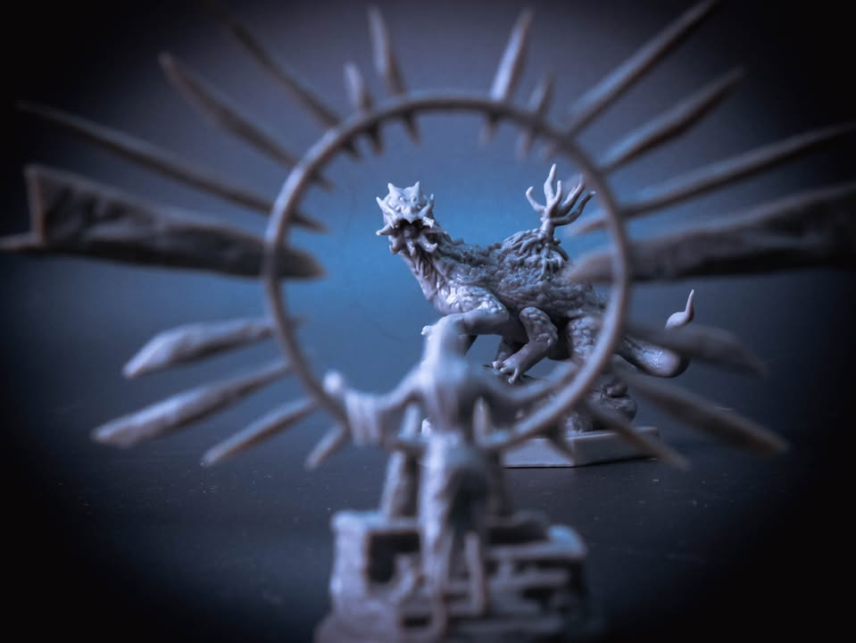
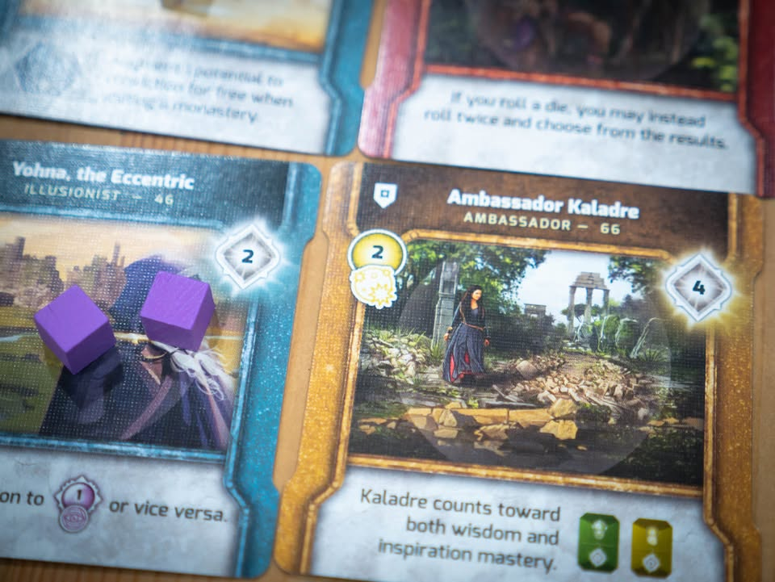
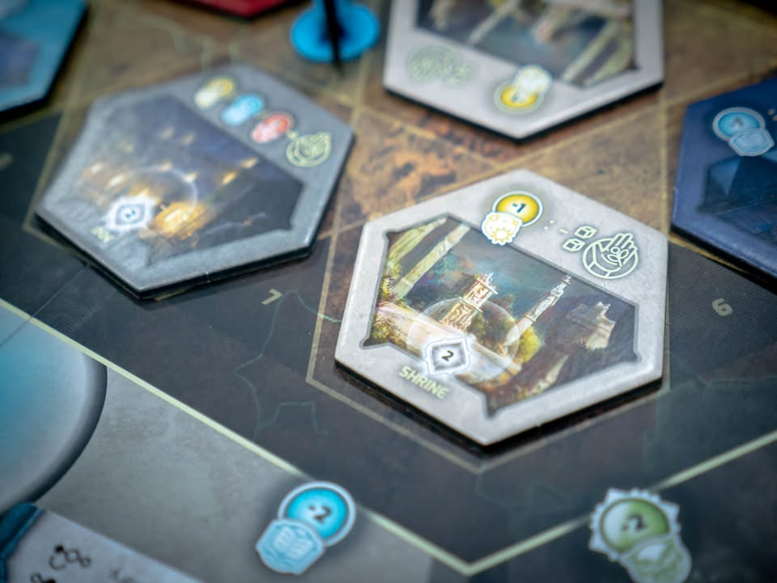
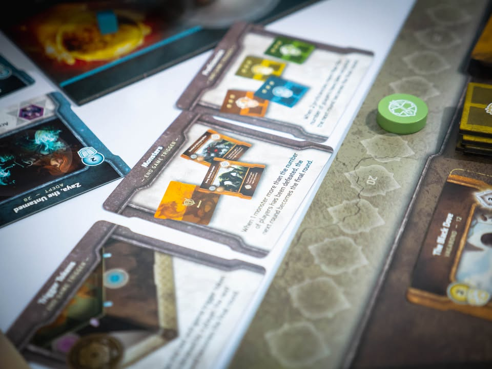
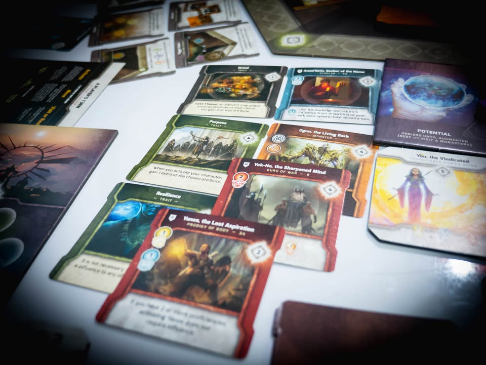
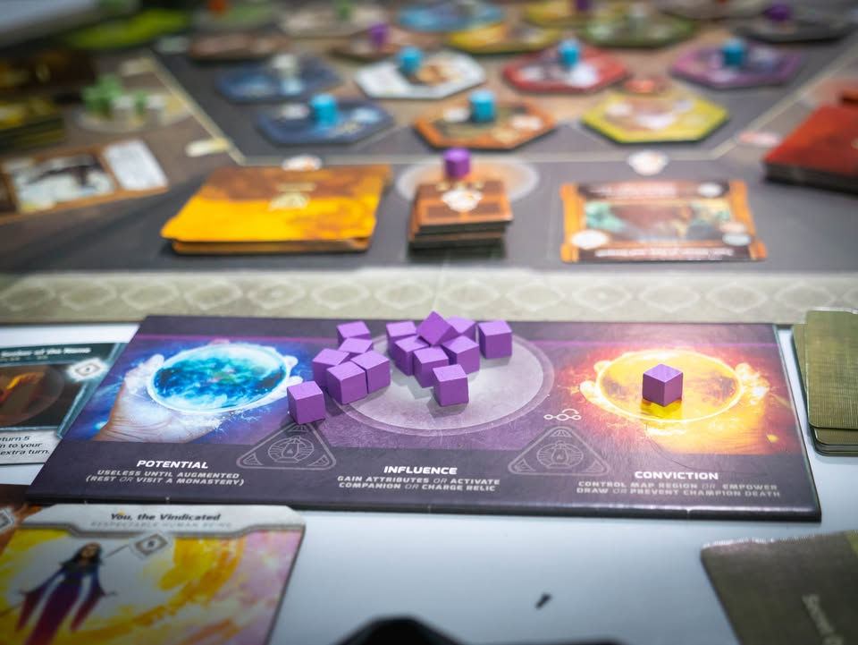
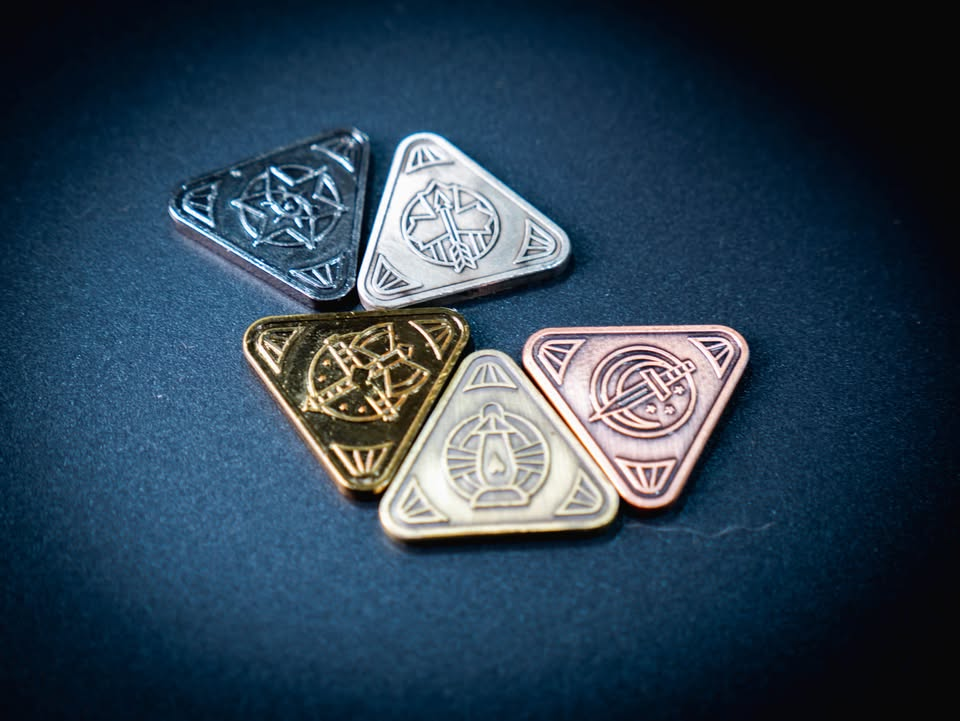

Vindication #thought
blog link: https://wp.me/p7TSgy-2Ma

▪️ เกมยูโรระดับกลางที่จะให้เราเดินทางท่องเที่ยวไปทั่วเกาะแฟนตาซีเก็บสะสมทำแต้มผ่านการผจญภัยและตามหาเพื่อนร่วมทางเพื่อเสริมศักยภาพปาร์ตี้ของเรา ผลงานของ Marc Neidlinger
 
 
▪️ เกมนี้ในแง่ธีมค่อนข้างปูมาเว่อร์วัง ประมาณว่าเราคือคนบาปที่ได้รับโอกาสใหม่ให้มาทำความดีให้เกาะแห่งนี้ แต่เล่นจริงอย่าไปสนใจมาก เราก็เดินไปมาสะสมพลังทำเควสเก็บแต้มไปเรื่อย 
 
 
▪️ไอเดียหลักเกมนี้คือเราจะเดินแวะไปตามไทล์บนเกาะที่จะสุ่มตำแหน่งกันไปในแต่ล่ะเกมมีอารมณ์เปิดแผนที่นิดๆ มี function หลักๆสองอย่างคือ แวะเพื่อไปเรียนรู้พลัง (เอาคิวป์ของเราไปวางว่ามีทรัพยากรสีนั้นอยู่ ได้แก่ แรงบันดาลใจ, ความรู้, ความแข็งแกร่ง และเราสามารถเอาสองอย่างมาผสมกันเป็นระดับสอง เรียกว่า ความกล้าหาญ, ความรู้ และวิสัยทัศน์) กับจ่ายเอาพลังที่เราเรียนรู้มาไปแลกการ์ด ซึ่งก็มีหกแบบตามสีของพลัง
  
 
▪️พวกไทล์สถานที่มันก็พยายามผูกธีมมาล่ะ พวกพลังพื้นฐานพอไปแลกมาจะได้ 'เพื่อน' มาช่วยเพิ่มความสามารถให้ แถมยังช่วยผลิตพลังสีนั้นๆด้วย ส่วนพลังขั้นสองก็จะได้การ์ดเป็นเครื่องรางแนวใช้เพื่อทำแอฟเฟค การ์ดบททดสอบเอาไว้เพิ่มแต้มทุกครั้งที่ทำตรงเงื่อนไข การ์ดสัตว์ประหลาดที่ช่วยให้เราได้แต้มเพิ่มตอนจบเกม 
 
 
▪️ถ้าพูดกว้างๆก็คือเดินๆเก็บแลกการ์ดไปเข้าสต๊อกไปเรื่อย ยิ่งเล่นเรายิ่งเก่งแต้มยิ่งฟุ้งเฟ้อ ด้วยความที่เราเน้นเดินไปมาก็จะมีไทล์เอาไว้ช่วยอัพเกรดในเราเดินไวขึ้น มีไทล์เอาไว้ช่วยเพิ่มคิวป์ไว้แปลงเป็นพลัง (เพราะคิวป์เรามีจำกัด)  มีการกั๊กผู้เล่นอื่นด้วยการลงคิวป์ไปจองเป็นเจ้าของ ข้อดีคือใครใช้ไทล์นั้นเราจะได้แต้มด้วย
 
  
▪️เกมนี้จบลงแล้วแต่ว่าการ์ดเงื่อนไขจบเกมจะเป็นอะไร ส่วนมาก็จะแนวๆมีใครเก็บของอันโน้นอันนี้ครบจำนวน ซึ่งข้อดีคือระหว่างเล่นการ์ดเงื่อนไขจบมันจะงอกมาเรื่อยๆ ทำให้เกมจบได้หลายทาง

-------------------------------
[🐸 Someone I know, เด็กชายข้างบ้านช่างฝัน] 

🔹 น้องคนนี้แม้การจะเดินไปซื้อไอติมวอล์ที่ 7-11 หน้าปากซอยก็สามารถกลายเป็นการผญจภัยอันหน้าตื่นเต้นได้เสมอ เรื่องเรียบง่ายในชีวิตล้วนสามารถกลายเป็นความสนุกอันยิ่งใหญ่ที่ทำให้วันธรรมดาไม่มีความน่าเบื่อ
  
 
🔹 ผมมองเกมนี้ว่ามันประมาณ Istanbul ฉบับแฟนตาซีและไม่มีทิ้งคนงาน เพราะไอเดียหลักคือพอเราเก็บการ์ดได้นิดหน่อยเราจะมี 'เส้นทางทำแต้ม' ส่วนตัวล่ะ เราก็เดินไปเดินมาแวะอยู่ที่สองสามช่องนี้ทำแต้มไปเรื่อยๆ ข้อดีคือแต่ล่ะคนมี optimal path ส่วนตัวที่เกิดจากการ์ดได้หาหยิบมาได้ระหว่างเกม ไม่นิ่งเหมือนใน Istanbul
 
 
🔹 ข้อดีคือเป็นเกมเล่นเพลินๆชั่วโมงกว่าๆก็จบล่ะ เข้าใจง่ายเดินไปเดินมามีเอฟเฟคการ์ดที่ไม่ว่าคุณจะทำอะไรจะมีคนบอกว่า 'โกง' ออกมาเสมอ ระดับการบริหารคิวป์ก็พอให้ใช้หัวไปเรื่อยๆ มีความขัดใจเล็กๆเวลาเพื่อนมายืนเกะกะ กับมีช่วงการแข่งกันกับการ์ดสีให้เยอะที่สุดเพื่อแต้มโบนัส รวมไปถึงการวางคิวป์จองไทล์ที่เพื่อนจะแวะมาบ่อยๆ (รวมถึงการวางคิวป์ตบเจ้าของเดิมออก) ตามด้วยโดนเพื่อนตัดจบตอนเรากำลังจะเทพ
 
 
🔸 จากกรอบว่ามันเป็นเกมเล่นสบายๆไปเรื่อยข้อเสียตามกรอบจะเป็นที่มันจะเอามินิใหญ่โตมาทำอะไรหว่า สร้างยากไม่เท่าไร แต่ใช้จริงผลกระจิ๊ดนึงแถมเกะกะอีกต่างหาก ข้อเสียเลยกลายเป็นภาพลักษณ์ของเกมมันใหญ่กว่าที่ตัวเกมเป็นไปซักหน่อย (ในมุมมองนี้ Tapestry ทำออกมาดีกว่ามาก)
 
 
🔸 ข้อเสียใหญ่ในมุมส่วนตัวผมคือวิธี 'นำเสนอ' เว่อร์เกินไป ทำให้การอ่านกติกาเข้าใจยากเกินจำเป็น รูล 40 กว่าหน้ามีแต่น้ำลำไยเขียนเล่าเรื่องเยอะแยะ ทั้งๆที่มันไม่ได้ซับซ้อนขนาดนั้น ถ้าเอารูลไปเขียนใหม่จบเนื้อๆแบบอ่านแค่นี้เล่นเกมได้เลยน่าจะเหลือ 4 หน้า ซึ่งเกมเดินแลกของนี้ไม่ผิดนะเพราะตอนเล่นก็สนุกดี แต่เล่าเว่อร์ไประบบเกมมันรองรับความขี้โม้ไม่ไหว ข้อเสียต่อเนื่องเล็กๆคือด้วยความที่เกมมันทำภาพมาใหญ่แต่ดันจบเร็ว เราก็อาจจะรู้สึกโหว่งๆนิดนึง (ซึ่งไม่ใช่ปัญหาเชิงเกม แต่มันไม่ตรงปก!!)
 
  
🔸 อย่างธีมเนี่ยมีช่องนึงต้องไป 'ตี' มอนสเตอร์ ซึ่งตอนเล่นก็คือไปแวะช่องนี้แล้วก็จ่ายคิวป์ 'ความกล้าหาญ' เท่านั้นเอง ไม่ซับซ้อนอะไรนอกจากมีการทอยเต๋าเก็บของนิดหน่อย กับถ้าดวงไม่ดีการ์ดเพื่อนเราจะหายไปใบนึง (ธีมประมาณสู้ยังไงก็ชนะ แต่ว่าเพื่อนร่วมทางอาจจะตายไรงี้)
 
 
🔸 ข้อเสียต่อเนื่องจากความพยายามดันธีมเยอะเลยมาอยู่ที่ เกมนี้เล่นครั้งแรกอธิบายยากเกินจำเป็นมาก โดยเฉพาะถ้าพยายามอธิบายตามคู่มือ อย่างการเลื่อนคิวป์เกมนี้ใช้คำว่า Augment  ซึ่งจริงๆมันก็คือย้ายคิวป์ไปมาเนี่ยล่ะ แต่เกมมันพยายามใช้คำพวกนี้เยอะจนน่ารำคาญไปหน่อย เกมนี้สอนรอบสองผมพูดแค่เก็บสีตรงนี้ ไปจ่ายแลกการ์ดตรงโน้นจบล่ะ คนที่เล่นเกมมาซักหน่อยก็เล่นเกมนี้ได้เลย คือเกมมันสอนง่ายขนาดนั้นเลยล่ะ (อันนี้เป็นข้อดี)
 
 
 👁‍🗨 ข้อสังเกตุคือเกมนี้มีภาษาค่อนข้างเยอะ ต้องไล่ตามอ่านประมาณหนึ่ง ข้อดีคือมันเป็นข้อมูลเปิด ข้อเสียคือเวลาอ่านตีลังกาแล้วหงุดหงิดนิดหน่อย หลายๆรอบเราก็เล่นแต่สายที่การ์ดอยู่ตรงหน้าเนี่ยล่ะขี้เกียจชะโงกหน้าไปอ่าน แต่ภาษาก็อยู่ในระดับทั่วไปไม่ได้ยากอะไรนะ ที่แปลกอีกนิดคือตัวเดินของเราจะเป็นเหรียญเหล็กไม่ใช่ไทล์สี ซึ่งตัวเหล็กนี้มีเนื้อต่างกัน 5 เฉด แรกๆจะรู้สึกขัดๆมองผิดบ่อยหน่อย แต่เล่นไปซักพักก็ชิน
 
 
💭 ถ้าถามว่าทำให้เรทประมาณนี้ หลักๆก็คือมันเบากว่ารสนิยมปกติเท่านั้นเอง (เกมนี้อยู่ที่ แถวๆ 3.00 ) เลยไม่รู้จะกางเล่นตอนไหน กล่องก็ดันใหญ่ซะเลยน่าจะเหมาะกับวางไว้บ้านมากกว่า คือถ้ามันทำกล่องเล็กๆตัดส่วนเว่อร์ๆออกแล้วเหลือเกมซักสองพันนี้อาจจะเป็นเกมเด็ดไว้แนะนำคนเล่นต่อจาก Lord of Waterdeep ได้เลย (ของที่ได้มันก็ตามราคานะ แค่มันทำให้ถูกกว่านี้ก็ได้) คือมันเป็นอะไรประมาณนั้นในแง่ว่าเกมระบบไม่ซับซ้อนมากแต่ใส่ธีมเราเรื่องมาเยอะๆ เหมาะกับคนเล่นเกมไม่หนักออกท่าไปเรื่อย 

---------------------------------------------------------
Compatible Level - เกมนี้เข้ากับคนเขียนได้ระดับไหนนะ!!

🐸 Family, อาจจะมีช่วงเวลาที่ไม่เข้าใจกันบ้างแต่ครอบครัวคือสิ่งที่จะอยู่กับเราตลอดไป นี้คือเกมที่จะมีพื้นที่ถาวรในชั้นวางแน่นอน!! แม้บางเกมจะเปรียบดั่งคุณปู่ใจดีที่ได้เจอกันแค่ปีล่ะครั้ง แต่อันดับในใจนั้นคือความสนุกในช่วงเวลาที่เล่น หาใช่การได้เล่นซ้ำไม่รู้เบื่อเพียงอย่างเดียว [ex. กบโปรด, กบชอบ]

🐸 Hang out friend, เพื่อนกินเที่ยว ถ้าไม่ติดธุระอันใดก็พร้อมจะออกไปพบเจอ สนุกยามได้พบปะ แต่จะให้เจอกันบ่อยๆคงใช่ที - เกมสนุกที่อยากเล่นในระดับที่อยากจะหยิบกางเป็นบางครั้ง สลับสับเปลี่ยนไปเรื่อยตามจังหวะและโอกาส แต่เราก็ไม่ได้อยากซ้ำต่อเนื่องรัวๆ [ex. กบโอเค]

🐸 Someone I know, หากบังเอิญพบเจอ ก็คงได้ทักทายไต่ถาม หากแต่ในยามปกติมิอาจนึกชื่อออก ยืนคุยก็ได้ แต่คงไม่ได้เอื่อนเอ่ยนัดกินข้าว - บางเกมเราก็ไม่ได้อยากชวนเล่น แต่ถ้าไม่มีอะไรทำแล้วมีคนชวนก็เล่นก็ได้ [ex. กบเฉย]

🐸 I Turn left, You Turn Right - เธอชอบกินเผ็ด เราชอบกินอาหารญี่ปุ่น เธอชอบคนคารมดีพาไปกินที่หรู แต่เราชอบเล่นเกมอยู่กับบ้าน แม้จะได้คุยเป็นบางคราแต่คงไม่อาจพัฒนาความสัมพันธ์ - บางเกมแม้ว่าจะดีแค่ไหน แต่ถ้ารสนิยมมันไปด้วยกันไม่ได้ก็ไม่รู้จะเล่นไปทำไม [ex. กบไม่เล่น]

