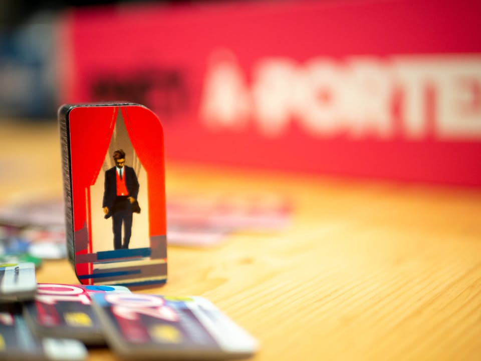
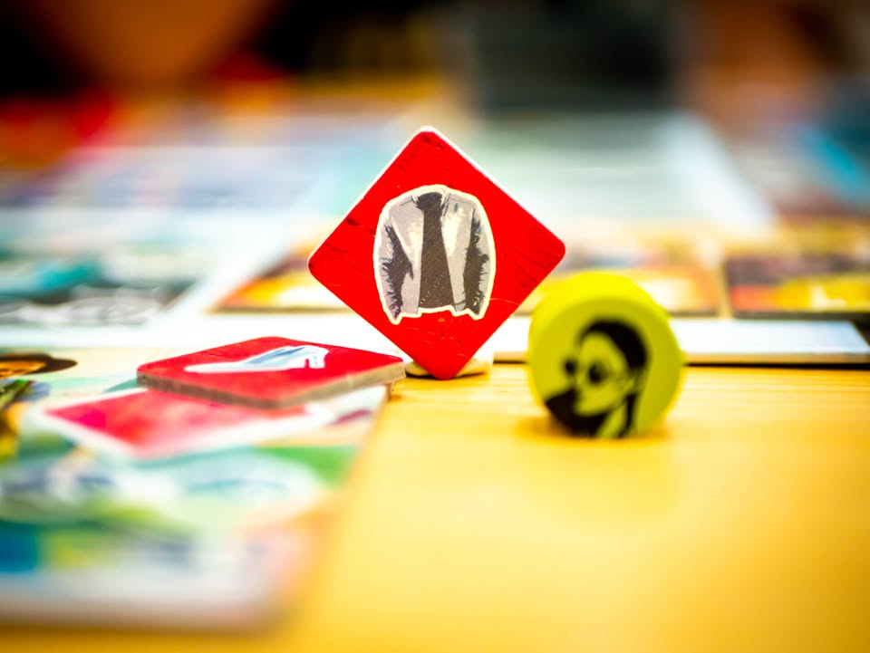
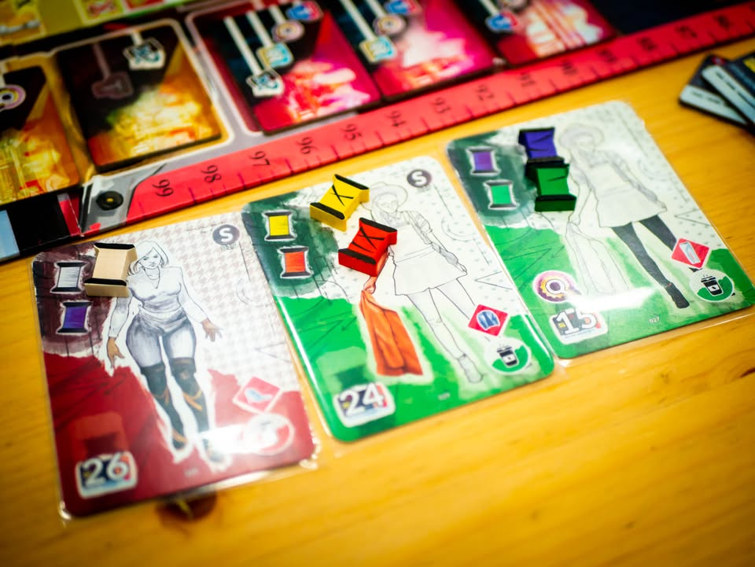
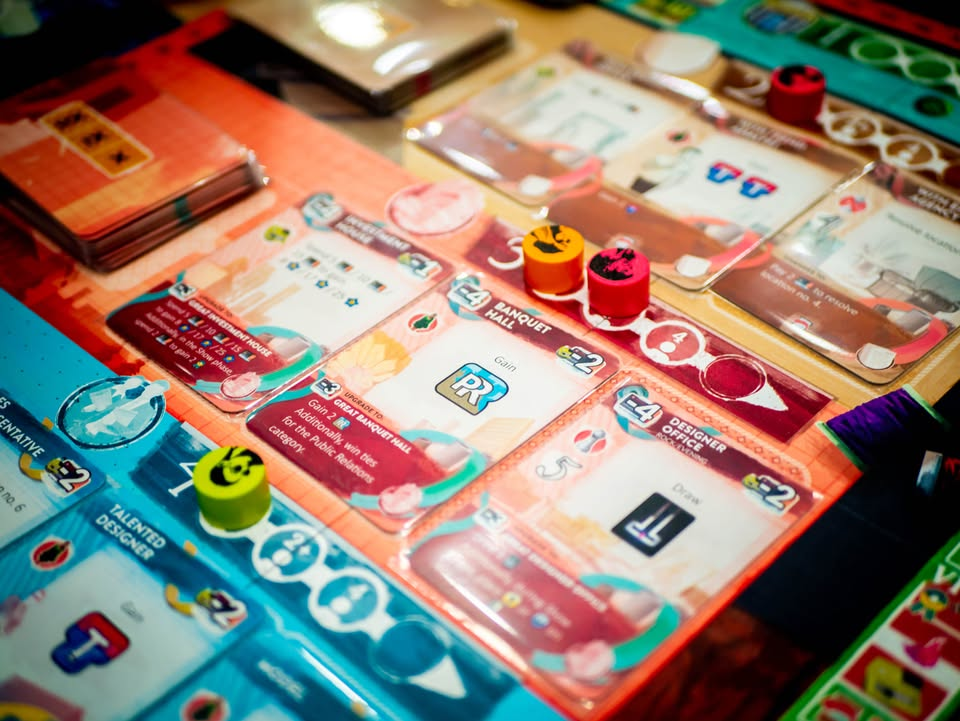
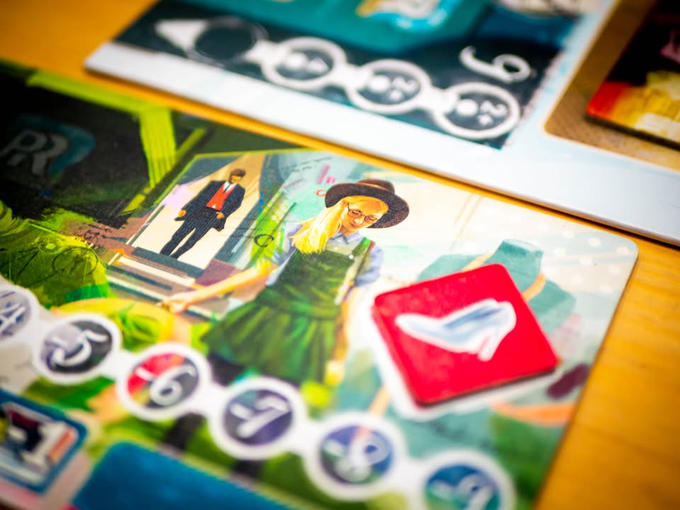
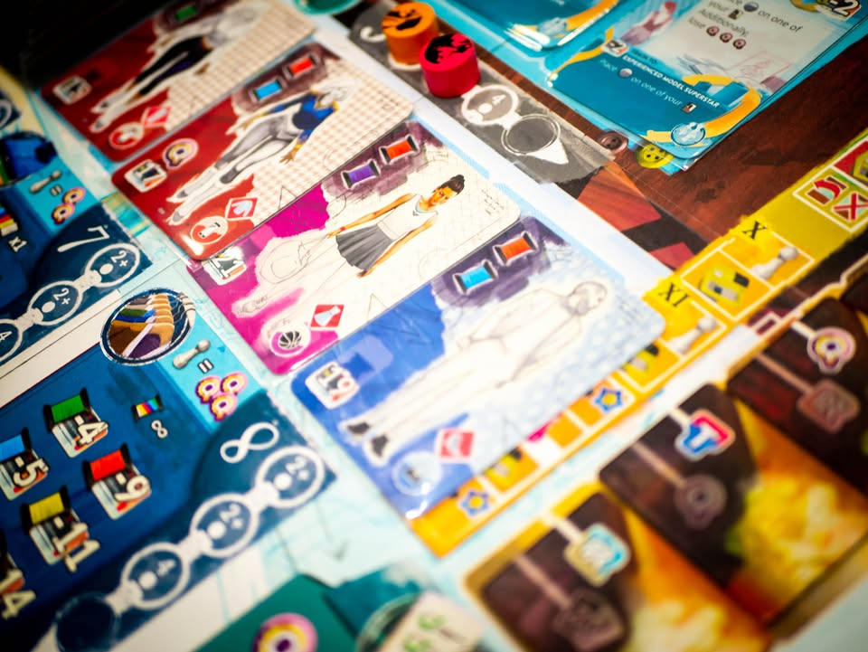
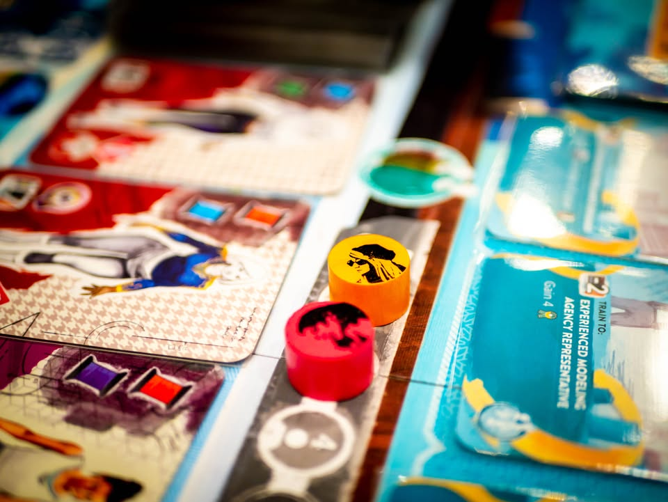
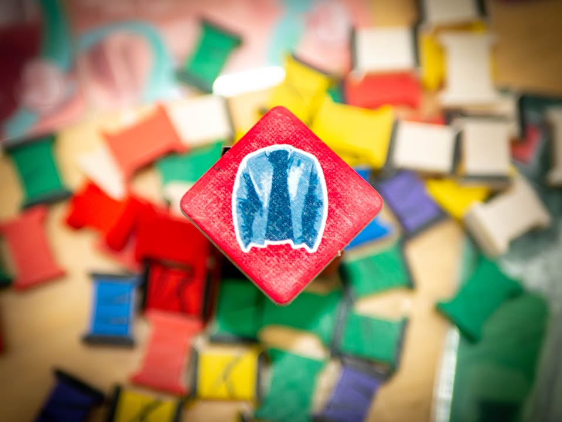
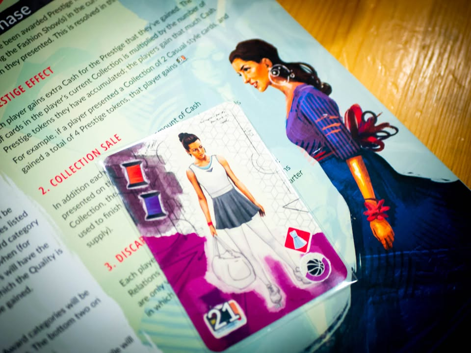

Pret-a-Porter 3rd Edition (Portal Games) #bite_size

หยุด!! ถ้าคุณคิดว่าเกมนี้เป็นเกมแต่งตัวสาวให้สวยเริ่ดไปทำแต้ม
.
เพราะคุณคิดผิด!!
.
เพราะนี้คือเกม Economic + Snowball Engine + Set Collection ที่ฉูดฉาดที่สุดในปี 2019
 
 
▪️ เกมนี้ผมเคยเขียนถึงไว้ล่ะ อันนี้เป็นฉบับพิมพ์ใหม่ที่ปรับงานศิลป์ใหม่ สีสันสดใสฉูดฉาดบาดตา เป็นเกมที่เดิมแล้วถือเป็นเกม OOP ที่มีคนตามหากันเรื่อยๆ เพราะธีมสดใหม่ (ตอนนี้ก็ยังสดอยู่) แต่การใช้ความคิดกลับไม่ใสตามหน้าปก
  
 
📖 blog link: https://wp.me/p7TSgy-2F1
  
  
📌 Prêt-à-Porter เป็นคำภาษาฝรั่งเศสที่มีความหมายว่า Ready-to-wear หรือเสื้อพร้อมใส่ (แบบที่บ้านเราชอบเรียกฟรีไซส์นั้นแหละ) และนี้คือตลาดเสื้อผ้าเค้กชิ้นใหญ่มูลค่ามหาศาลที่เราจะต้องมารับบทเป็นผู้ประกอบการมาแก่งแย่งกัน แต่ตลาดนี้มันไม่ได้มีแค่เสื้อโบ๊เบ๊ 199 บาทแบบที่อาจจะเข้าใจในแว๊บแรกนะ แต่เรากำลังอยู่ในตลาด ready-to-ware ระดับแบรนด์ดังดั่ง Chanel, Dior ที่เสื้อผ้าต้องเอาไปออกงานแฟชั่นโชว์ให้โลกประจักษ์
 
 
▪️ ไอเดียเกมนี้ง่ายๆเลยคือเป็น Worker Placement ที่เราต้องไปหยิบการ์ดแบบเสื้อที่สุ่มมาไปเก็บไว้ จากนั้นก็ไปลงช่องโรงงานสั่งซื้อด้ายให้ตรงกับการ์ดแบบเสื้อ พอถึงช่วงแฟชั่นโชว์ก็ต้องเลือกสไตล์เสื้อผ้าเข้าชุดกันไปเดินแบบก็จะได้เงินมา แล้วก็วนลูป จบเกมใครรวยสุดชนะ
 
 
▪️ ความ 'หนัก' ที่ฉีกหน้าตาใสๆของเกมนี้คือเราต้องไปจ้างการ์ดพนักงาน และการ์ดแผนกที่จะให้ความสามารถขี้โกงๆกับเรามา แต่ก็แลกมากับการที่ต้องตามจ่ายเงินเดือนแพงๆให้กับเจ้าพวกนี้ทุกตา 
 
 
▪️ ส่วนที่ต้องใช้ความคิดหนักอีกอย่างเกิดจากคนงานที่มีจำนวนจำกัด ช่องที่มีนิดเดียว รอบการเล่นก็น้อยแถมเงินก็ไหลออกเป็นน้ำ ระหว่างนั้นเราก็ต้องวางแผนที่จะชนะการแข่งเดินแบบกับคนอื่นที่จะจัดขึ้นสี่ครั้งในเกม แต่ล่ะรอบก็จะมีการคิดแต้มชิงดีชิงเด่นทั้งคุณภาพการผลิต, ความทันสมัย และการโปรโมทสินค้า ซึ่งจะสุ่มไปตามเกม แต่ว่าเราเห็นล่วงหน้าทั้งหมดว่าเดือนไหนเค้าเน้นแข่งอะไร
 
 
▪️ ไม่ว่าคุณจะสนใจแฟชั่นโชว์หรือไม่ (ผมก็ไม่สนเหมือนกัน มิแรนดา เคอร์ ไรงี้นางเป็นใครไม่รู้จักจริงๆ.......)  ผมเชื่อว่าเกมนี้จะมันจะนำโมเม้น 'chic chic' ออกมาจากตัวคุณได้แน่นอน
 
 
🔹 ข้อดีเกมนี้คือธีมดี เข้ากับเกม เกมสอนไม่ยากมีเฟสชัดเจน แกนหลักเป็นยูโรแห้งๆตามขนบแต่ตอนเล่นธีมมันกลบไว้ค่อนข้างมิด 
 
 
👁‍🗨 ไม่เชิงข้อเสียแต่ว่ามันเป็นเกมสไตล์ snowball คนที่จับ engine ดีแล้วก็มักจะติดปีกบินไปเรื่อย ใครเล่นพลาดก็จะเหงาๆหน่อยแข่งอะไรก็แพ้ แต่ข้อดีในแง่นี้คือเกมเล่นไม่นานมากชั่วโมงครึ่งก็จบแล้ว กับอีกอย่างคือเกมมันจะมีแข่งวัดจำนวนโทเคนสามอย่างคือ Quality, Trend, PR ซึ่งมันก็คือเก็บโทเคนโง่ๆมาวัดแล้วทิ้งเลย ซึ่งตรงนี้ธีมมันอาจจะเบาบางไปนิด แต่ส่วนตัวคิดว่าบรรยากาศเกมโดยรวมมันยังอุ้มตรงนี้ไว้ได้อยู่ 
 
 
🔸 ที่ไม่ชอบของฉบับใหม่ที่แม้จะปรับจากอันแรกมาหลายอย่างนั้นมีอย่างเดียวคือไม่ชอบไทล์เงินกระดาษที่มันหน้าตาเหมือนๆกันไปหมดแยกมูลค่าไม่ออก 
  
 
💭 คิดว่าเป็นเกมที่มีจุดเด่นดีตรงธีมสวยเอาไว้หลอกสายธีมมาลองเล่นเกมคิดหนักเยอะหน่อย ส่วนสายคิดเยอะเองก็ได้เปลี่ยนจากโลกธุรกิจสีตุ่นๆแห้งๆ ไปลองธีมสดใสโดยที่ยังไม่ทิ้งความเป็นเกมใช้หัวไป เท่าที่เจอมาก็เห็นหลายคนรอบแฟชั่นมีกัดกันเบาด้วยประโยคประเภท "ขอโทษนะที่เสื้อชั้นมันหรูกว่าแกร๊" จากปากสาย non-theme อยู่เรื่อยๆ :P
 
 
▪️ ถึงจะบอกว่าเป็น 3rd แต่ตัว 1st กับ 2nd นี้เหมือนกันเลยไม่ต้องสับสนไปนะ
--------------------------------
หมวด Bite Size (พอดีคำ) นี้กะว่าจะเขียนอะไรสั้นๆประมาณนี้ล่ะกัน ใหม่บ้าง ซ้ำบ้าง เกมที่ขี้เกียจเขียนบ้าง เขียนๆไว้ก่อนเผื่อมีอารมณ์อาจจะขยายไปลง Thought บ้าง จริงๆอยากเขียนสั้นกว่านี้ แต่ยังอดไม่ได้ที่จะต้องอธิบายอะไรเพิ่มตามนิสัย เดี๋ยวค่อยๆปรับไปล่ะกัน

