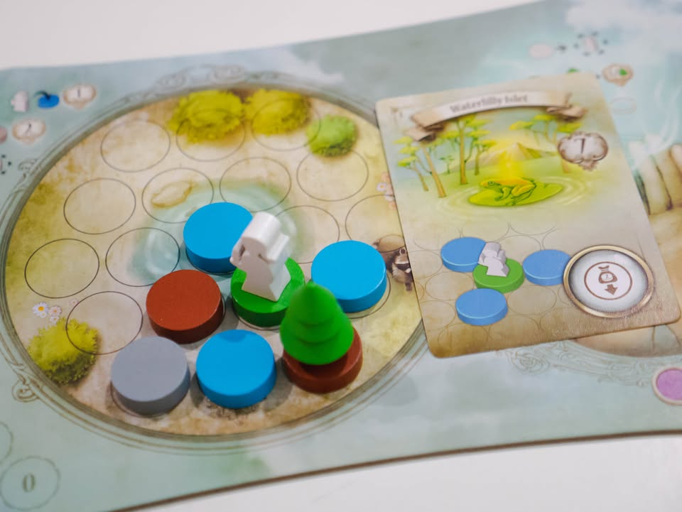
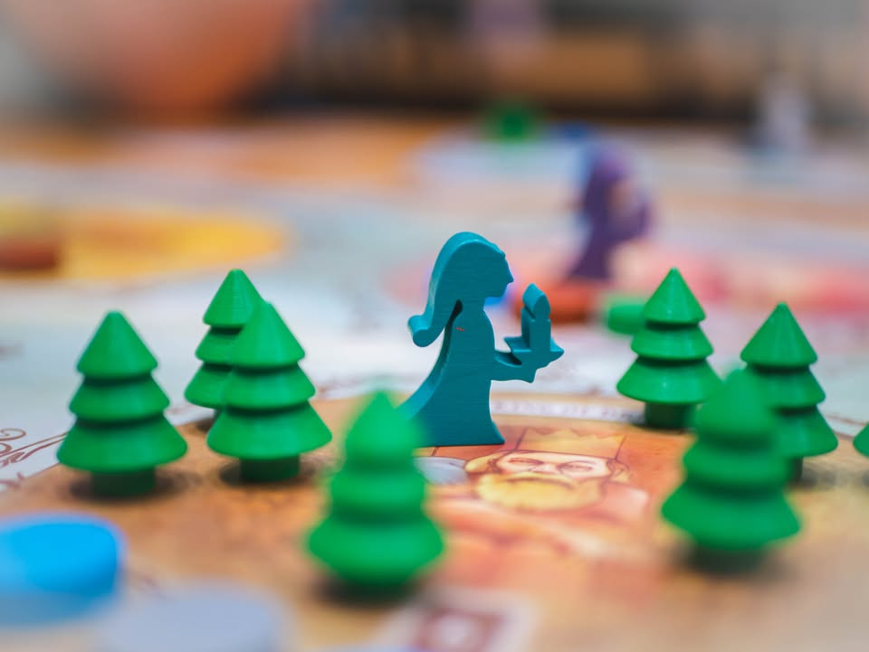
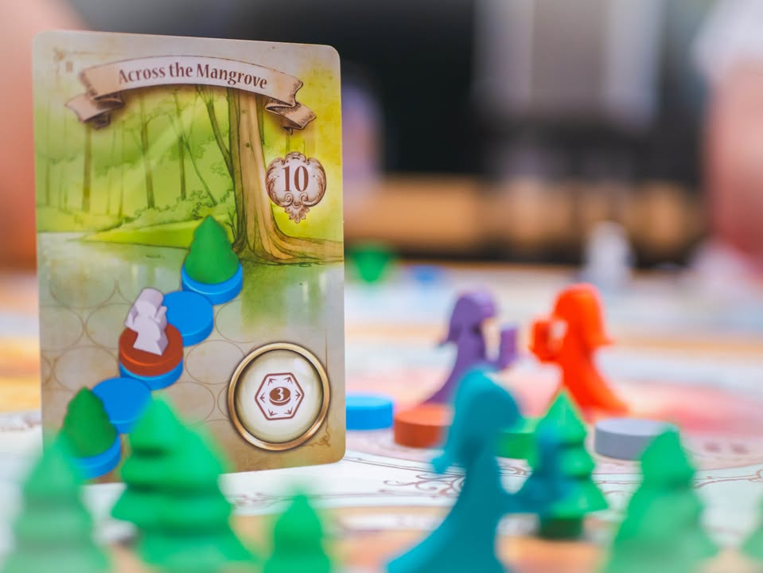
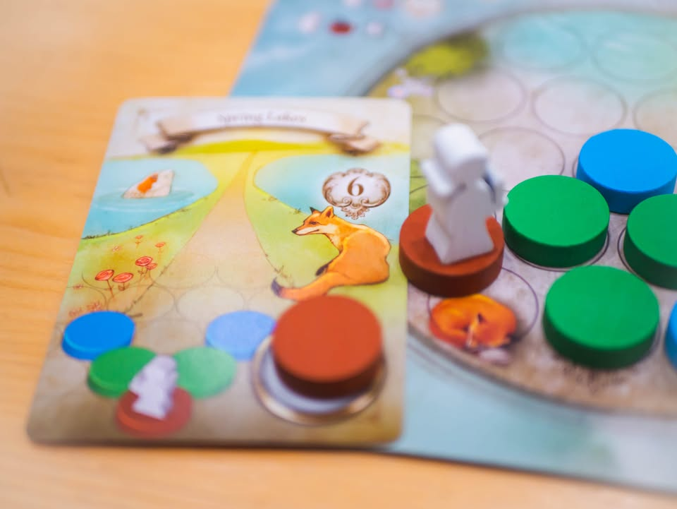
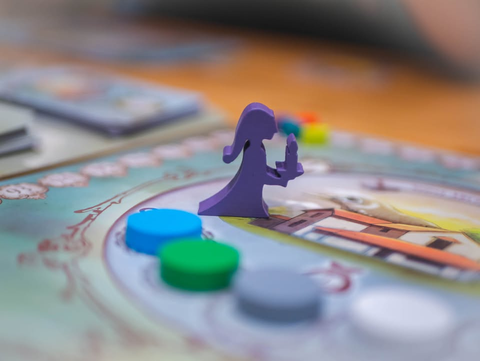
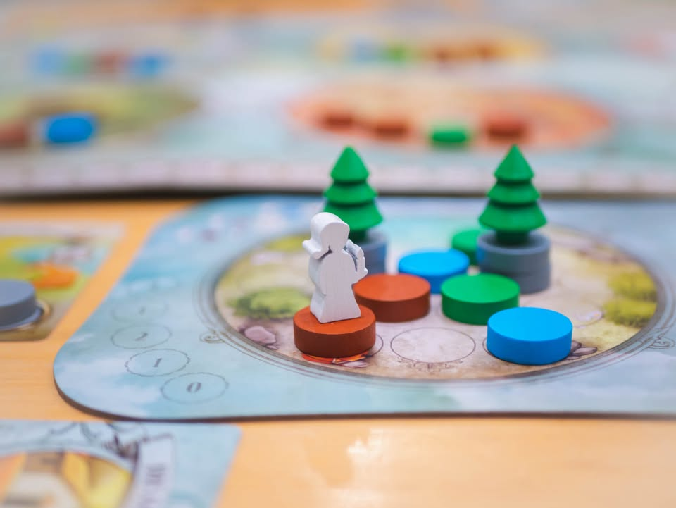
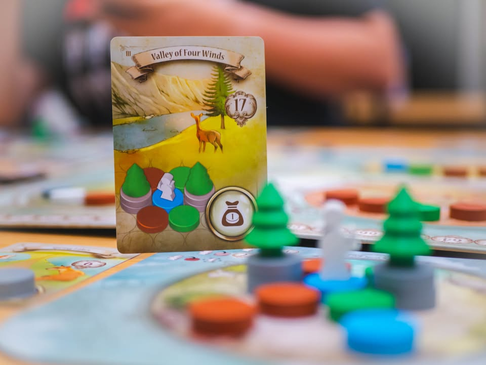
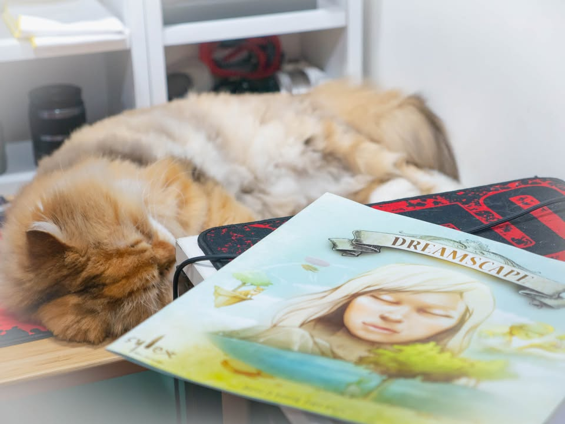

Dreamscape #bite_size
blog link: https_://wp.me/p7TSgy-2Mp

▪️เกมยูโรระดับกลางที่จะให้เราล่องลอยไปท่ามกลางดินแดนแห่งนิทราเพื่อนำเศษเสี้ยวแห่งจินตนาการมาสร้างสรรค์ทิวทัศน์ในความฝันของเรา
 
  
📌 ตอนแรกกะว่าจะแกะ expansion มาลองครบ 4 ตัวแล้วค่อยเขียนทีเดียว แต่เหมือนผมยังหาจังหวะกางเกมกับวงเดิมซ้ำๆไม่ได้เลยขอเขียนถึงแค่ตัวหลักสั้นๆละกัน นี้ยังแอบเซงเปิดมาโทเคนหายไปอันนึงพึ่งติดต่อเคลมไป -_-
  
  
▪️เป็นเกมแนวเพลินๆผลัดกันเดินไปมาในบอร์ดกลางแล้วก็หยิบภูเขา ต้นไม้ แม่น้ำ มาเก็บไว้พอจบรอบก็ต้องเอาที่หยิบมาเนี่ยวางเรียงๆบนกระดานเรา ซึ่งระหว่างเล่นก็ต้องไปหยิบใบโผยมาว่าเราฝันเห็นวิวแบบไหนก็ต้องไปสร้างตามมา
  
 
▪️มีกิมมิคนิดหน่อยว่าแค่ทำเหมือนอย่างเดียวไม่พอเราต้องไปหยิบโทเคนเดินเอาไว้พาตัวเรา(ที่ฝันอยู่) ไปหยุดดูวิวให้ตรงกับที่เห็นในภาพ ซึ่งส่วนตัวคิดว่ามันก็เออแม้ของจะมีไม่กี่แบบแต่มันวาดรูปประกอบชี้นำให้เรามองเห็นเป็นทิวทัศน์ตามรูปได้จริงๆด้วยล่ะ (อารมณ์จะแถวๆต่อเลโก้แล้วมองไปมองมาก็เออ เหมือนอยู่)
  
  
▪️ตัวเกมเล่นไม่ยาก แต่ที่ทำให้ยากคือแอคชั่นน้อยสัด แถมเล่นไม่กี่รอบก็จบ ในตานึงเราต้องแบ่งแต้มที่มีอยู่น้อยนิดไปทั้งเดินและเอาไว้เก็บโทเคนฝัน แล้วไหนจะต้องวางแผนว่าจะหยุดตรงพื้นที่ไหนเพื่อใช้ความสามารถประจำพื้นที่ดี  บางทีก็เอาไว้เพิ่มโทเคนฝัน บางทีก็ช่วยให้เรา 'รื้อ' ความฝันที่วางไว้แล้วได้ เอาไว้วางเรียงสร้างตามความฝันอันใหม่
  
  
🔸ด้วยความที่แอคชั่นน้อยถ้าเล่นกับสาย AP เกมอาจจะนาน และผู้เล่นที่ไม่มีทักษะหมุนเททริสในหัวอาจจะต้องเล็งเยอะหน่อย
  
  
👁‍🗨 เกมอยู่คนเดียวค่อนข้างเยอะก็จริงแต่ส่วนตัวคิดว่าโอเค เพราะรู้สึกว่าน้ำหนักของ puzzle มันดึงให้เราต้องจมอยู่กับกระดานนานแบบสนุกกับการหามุม กับวางแผนในหัวว่าจะต้องหยิบอะไรก่อนหลังดี แต่คนที่ไม่ชอบเกมอยู่คนเดียวจ้าๆก็อาจจะไม่ชอบเกมนี้
 
  
🔹 เป็นเกมสไตล์ชนะก็ดีใจนะ แต่ตอนทำความทิวทัศน์แบบยาก (เกมมีสามระดับ) สำเร็จนี้รู้สึกดีมากๆ แบบความฝันกูสำเร็จแล้วโว้ยยยยยย แพ้ก็ไม่เป็นไร แต่โดยรวมก็เป็นเกมแบบเล่นไปเรื่อยๆ ใช้เวลาไม่นานมาก
 
 
▪️ตัวเสริมมีสี่ตัวที่อ่านไว้แต่ยังไม่ได้เล่นได้แก่

▫️ อีกาแดง - จะเพิ่มโทเคนฝันร้ายเข้ามา กับมีทิวทัศน์ฝันร้ายให้วางเรียงเพิ่ม อันนี้อ่านล่ะดูยุ่งยากสุด

▫️ สโนว์แมน - อันนี้จะเพิ่มทิวทัศน์หิมะตก

▫️ สัตว์แห่งราตรี - เพิ่มสัตว์มาให้เล่นห้าชนิด มีหมาป่า กระต่าย ปลาโลมา กระรอก และนกฮูก ให้ต้องวางเหยื่อล่อถ้าจับได้ก็จะได้โบนัสไปช่วยเราเวลาสร้างฝันต่อ

▫️ วิญญาณแห่งความฝัน - อันนี้แนวเพิ่มไทล์ความสามารถให้เราออกลีลาได้เพิ่ม
 
 
🔹 ปกติจะไม่ชอบเกมอยู่คนเดียวนานๆแล้วงอกโมดูลแบบต่างคนต่างทำเท่าไร แต่ 'เดา' เอาว่าเกมนี้ใส่ครบน่าจะสนุกดี เพราะมันเป็นเกมแนววางเรียงให้มันสวยๆอยู่แล้ว แต่น่าจะแอบเสียเวลาสอนแล้วอาจจะทำให้ความเรียบง่ายของเกมหายไป ซึ่งอาจจะผิดกับเป้าหมายที่จะหยิบเกมมากางแต่แรกก็ได้

ไว้ถ้าได้เล่นครบอาจจะเอามาเขียนเพิ่ม

--------------------------------
หมวด Bite Size (พอดีคำ) นี้กะว่าจะเขียนอะไรสั้นๆประมาณนี้ล่ะกัน ใหม่บ้าง ซ้ำบ้าง เกมที่ขี้เกียจเขียนบ้าง เขียนๆไว้ก่อนเผื่อมีอารมณ์อาจจะขยายไปลง Thought บ้าง จริงๆอยากเขียนสั้นกว่านี้ แต่ยังอดไม่ได้ที่จะต้องอธิบายอะไรเพิ่มตามนิสัย เดี๋ยวค่อยๆปรับไปล่ะกัน

