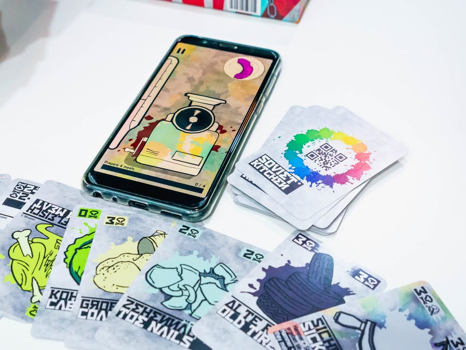

Soviet Kitchen Unleashed #bite_size

▪️เกมเบาธีมออกแนวดมกาวเล็กๆว่าด้วยสงครามได้ปะทุขึ้นและเราคือกลุ่มพ่อครัวกลางสนามรบที่ต้องช่วยกันเอาของรอบตัวที่ดูแล้วไม่น่าจะกินเข้าไปได้อย่างร้องเท้า,ไม้กระดาน,หัวตะปู เอามาผสมปนเปกับของกินได้มาเสริฟเป็นไส้กรอกพร้อมเครื่องเคียงแสนอร่อย(?) ให้เหล่าเพื่อนร่วมรบได้อิ่มท้อง
  
  
▪️เกมนี้ต้องโหลด app ใส่มือถือมาเล่นด้วย ไอเดียหลักก็ง่ายๆคือเกมจะสุ่มอาหารมาพร้อมกับสีพิลึกๆมาหนึ่งเฉด (อย่างสีเขียวนีออน) ผู้เล่นในวงก็จะผลัดกันทิ้งการ์ดที่มีสีแตกต่างกันเพื่อผสมออกมาให้สีใกล้เคียงกับสีที่เกมต้องการมากที่สุด ซึ่งสีในการ์ดแต่ล่ะใบจะไม่มีเฉดซ้ำกัน
  
  
▪️ลูกเล่นของเกมนี้คือตรงหลังการ์ดจะมี QR Code เอาไว้อ่านค่าสี เวลาทิ้งเราก็แค่ยกการ์ดไว้เหนือกล้องหน้า พอใส่การ์ดครบมันก็จะผสมสีมาให้เราเองพร้อมกับเทียบเป็นเปอร์เซ็น เกมมีเนื้อเรื่องให้เล่นต่อเนื่องประมาณหนึ่ง ซึ่งยิ่งเล่นก็ยิ่งยากขึ้นเรื่อยๆ 
  
  
▪️รวมๆก็เป็นเกมเพลินๆดี มีกิมมิคตรงนั้นตรงนี้หลายอย่าง กับต้องบริหารทรัพยากรสีในมือ แต่หลักๆก็คือต้องใช้ทักษะความรู้เรื่องสีนิดหน่อยมาผสมสีเนี่ยล่ะ 
  
  
▪️ ในแง่ออกแบบร่วมกับ app ผมค่อนข้างชอบที่ใช้วิธี scan หลังการ์ดโดยใช้กล้องหน้านะ เพราะมันทำให้ใช้มือถือเครื่องเดียวและวิธี scan มันไม่ต้องคว่ำมือในทิศทางแปลกๆ ในแง่ User Experience แล้วถือว่าควรค่าแก่การเอาไปเลียนแบบ

--------------------------------
หมวด Bite Size (พอดีคำ) นี้กะว่าจะเขียนอะไรสั้นๆประมาณนี้ล่ะกัน ใหม่บ้าง ซ้ำบ้าง เกมที่ขี้เกียจเขียนบ้าง เขียนๆไว้ก่อนเผื่อมีอารมณ์อาจจะขยายไปลง Thought บ้าง จริงๆอยากเขียนสั้นกว่านี้ แต่ยังอดไม่ได้ที่จะต้องอธิบายอะไรเพิ่มตามนิสัย เดี๋ยวค่อยๆปรับไปล่ะกัน

