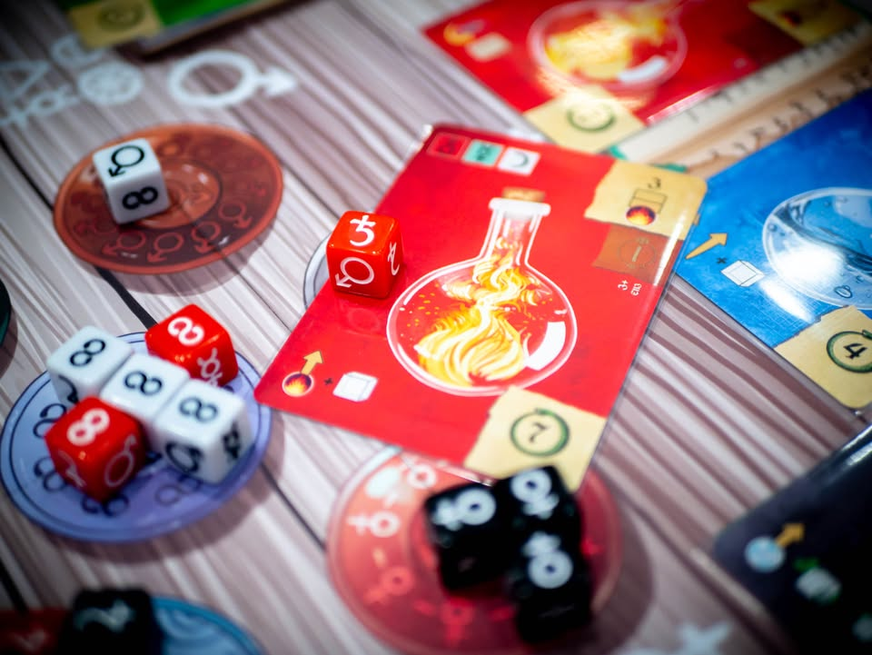
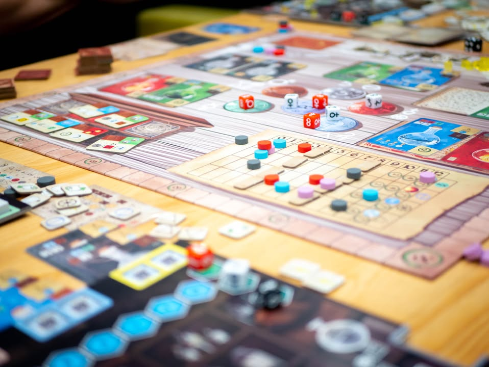
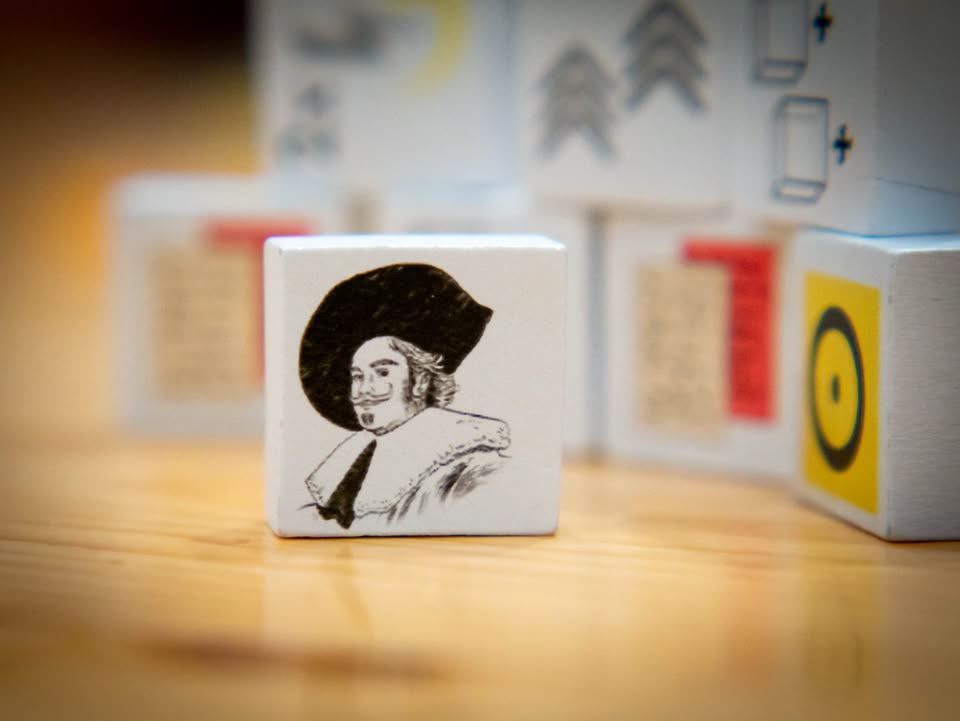
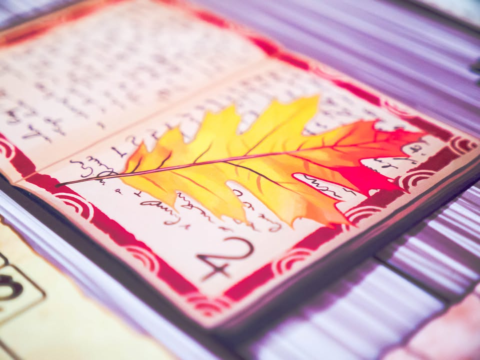
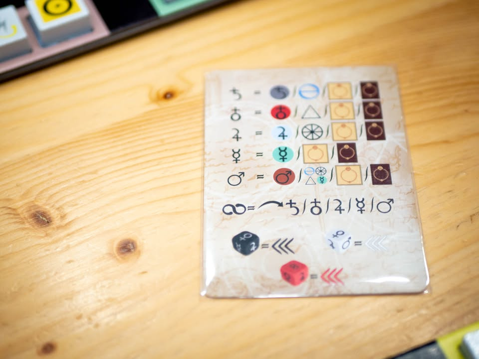
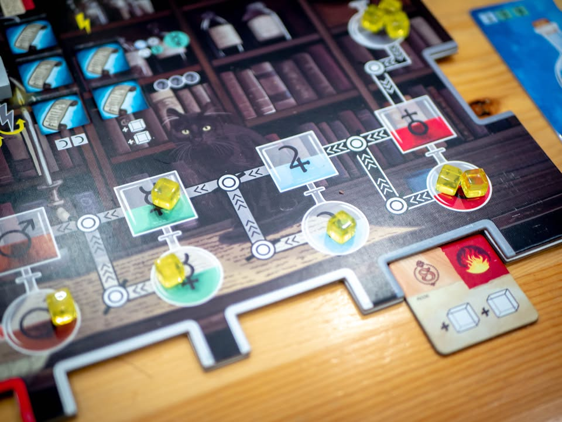
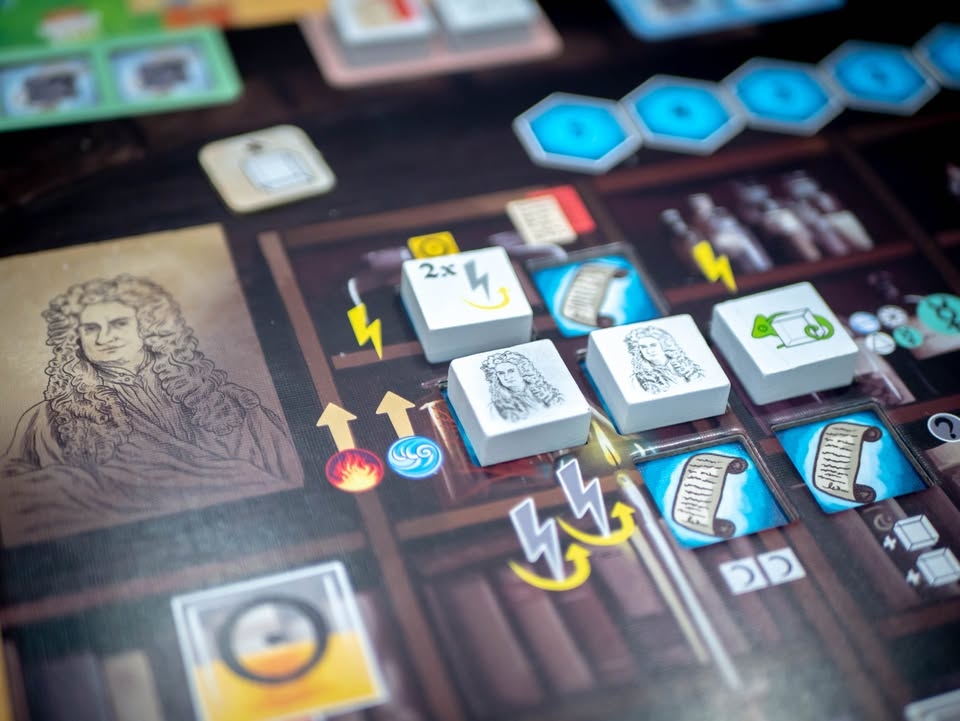

Trismegistus: The Ultimate Formula #thought #first_impression 
blog link: https://wp.me/p7TSgy-2ME

▪️เกมยูโรระดับหนักที่จะให้เรามาใช้ศาสตร์แห่งการเล่นแร่แปรธาตุ แปรเปลี่ยนดีบุกไรค่าให้กลายเป็นทองคำ ผลงานของนักออกแบบ Federico Pierlorenzi และ Daniele Tascini ( Teotihuacan, Tzolk'in)
 
 
▪️เกมนี้ถ้าพูดให้ง่ายก็คือเกมแนว resource conversion ที่เราจะหยิบเอาทรัพยากรมาเป็นวัตถุตั้งต้นจากนั้นก็ค่อยๆเปลี่ยนสถานะไปตามเส้นทางเพื่อเปลี่ยนเป็นวัตถุอีกแบบ จากนั้นเราก็เอาทรัพยากรนี้ไปเคลมการ์ดการทดลองเพื่อทำแต้ม ตรงนี้ก็เป็นแกนเกมยูโรที่หนักแน่นเข้าใจง่ายทั่วไป 
 
 
▪️แกนหลักของเกมจะเริ่มจากให้เราไปหยิบลูกเต๋า (มีสามสี และหกหน้าแตกต่างกัน) ที่ถูกสุ่มขึ้นมา ซึ่งทุกครั้งที่หยิบเต๋าจะมี 'พลัง' (Action Point นั้นแหละ) มากน้อยขึ้นอยู่กับว่ากลุ่มหน้าเต๋าที่หยิบมามีอยู่กี่ลูก จากนั้นเราก็เอาแต้มที่ว่ามาใช้ทำแอคชั่นไปเรื่อย
 
 
▪️แน่นอนว่าถ้าเล่นแค่นี้คนคงไม่โหวตเกมนี้จนค่าเฉลี่ยอยู่ที่ 4.00 (ณ ตอนเขียนข้อเขียนนี้) ความซับซ้อนของเกมนี้จะมาในรูปของ 'ขยัก' หลายจุดที่การเลือกเต๋าแต่ล่ะครั้งจะเป็นตัวกำหนดว่าเราทำแอคชั่นอะไรได้บ้าง
 
 
▪️เกมจะมีทรัพยากรพื้นฐานอยู่ 5 ชนิดตามหน้าเต๋า ถ้าเราอยากได้แบบไหนก็ต้องไปหยิบเต๋าหน้านั้นมา และแต่ล่ะชนิดการจะแปรสภาพให้สามารถเอาไปใช้ต่อได้จำเป็นต้องใช้แต้มเต๋าที่ 'สี' ตรงกับความต้องการของแร่ชนิดนั้น  
 
 
▪️ความซับซ้อนอื่นจะมาจากการเคลมการ์ดการทดลองที่เราต้องพยายามแปลงทรัพยากรสีให้ตรงเพื่อจ่ายเป็นค่าวิจัย แต่ตัวการ์ดเองยังต้องการค่า 'ความเชียวชาญ' ซึ่งในเกมมีสี่สาขาแตกต่างกันโดยเราต้องมีค่านี้ถึงก่อนถึงจะวิจัยได้ และค่านี้จะเพิ่มได้จากการที่เราจ่ายทรัพยากรไปตอนแปรธาตุ ซึ่งทรัพยากรนี้ก็ขึ้นอยู่กับว่าเราหยิบเต๋าหน้าไหนมาอีกที
 
 
▪️นี้ยังมีอีกว่าถ้าเราอยากหยิบการ์ดใบไหนเราต้องเอาแต้มจากหน้าเต๋าชนิดนั้นไปแลกมาด้วยนะ แปลว่าในแง่นี้การเลือกเต๋าเราต้องคำนึงถึงห้าตัวแปร ได้แก่หน้าเต๋าที่อยากได้เพื่อเป็นทรัพยากรและค่าความเชี่ยวชาญ,  สีที่อยากได้, การ์ดที่อยากหยิบ และมูลค่าของแต้ม (ซึ่งตัวมูลค่านี้มีเท่าไรก็ไม่ค่อยจะพอ)
 
 
▪️คุณอาจจะคิดว่าก็หยิบการ์ดใบไหนก็ได้สิ? ก็ต้องบอกว่าไม่ได้นะ เพราะการจะเคลมได้คุณต้องมีค่าความเชี่ยวชาญเยอะพอซึ่งเพิ่มไม่ได้ง่ายๆเท่าไรถ้าไม่ได้วางแผนมา แปลว่าเกมนี้คุณแทบจะไม่มีเวลาไปทำอะไรมั่วๆเท่าไร เนื่องจากทั้งเกมเราจะได้หยิบลูกเต๋าเพียง 9 ครั้งเท่านั้นเอง

----------------------------------------------------------
[🐸 I Turn left, You Turn Right - ชายผู้ชอบบ่นงึมงำตลอดเวลา] นักวิทยาศาสตร์สติเฟื่องเจ้าทฤษฎีที่การขยับเขยื่อนของทุกสิ่งต้องได้รับการไตร่ตรองมาอย่างดี
  
  
🔹 ผมคิดว่ามันมีจังหวะสนุกตามแบบที่เกมสนุกๆเค้ามีกัน แต่ผมคงไม่เล่นเกมนี้ซ้ำอีกถ้าไม่จำเป็น เนื่องจากมันเป็นเกมประเภททำมาให้ยุ่งยากเพื่อที่จะให้มันยุ่งยาก และมีความซับซ้อนของวิธีเล่นที่นำหน้าความลุ่มลึกในการเล่น ซึ่งโดยทั่วไปผมไม่ค่อยชอบเท่าไร (น่าจะมีแค่เกมของ Phil Eklund ที่ผมยกเว้นไว้) ยิ่งเกมนี้มี  Daniele Tascini นักออกแบบร่วมที่จุดเด่นคือการออกแบบเกมที่ระบบเรียบง่ายแต่ได้เกมที่ลึกแล้วผมค่อนข้างผิดหวังมาก จนคิดว่าเหมือนเอาชื่อเค้ามาพ่วงเพื่อช่วยนักออกแบบหน้าใหม่ขายของเท่านั้นเอง
 
  
🔹แต่ในแง่นี้ถ้าคุณชอบเกมสไตล์ Vital Lacerda หรือชอบเกมที่การจะทำอะไรต้องคิดหลายขยักแล้วล่ะก็ผมคิดว่าคุณอาจจะชอบเกมนี้ก็ได้ เพราะเกมมันจะมีอารมณ์แบบก็อยากจะทำการ์ดนี้ แต่ว่าต้องมีทรัพยากรนี้ แต่อ่ะจะแปลงแบบนั้นต้องเอาสีนี้นิหว่า แล้วจะหยิบเต๋าแบบไหนก่อนดีเพราะของมันไม่มี บลาๆ แต่เกมนี้ไม่มี Interlock แบบเกมของ Vital นะ
 
  
🔸สิ่งที่ทำให้เกมนี้เหี้ยบัดซบสำหรับผมคือ Player Aid ที่คุณค่าการใช้งานระดับขยะ เพราะเกมนี้มี Optional Action, Main Action และ Free Action ที่หลากหลายรวมไปถึงมีค่าใช้จ่ายและโบนัสที่แตกต่างกัน Player Aid ที่ช่วยให้เราจดจำและเรียนรู้เกมจึงสำคัญมาก แต่เกมนี้มาในรูปการ์ดใบเล็กๆพร้อมกับสัญลักษณ์ประหนึ่งอักษรไฮเออโรกลีฟอียิปต์
  
  
🔸 ลำดับต่อมาที่ทำให้ประสบการณ์การเล่นไม่ดี และทำให้เกมเรียนรู้ยากเกินจำเป็นไปมากที่พูดแล้วอาจจะฟังดูแปลกนั้นคือ เกมมันพยายามยึดติดกับธีมจนเกินจำเป็น คือคู่มือจะพยายามเรียกธาตุและสัญลักษณ์ตลอดเวลา หยิบเต๋าหน้านี้แต่ตอนแปลงเป็นสัญลักษณ์ความเชี่ยวชาญดันใช้อีกแบบ การ์ดสีดำแต่พอทำสำเร็จดันให้ไปเสียบช่องสีเหลือง ซึ่งมันก็ใส่ธีมแบบการเล่นแร่แปรธาตุมารองรับอ่ะนะ แต่โดยรวมมันทำให้เกิดคำถามโดยไม่จำเป็น ซึ่งจริงๆก็คิดว่าเกมมันมีปัญหาเชิง UI/UX อีกเล็กๆน้อยๆอีกหลายจุด แต่ถ้าเขียนน่าจะได้อีกซักสี่ย่อหน้า
 
 
💭 เอาจริงๆตอนเล่นผมก็คิดว่ามันสนุกดีนะ พอข้ามเรื่องความเข้าใจยากจนเข้าใจเกมแล้วก็ได้ใช้พลังสมองคิด puzzle และตัวเกมเองพอเก็ทว่าต้องทำอะไรแล้วก็ไม่ได้ยากขนาดนั้น ก็เป็นเกมยูโรแลกของทั่วไป มีออกของทำคอมโบให้ทำเพียบ แต่ด้วยความที่จังหวะมันเหมือนขับรถถนนลาดยางอยู่ดีๆ แล้วติดหล่มโคลนพองัดขึ้นมาได้ก็วิ่งฉลุยแล้วติดหล่มวนลูป คืออารมณ์มันแบบคิดมากำลังสวยเลยแต่ดันลืมคิดไป step เล็กๆอีกอันเพราะตัวแปรในการเลือกเต๋ามันเยอะ เกมอื่นที่ว่าซับซ้อนยังมีแค่สองสามอย่าง เกมนี้เล่นไปห้าอย่าง เลยไม่คลิกเท่าไร

----------------------------------------------------------
Compatible Level - เกมนี้เข้ากับคนเขียนได้ระดับไหนนะ!!

🐸 Family, อาจจะมีช่วงเวลาที่ไม่เข้าใจกันบ้างแต่ครอบครัวคือสิ่งที่จะอยู่กับเราตลอดไป นี้คือเกมที่จะมีพื้นที่ถาวรในชั้นวางแน่นอน!! แม้บางเกมจะเปรียบดั่งคุณปู่ใจดีที่ได้เจอกันแค่ปีล่ะครั้ง แต่อันดับในใจนั้นคือความสนุกในช่วงเวลาที่เล่น หาใช่การได้เล่นซ้ำไม่รู้เบื่อเพียงอย่างเดียว [ex. กบโปรด, กบชอบ]

🐸 Hang out friend, เพื่อนกินเที่ยว ถ้าไม่ติดธุระอันใดก็พร้อมจะออกไปพบเจอ สนุกยามได้พบปะ แต่จะให้เจอกันบ่อยๆคงใช่ที - เกมสนุกที่อยากเล่นในระดับที่อยากจะหยิบกางเป็นบางครั้ง สลับสับเปลี่ยนไปเรื่อยตามจังหวะและโอกาส แต่เราก็ไม่ได้อยากซ้ำต่อเนื่องรัวๆ [ex. กบโอเค]

🐸 Someone I know, หากบังเอิญพบเจอ ก็คงได้ทักทายไต่ถาม หากแต่ในยามปกติมิอาจนึกชื่อออก ยืนคุยก็ได้ แต่คงไม่ได้เอื่อนเอ่ยนัดกินข้าว - บางเกมเราก็ไม่ได้อยากชวนเล่น แต่ถ้าไม่มีอะไรทำแล้วมีคนชวนก็เล่นก็ได้ [ex. กบเฉย]

🐸 I Turn left, You Turn Right - เธอชอบกินเผ็ด เราชอบกินอาหารญี่ปุ่น เธอชอบคนคารมดีพาไปกินที่หรู แต่เราชอบเล่นเกมอยู่กับบ้าน แม้จะได้คุยเป็นบางคราแต่คงไม่อาจพัฒนาความสัมพันธ์ - บางเกมแม้ว่าจะดีแค่ไหน แต่ถ้ารสนิยมมันไปด้วยกันไม่ได้ก็ไม่รู้จะเล่นไปทำไม [ex. กบไม่เล่น]

