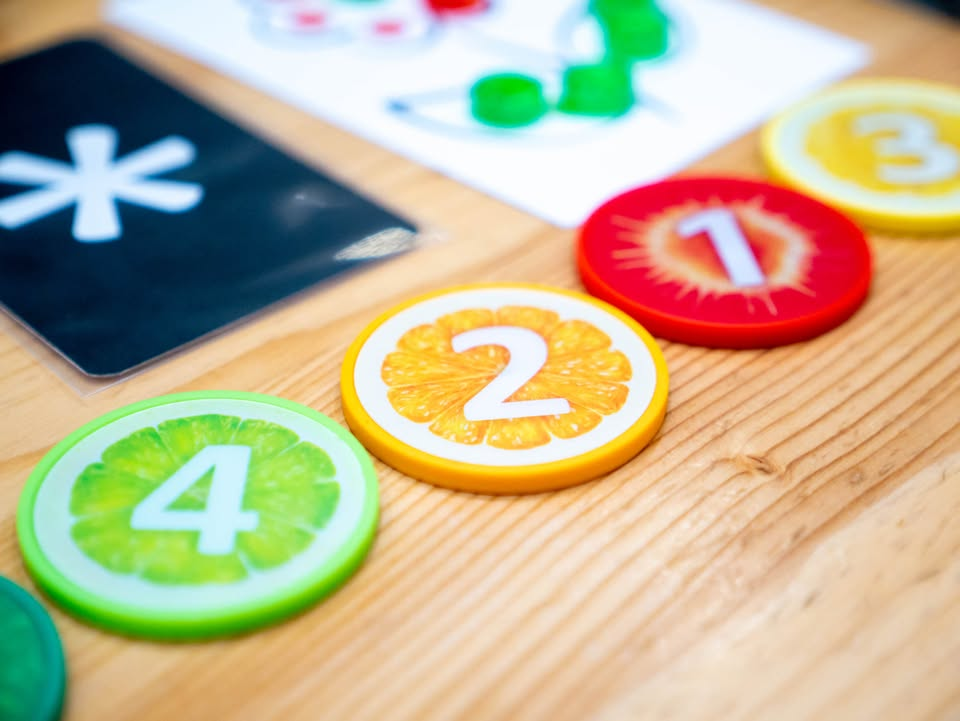
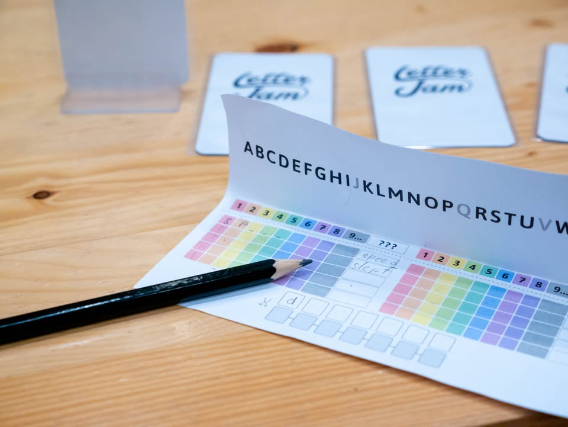

Letter Jam #bite_size
blog link: https://wp.me/p7TSgy-2MU

▪️เกมใบ้คำแบบช่วยกันเล่นที่ทุกคนในทีมจะต้องมาช่วยกันเผยความลับของคำศัพท์ในมือผู้เล่นคนอื่นเพราะผู้เล่นแต่ละคนจะไม่รู้ว่าตัวเองมีคำศัพท์อะไร และประกอบจากตัวอักษรตัวไหน!!
 
 
▪️ถ้าพูดกันง่ายๆเกมนี้ก็ประมาณ Hanabi ในฉบับใช้ตัวอักษร เกมเริ่มจากให้ผู้เล่นแต่ล่ะคนเอาการ์ดตัวอักษรมาเรียงเป็นคำที่ประกอบไปด้วยตัวอักษรห้าตัว จากนั้นส่งให้คนข้างๆ (กระบวนการไม่มีความหมายอะไรมากไปกว่าการ seed คำศัพท์เพื่อเริ่มเกม)
 
 
▪️จากนั้นผู้เล่นแต่ละคนจะเอาการ์ดตัวอักษรหนึ่งใบของตัวเองวางเสียบเป็นแนวตั้งหันออกให้ผู้เล่นคนอื่นยกเว้นตัวเองเห็น พร้อมแล้วก็เริ่มเกมได้
 
 
▪️กระบวนการจะมีแค่เรามองไปรอบๆว่ามีตัวอักษรอะไรบ้างเราก็พยายามสร้างคำจากตัวอักษรนั้นโดยการเอาป้ายเลข 1-9 ไปวางไว้หน้าป้ายตัวอักษรผู้เล่นแต่ล่ะคนก็จะจดคำนี้ลงไป บางครั้งป้ายจะวางอยู่หน้าเราซึ่งเราไม่รู้ว่ามันเป็นคำไหน แต่ว่าพอดูจากการสะกดคำเราก็อาจจะเดาได้ว่าที่อยู่ตรงหน้าเราเป็นอักษรตัวไหน ถ้ามั่นใจว่ารู้ก็สามารถปิดแล้วไปเปิดใบอักษรตัวต่อไปของเราได้
 
 
▪️ใบกันครบสิบครั้งก็มาเปิดดูกันว่าระหว่างเล่นและตอนจบเดากันได้ยังไงบ้างก็คิดเป็นแต้มกันออกมา ซึ่งตรงนี้อาจจะไม่ค่อยสำคัญนักเพราะมันเป็นเกม co-op แบบไม่มีทางแพ้ 
 
 
▪️ส่วนตัวผมคิดว่าก็เพลินๆดี  แต่ด้วยความที่ทักษะการสะกดคำผมต่ำเตี้ยมากปกติเลยไม่ค่อยชอบเกมแนวที่ต้องสะกดคำแม่นๆเท่าไร แต่เกมนี้ทำออกมาค่อนข้างโอเค จะไม่ชอบก็ตอนต้องมาคิดคำตอนเริ่มเกมเนี่ยแหละ นึกไม่ออกสะกดห้าตัวมันมีอะไรบ้าง (อันนี้เป็นความโง่แดกส่วนตัว) แต่ส่วนตัวยังให้ระดับความมันส์ก็ยังไม่ถึงขั้น CrossTalk หรือกระทั้ง JustOne นะ (แต่จริงๆมันเป็นคนละ sub-genre เทียบกันตรงๆไม่ได้)

--------------------------------
หมวด Bite Size (พอดีคำ) นี้กะว่าจะเขียนอะไรสั้นๆประมาณนี้ล่ะกัน ใหม่บ้าง ซ้ำบ้าง เกมที่ขี้เกียจเขียนบ้าง เขียนๆไว้ก่อนเผื่อมีอารมณ์อาจจะขยายไปลง Thought บ้าง จริงๆอยากเขียนสั้นกว่านี้ แต่ยังอดไม่ได้ที่จะต้องอธิบายอะไรเพิ่มตามนิสัย เดี๋ยวค่อยๆปรับไปล่ะกัน

