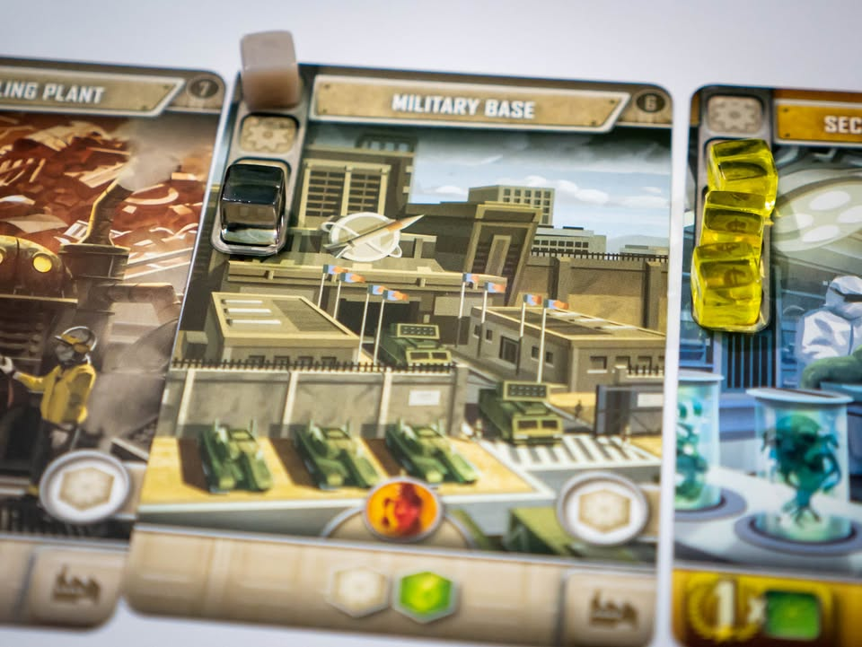
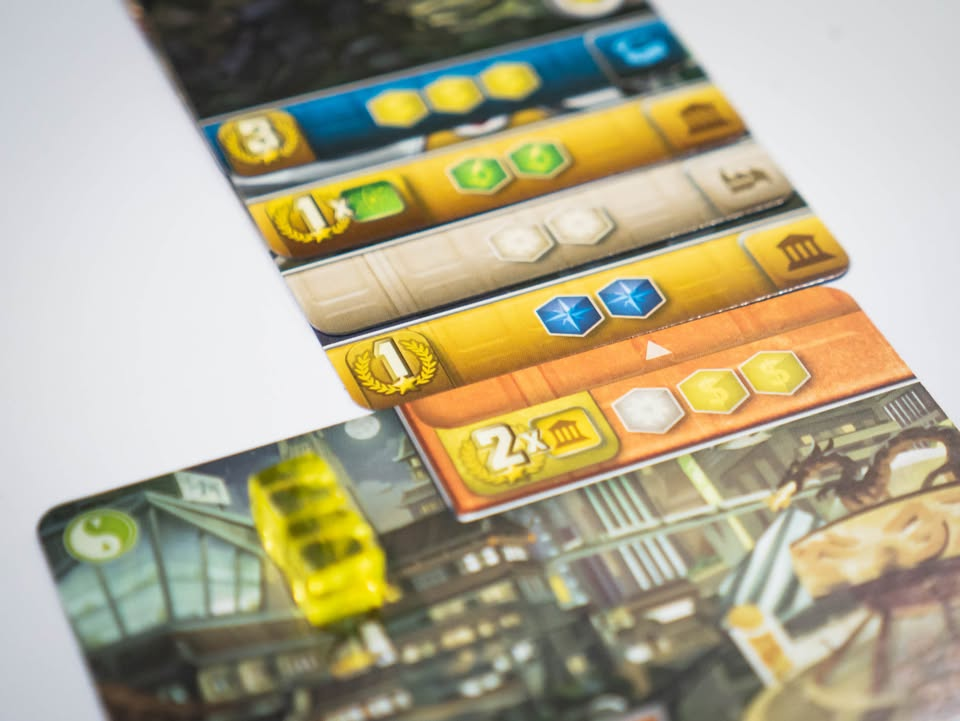
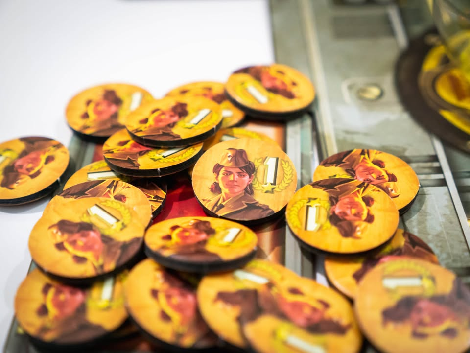

It's a Wonderful World #bite_size #first_impression
blog link: https://wp.me/p7TSgy-2N0
 
▪️เป็นเกมสไตล์ card drafting + engine building ที่ถ้าพูดง่ายๆก็คือ  7 Wonders ฉบับไม่ลีลาเน้นสร้าง engine อย่างเดียว
 
 
▪️เกมเล่นสี่รอบจบ แต่ละรอบจั่วการ์ดมาคนล่ะเจ็ดใบ เราเลือกหนึ่ง ที่เหลือส่งไปข้างๆ ทำจนครบทุกใบ แต่ที่ต่างจาก 7 Wonders คือการ์ดที่เลือกไว้ยังไม่ต้องตัดสินใจว่าจะเอาไปใช้ทำอะไร วางไว้ก่อนเฉยๆ
 
 
▪️พอได้การ์ดครบ เราต้องมาเลือกว่าจะเอาการ์ดไปทำอะไรบ้างระหว่าง รอสร้าง หรือ ทิ้งเพื่อเอาทรัพยากรไปสร้างการ์ดใบอื่น ถ้าการ์ดไหนมีทรัพยากรครบก็จะถือว่าสร้างสำเร็จ
 
 
▪️การ์ดที่สร้างเสร็จส่วนมากจะผลิตทรัพยากรให้เราเอาไว้สร้างใบอื่นต่อ บางใบก็จะให้โบนัสเป็นแต้มตอนจบ
 
 
▪️มีกิมมิคอื่นนิดหน่อยอย่างเช่นทรัพยากรแต่ล่ะชนิดจะผลิดเป็น phase ถ้าเราผลิตชนิดไหนเยอะสุดจะได้โบนัสเป็นทรัพยากรพิเศษ และเราอาจจะสร้างตึกเสร็จใน phase แรกแล้วมันผลิตของไปใช้ phase ต่อไปได้ทันที
 
 
▪️เกมนี้ผมให้ position อยู่แถวๆ Jump Drive คือเกมคั่นเวลา เล่นง่าย สอนง่าย (ถ้าเป็นคนเล่นเกมมาซักพักเกมแทบไม่ต้องสอนเลย อธิบายเกมราวๆ 5-6 bullet point เล่นเป็นแล้ว) แต่มีน้ำหนักการตัดสินใจที่ดีไม่ออโต้บ่อย ข้อดีอีกอย่างที่ทำให้ชอบมากกว่า  7 Wonder คือมันไม่ต้องลีลา setup การ์ดยุคใหม่ (น่าจะเป็นขั้นตอนที่บัดซบสุดในเกม  7 Wonders แล้ว)
 
 
▪️แต่ความที่มันไม่มียุคก็มีข้อเสียเหมือนกัน คือตึกมันออกมาสุ่มๆ ไม่ใช่แบบยุคแรกเน้นผลิตของ ยุคหลังผลิตแต้มแบบของ 7 Wonders เพื่อแก้ปัญหานี้เกมเลยเอาการ์ด mission แจกให้ผู้เล่นแต่แรก จะได้ไม่หลงทาง กับธีมมันสะเปะสะปะมาก ตาแรกสร้างค่ายทหาร ตามด้วย Area51 แล้วทำไมกูมีสวนสวรรค์สัตว์เทพนิยายมาจากไหน อารมณ์เกมสร้างอารยธรรมที่โม้ไว้ไม่สามารถหาได้ในเกมนี้
 
 
▪️ข้อเสียที่จริงๆแล้วไม่ใช่เรื่องใหญ่ในมุมปกติ แต่เป็นข้อเสียร้ายกาจถ้ามองจากกรอบว่าเป็นเกมเล่นง่ายจบไว คือกล่องใหญ่เหี้ยๆ พอพกยากคุณค่าในการกางก็ตกลง เพราะมันควรจะเป็นกล่องเล็กๆติดไปมา
 
 
▪️บางคนอาจจะคิดว่าเกมจบไวเกินไป แต่ส่วนตัวคิดว่ามันจบแบบกำลังพอดีในกรอบเกม 30 นาที คือให้ความรู้สึกกดดันและทำอะไรก็ไม่เสร็จ สร้างอารมณ์จำพวก 'ถ้ากูมีอีกตานะ' ได้ดีสำหรับเกม engine building สั้นๆ ถ้าเทียบกับ 7 Wonders ตัวหลัก และเกมสไตล์นี้ที่ใกล้เคียงกันอย่าง Res Arcana, Villagers, San Juan, Paper Tale, Century, Space Race ผมชอบความ 'ไม่ลีลา' จบในเวลาของเกมนี้มากกว่า เอาไปยืนคู่กับ Jump Drive ได้เลย
 
 
▪️กล่อง KS มี campaign ให้เล่นยาวๆ อันนี้ยังไม่ได้ลอง แต่เป็นเกมที่รู้สึกว่ามันน่าจะออกตัวเสริม (หรือมันมีการ์ดเพิ่มใน campaign ก็ไม่ทราบ) มาให้เล่นได้อีกเยอะอยู่
 
 
▪️และ.....ภาพแบบรูปแรกน่ะมีใบเดียว (เหมือน 7 Wonders ที่มี อ่างอาบน้ำอันเดียวนั้นแหละ)......

--------------------------------
หมวด Bite Size (พอดีคำ) นี้กะว่าจะเขียนอะไรสั้นๆประมาณนี้ล่ะกัน ใหม่บ้าง ซ้ำบ้าง เกมที่ขี้เกียจเขียนบ้าง เขียนๆไว้ก่อนเผื่อมีอารมณ์อาจจะขยายไปลง Thought บ้าง จริงๆอยากเขียนสั้นกว่านี้ แต่ยังอดไม่ได้ที่จะต้องอธิบายอะไรเพิ่มตามนิสัย เดี๋ยวค่อยๆปรับไปล่ะกัน

