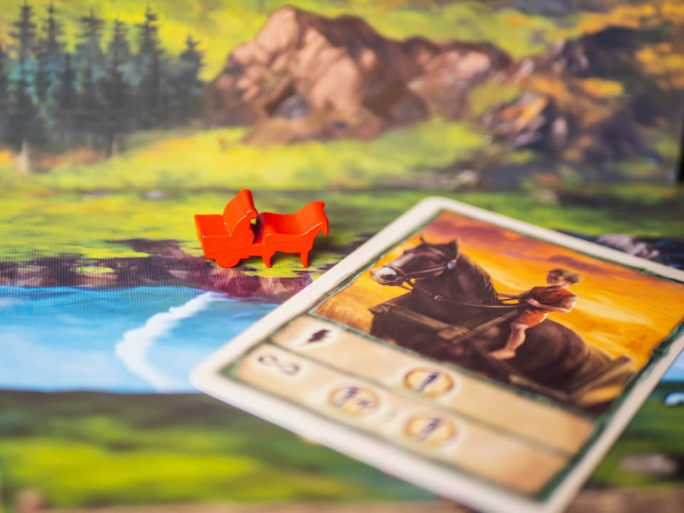
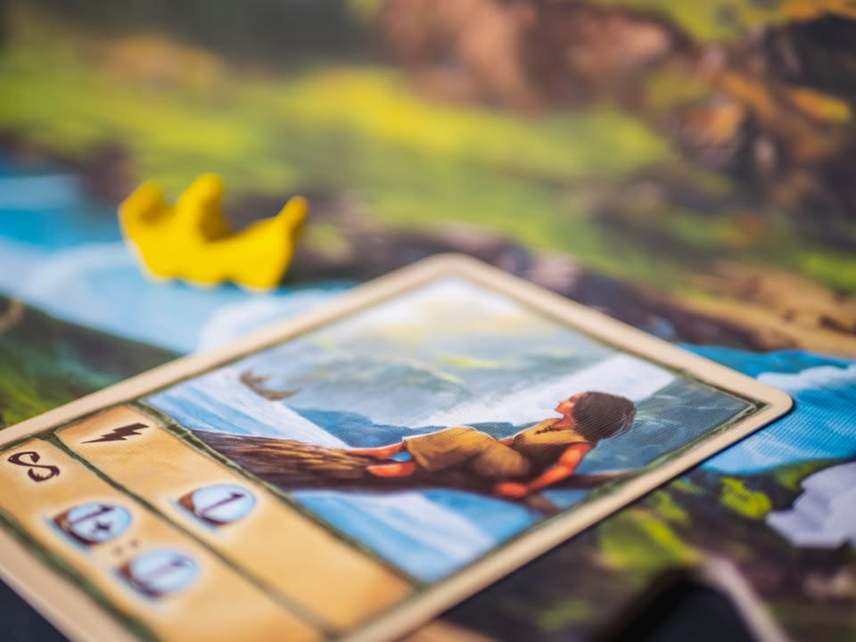
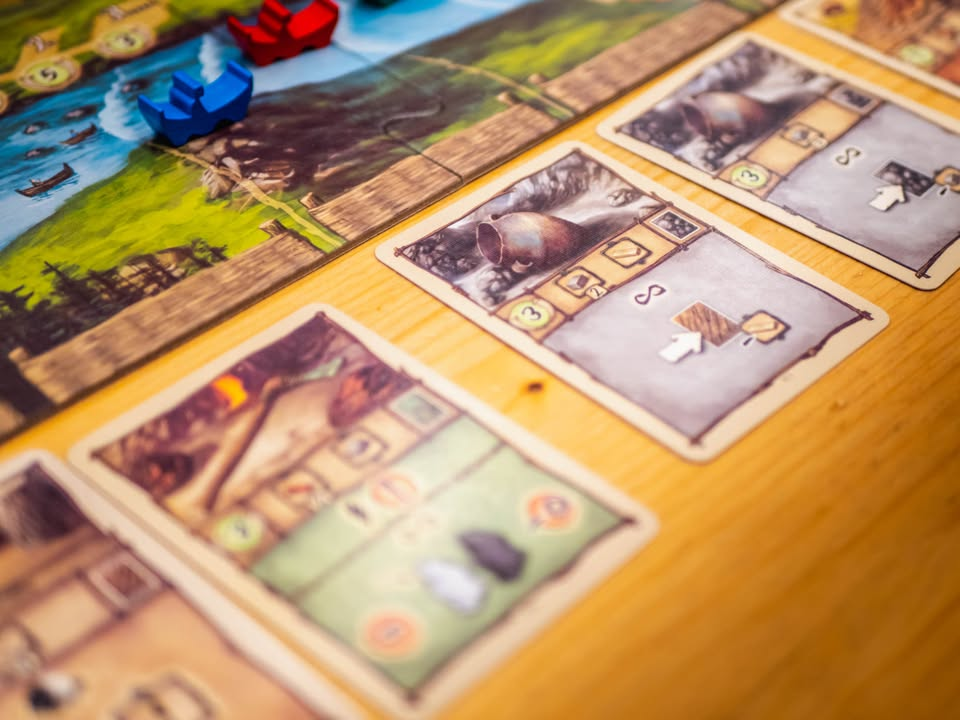
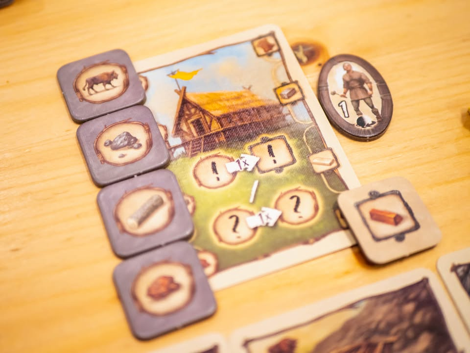
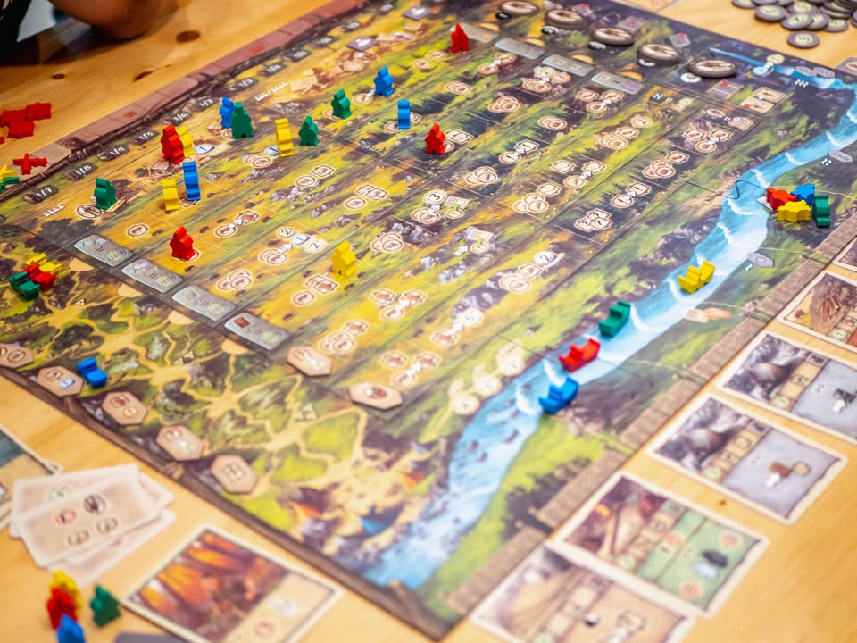
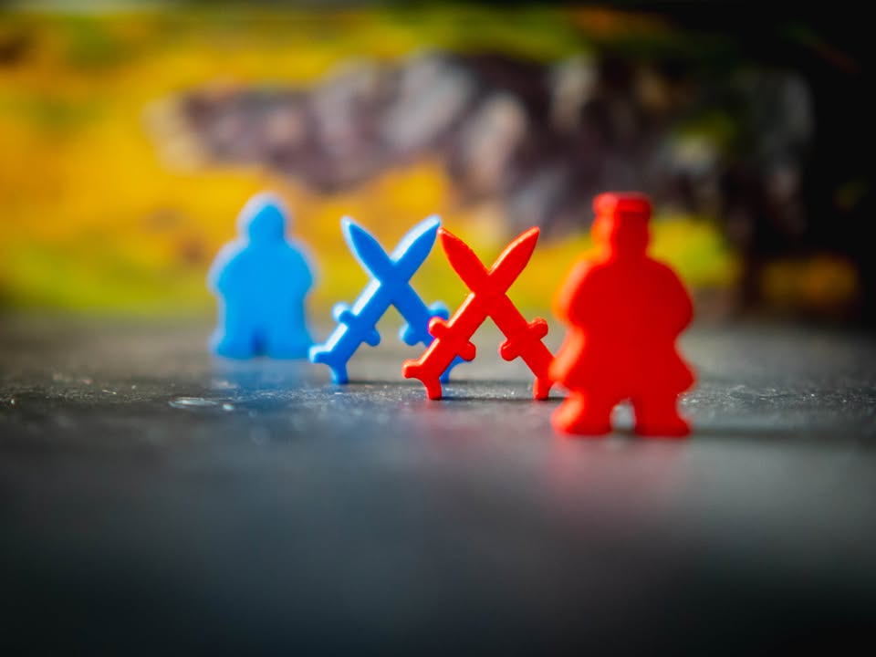

Terramara #thought
blog link: https://wp.me/p7TSgy-2N8

▪️เกมยูโรระดับกลางหนักที่ฉากคือช่วงเวลาหนึ่งพันห้าร้อยปีก่อนคริสต์ศักราช ที่เราต้องทำพาผู้คนของเผ่าพันธ์ที่เคยอาศัยอยู่ในอิตาลีตอนเหนือมาแก่งแย่งทรัพยากร แผ่วถางดินแดนแห่งใหม่เพื่อนำการพัฒนามาสู่บ้านเมือง เพื่อความเป็นหนึ่งในดินแดนแถบนี้ เป็นผลงานร่วมของนักออกแบบถึงห้าคนที่เคยทำเกม Egizia ร่วมกัน (เยอะจังว่ะ) ได้แก่ Acchittocca, Flaminia Brasini (Coimbra, Lorenzo) , Virginio Gigli (Coimbra, Grand Austria Hotel), Stefano Luperto, Antonio Tinto
 
 
▪️ถ้ายกมาแค่แกนแห้งๆเลยก็คือเกม Worker Placement บอร์ดแบบสุ่ม แล้วเอาคนงานไปแย่งเก็บของตามช่องแล้วเอาของไปแลกการ์ดที่จะให้ความสามารถพิเศษมา เล่นกันห้ารอบจบ....... แต่เห้ยเกมแค่นี้มันไม่จำเป็นต้องเอานักออกแบบตั้งห้าคนมาลงชื่อแน่ๆ เรามาคุยกันถึงจุดแตกต่างที่เกมนี้ใส่และถักถอเข้าด้วยกันหลายอย่างกันหน่อย ซึ่งจริงๆมีลูกเล่นเยอะแต่ขอยกที่รู้สึกว่ามันเป็นแกนมาล่ะกัน
 
 
▪️ตอนวางคนงานของเราในเกมนี้วางที่ไหนก็ได้ก็จริง แต่ว่าถ้าเราเลือกทีวางคนงานลงไป 'ลึก' ขึ้น ของที่ได้ก็มักจะขึ้นด้วย แต่ว่ามันแลกกับการที่คนงานของเรากว่าจะกลับมาให้เราใช้งานก็ต้องรอให้ถึงจบรอบนั้นก่อน นั้นคือเกมมีห้ารอบ ถ้าเราเอาคนงานไปช่องเก็บของรอบที่ห้าตั้งแต่ตาแรกก็แปลว่ามันจะไม่กลับมาให้เราใช้อีกแล้ว
 
 
▪️แน่นอนว่าปกติเราจะไม่ค่อยอยากทำหรอก แต่ว่าช่องในรอบปัจจุบันของเกมมันมีไม่พอสำหรับทุกคนยังไงล่ะ!! พอทีไม่พอเราเลยต้องโดนบังคับให้ 'บุก' ไปบุกเบิกดินแดนใหม่โดยปริยาย
 
 
▪️กิมมิคต่อมาก็คือการวางคนงานที่จริงๆแล้ววางได้ช่องล่ะสองตัวนะ แต่การที่จะลงได้ผู้เล่นที่มาทีหลังจำเป็นที่จะต้องมี 'กำลังทหาร' เหนือกว่าคนที่อยู่มาก่อน ถ้าลงแล้วก็จะต้องลดทหารลง ทำให้ไม่สามารถไปไล่ลงตามคนอื่นได้ตลอด กับเกมจะมีคนงานเป็นหัวหน้าเผ่าให้คนล่ะตัวเอาไปยืนทับคนอื่นได้แม้ทหารด้อยกว่า
 
  
▪️และด้วยการออกแบบกระดานของเกมที่ที่ไม่ใช้แผนที่นิ่งๆแบบเกมอื่น แต่เป็นไทล์ทำให้เกมทำลูกเล่นสนุกๆได้อีกอย่าง นั้นคือทุกครั้งที่เริ่มรอบใหม่ ช่องในรอบเก่าจะหายไปด้วยทำให้จำนวนช่องในเกมยิ่งเล่นยิ่งน้อยลง ความกดดันของเกมนี้จึงมาจากการที่ต้องลำดับการเอาคนงานไปลองเก็บของให้ดี เพราะช่องมีจำกัด
  
  
▪️ของเล่นอีกอันที่สนุกดีคือการเดินกองคาราวาน ซึ่งไอ้แทรคพวกนี้เกมอื่นมันจะมีตัวเดียวแล้วเดินไปเรื่อยๆ แต่เกมนี้ให้มาสองตัวเพราะเส้นทางมันไปได้หลายเส้น ทางเดินมันต้องเลือกว่าจะแวะไปเก็บของดี หรือจะแวะไปตั้งแคมป์เพื่อเอาสิทธิ์การเคลมแต้มจบเกมบางหมวดดี ความดีคือเรามีอิสระในการเลือกว่าจะข้ามอันไหนไป เพื่อให้ไปข้างหน้าไวๆ แต่ว่าไปแล้วไปเลยเดินกลับมาไม่ได้ รวมไปถึงช่องแอคชั่นหลายอันมีเงื่อนไขว่ากองคาราวานทั้งสองกองต้องเคยวิ่งผ่านตรงนี้มาแล้ว เราเลยต้องมาคิดอีกว่าเราอยากได้อะไรดีระหว่าง โบนัส, แอคชั่นพิเศษ กับแต้มจบเกม
 
----------------------------------------------------------
[🐸 Family, ชนเผ่าโบราณที่มีวีถีชีวิตเรียบง่าย เบียดเบียนตามประสา แต่ลีลาไม่แพ้คนสมัยใหม่]

🔹 เป็นเกมที่ตอนอ่านกฎคิดว่าอาจจะน่าเบื่อเพราะดูแล้วไม่ค่อยมีอะไรเด่นขึ้นมา แต่เล่นแล้วผิดคาดเพราะพวกแอคชั่นทุกอย่างมันถูกโยงและส่งต่อความกดดันในการตัดสินใจได้สวยงาม เป็นเกมผมวางไว้ใน position แถวๆ Lorenzo il Magifico ตัวหลัก ด้วยความที่มันเป็น Solid Euro ที่สอนไม่ยากแต่ได้เกมที่แน่น เล่นเพลิน 
 
 
🔹 สิ่งที่ชอบคือมันสร้างความรู้สึกสนุกๆได้โดยไม่ต้องใช้ระบบแปลกๆ ก็ระบบเก็บของสร้างการ์ดทั่วไป คนเล่นยูโรมาหน่อยอธิบายเกมแป๊บเดียวจบ แต่ระบบมันลื่นไหลและไม่ซ้ำซากผ่านการ์ดที่ไหลมาให้เราเก็บและโบนัสที่ถูกสุ่มออกมาทุกรอบ ทำให้ต่อให้อยากเล่นท่าเดิมก็ทำไม่ได้ง่ายๆนะ 
 
 
👁‍🗨 จุดที่อาจจะทำให้บางคนไม่ชอบคือมันมี element เกเรอยู่นิดนึงคือช่องแอคชั่นปล้นสะดม ที่จะวัดกำลังทหารกับทั้งวงถ้าใครน้อยกว่าเราจะต้องเสียของในสัดส่วนหนึ่ง ถ้ามากกว่าก็ยังเสียอยู่ดีในสัดส่วนที่น้อยกว่า ตรงที่เป็นระบบป้องกันการกั๊กทรัพยากรไปสร้างแบบในเกมอื่น แต่ผลของมันคือถ้าเก็บของไว้พอดีแล้วทหารไม่แกร่งก็จะรู้สึกอึดอัดเวลาโดนปล้นพอดู 
 
 
👁‍🗨 ซึ่งความอึดอัดนี้มันส่งผลหลายต่อ ด้วยความที่ช่องแอคชั่นมันมีน้อย ทำให้ผู้เล่นที่ทหารน้อยลงไปเบียดลงช่องเดียวกับคนอื่นไม่ได้ทำให้ต้องเดินไปลงช่องที่อยู่ลึกเข้าไป ซึ่งเป็นลูปว่า อ้าวตาหน้าตัวเหลือน้อยลงอีกแถมอาจจะโดนปล้นไปต่ออีกต่างหาก คือเป็นเกมที่ถ้าจังหวะคุณอยู่ใต้ลมตลอดทั้งเกมนี้มันจะอึดอัดมาก (อันนี้ประสบการณ์ตรง)
 
 
👁‍🗨 ซึ่งก็อีกนั้นแหละ ความอึดอัดในการตัวเลือกนั้นก็ถือเป็นส่วนที่ทำให้เกมนี้สนุก และสร้างน้ำหนักในการตัดสินใจให้กับเรา (ซึ่งผมชอบตรงนี้)
 
 
🔸 ส่วนข้อเสียถ้ามองตามกรอบแล้วก็คิดว่าไม่มีอะไรเด่นนะ จะมีแค่ไอคอนกับกติกาเล็กๆบางอย่างยังไม่คลีนเท่าไรต้องแอบมี consult คู่มือกับใน bgg นิดหน่อย กับรู้สึกว่าเกมน่าจะมีการ์ดผู้นำเผ่าเยอะกว่านี้ และด้วยความที่เกมมันแอคชั่นน้อยและมีจังหวะแอบดิ้นยากอยู่ประปรายก็อาจจะต้องระวังการเล่นกับผู้เล่นสาย AP ไว้เยอะหน่อย ผมเองปกติเล่นค่อนข้างเร็วก็ยังมีจังหวะมึนคิดไม่ออกแบบนานมากๆกับเกมนี้เหมือนกัน คือมันไม่ได้คิดยากนะ แต่ทำใจเลือกยากเพราะมันต้องเสียคนงานไปหลายตาไรงี้
 

💭 โดยรวมก็คิดว่าเป็น Solid Euro ที่หนักแน่นอีกเกม แต่อาจจะไม่เหมาะกับสายเล่นสี่ห้ารอบติดแล้วบอกครบแล้วจ้าไปเล่นเกมอื่นดีกว่า แต่เป็นเกมแนวถ้าอยู่ใกล้มือมีจังหวะก็หยิบมาเล่นที ไม่ใช่แนวเน้นกลับบ้านไปคิดท่าคิดคอมโบมาแก้มือ ซึ่งถ้าให้เทียบอารมณ์การกางก็คงเทียบกับ Lorenzo ตัวหลักนั้นแหละ คุณไม่ถูก draw in ให้ไปเล่นแต่พอเล่นแล้ว stay จบเกมไปก็ out ไม่ต้องกลับมาคิดต่อ

----------------------------------------------------------
Compatible Level - เกมนี้เข้ากับคนเขียนได้ระดับไหนนะ!!

🐸 Family, อาจจะมีช่วงเวลาที่ไม่เข้าใจกันบ้างแต่ครอบครัวคือสิ่งที่จะอยู่กับเราตลอดไป นี้คือเกมที่จะมีพื้นที่ถาวรในชั้นวางแน่นอน!! แม้บางเกมจะเปรียบดั่งคุณปู่ใจดีที่ได้เจอกันแค่ปีล่ะครั้ง แต่อันดับในใจนั้นคือความสนุกในช่วงเวลาที่เล่น หาใช่การได้เล่นซ้ำไม่รู้เบื่อเพียงอย่างเดียว [ex. กบโปรด, กบชอบ]

🐸 Hang out friend, เพื่อนกินเที่ยว ถ้าไม่ติดธุระอันใดก็พร้อมจะออกไปพบเจอ สนุกยามได้พบปะ แต่จะให้เจอกันบ่อยๆคงใช่ที - เกมสนุกที่อยากเล่นในระดับที่อยากจะหยิบกางเป็นบางครั้ง สลับสับเปลี่ยนไปเรื่อยตามจังหวะและโอกาส แต่เราก็ไม่ได้อยากซ้ำต่อเนื่องรัวๆ [ex. กบโอเค]

🐸 Someone I know, หากบังเอิญพบเจอ ก็คงได้ทักทายไต่ถาม หากแต่ในยามปกติมิอาจนึกชื่อออก ยืนคุยก็ได้ แต่คงไม่ได้เอื่อนเอ่ยนัดกินข้าว - บางเกมเราก็ไม่ได้อยากชวนเล่น แต่ถ้าไม่มีอะไรทำแล้วมีคนชวนก็เล่นก็ได้ [ex. กบเฉย]

🐸 I Turn left, You Turn Right - เธอชอบกินเผ็ด เราชอบกินอาหารญี่ปุ่น เธอชอบคนคารมดีพาไปกินที่หรู แต่เราชอบเล่นเกมอยู่กับบ้าน แม้จะได้คุยเป็นบางคราแต่คงไม่อาจพัฒนาความสัมพันธ์ - บางเกมแม้ว่าจะดีแค่ไหน แต่ถ้ารสนิยมมันไปด้วยกันไม่ได้ก็ไม่รู้จะเล่นไปทำไม [ex. กบไม่เล่น]

