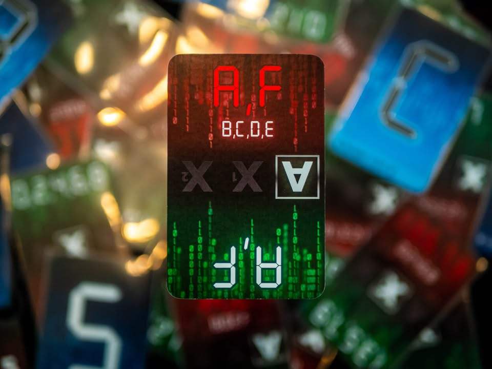
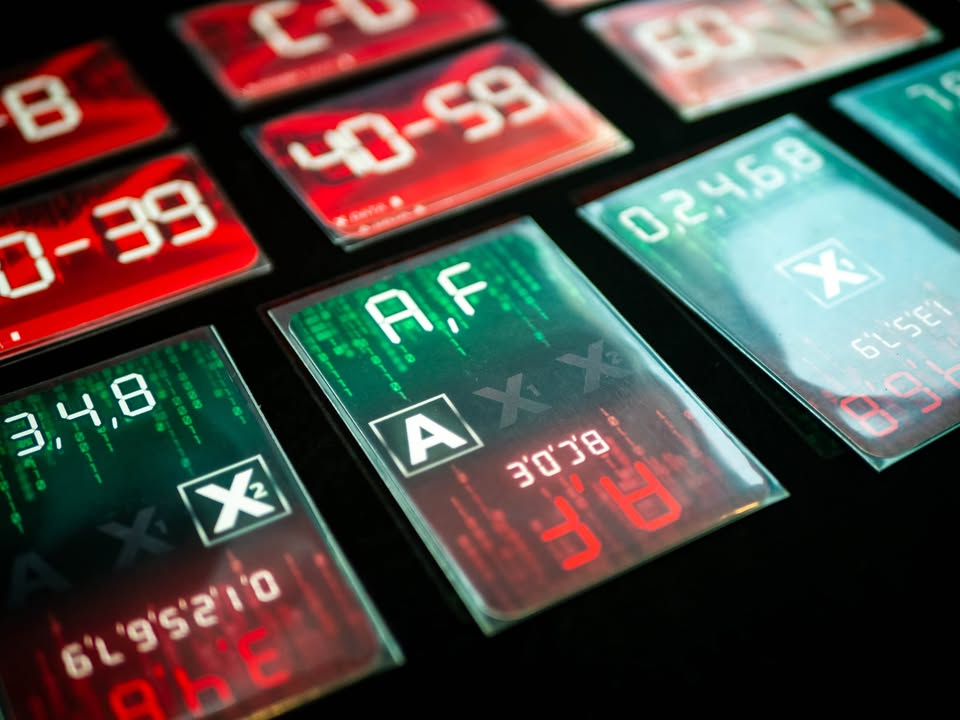
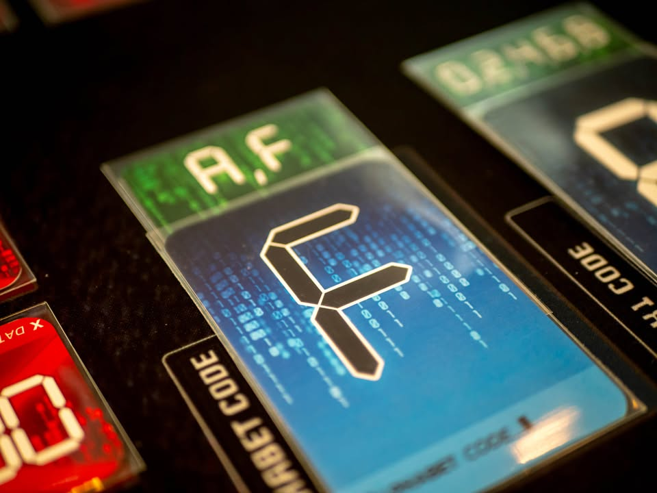
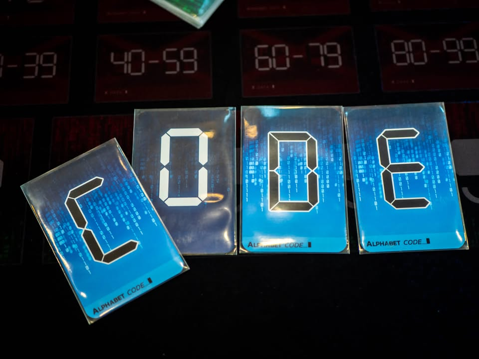
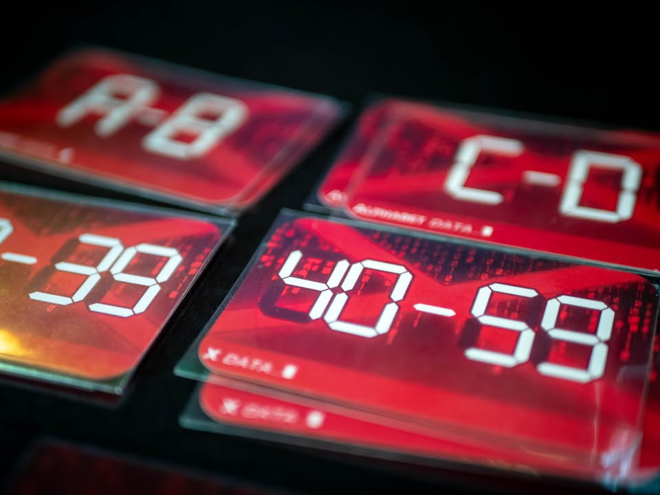
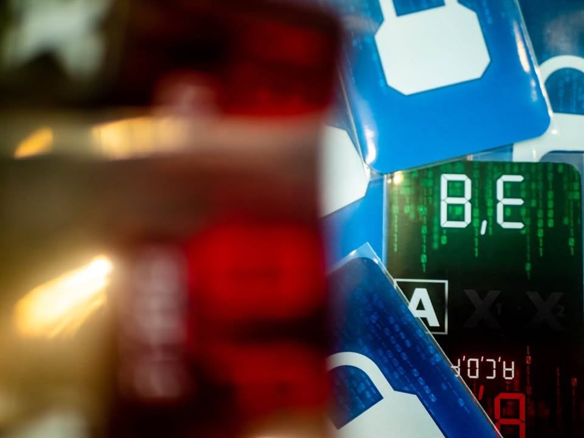
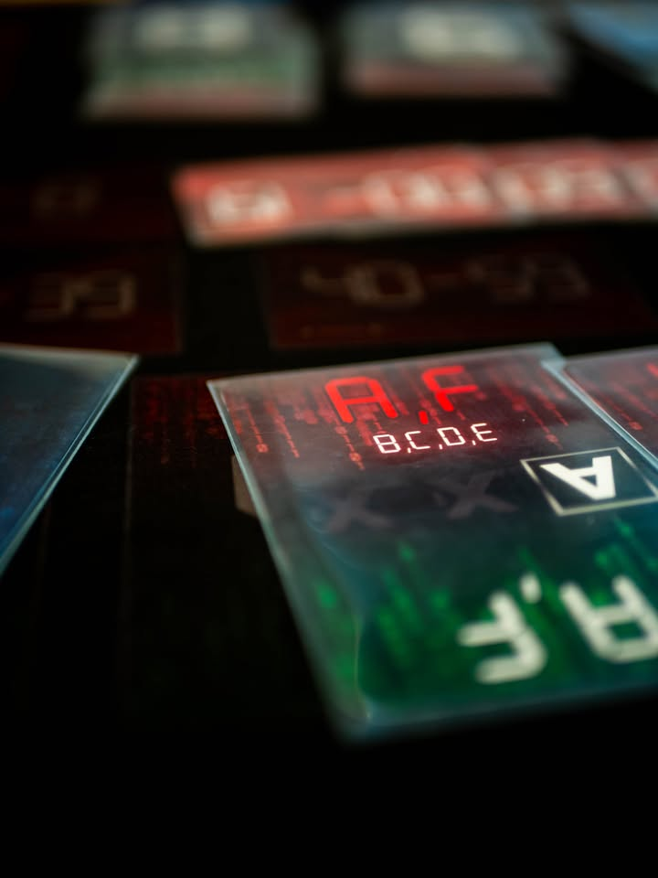

The Coding เกมถอดรหัส #thought #first_impression
blog link: https://wp.me/p7TSgy-2Nn

▪️เกมแนวนิรนัย (Deductive) ที่เราจะต้องเป็นแฮกเกอร์ไปเจาะหารหัสลับจากฝ่ายตรงข้าม พร้อมกับหาทางปล่อยข้อมูลที่ทำให้เราเสียเปรียบฝ่ายตรงข้ามน้อยที่สุด ผลงานจากนักออกแบบชาวไทย คุณอาร์ม (Vatcharis Thanomsub)
  
 
📌 Disclaimer: ผมทรีทเกมนี้ในฐานะเกมที่กำลังวางจำหน่าย (เพราะสั่งผลิตไปแล้ว และกำลังจะวางจำหน่าย) และการที่นักออกแบบเป็นคนไทยนั้นไม่มีน้ำหนักต่อความเห็นของผม ส่วนตัว Pre-Order ไปแล้วไม่ได้รับเงินค่าจ้างหรือ Product ฟรีแต่อย่างใด
 
 
▪️ในหลายๆแง่มุมแล้วถ้าบอกว่าเกมนี้คล้าย Da Vinci Code น่าจะใกล้เคียงสุด (update - มีคนแนะนำมาว่า Cluedo Suspect ก็คล้ายกันพอควร ซึ่งก็คล้ายในหลายแง่เหมือนกัน) ถ้าพูดโดยสรุปคือตอนเริ่มเกมผู้เล่นจะได้รับสุ่มการ์ดที่เป็นรหัสมาสามใบ ประกอบด้วยตัวอักษรหนึ่งตัว (A-F) และตัวเลขสองตัว (0-9) ข้อสำคัญคือการ์ดไม่ซ้ำแปลว่าถ้าผมได้ A-0-1 การ์ดสามใบนี้ผู้เล่นอื่นก็ต้องไม่มี
 
 
▪️ในตาหนึ่งสิ่งที่เราต้องทำมีสองอย่าง อย่างแรกคือหยิบการ์ดที่บอกว่าชุดรหัสของเรา 'ไม่ใช่' อันไหน อย่างเช่นไม่ใช่ A-B หรือตัวเลขไม่อยู่ในช่วง 00-19 ตรงนี้คนอื่นก็จะเริ่มจดข้อมูลของเราไป กิมมิคตรงนี้คือใบที่ว่ามีจำนวนจำกัด การหยิบมาเฉลยตัวเองก็อาจจะคิดเพิ่มได้อีกนิดว่าขัดคนอื่นได้ไหม
 
 
▪️จากนั้นเราก็จะเลือกว่าจะ 'ขุด' ข้อมูลผู้เล่นคนไหนโดยเลือกการ์ดเจาะรหัสที่หงายอยู่ไปใส่ผู้เล่นคนนั้น การ์ดแต่ล่ะใบก็จะถามข้อมูลแตกต่างกันอย่างเช่น ใบหนึ่งอาจจะถามว่าใบที่คว่ำอยู่เป็นตัวเลข 0,1,2,3,4 ไหม? ฝ่ายที่ถูกถามก็จะตอบว่าใช่หรือไม่ใช่
 
 
▪️ก็วนๆแบบนี้ไปสี่รอบคือเราก็เปิดข้อมูลตัวเองบ้าง ถามคนอื่นบ้าง จากนั้นก็จะเริ่มมาทายว่ารหัสจริงๆของคนๆนั้นคืออะไรกันไหน ใครโดนทายถูกก็ out ไปหาคนสุดท้ายคนเดียว
 
 ----------------------------------------------------------
[🐸  Hang out friend, คั่นเวลาด้วยการหารหัสค้นใจ]
 
 
🔹ผมมองเกมนี้เป็นเกมสไตล์ Thinky Filler หรือเกมคั่นเวลาสำหรับคนชอบเล่นเกมใหญ่ หรือเกมประเภทที่เราอยากอยากขบคิดสนุกๆใช้เวลาไม่นาน โดยไม่เคร่งเครียดจนเกินไป (Red7 คือเกมที่ผมให้เป็นเบอร์หนึ่งหมวดนี้) ซึ่งเกมนี้สอบผ่านในหลายเงื่อนไขหลัก ได้แก่ กล่องเล็ก, อธิบายง่าย, เล่นไวสิบห้ายี่สิบนาทีจบ, ใช้หัวโดยที่ไม่ล้า เล่นสามรอบติดยังไม่รู้สึกว่าเกมมันน่าเบื่อ กำลังได้วอร์มหัวสบายๆ
 
 
🔹ข้อดีมากของเกมนี้คืออธิบายง่าย วางการ์ดใบเสียบๆกันคนเดินๆดูก็น่าจะพอเข้าใจกติกาเกือบหมดแล้ว  วางเกมทิ้งไว้นานๆกลับมาเล่นใหม่ได้เลย ไม่ต้องลีลาเยอะ
 
 
🔹ไอเดียทางความคิดหลักจะไปอยู่ที่ เราจะเลือกคำใบ้บอกตัวเราแบบไหนให้เกิดประโยชน์กับคนอื่นน้อยที่สุด และเราจะเลือกการ์ดคำถามแบบไหนเพื่อดึงข้อมูลจากฝ่ายให้ได้มากที่สุดพร้อมกับอารมณ์ลุ้นเล็กๆตอนท้ายเกมที่เราจะไปเดาเลขคนอื่นถูกไหม เพราะหลายครั้งคำตอบมันจะมาในรูปเกือบๆมากกว่า ซึ่งตรงนี้ก็เลยทำให้บรรยากาศในเกมมีความเฮฮาไม่เครียดจนเกินไป แต่ก็ไม่ดวงจนรู้สึกว่าควบคุมอะไรไม่ได้
 
 
👁‍🗨 จุดสังเกตุสำคัญคือในเชิงคณิตศาสตร์แล้วเกมนี้มันค่อนข้างมีอารมณ์แบบ คำตอบที่ถูกต้องที่สุดชัดเจนอยู่แล้ว เราแค่ไปหยิบมาใช้  ทุกคนก็ทำแบบเดียวกันพอไปจุดท้ายเกมก็แค่คาดเดานิดหน่อย กลายเป็นเกมอาจจะถูกมองว่าซ้ำซาก แต่ส่วนตัวผมมองต่างไปในแง่ว่าไอ้ตอนใช้เวลาคิดหาคำตอบพวกนี้เป็นการใช้สมองเพลินๆในแบบ Thinky Filler ดี ไม่รู้สึกว่าถูกบังคับเพราะมีโจทย์หน้างานที่แตกต่างกันจากการสุ่มของการ์ดเจาะรหัส (ตอนเล่นนึกถึง Shipwreck Arcana นิดๆ แต่ไม่รู้สึกว่าโดนบังคับแบบเกมนั้นนะ  หรือไม่ก็แบบ Alchemists ที่จริงๆแล้วเป็นเกมคณิตจ้าซ่อนในธีมแปรธาตุ) แต่มาคิดๆแล้วก็อยากให้มันลีลาเยอะกว่านี้ได้เหมือนกันนะ 
 
 
👁‍🗨 พูดถึงลีลาเกมมีโหมดเสริมเล็กๆเป็นการ์ดกับดัก (เกมเรียกไวรัส) ที่เอาไว้เปิดเวลาอีกฝ่ายพยายามถามเลขเรา ก็พอจะทำให้เกมมีส่วนที่คาดเดาไม่ได้เล็กๆขึ้นมาอีกนิด
 
 
💭 สิ่งที่แอบกังวลแทนคนทำคือ 'ไอ้เกมนี้จะไปขายคนอื่นยังไงฟระ?' คือเกมสนุกอ่ะใช่ แต่จะไปขายกลุ่มปาร์ตี้จ้าๆ นี้เจอตัวเลขไปพวกสายเห็นเลขแล้วทำเวียนหัวก็น่าจะมีพอควร ส่วนจะไปขายสายคิดเยอะเค้าก็อาจจะคิดว่ามันเป็นเกมที่เบาไปหรือปล่าว เลยแอบเหมือน theme มันทำร้ายยอดขายอยู่เหมือนกัน (มั้ง) แต่นั้นแหละผมคิดว่าใครที่กำลังมองหาเกมสาย Thinky Filler ติดกระเป๋า เกมนี้ก็น่าลองอีกเกมครับ
  
  
💭  เนื่องจากเป็นเกมคนไทยเลยขอเขียนเพิ่มอีกหน่อย (ถึงจะบอกว่าคนชาติไหนทำไม่เกี่ยวกับผมก็เถอะ) คือเกมนี้มันสนุกเกรดตลาดโลกนะ คือเอาเกม KS แนวๆนี้มา เกมนี้ก็สนุกทัดเทียมกับเกมพวกนั้นเลยแหละ คุณซื้อในฐานะเพราะมันเป็นเกมสนุกได้โดยไม่ต้องรู้สึกเคอะเขิน (ซึ่งหลายๆเกมที่มันลง KS ได้ก็เพราะอยู่ในประเทศที่ KS รับรอง กับมีข้อได้เปรียบทางฐานคนเล่นและการขนส่งเท่านั้นแหละ)
 

----------------------------------------------------------
Compatible Level - เกมนี้เข้ากับคนเขียนได้ระดับไหนนะ!!

🐸 Family, อาจจะมีช่วงเวลาที่ไม่เข้าใจกันบ้างแต่ครอบครัวคือสิ่งที่จะอยู่กับเราตลอดไป นี้คือเกมที่จะมีพื้นที่ถาวรในชั้นวางแน่นอน!! แม้บางเกมจะเปรียบดั่งคุณปู่ใจดีที่ได้เจอกันแค่ปีล่ะครั้ง แต่อันดับในใจนั้นคือความสนุกในช่วงเวลาที่เล่น หาใช่การได้เล่นซ้ำไม่รู้เบื่อเพียงอย่างเดียว [ex. กบโปรด, กบชอบ]

🐸 Hang out friend, เพื่อนกินเที่ยว ถ้าไม่ติดธุระอันใดก็พร้อมจะออกไปพบเจอ สนุกยามได้พบปะ แต่จะให้เจอกันบ่อยๆคงใช่ที - เกมสนุกที่อยากเล่นในระดับที่อยากจะหยิบกางเป็นบางครั้ง สลับสับเปลี่ยนไปเรื่อยตามจังหวะและโอกาส แต่เราก็ไม่ได้อยากซ้ำต่อเนื่องรัวๆ [ex. กบโอเค]

🐸 Someone I know, หากบังเอิญพบเจอ ก็คงได้ทักทายไต่ถาม หากแต่ในยามปกติมิอาจนึกชื่อออก ยืนคุยก็ได้ แต่คงไม่ได้เอื่อนเอ่ยนัดกินข้าว - บางเกมเราก็ไม่ได้อยากชวนเล่น แต่ถ้าไม่มีอะไรทำแล้วมีคนชวนก็เล่นก็ได้ [ex. กบเฉย]

🐸 I Turn left, You Turn Right - เธอชอบกินเผ็ด เราชอบกินอาหารญี่ปุ่น เธอชอบคนคารมดีพาไปกินที่หรู แต่เราชอบเล่นเกมอยู่กับบ้าน แม้จะได้คุยเป็นบางคราแต่คงไม่อาจพัฒนาความสัมพันธ์ - บางเกมแม้ว่าจะดีแค่ไหน แต่ถ้ารสนิยมมันไปด้วยกันไม่ได้ก็ไม่รู้จะเล่นไปทำไม [ex. กบไม่เล่น]

