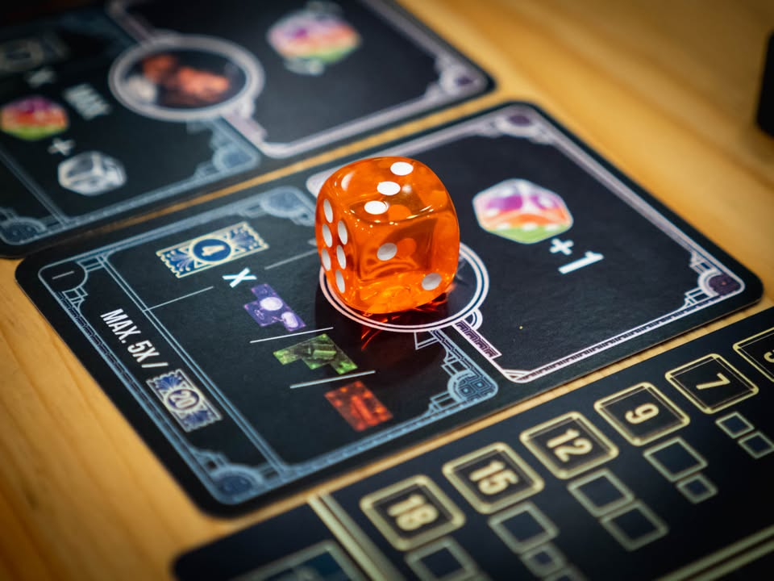
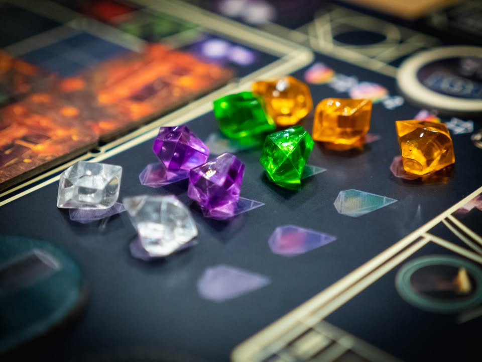
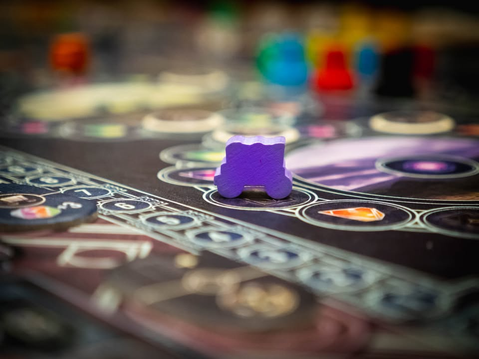
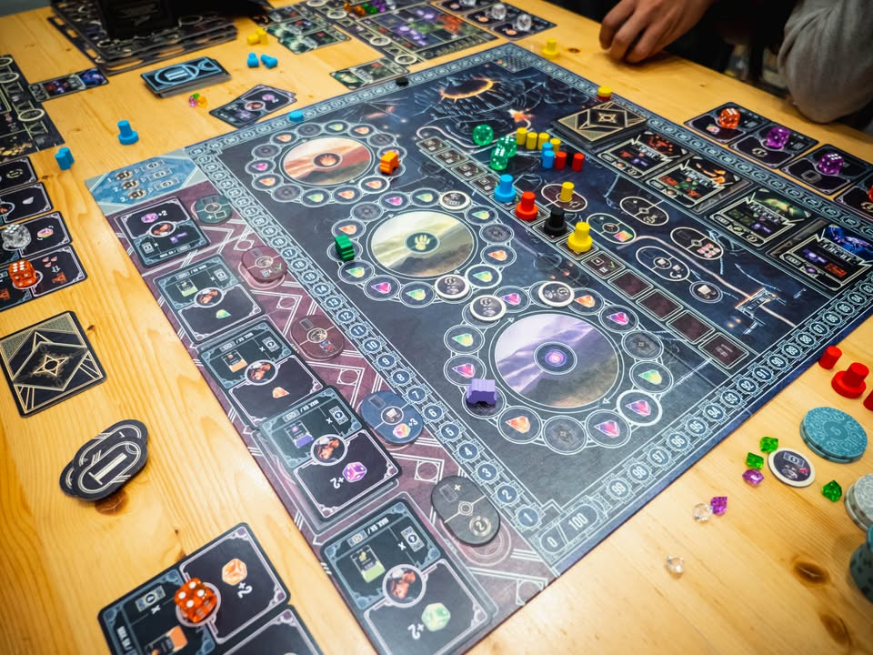
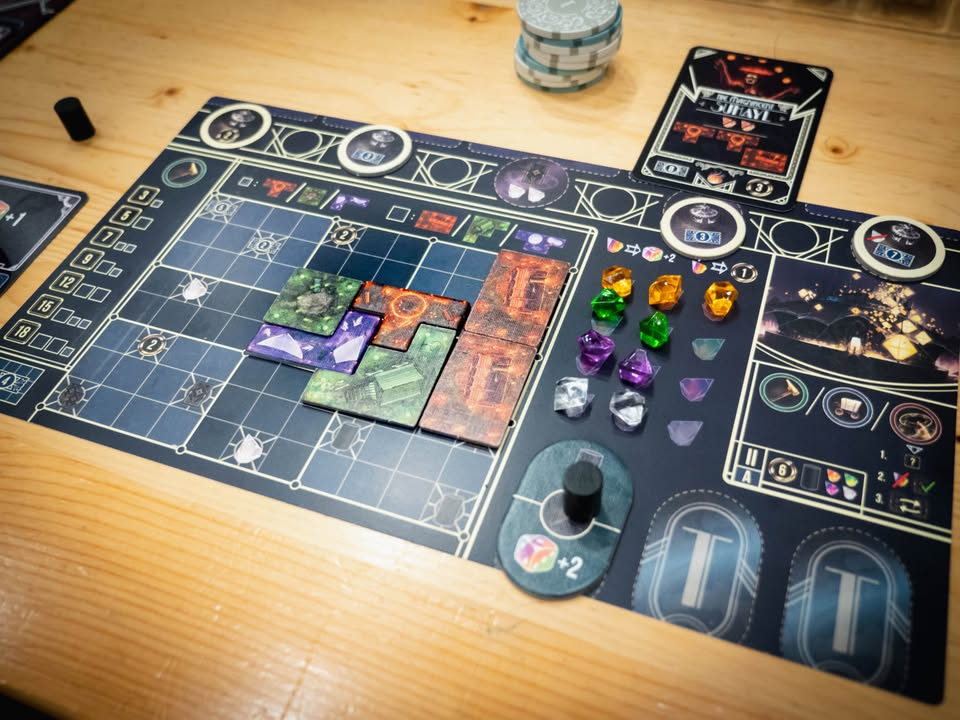
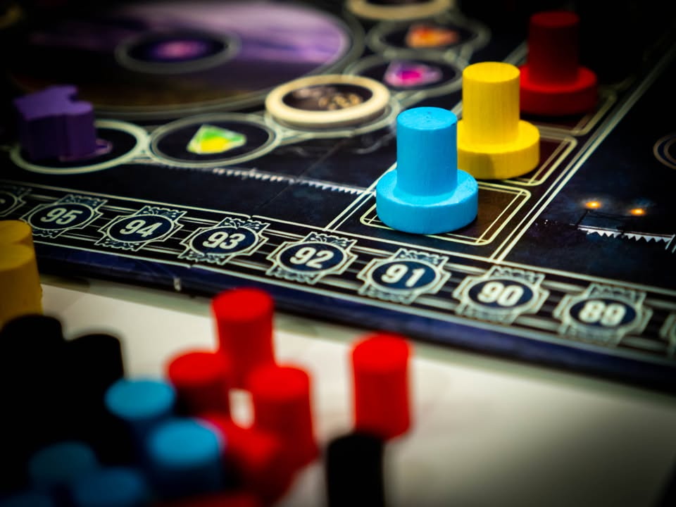
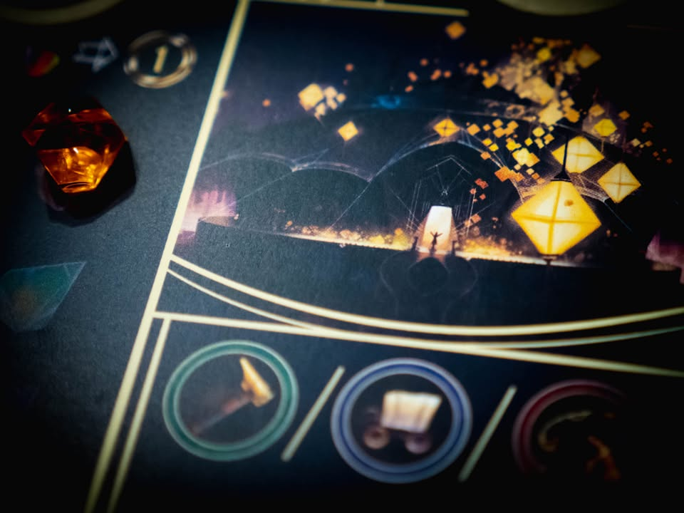

The Magnificent #thought
blog link: https_://wp.me/p7TSgy-2O7

▪️ เกมยูโรระดับกลางที่จะให้เรามาเป็นเจ้าของละครสัตว์ยามค่ำคืนที่เน้นการแสดงแสงสีดึงดูดผู้ชม ผลงานของ Eilif Svensson, Kristian Amundsen Østby ทีมออกแบบเกม Santa Maria (เป็นเกม Dice Drafting ที่สนุกอีกเกม)
 
 
▪️ในแง่ธีมเราน่าจะไม่มีอะไรให้พูดเยอะเพราะแนว Paste on ตัดแปะมางั้นๆ แกนหลักของเกมเป็นเกม Set Collection ที่เราจะต้องไปหยิบการ์ดแสดงโชว์ ที่แต่ละใบก็ต้องการให้เราไปจัดเตรียมเต็นท์การแแสดงหลากสีให้พร้อมเพื่อทำคะแนน
 
 
▪️ไอเดียหลักของเกมเป็น Dice Drafting  มาทำแอคชั่น กิมมิคคือเต๋ามีสามสีทุกครั้งที่หยิบเต๋าลูกใหม่มามันจะให้เราเอาหน้าเต๋าของสีนั้นๆที่เคยหยิบมาก่อนมานับแต้มรวมกัน แล้วเอาแต้มไปใช้ในแอคชั่นที่เราต้องการอีกที ถ้ารอบแรกหยิบสีม่วง 5 รอบต่อมาหยิบสีม่วง 6 ก็จะกลายเป็นมีแต้มรวมถึง 11!! 
 
 
▪️งี้ก็หยิบเลขเยอะซ้ำๆสิ?
 
 
▪️สิ่งที่ทำให้เราไม่อยากทำบ่อยๆนอกจากเงื่อนไขเรื่องสี (ที่เกี่ยวกับผลของแอคชั่น) นั้นก็คือตอนจบรอบเกมจะบังคับให้เราจ่ายเงินเท่ากับแต้มรวมของเต๋าที่มูลค่ารวมมากที่สุด นั้นคือถ้าหยิบสีเดียวซ้ำกันเยอะๆก็ต้องจ่ายแพงหน่อยนั้นเอง เกมเล่นกันแค่ สี่แอคชั่นก็จบรอบ และเล่นสามรอบก็จบเกม
 
 
▪️ซึ่งแอคชั่นในเกมจะมีให้ทำแค่สามอย่างได้แก่เดินรถคาราวานไปรอบๆเพื่อเก็บเพชรและโปสเตอร์การแสดง, สร้างเต็นท์ในบอร์ด และจัดแสดงโชว์ 
 
 
▪️ไอเดียของคือการ์ดโปสเตอร์แต่ละใบจะมีเงื่อนไขว่าต้องมีเต็นท์ชนิดไหนจำนวนเท่าไร ถ้าครบเงื่อนไขก็เอาไปจัดแสดงได้ ส่วนเต็นท์ที่มีรูปทรงหน้าตาเหมือนเททริสนี้หลักๆคือมันเอาไว้ให้เราบิดเพื่อวางทับช่องในกระดานเพื่อเอาโบนัสระหว่างเล่น (กับมีแต้มให้ถ้าถมที่เต็มในตอนจบเกม)
 
 
▪️กิมมิคอีกอย่างที่แอบเอามาขับเคลื่อนเกมแล้วผสมมาเนียนดี คือเวลาเราหยิบลูกเต๋าเนี่ยจะต้องเอามาวางบนการ์ดโบนัสมีอยู่สี่ใบ แต่ละใบก็จะให้โบนัสที่แตกต่างกัน ซึ่งตัวการ์ดมันจะมีมัลติฟังชั่นอีกแบบคือตอนจบรอบเราต้องเลือกทิ้งการ์ดหนึ่งใบเพื่อเคลม 'โบนัส' ในเงื่อนไขของใบนั้น (อย่างเช่นทุกๆเต้นท์สีแดงจะได้ 4 แต้ม, ) ตรงนี้เราเลยต้องวางระหว่างเล่นนิดนึง และทำให้แต่ล่ะเกมไม่ซ้ำกันมากเพราะต้องพยายามเดินเกมเพื่อเคลมโบนัสส่วนตัว ระหว่างเล่นก็จะมีไทล์ความสามารถเสริมให้เราทำลีลากับต้องวางแผนไปแย่งกันมา
 
 
ส่วนเพชรที่เก็บๆมานี้ส่วนมาก็เอาไปจ่ายเรื่อยเปื่อยระหว่างเล่นเกม

---------------------------------------------------
[🐸 Someone I know,  เด็กชายผู้เดินทางไปฝึกวิชาการแสดงแสงสี]
 
🔹 เป็นเกมยูโรตรงไปตรงมาที่สอนไม่ยาก ใช้เวลาไม่นาน (ผมเรียก 60-90 นาทีว่าไม่นาน) แต่ถึงแม้จะเป็นเกมไอเดียพื้นฐานจัดเซ็ทส่งของ แต่ก็ใส่ลูกเล่นสนุกๆและน่าสนใจหลายอย่างมาก โดยที่ไม่ทำให้รู้สึกว่ามันล้นแบบเยอะแยะไปไหน puzzle ระหว่างเล่นก็ค่อนข้างสนุกดี เกมไม่หวือหวา แต่ก็ไม่แข็งทื่อแต่อย่างใด เพราะมีการ 'ส่งต่อ' ลำดับความคิดของแต่ละโมดูลไม่ขาดตอน อย่างเช่นสีของเต๋านอกจากจะได้เรื่องผลรวมของแต้มแล้วยังมีผลต่อสีของเต็นท์ที่จะหยิบ แทรคการเดินที่จะไป และราคาที่จะต้องจ่าย
 
 
🔸 จุดที่ทำให้ผมคลิกกับมันน้อยแต่ไม่ใช่ข้อเสียคือมัน 'เบา' กว่ารสนิยมปกติไปหน่อย ตอนหยิบเต๋าไม่ค่อยมีอารมณ์ว่าไปแย่งลูกเต๋าหรือต้องตั้งใจหยิบตัดเพื่อขัดคนอื่น เป็นการมอง puzzle ของตัวเองเสียมากกว่า ไอเดียเรื่องการวางเต็นท์ทับของจริงๆมันก็ไม่มีปัญหาอะไร แต่เราก็รู้สึกว่ามันแอบหลุดๆจากระบบอื่นไปซักนิดนึง คือต้องมาหมุนๆเอาโบนัสในเกมจัดเซ็ทส่งของไรงี้  เป็นเกมที่ค่อนข้างให้อภัยกับการเล่นพลาดเยอะ ทำให้ตอนเล่นไม่ค่อยรู้สึกกดดัน
 
 
👁‍🗨 อีกจุดคือในกรอบประมาณนี้คู่แข่งมันคือ Coimbra ที่ความซับซ้อนในการอธิบาย และเวลาที่ใช้เล่นใกล้เคียงกันมาก แต่ตัว Coimbra มันได้ weight ที่เยอะกว่าและมอบประสบการณ์พวกการทำคอมโบกับน้ำหนักในการตัดสินในเลือกเต๋าเยอะกว่า  (อนึ่ง weight เยอะกว่าไม่จำเป็นต้องเป็นข้อดี แค่บังเอิญว่ามันตรงจริตผมกว่า) เลยกลายเป็นถ้ามีเวลาพอๆกันผมคงไปหยิบ Coimbra มาแทน แต่ถ้าชอบเกมแนวนี้และ weight ประมาณนี้ก็เป็นเกมที่สนุกทั้งคู่นะ
 
 
💭 แต่สำหรับกลุ่มคนที่เล่นเกมระดับกลางหรือแถวระดับครอบครัวแล้วโมดูลแต่ล่ะอันมันก็ถือว่าซับซ้อนมากพอที่จะทำให้เราต้องขบคิดตลอดเวลาว่าจะหยิบอันนี้แล้วไปเคลมอันโน้น หรือจะต้องจ่ายเท่าไรอะไรยังไงดี ก็ถือเป็นอะไรที่ step up มาจาก Stone Age มาอีกระดับหนึ่ง ส่วนมือเก่าก็จะคุ้นเคยกับเกมได้อย่างรวดเร็วโดยที่ไม่รู้สึกว่าเกมมันตื้นเกินไป
 
 
💭 รวมๆก็เป็นเกมสายเต๋าในที่วางตัวเองอยู่ใน comfort zone แบบที่ใส่ลีลาน่าสนใจไว้หลายอย่าง หยิบมากางง่าย เป็นเกมสไตล์ติดท้ายรถหรือเป็นมื้อก่อนกลับบ้าน

----------------------------------------------------------
Compatible Level - เกมนี้เข้ากับคนเขียนได้ระดับไหนนะ!!

🐸 Family, อาจจะมีช่วงเวลาที่ไม่เข้าใจกันบ้างแต่ครอบครัวคือสิ่งที่จะอยู่กับเราตลอดไป นี้คือเกมที่จะมีพื้นที่ถาวรในชั้นวางแน่นอน!! แม้บางเกมจะเปรียบดั่งคุณปู่ใจดีที่ได้เจอกันแค่ปีล่ะครั้ง แต่อันดับในใจนั้นคือความสนุกในช่วงเวลาที่เล่น หาใช่การได้เล่นซ้ำไม่รู้เบื่อเพียงอย่างเดียว [ex. กบโปรด, กบชอบ]

🐸 Hang out friend, เพื่อนกินเที่ยว ถ้าไม่ติดธุระอันใดก็พร้อมจะออกไปพบเจอ สนุกยามได้พบปะ แต่จะให้เจอกันบ่อยๆคงใช่ที - เกมสนุกที่อยากเล่นในระดับที่อยากจะหยิบกางเป็นบางครั้ง สลับสับเปลี่ยนไปเรื่อยตามจังหวะและโอกาส แต่เราก็ไม่ได้อยากซ้ำต่อเนื่องรัวๆ [ex. กบโอเค]

🐸 Someone I know, หากบังเอิญพบเจอ ก็คงได้ทักทายไต่ถาม หากแต่ในยามปกติมิอาจนึกชื่อออก ยืนคุยก็ได้ แต่คงไม่ได้เอื่อนเอ่ยนัดกินข้าว - บางเกมเราก็ไม่ได้อยากชวนเล่น แต่ถ้าไม่มีอะไรทำแล้วมีคนชวนก็เล่นก็ได้ [ex. กบเฉย]

🐸 I Turn left, You Turn Right - เธอชอบกินเผ็ด เราชอบกินอาหารญี่ปุ่น เธอชอบคนคารมดีพาไปกินที่หรู แต่เราชอบเล่นเกมอยู่กับบ้าน แม้จะได้คุยเป็นบางคราแต่คงไม่อาจพัฒนาความสัมพันธ์ - บางเกมแม้ว่าจะดีแค่ไหน แต่ถ้ารสนิยมมันไปด้วยกันไม่ได้ก็ไม่รู้จะเล่นไปทำไม [ex. กบไม่เล่น]

