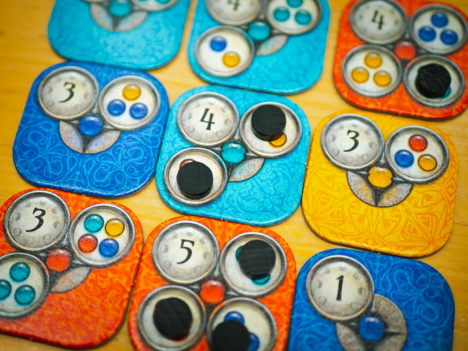
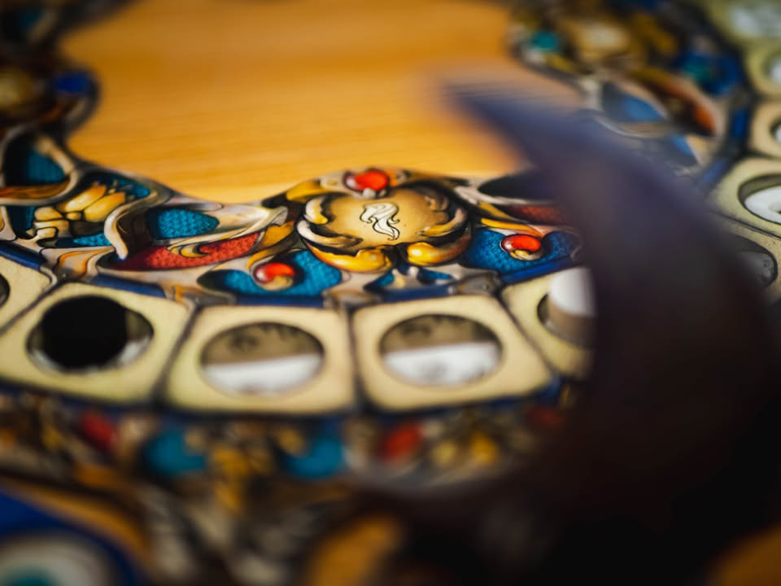

Luna Nova #bite_size
blog link: https://wp.me/p7TSgy-2Op
 
▪️เกมเพลินๆเล่นสบายๆคั่นเวลาหยิบไทล์มาต่อเป็นรูปแบบเพื่อทำแต้มจาก Uwe Rosenberg เจ้าพ่อเกมวิถีชาวบ้าน และ Corné van Moorsel (Factory Funner) 
 
 
▪️เกมแนวต่อไทล์แบบ abstract ที่แต่ละตาก็ไม่ได้ยุ่งยากอะไรแค่หยิบไทล์มาหนึ่งอันแล้ววางติดกับไทล์เดิมที่มีอยู่ มีเงื่อนไขนิดเดียวว่าหยิบได้เพียง 1-3 ไทล์ข้างหน้าจากมาร์คเกอร์ดวงจันทร์
 
 
▪️ไทล์เนี่ยจะมีสีแตกต่างกันและเป้าหมายของเราคือวางกลุ่มไทล์สีในแบบที่ไทล์นั้นต้องการ ถ้าเราเคลียร์เงื่อนไขได้ ก็จะได้วาง disc ของเราไว้บนไทล์ และคนแรกที่วาง disc ได้หมดก่อนก็จะชนะ ไม่มีลีลานับแต้ม
 
 
▪️อีกลูกเล่นที่ยกมาจาก Patchwork คือเวลาหยิบไทล์มาแล้วเราต้องเดินมาร์คเกอร์เวลาของเราไปข้างหน้าตามตัวเลขที่เขียนไว้ และรอบการเล่นของเกมจะให้ดูคนที่ใช้เวลาน้อยที่สุด (ถ้าหยิบเลขเล็กก็จะได้เล่นบ่อยกว่าคนที่หยิบเลขมาก)
 
 
▪️เกมเพลินดีส่วนตัวชอบกว่า Patchwork สอนง่ายเล่นไวมีอารมณ์ออกคอมโบเรียงสี (เล่นได้ถึงสี่คนด้วย) กับแอบมึนเล็กๆ (ในแง่ดี) เวลาพยายามหา optimal placement ว่าทำยังไงให้มันเคลียร์เงื่อนไขได้แบบตูมตาม แต่ถ้าเล่นกับสาย AP (คิดนาน) เกมอาจจะกร่อยเพราะมันไปได้หลายทาง
 
 
▪️เอาจริงๆผม 'เดา' เอาว่า Corné van Moorsel นี้คนทำหลักแล้วขอคำแนะนำกับเอาระบบแบบ Patchwork ของ Uwe มาใช้ เลยได้ชื่อ Uwe มาบูสยอดขาย (เดาล้วนนะ)
 
 
--------------------------------
หมวด Bite Size (พอดีคำ) นี้กะว่าจะเขียนอะไรสั้นๆประมาณนี้ล่ะกัน ใหม่บ้าง ซ้ำบ้าง เกมที่ขี้เกียจเขียนบ้าง เขียนๆไว้ก่อนเผื่อมีอารมณ์อาจจะขยายไปลง Thought บ้าง จริงๆอยากเขียนสั้นกว่านี้ แต่ยังอดไม่ได้ที่จะต้องอธิบายอะไรเพิ่มตามนิสัย เดี๋ยวค่อยๆปรับไปล่ะกัน

