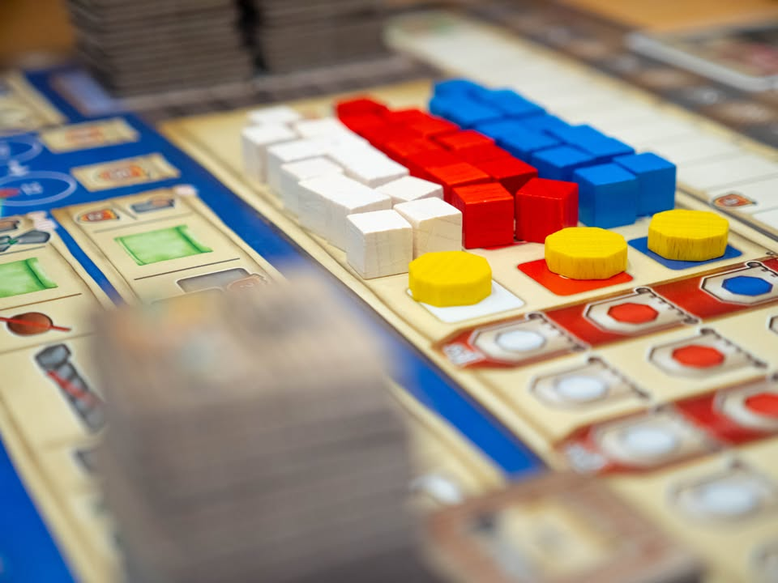
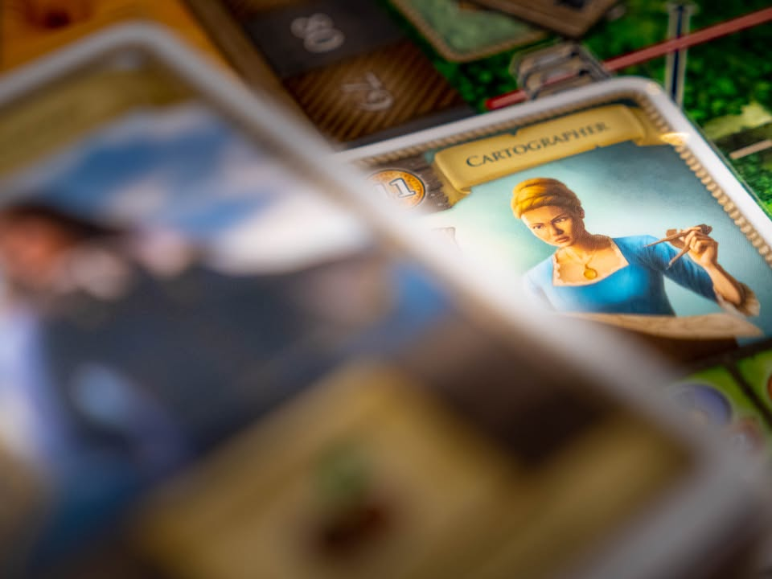
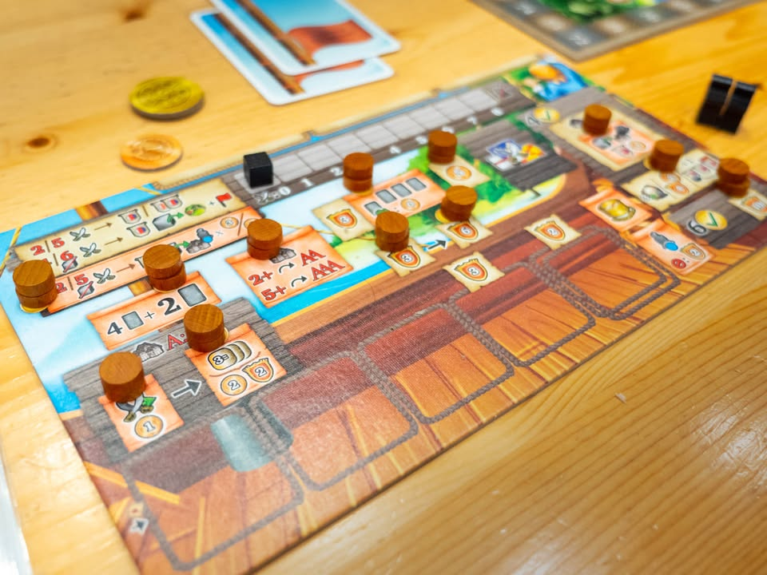
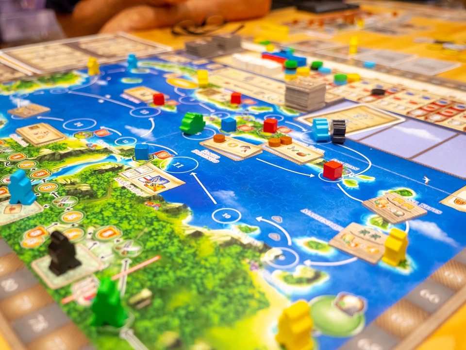
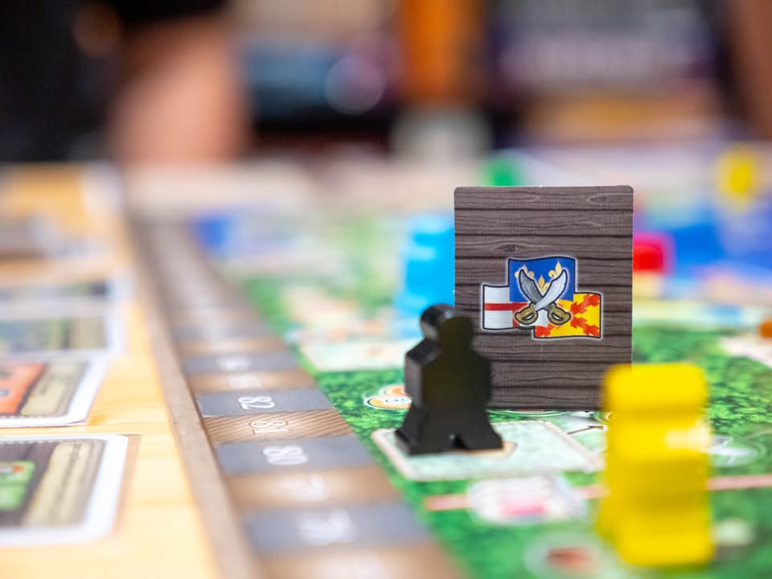
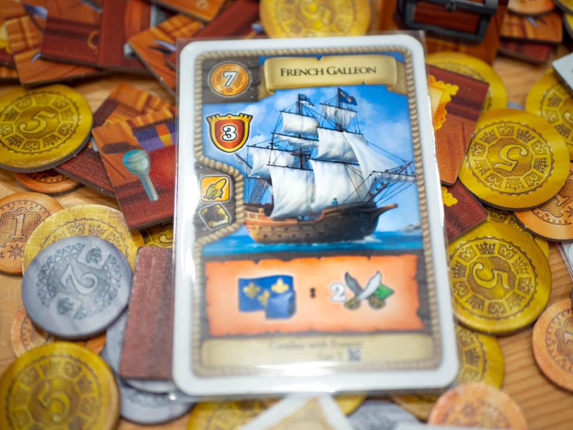
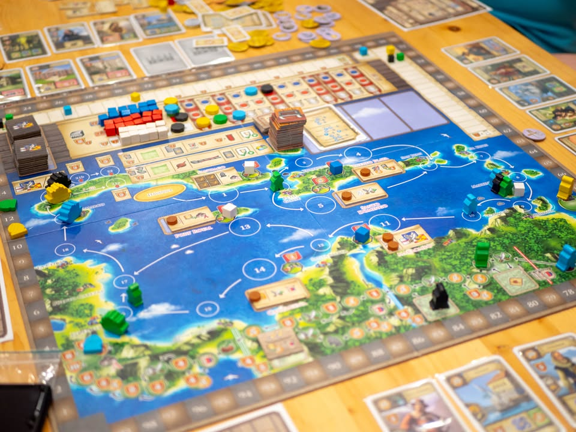
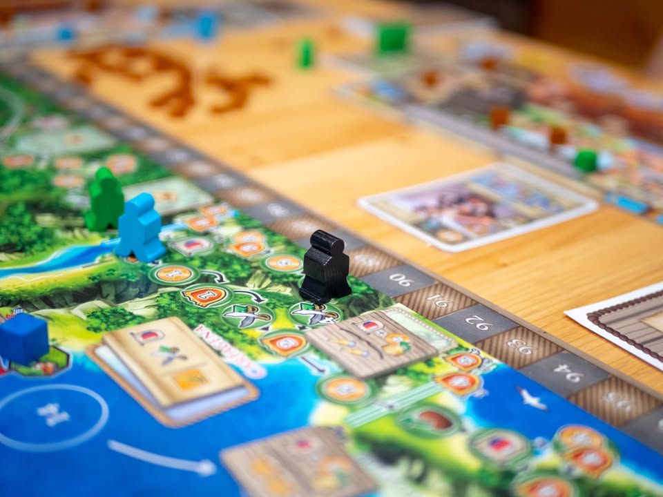
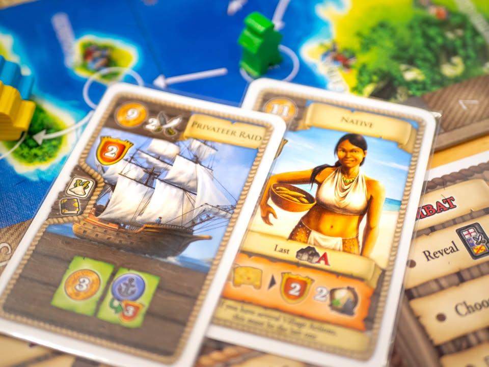

Maracaibo #thought
blog link : https_://wp.me/p7TSgy-2Ox

▪️เกมยูโรระดับกลางหนักว่าด้วยการเดินทางค้าขายและขยายอิทธิพลของชาติมหาอำนาจที่เข้ามาตักตวงผลประโยชน์ในพื้นแถบทะเลคาริบเบี้ยนตอนช่วงศตวรรษที่ 17 ผลงานของนักออกแบบ Alexander Pfister (Great Western Trail, Mombasa)
 
 
▪️ความหน้าสนในของเกมนี้คือเราจะต้องเดินเรือรอบเกาะแก่งในพื้นที่แถบนี้เป็นวงกลม รอบนึงมี 20 ช่อง แต่ทวิสที่น่าสนใจคือเราเลือกจะเดินกี่ช่องก็ได้ตั้งแต่ 1-7 ช่อง แต่ถ้ามีใครวนครบก่อนคนที่เหลือก็ต้องหยุดเล่นและเป็นการจบใหญ่นั้น เล่นสี่รอบใหญ่ก็จบแล้ว ไดนามิคสำคัญเลยอยู่ที่เราจะค่อยๆวิ่งทีล่ะนิดหรือจะจ้วงเอาๆไปเพื่อเร่งตัดจบเลย ตรงที่ทำให้แต่ล่ะครั้งมีความแตกต่างกัน
 
 
▪️การ์ดในเกมที่เราจะจั่วฟรีมาตลอดจะใช้งานได้สองแบบคือทิ้งเป็น 'สินค้า' เอาไว้เวลาแวะตามเมืองก็ทิ้งเพื่อทำแอคชั่น หรือจ่ายเงินเพื่อซื้อมาเป็นคนเพื่อมาทำงานให้เรา ความสามารถก็ไปตามเรื่องบวกนั้นเพิ่มนี้โบนัสบลาๆ สินค้านี้เวลาค้าขายก็เอาไปปลดล๊อกความสามารถของเราได้อีก
 
 
▪️โครงที่เหลือเราจะได้พบกับเกมยูโรแบบที่เรามีหลายเส้นทางให้เลือก จะเลือกเอาโบนัสผ่านการบุกป่าฝ่าดง (อัพเทรคสำรวจบนบก) เน้นช่วยเหลือชาติมหาอำนาจยึดเมืองพร้อมกับพยายามเพิ่มความดีความชอบในประเทศนั้น หรือจะเน้นเก็บไทล์เควส รวมไปถึงมี tech tree ที่เราสามารถปลดล๊อกเพิ่มศักยภาพให้กับเราระหว่างเล่นได้หลายทิศทาง
 
 
▪️ความน่าสนใจอีกอย่างคือเกมมีโหมดเนื้อเรื่อง (มีโซโล่ด้วย) ที่จะเปลี่ยนเงื่อนไขการเล่นและมีไทล์แผนที่หลายแบบมาช่วยเปลี่ยนเส้นทางการเดินด้วย ทำให้นอกจากการสุ่มไทล์ในแต่ล่ะเกมแล้วยังมีเนื้อเรื่องที่เปลี่ยนไปเรื่อยๆอีกต่างหาก  ทำให้คุณค่าในการเล่นซ้ำเกมนี้ค่อนข้างสูง
 
------------------------------------------------------
[🐸 Someone I know, กาลาสีหนุ่มล่องเรือในอ่าง ไร้ความทะเยอะทะยาน ชีวิตมีเพียงสายลมและแสงแดด]

🔸 เกมนี้เรียกได้ว่าเป็นเกมโคตร hype เกมหนึ่งที่ผมได้รับกระแสความ hype มาจากหลายแหล่ง (ทั้งใน BGG และคนใกล้ตัว) แต่เล่นแล้วสงัดนิดหน่อย แต่ไม่ใช่ว่าเกมไม่สนุก ทำอะไรก็ได้แต้ม มีจุดให้คิดตลอด แต่มันรู้สึกราบเรียบ ไม่มีจุด excite หรือจุดเบื่อ แต่คือมันเรียบดุจผิวน้ำนิ่งสนิท ตอนเล่นเลยแอบง่วงนิดนึง เพราะเกมมันไม่ต้องบี้เบียดแย่งที่อะไรใครเลยขาดช่วงกราฟขึ้นลง
  
 
🔹ไอเดียที่ชอบในแง่ implement คือระบบเดินช้าเดินไวเนี่ยล่ะ มันมีจังหวะที่ต้องสะดุดคิดว่าจะรีบดีไหมนะ เพราะเดินแล้วไปเลย กับพวกท่าเยอะก็จะโดนพวกที่ไม่เหลืออะไรทำเร่งตัดจบรอบ  อีกอย่างคือระบบการเล่นค่อนข้างตรงไปตรงมา พัฒนาแทรคแลกของไปเรื่อย จบรอบการเล่นของตัวเองได้อย่างว่องไว กติกาคลีนเป็นส่วนมาก
  
 
🔹 ข้อเด่นอีกอย่างคือ replayability สูงจากการสุ่มไทล์แอคชั่น, การ์ดจำนวนมาก และระบบ campaign แต่ถึงไม่เล่น campaign การสุ่มนอกจากแอคชั่นแล้วก็ยังมีไทล์เควสที่ค่อยๆออกมาระหว่างเกม แถมมีการปรับแผนที่อีก คือถ้ากะเล่นเกมเดียวยาวๆเกมนี้ก็มีอะไรให้เล่นเยอะ ซึ่งมันแลกมันกับการที่เกมแอบ set วุ่นวายขึ้นอีกนิด
  
 
👁‍🗨 จุดกลางๆ คือแม้จะเป็นเกมสไตล์ยูโรที่ให้รางวัลต่อการมุ่งทำสายแต้มตัวเอง แต่เกมกลับค่อนข้างยืดหยุ่นสูง ไม่มีการตัดหรือบล๊อกกันเป็นพิเศษ โดนแย่งตรงนี้ก็ไปหยิบตรงโน้น ลงตรงไหนก็มีแต้มมาให้สำหรับคนที่ชอบเล่นเกมแบบอิสระไปเรื่อยๆแล้วอาจจะชอบเกมนี้ แต่ส่วนตัวสำหรับผมมันเลยทำให้เกมขาดความตื้นเต้นในการวางแผนไป
  
  
👁‍🗨 ในแง่หนึ่งแล้วมันเป็นเกมสไตล์ที่เราต้องพยายามสร้างคอมโบจากการ์ดให้เร็วที่สุด แต่ตัวการ์ดมันจั่วมาแบบสุ่มซึ่งตรงนี้ไม่ใช่เรื่องแย่ แต่เราต้องเน้นมองหาคอมโบจากการ์ดหลากหลายที่เข้ามือมา ต้องค่อยหาทางใช้ให้เกิดประโยชน์เอาระหว่างเล่น
  
  
🔸จุดที่ไม่ชอบนิดๆน่าจะมาจากระบบอิทธิพลที่แอบยกมาจาก Mombasa คือจำนวนเมืองที่ประเทศนั้นยึดได้จะมีผลต่อความดีของเราในประเทศนั้นๆมาคูณกัน (สมมุติสเปนยึดได้ 4 เมือง ใครเดินเทรคสเปนไว้ก็เอาตำแหน่งนั้นคูณ 4) ซึ่งโดย default แล้วประเทศไหนเดินอยู่เราก็ควรไปจอยแล้วช่วยให้ประเทศนั้นยึดที่เพิ่ม เพราะการเอาประเทศอื่นไปยึดเมืองกลับไอ้คิวป์ตัวคูณนี้มันไม่วางกลับไปที่แทรคแต่ให้เอาออกไปเลยทำให้แต้มเค้าไม่ลด กลายเป็นจะไปตบประเทศอื่นทำไมหว่าเสียเวลา (อันนี้พูดในแง่โมดูลเล่นแบบไม่ใช่เนื้อเรื่องนะ) เหตุผลที่คนจะมาเบียดกันมีแค่อยากทำเงื่อนไขลงการ์ดบางใบเท่านั้นเอง
  
 
💭 สำหรับผมแล้วนักออกแบบคนนี้ยังไงก็คือ Mombasa เนี่ยล่ะ (ชอบมาก) เกมใหญ่เกมอื่นนี้ไม่คลิกเท่าไร (Blackout: Hong Kong กับ Great Western Trail นี้เล่นล่ะหลับทั้งคู่ แต่ GWT นี้คนชอบกันเยอะแยะอยู่อย่าเชื่อผมเยอะ) ส่วนกล่องเล็กนี้สนุกล้นไอเดียอยู่ (Tybor the Builder,  Oh My Goods!)
  
  
💭 นี้ก็เดาๆว่าคนเล่นยูโรสาย Great Western Trail ก็น่าจะชอบนะ พอดีผมไม่โดน Great Western Trail อยู่แล้วเลยไม่คลิกมั้ง?
 
----------------------------------------------------------
Compatible Level - เกมนี้เข้ากับคนเขียนได้ระดับไหนนะ!!

🐸 Family, อาจจะมีช่วงเวลาที่ไม่เข้าใจกันบ้างแต่ครอบครัวคือสิ่งที่จะอยู่กับเราตลอดไป นี้คือเกมที่จะมีพื้นที่ถาวรในชั้นวางแน่นอน!! แม้บางเกมจะเปรียบดั่งคุณปู่ใจดีที่ได้เจอกันแค่ปีล่ะครั้ง แต่อันดับในใจนั้นคือความสนุกในช่วงเวลาที่เล่น หาใช่การได้เล่นซ้ำไม่รู้เบื่อเพียงอย่างเดียว [ex. กบโปรด, กบชอบ]

🐸 Hang out friend, เพื่อนกินเที่ยว ถ้าไม่ติดธุระอันใดก็พร้อมจะออกไปพบเจอ สนุกยามได้พบปะ แต่จะให้เจอกันบ่อยๆคงใช่ที - เกมสนุกที่อยากเล่นในระดับที่อยากจะหยิบกางเป็นบางครั้ง สลับสับเปลี่ยนไปเรื่อยตามจังหวะและโอกาส แต่เราก็ไม่ได้อยากซ้ำต่อเนื่องรัวๆ [ex. กบโอเค]

🐸 Someone I know, หากบังเอิญพบเจอ ก็คงได้ทักทายไต่ถาม หากแต่ในยามปกติมิอาจนึกชื่อออก ยืนคุยก็ได้ แต่คงไม่ได้เอื่อนเอ่ยนัดกินข้าว - บางเกมเราก็ไม่ได้อยากชวนเล่น แต่ถ้าไม่มีอะไรทำแล้วมีคนชวนก็เล่นก็ได้ [ex. กบเฉย]

🐸 I Turn left, You Turn Right - เธอชอบกินเผ็ด เราชอบกินอาหารญี่ปุ่น เธอชอบคนคารมดีพาไปกินที่หรู แต่เราชอบเล่นเกมอยู่กับบ้าน แม้จะได้คุยเป็นบางคราแต่คงไม่อาจพัฒนาความสัมพันธ์ - บางเกมแม้ว่าจะดีแค่ไหน แต่ถ้ารสนิยมมันไปด้วยกันไม่ได้ก็ไม่รู้จะเล่นไปทำไม [ex. กบไม่เล่น]
 
อนึ่ง : เป็นความรู้สึกในความ "อยากจะหยิบมาเล่นไหม?" ของผมเอง ไม่ได้เกี่ยวอะไรกับคุณภาพของเกม ไม่อิงมาตราฐานอื่นใดนอกจากตัวเองเท่านั้น ดูให้เป็นแค่ "อีกความคิดเห็นหนึ่ง" เท่านั้นก็พอนะครับ :)

