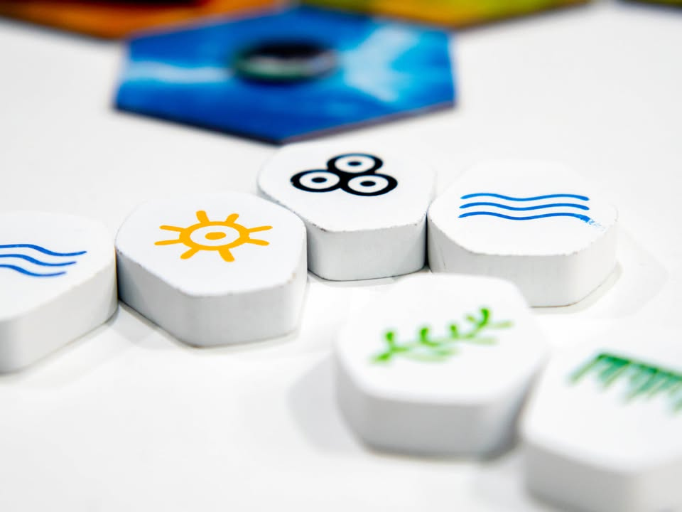
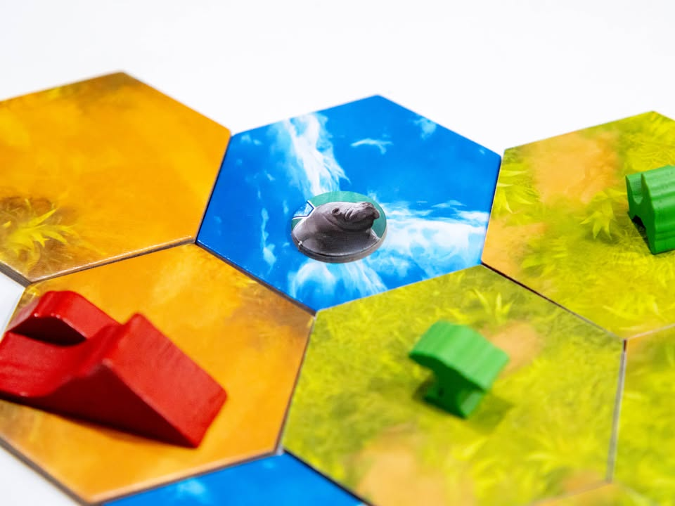
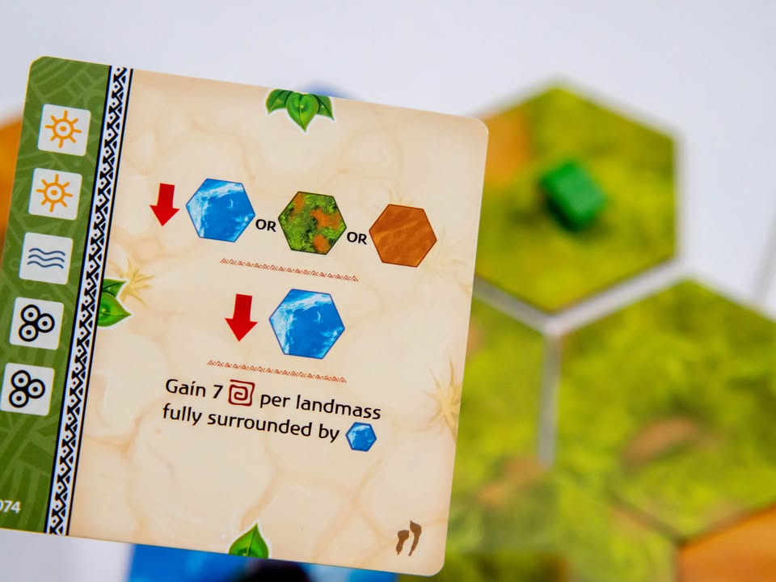

Ecos: First Continent #bite_size #first_impression
blog link: https://wp.me/p7TSgy-2OQ

▪️เกมระดับเบาที่ให้เราเป็นพระเจ้าที่ต้องรอชาร์ทพลังธรรมชาติไปทำการแปรเปลี่ยนภูมิประเทศและสิ่งมีชีวิตให้ก่อเกิดแต้มให้กับเรา งานของ John D. Clair (Mystic Vale, Edge of Darkness)
 
 
▪️ถ้าพูดให้เข้าใจง่ายหน่อยเกมนี้ไอเดียประมาณเกม Bingo (ไอ้ทีหยิบๆเลขมาแล้วก็วางตามตารางนั้นแหละ)  ผู้เล่นจะมีการ์ดความสามารถพิเศษในมือจำนวนหนึ่งเปิดเกมมาก็วางไว้ข้างหน้าสามใบ จากนั้นช่วงเวลาสุดตื่นเต้นคือใครซักคนจะล้วงถุงมาพร้อมกับแจกพลังธรรมชาติสายลม แสงแดด ต้นหญ้าอะไรก็ว่าไป ถ้าการ์ดใครมีช่องตรงก็หยิบคิวป์มาวาง ถ้าวางครบก็จะได้ใช้ความสามารถการ์ด ถ้าไม่มีก็จะหลายเป็นไปชาร์ทการ์ดติดตัวแทน
 
 
▪️ความสามารถก็แนวๆวางไทล์พื้นดิน ผืนน้ำ ภูเขา ต้นไม้ และเหล่าสรรพสัตว์ ถ้าทำได้ก็จะได้แต้มตามเงื่อนไขการ์ด (ติดตรงนี้ มีตรงโน้น บลาๆ) บางใบก็ให้จั่วเพิ่มบางใบก็ทำให้ลงการ์ดได้เพิ่ม
 
 
▪️ถ้าพูดจากอีกมุมคือเกมไม่มี decision tree อะไร ก็วางการ์ดรอหวยออกตรงเลขครบทำท่า เกมจะเริ่มฉายแสงเอาตอนเมื่อเล่นแบบ Draft เพื่อหาคอมโบระหว่างการ์ด แล้วค่อยลองเอามาทดสอบเครื่องยนต์ทีหลัง 
 
 
▪️ข้อเสียจากกรอบของเกมน่าจะมีแค่สัตว์มาเป็นแค่ไทล์พิมพ์รูปเฉยๆ แต่จะให้ทำมีเปิ้ลสัตว์ทุกชนิดก็คงไม่ไหวก็ถือว่าหยวนๆให้ล่ะกัน
  
  
▪️ ถ้ามองจากมุมที่ถอยออกมาหน่อย เกมแบ่งโหลดน้ำหนักยังไม่บาลานซ์เท่าไร คือการตัดสินใจไปกองอยู่ตรงตอน draft หมด และต้องคิดเยอะหน่อยด้วยเพราะต้องหาคอมโบ หลังจากนั้นไม่ต้องคิดอะไระล่ะลุ้นอย่างเดียว 
 
  
▪️ แน่นอนว่าผมไม่คลิกอะไรกับเกมนี้.....แต่มันก็มีตลาดของมันอ่ะนะ ถ้ามองจากมุมเกมแฟมมิลี่ใสๆ ลุ้นสนุกๆ มีตื้นเต้นกับความดวงดีของตัวเองแล้วก็ถือว่าได้อยู่ สนุกกว่า Bingo หลายเท่า ก็พอมุ้งมิ้งมีเรื่องราวนิดนึง
--------------------------------
หมวด Bite Size (พอดีคำ) นี้กะว่าจะเขียนอะไรสั้นๆประมาณนี้ล่ะกัน ใหม่บ้าง ซ้ำบ้าง เกมที่ขี้เกียจเขียนบ้าง เขียนๆไว้ก่อนเผื่อมีอารมณ์อาจจะขยายไปลง Thought บ้าง จริงๆอยากเขียนสั้นกว่านี้ แต่ยังอดไม่ได้ที่จะต้องอธิบายอะไรเพิ่มตามนิสัย เดี๋ยวค่อยๆปรับไปล่ะกัน

