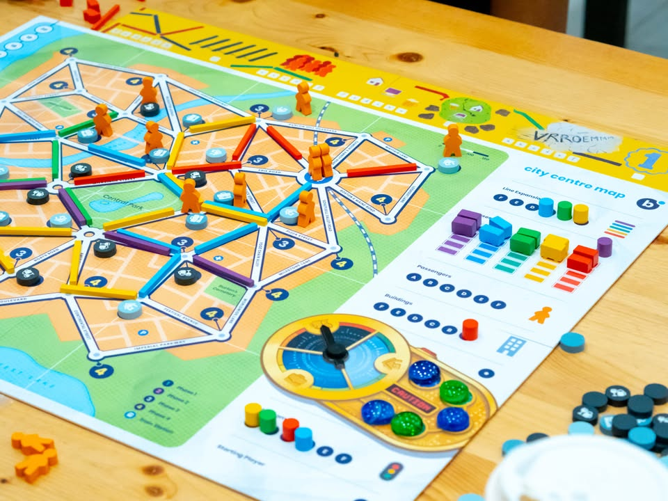
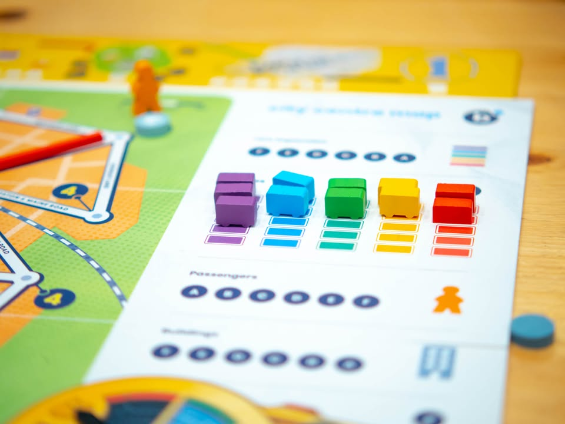
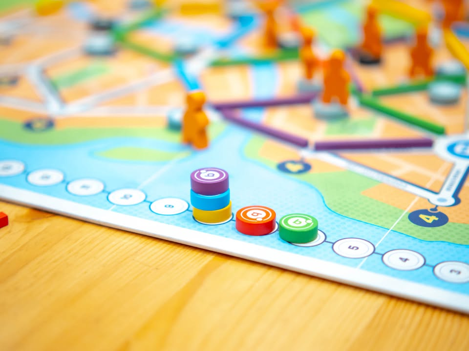
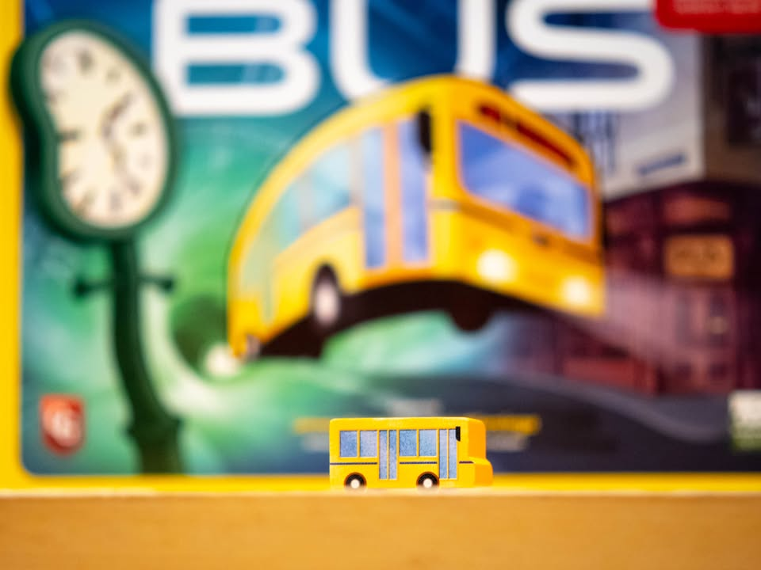

Bus: รถเมล์ทะลุเวลา #though
blog link: https://wp.me/p7TSgy-2OZ

▪️เกมยูโรระดับกลางจากทีมสร้างเกมสุดเบิร์นหัวแห่งค่าย Splotter Spellen (Jeroen Doumen, Joris Wiersinga) ที่ทำเกมสุดโปรดของสายเกมหนักมาอย่าง Food Chain Magnate, Antiquity,  Indonesia,  Roads & Boats ฯลฯ   แต่ในเกมนี้เราจะมาเป็นสุดยอดบริษัทรถเมล์ที่จะมารับส่งผู้โดยสารไปสู่ที่หมายแถมด้วยการไปยุ่งเกี่ยวกับกระแสเวลานิดหน่อย ?#@!
 
 
📌เกมนี้ตีพิมพ์ครั้งแรกในจำนวนจำกัดมาก (Splotter Spellen เป็นค่ายเกมบูติกที่ทำเกมตีพิมพ์ไม่มาก พึ่งจะเริ่มมาบูสเอาตอนผ่านมาเกือบ 20 ปีตอน Food Chain Magnate ดังเปรี้ยงเนี่ยล่ะ ถึงได้กล้าเอาเกมเก่ามา reprint รัวๆ) แต่เพื่อเป็นการฉลองครบรอบ 20 ปีค่าย Capestone Games จึงหยิบเอามาตีพิมพ์ใหม่ ใช้ component และ graphic ใหม่ 
  
 
📌Fun Fact : เกมนี้ถือกันว่าเป็นเกม Worker Placement รุ่นแรกๆด้วยนะ (ระบบนี้โด่งดังจาก Caylus แต่ว่า Worker Placement เกมแรกคือเกม Keydom ที่ออกก่อน Bus 1 ปีเท่านั้นเอง)

 
▪️ไอเดียเกมคือ Pick Up & Delivery ที่จะให้ผู้เล่นทำการวางเส้นทางและส่งผู้โดยสาร มีกิมมิคว่าผู้คนในโลกแห่งนี้จะวนเวียนไปอยู่สามสถานที่ได้แก่บ้าน ที่ทำงาน และผับบาร์ ซึ่งจะเปลี่ยนไปตามช่วงเวลาของวัน
 
 
▪️วิธีการเล่นมีแค่ผู้เล่นผลัดกันวางจองแอคชั่นไปตามช่องพอผ่านหมดก็ไล่ resolve (ตรงนี้ถ้าเคยเล่น Dominant Spacies มาก็แบบนั้นแหละ) แต่กิมมิคที่เกมนี้มีคือแอคชั่นที่เราใช้ไปแล้วจะถูกทิ้งออกไปจากเกมและทั้งเกมเรามีเพียง 20 แอคชั่นให้ใช้เท่านั้น!! คือตอนไหนอยากเล่นเยอะก็ไปเล่น อยากเล่นน้อยก็ได้ แต่ทั้งเกมมีให้แค่นี้แหละ
 
 
▪️ระหว่างเล่นก็มีแอคชั่นแค่วางราง เพิ่มปริมาณรถเมล์ เพิ่มจำนวนผู้โดยสาร สร้างตึกไว้รับคน ส่งคน และหยุดเวลา....... กิมมิคสนุกๆแต่โคตรไม่เข้าธีมของเกมนี้คือโดยปกติแล้วทุกคนจะต้องส่งผู้โดยสารไปพื้นที่แบบเดียวกัน พอเปลี่ยนรอบก็จะเปลี่ยนสถานที่ไปในรูปแบบที่แน่นอนทำให้สามารถวางแผนล่วงหน้าได้ แต่ถ้ามีใครทำแอคชั่นนี้ก็จะสามารถเลือกให้เวลาไม่เดินไปข้างหน้า ซึ่งอาจจะเป็นการทำลายจังหวะของผู้เล่นคนอื่นได้ด้วย
 
 
▪️ของเล่นอีกแบบที่ไม่ค่อยได้เห็นในเกม Pick Up & Delivery เกมอื่นๆก็คือผู้โดยสารเวลาไปส่งแล้วจะไม่หายไปไหน แต่ก็อยู่บนกระดานรอที่จะเดินทางไปที่อื่นในรอบต่อไป ในแง่การแล้วมันค่อนข้างน่าสนใจในแง่เราต้องพยายามเลือกตำแหน่งที่ผู้โดยสารจะถููกส่งไป เพราะเราอยากจะเอาไปส่งซ้ำในรอบหน้าโดยที่ไม่โดนคนอื่นแย่งไปเสียก่อน

----------------------------------------------------------
[🐸 Family, คุณลุงขับรถโรงเรียนที่ขับรถตามเส้นทางดั้งเดิมมานับสิบปี]

🔹 Solid, easy to learn, easy to play, meaningful decision and........ many cutthroat move เป็นเกม 20 ปีที่แล้วที่เล่นตอนนี้ไม่มีส่วนไหนรู้สึกว่าเก่า ระบบการเล่นที่ไม่มีอะไรซับซ้อนเกินเข้าใจ แต่ตอนเล่นจริงกลับต้องคิดตลอดเวลาพร้อมแอบซ่อนความปวดหัวในการคิด Sub-State สไตล์เกมของคู่นักออกแบบคนนี้ไว้อย่างแยบยล
 
 
🔹 ข้อดีมากก็อย่างที่บอกคือสอนง่าย ไอเดียไม่ซับซ้อน ตัวเกมเองก็ค่อนข้างกลางๆ แต่ดันได้อารมณ์แบบ 'คิดหนัก' ติดหัวตลอดเพราะด้วยความที่เส้นทางมันไขว้กันไปมาทำให้เราอาจจะวางแผนพลาดจนส่งคนผู้โดยสารไม่ได้เพราะมองไม่ครบพอโดยเฉพาะตอนท้ายเกมที่มีเรื่องต้องให้มองเยอะ ระบบจำกัดจำนวนแอคชั่นที่เหมือนจะดูต้องคำนวนเยอะก็ไม่ได้หนักหัวอะไร เพราะโดยเฉลี่ยก็ใช้พอๆกันเนี่ยแหละยกเว้นตอนอยากทำท่ายาก 
  
 
🔹 ข้อดีอีกอย่างที่ชอบเป็นการส่วนตัวของฉบับพิมพ์ใหม่นี้คือมีการปรับภาพและสีใหม่หมดทำให้ดูง่ายสะอาดตาไม่เหมือนเส้นสไตล์รกๆมั่วๆผสมภาพเขียนแบบเหมือนเด็กวาดอันเป็นเอกลักษณ์ของ Splotter Spellen ที่ผมค่อยถูกใจนัก ทำให้เกมค่อนข้างดึงดูดสายตาคนเล่นหน้าเก่าและใหม่ได้ดี
  
 
👁‍🗨จุุดกลางๆคือเกมมันอาจจะแอบรู้สึก scripted นิดๆเพราะแผนที่ไม่มีการสุ่มเป็นเหมือนเดิมทุกรอบ การสุ่มจะเกิดจากลำดับ turn order และสิ่งเล็กๆน้อยๆที่เกิดขึ้นระหว่างการเล่นแทน (ซึ่งก็มีผลกับเกมมากอยู่นะ) อย่างเช่นการหยุดเวลา 
 

 
👁‍🗨จุดที่ผมรู้สึกขัดๆอยู่นิดๆ (แต่อาจจะเกิดจากที่ยังคิดท่าไม่เป็นเอง) คือระบบหยุดเวลาที่ยังหาจังหวะใช้แล้วเกิดผลดีกับเราไม่ค่อยออก คือถ้าทุกคนต้องมาส่งแบบเดียวกับเราเค้าก็ไม่น่าจะลำบากอะไร หรือว่าเราก็อาจจะไม่ได้ประโยชน์ขนาดต้องยอมเสียตั้งแต้มหนึ่งเพื่อมาหยุดเวลาหรือปล่าว (เกมนี้เล่นกันแถว 10-15 แต้ม แต้มนึงนี้ระดับชี้ชะตาเลยนะ)
 
 
🔸ข้อเสียจริงๆที่นึกออกเลยคือคู่มือเกมทำมาอย่าง 'กาก' เป็นกระดาษพับสองทบแบบแผนพับแจกตามสถานที่ท่องเที่ยว นี้เกมสามพันนะเว้ย!! อย่างอื่นพอเข้าใจแต่คู่มือนี้ไม่ไหว นี้พับๆอ่านแป๊บนึงรอยขาวขึ้นล่ะจะขาดเมื่อไรก็ไม่รู้ โอเคมันแอบดูธีมดีแหละแต่ช่วยทำคุณภาพกระดาษดีๆหน่อยก็ได้ แถมพื้นที่จำกัดทำให้ใส่รูปอธิบายกติกาได้น้อยลงอีกต่างหาก
 
 
🔸ข้อเสียที่ไม่เกี่ยวกับเกมคือราคาแพงไปหน่อยทั้งๆที่ค่ายที่เอากลับมาทำใหม่ระดับแมสคือ Capestones Games แต่ถ้าอิงจากถ้าต้องไปซื้อฉบับที่พิมพ์เมื่อ 20 ปีก่อนที่แพงกว่านี้รวมไปถึงราคามาตราฐานของค่าย Splotter Spellen คนที่จ่ายราคาพวกนี้มาจะไม่รู้สึกหนักใจอะไรนัก แต่สำหรับผู้เล่นที่ไม่เข้าใจตรงนี้ก็จะคิดว่าเกมแพงเกิ๊น
 
 
💭ข้อสังเกตุส่วนตัวอีกอย่างคือเกมนี้แม้จะเล่นได้ 5 คนก็จริง แต่แนะนำที่ 3-4 มากกว่า (4 ดีสุด) เพราะพอไปเป็น 5 คนแล้วลำดับ turn order มันค่อนข้างโหดร้ายและบีบบังคับเกินสนุกไปหน่อย
 
 
💭โดยรวมเป็นเกม 60-90 นาทีเล่นไม่ยาก แฟนๆ Splotter Spellen ซื้อมันมาให้ฐานะเกมอุ่นเครื่องที่นำเสนอซิกเนเจอร์เกมเด่นของค่ายเอาไว้ได้ดี หรือคนอยากได้เกมกางง่ายสอนง่ายแต่ meaty หน่อยก็เป็นอีกตัวเลือกที่น่าสนใจ เล่นจบก็ไม่รู้สึกว่าเหนื่อยเหมือนเกมอื่นๆของค่าย

----------------------------------------------------------
Compatible Level - เกมนี้เข้ากับคนเขียนได้ระดับไหนนะ!!

🐸 Family, อาจจะมีช่วงเวลาที่ไม่เข้าใจกันบ้างแต่ครอบครัวคือสิ่งที่จะอยู่กับเราตลอดไป นี้คือเกมที่จะมีพื้นที่ถาวรในชั้นวางแน่นอน!! แม้บางเกมจะเปรียบดั่งคุณปู่ใจดีที่ได้เจอกันแค่ปีล่ะครั้ง แต่อันดับในใจนั้นคือความสนุกในช่วงเวลาที่เล่น หาใช่การได้เล่นซ้ำไม่รู้เบื่อเพียงอย่างเดียว [ex. กบโปรด, กบชอบ]

🐸 Hang out friend, เพื่อนกินเที่ยว ถ้าไม่ติดธุระอันใดก็พร้อมจะออกไปพบเจอ สนุกยามได้พบปะ แต่จะให้เจอกันบ่อยๆคงใช่ที - เกมสนุกที่อยากเล่นในระดับที่อยากจะหยิบกางเป็นบางครั้ง สลับสับเปลี่ยนไปเรื่อยตามจังหวะและโอกาส แต่เราก็ไม่ได้อยากซ้ำต่อเนื่องรัวๆ [ex. กบโอเค]

🐸 Someone I know, หากบังเอิญพบเจอ ก็คงได้ทักทายไต่ถาม หากแต่ในยามปกติมิอาจนึกชื่อออก ยืนคุยก็ได้ แต่คงไม่ได้เอื่อนเอ่ยนัดกินข้าว - บางเกมเราก็ไม่ได้อยากชวนเล่น แต่ถ้าไม่มีอะไรทำแล้วมีคนชวนก็เล่นก็ได้ [ex. กบเฉย]

🐸 I Turn left, You Turn Right - เธอชอบกินเผ็ด เราชอบกินอาหารญี่ปุ่น เธอชอบคนคารมดีพาไปกินที่หรู แต่เราชอบเล่นเกมอยู่กับบ้าน แม้จะได้คุยเป็นบางคราแต่คงไม่อาจพัฒนาความสัมพันธ์ - บางเกมแม้ว่าจะดีแค่ไหน แต่ถ้ารสนิยมมันไปด้วยกันไม่ได้ก็ไม่รู้จะเล่นไปทำไม [ex. กบไม่เล่น]
 
 
อนึ่ง : เป็นความรู้สึกในความ "อยากจะหยิบมาเล่นไหม?" ของผมเอง ไม่ได้เกี่ยวอะไรกับคุณภาพของเกม ไม่อิงมาตราฐานอื่นใดนอกจากตัวเองเท่านั้น ดูให้เป็นแค่ "อีกความคิดเห็นหนึ่ง" เท่านั้นก็พอนะครับ :)

