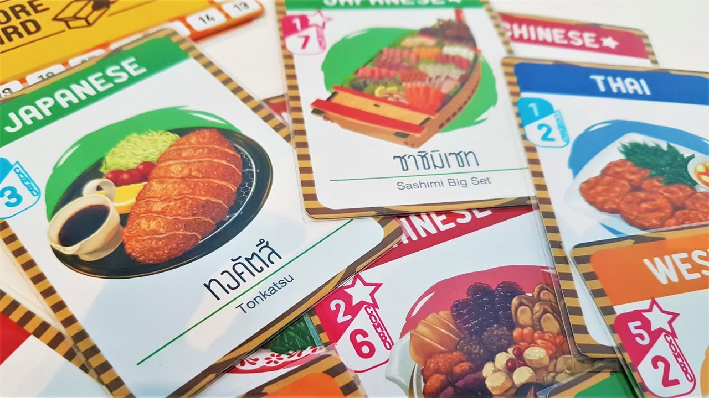
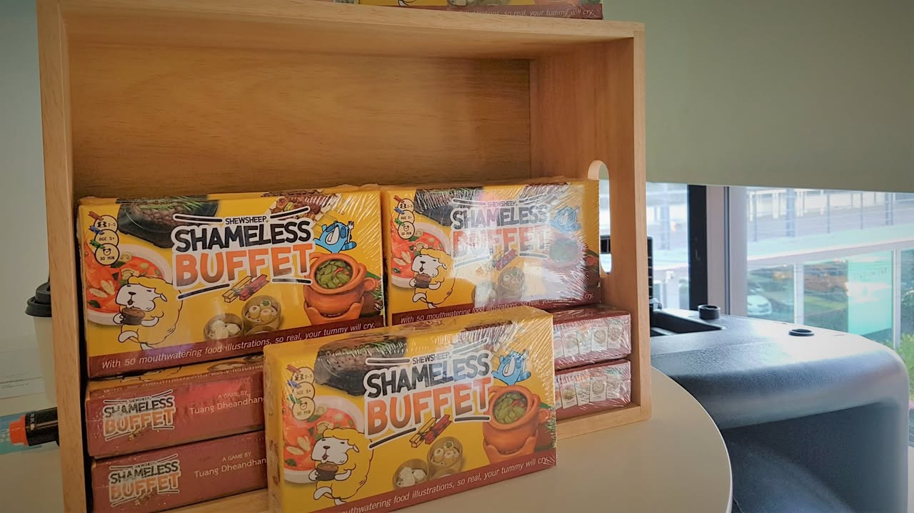
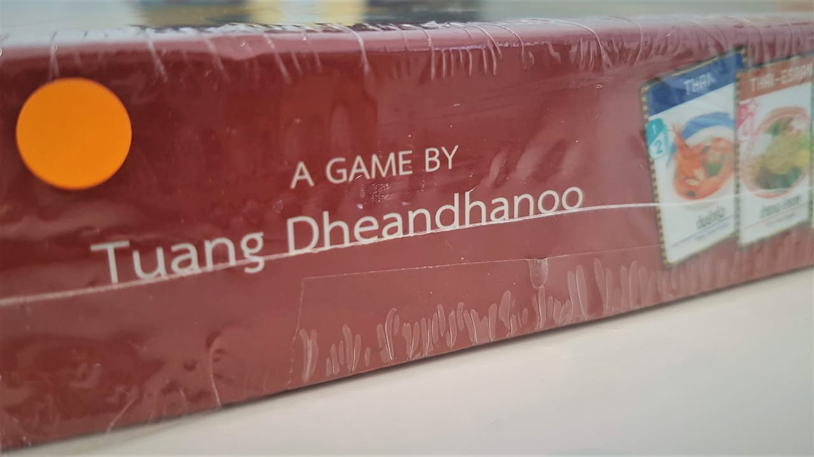
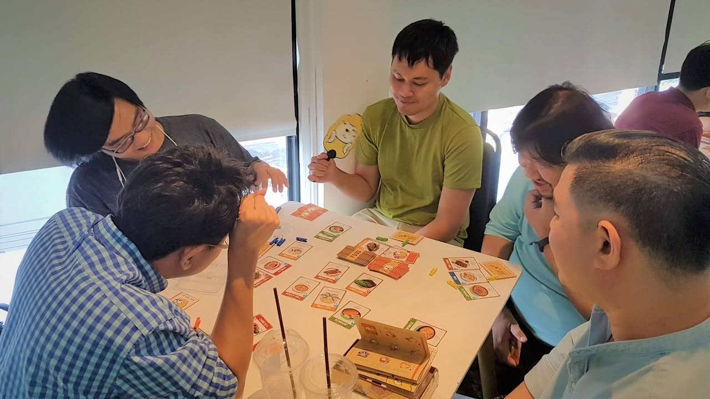
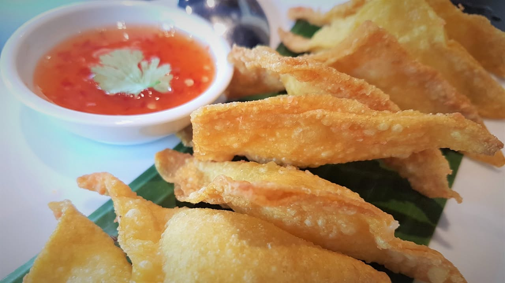

"คำเตือน" -- อย่าเล่นเกมนี้ตอนท้องว่างหรือยามดึก เพราะจะหิวฉิบหาย เนื่องจากภาพน่ากินเหี้ยๆ  #ประชาสัมพันธ์  #ไปงานเปิดตัวมา

เกมนี้ชื่อ Shameless Buffet  -- ธีมของเกมว่าด้วยการไปกินบุฟเฟ่ต์นานาชาติกับพ้องเพื่อน แต่ด้วยอารมณ์แข่งกันแดกแบบไทยๆความวุ่นวายก็ตามมาในการ์ดระดับเบาเกมสไตล์จับชุดทำแต้มพร้อมอารมณ์ Take That พอให้มิตรภาพสั่นไหวเล็กๆ ออกแบบโดย อ.ตวง เธียรธนู ที่กลุ่มนักออกแบบเกมน่าจะคุ้นหน้าพอควรเพราะไปเป็นวิทยากรก็หลายงาน กับคุณสุมิตร สีมากุล ผู้วาดแกะสีทองวันเอาแต่แดกนามชูชีพที่น่าจะคุ้นหน้าคุ้นตากันดี
 
--------------------------------------
รูปแบบเกมคือจะมีการจั่วไพ่อาหารนานาชาติไว้กลางกระดานผู้เล่นแต่ล่ะคนก็เลือกทำระหว่าง หยิบอาหารที่เราต้องการมาเก็บไว้ หรือจะเคลมเอาแต้ม (เอ้ากิน!) อาหารจานที่เราหยิบไว้ ไอเดียง่ายๆก็จะมีแค่ถ้าอาหารชาติเดียวกันกินเป็นชุดจะได้แต้มเยอะ แต่บางใบกินเดี่ยวๆก็จะได้แต้มเยอะ อาหารบางจานก็ต้องลงเสียแอคชั่นเอาไม้หนีบบุฟเฟ่ต์ไปวางจองก่อนถึงจะหยิบได้ไรงี้
 
 
สรุปตานึงมีแค่เลือกทำระหว่าง
- หยิบอาหาร
- จองอาหารพรีเมี่ยม
- เอ้ากิน! 
- และเล่นการ์ด
 
 
เล่นการ์ดเกมนี้มีสองแบบ อย่างแรกคือคือเล่นเพื่อใช้ความสามารถกับตัวเองอย่างเช่นหยิบอาหารสองจาน, ขโมยอาหารเพื่อน, แอบตลกแดก, จับคู่อาหารต่างชาติมาผสมกันกิน ฯลฯ
 
 
อีกแบบ อันเป็นความเหี้ยของเกมนี้ก็คือพอเราจะเคลมการ์ดเอาแต้มเนี่ยมันจะให้ถามรอบวงว่าใครจะเล่นการ์ดขัดเราไหม? มีตั้งแต่ อย่าพึ่งแดกขอกูถ่ายรูปก่อน (โดน skip การกิน), เห้ยแม่มึงโทรมา จังหวะที่เพื่อนไปรับโทรศัพท์เราก็เอาอาหารเพื่อนไปกินแทน หรือการ์ดอย่างเห้ยเมิงแดกอะไรขอกูกินด้วย แชร์แต้มกันแบบเนียนๆ  หรือจะเหี้ยนักขนาดแอบราดซอสเผ็ดทำให้ของที่เพื่อนพยายามจะกินกลายเป็นไม่รู้รสอดแต้มไปฯลฯ
 
 
ก็เล่นวนๆไปงี้ใครได้แต้มถึงจำนวนก่อนก็จบไป เป็นเกมแนวเล่นขำๆ 10-20 นาทีจบ ผมลองเล่นแบบ 4/5 คนพบว่า 5 คนสนุกสุดแต่อาจจะนานนิดๆเพราะมัวแต่ออกการ์ดแกล้งกัน ส่วน 4 คนจะจบไวหน่อย
 
--------------------------------------

เกมนี้มีกลุ่มเป้าหมายอยู่ที่ผู้เล่นสายที่ไม่เคยเล่นเกมมาก่อนหรือแนวให้ตามร้านเกมแนะนำลูกค้าใหม่ๆเล่น เลยขอไม่ให้เรทกบๆเนื่องจากเกมมันไม่ใช่ทางปกติของผมอยู่แล้ว แต่ในฐานะเกมสำหรับกลุ่มเป้าหมายนี้ผมคิดว่าเกมนี้ 'สอบผ่าน' ครับ เพราะแอคชั่นคลีน สอนง่าย ธีมสวย แต่มันก็ไม่ใช่เกมสไตล์เล่นซ้ำซากเอา depth นะ มองมันประมาณแถวๆเกมค่าย OInk อ่ะ เล็กๆเพลินสอนง่าย กางง่าย
 
 
ส่วนที่อาจจะติดอยู่เล็กๆคือราคาที่สำหรับคนเล่นเกมปกติอาจจะรู้สึกว่าไม่แพงอะไร แต่สำหรับตลาดแมสก็ถือว่าสูงพอควรสำหรับเกมเล่นคั่นเวลา ส่วนหนึ่งมาจากยอดพิมพ์ต่ำ (ออกมาไม่กี่ร้อยกล่อง สนใจสะสมก็ต้องรีบหน่อย) ตัววัสดุสำหรับงานไทยแล้วถือว่าค่อนข้างดี การ์ดเป็นแบบเล่นไม่ใส่ซองก็ไม่พังง่ายๆ จุดที่มีให้ติเล็กๆน้อยๆจะเป็น typo การ์ดบางใบที่มีแอบตกหล่น (แต่ minor มาก) กับคำภาษาอังกฤษยังใช้คำไม่ consistance ในบางคำ (minor เช่นกัน) 
 
 
อันที่แอบหงุดหงิดเล็กๆอีกนิดคือการ์ดทริคในเกมจะมีสองแบบคือแบบแกล้งคนอื่นกับแบบใช้เพื่อประโยชน์ตัวเองทั้งสอง แบบแกล้งจะเป็นสีแดง ส่วนแบบใช้กับตัวจะเป็นสีส้ม แล้วโทนสีมันใกล้ๆกันไปนิด ในแง่ personal choice ผมคิดว่าของตัวเองเป็นสีเขียวหรือฟ้าอาจจะตรงกว่า กับใบแกล้งในเกมมันหมุนทิ้งไม่ได้ถ้ามีใบงั้งๆอยู่ในมือจะเซงนิดหน่อย เพราะใบโกงๆก็เยอะอยู่ ส่วนตัวคิดว่าน่าจะใส่วาเรี้ยนที่ช่วยให้เราทิ้งเปลี่ยนการ์ดแกล้งได้ซักหน่อย จริงๆผมยังติดใจในเรื่องสัดส่วนกับความสามารถของพวกการ์ดทริคพอควร แต่ก็คิดว่าเกมนี้มันมีพื้นที่ให้ house rule หรือออกตัวเสริมได้อีกบาน
  
--------------------------------------
เกมขายที่นี้ https_://www.facebook.com/shamelessbuffet/ ในราคา 850 บาท
--------------------------------------
 
#ads ข้อเขียนนี้เขียนในฐานะ 'สื่อ'
#disclaimer  ผมไม่มีส่วนได้เสียกับยอดขายของเกม ไม่ได้รับเงินจากข้อเขียนนี้ และคนออกแบบเป็นหุ้นส่วนกับบริษัทที่ผมทำงานอยู่ (แปลง่ายๆว่าเจ้านายผมเอง) แต่เงื่อนไขข้างต้นไม่มีผลต่อการเขียนข้อดีข้อเสียของเกมนี้
 
สองรูปสุดท้ายคือเล่นเสร็จล่ะหิวสัดเลยออกไปหาไรกินต่อ.....

