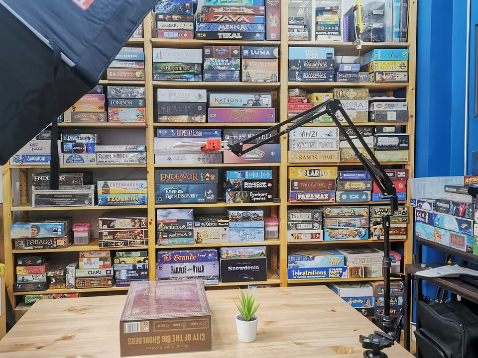
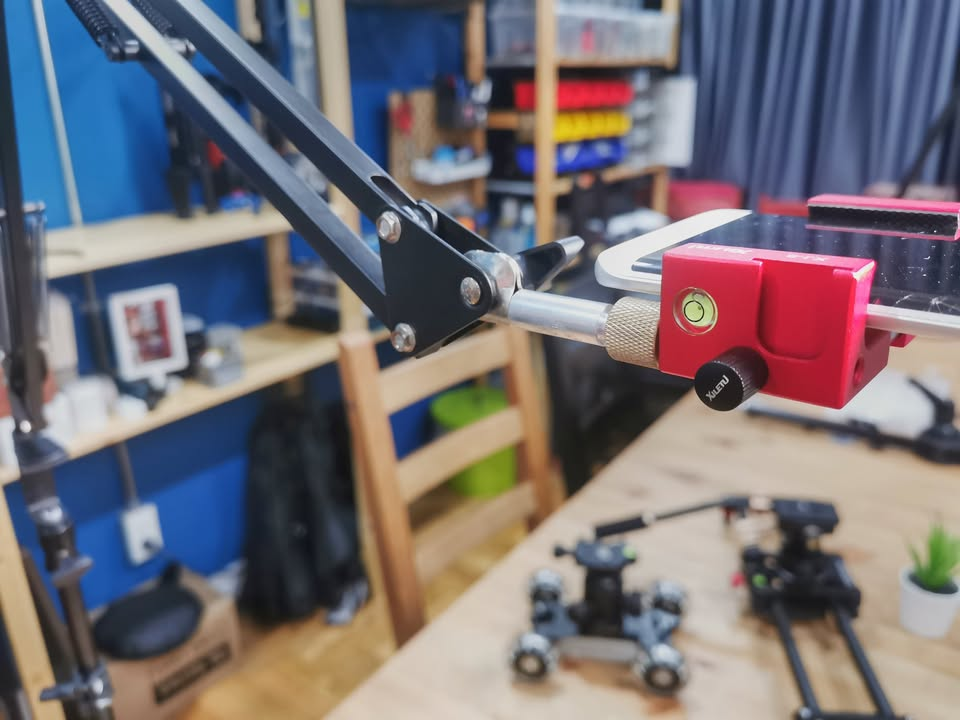
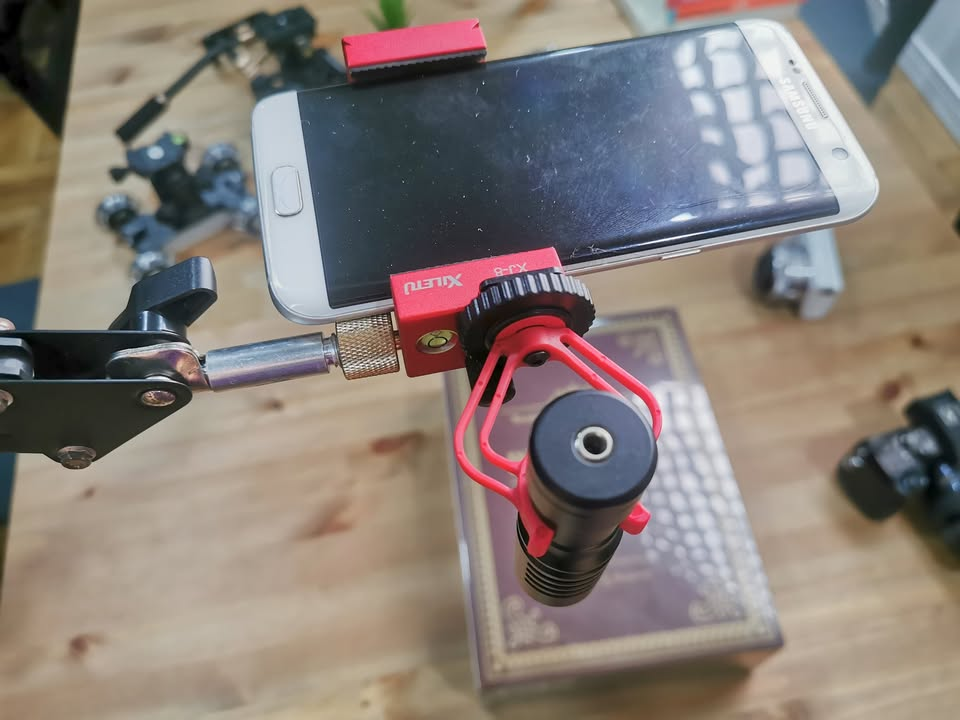

🔹 DIY อุปกรณ์ถ่ายคลิปแบบ Top-Down (มุมถ่ายลงขนานกับพื้น) งบหลักร้อย
 
#ช่วงแชร์ของเล่น  #ของฝากนักกอล์ฟ #เพื่อcreatorโดยcreator #ไม่ค่อยเกี่ยวกับบอร์ดเกมเท่าไร

🔹 เนื่องจากมีคนหลังไมค์มาถามสองสามคนว่าผมถ่ายคลิปแบบ overhead (top down) ตอน unbox ยังไง ก็เลยคิดว่าน่าจะเอามาแชร์แลกเปลี่ยนกัน เผื่อใครอยากลองเอาไปใช้ หรือมีอะไรมาแนะนำ เพราะคิดว่ามันก็เป็นมุมที่ถ่ายคลิปเล่นเกม,สอนเกมที่ได้ใช้บ่อย  
 
 
🗯 อันนี้ต้องบอกก่อนว่าผมไม่มีพื้นฐานอะไรเลยกับพวกอุปกรณ์พวกนี้หรือคุ้นเคยกับการถ่ายรูปแต่อย่างใด ก็ลองเปิดหาดูคลิปกับลองซื้อมาเล่นตามชาวบ้านดับความอยากรู้ไปเรื่อย เพราะงั้น......"ถ้าผมทำได้คุณก็ทำได้"  ก็หวังว่าอาจจะช่วยประหยัดเวลาให้คนอื่นได้ แต่ถ้าใครมีทริคอะไรก็แนะนำได้ฮะ
 
  
🔹 ในกรณีของผมจะใช้สิ่งที่เรียกว่า boom arm กับขาตั้งไฟอันใหญ่ พูดในง่ายๆก็มีขาตั้งแล้วหาอีกแกนมาวางแนวนอน ซึ่งข้อดีคือมันใช้กับกล้องตัวใหญ่ได้ (ซึ่งผมไม่มี...ฮา) แต่ว่าราคารวมมันก็หลักพันอยู่แถมค่อนข้างเกะกะใช่เล่นเดินชนตลอด (ซึ่งไอ้หลักพันนี้แค่สนองความอยากรู้อยากเห็นเฉยๆ ไม่ได้จำเป็นสำหรับที่ใช้หรอก เปลืองชิบหาย...บอกเลย) อ่านวิธีหลักร้อยย่อหน้าต่อไป
 
 
🔹 แต่ผมมีวิธีหลักร้อยที่ใช้งานได้ดีพอกันมาแชร์ เท่าที่ทดสอบรับน้ำหนักได้ราวๆ 700-900 กรัม (ใช้กับ Rode PodMic ที่เห็นผมใช้ในคลิปช่วงหลังๆ อันนั้นหนัก 900 กรัม) ซึ่งเหลือเฝือสำหรับมือถือและกล้อง mirror less ทั่วไป แต่ถ้าใช้เลนส์หนักมากๆก็ไม่ไหวนะ
 
 
🔹 สิ่งที่ต้องมี version 1 (Basic)
 .
▪️ suspension arm สำหรับไมค์ (shopee ฿160 - ฿250) 
 .
▪️ หัวแปลงเกลียว 3/8 ไปเป็น 1/4  (shopee ฿50 - ฿60)
 .
▪️ ถ้าใช้มือถือก็ต้องมีตัวจับโทรศัพท์ ใช้อะไรก็ได้แต่ส่วนตัวผมแนะนำแบบเป็นเกลียวจับ ไม่ใช่แบบหนีบที่ขายกันทั่วไป เพราะจะใช้งานสะดวกกว่า ถ้ามีงบแนะนำให้ออกตัวที่ผมใช้อยู่ เพราะมีสามรูให้เสียบอย่างอื่นเพิ่ม แถมมีช่อง cold shoe ไว้เสียบไมค์หรือไฟด้วย เอาไปต่อกับไม้เชลฟี่ก็ได้ คือดีย์ อันนี้แนะนำ มี Ulanzi ST-2S กับ XILETU XJ-8  search ใน aliexpress จะอยู่แถวๆ 2xx-3xx 
   
 
🔹 คือด้านปลายของที่จับไมค์มันจะเป็นหัว 3/8 เราก็เอาเกลียวใส่แล้วก็เอาเอาที่จับโทรศัพท์ ที่เป็นเกลียว 1/4 ไปใส่ก็ใช้ได้ล่ะ จบ ซึ่งรูขนาด 1/4 นี้รูครอบจักรวาลที่อุปกรณ์กล้องทั่วไปเค้าใช้กัน
 
 
🔸 ซึ่งตัวแปลงนี้จะมีขายอยู่สองแบบคือแบบที่เป็นเหล็กชิ้นเดียว กับแบบที่เป็นตัวแปลงเสียบไปมา ใช้ได้ทั้งคู่แต่ส่วนตัวชอบแบบที่เป็นเหล็กชิ้นเดียวมากกว่าเพราะมโนว่าอุ่นใจกว่า แต่ไอ้แบบแปลงหัวไปมาได้นี้ก็โคตรสารพัดประโยชน์มาก
 
 
🔸 แต่ข้อจำกัดของวิธีนี้คือมันอาจจะยกสูงไม่พอสำหรับถ่ายให้ทั่วกระดาน ถ้าวิธีง่ายๆหน่อยก็อาจจะหาอะไรที่สูงว่าโต๊ะที่เราใช้มาหนีบเพื่อยกระดับ แต่ถ้าอยากได้อะไรที่ยืดหยุ่นกว่านั้นก็จะมี version 2 ที่ DIY ขึ้นอีกนิด (หรือจะหนีบกับโต๊ะแล้วเราไปถ่ายบนพื้นแทนก็ได้นะ แต่ต้องเพิ่มเรื่องแสงไฟซักหน่อย)
 
  
🔹 สิ่งที่ต้องมีเพิ่มใน version 2
.
▪️ ขาตั้งไฟ (สูงสองเมตร ราคาประมาณ shopee ฿250 ) ที่ไม่แนะนำแบบสูงแค่ 75cm เพราะราคาต่างกันไม่มาก และขามันจะสั้นทำให้กระจายน้ำหนักได้ไม่ดีเท่า แต่ถ้าสะดวกวางถุงทรายก็ไม่เป็นไรมั้ง
.
▪️ ที่สวมเปลี่ยนหัวเสียบไฟ 5/8 เป็น 1/4 (อันนี้ผมไม่แน่ใจว่าจะหาในไทยจาก keyword ไหนเพราะใน Amazon เรียก Rapid Baby Adapter 5/8 Inches (16mm) Stud with 1/4 Inches-20 Male Thread แต่ผมสั่งจาก aliexpress เดี๋ยวลงลิงค์ไว้ด้านล่าง)
  

🔹 ที่ต้องทำก็แค่เอาหัวที่ว่าเสียบไปบนขาตั้งไฟ แล้วก็ดัดแปลงที่หนีบของขาไมค์นิดนึงเพื่อให้มันเสียบลงไปได้ จากนั้นก็เอาน๊อตหกเหลี่ยมมาขันให้แน่น
 
 
🔹 อันนี้ต้องออกแรงหน่อยคือตรงเกลียวที่เอาไว้ไขให้หนีบกับโต๊ะของขาไมค์เนี่ย มันจะมีน๊อตขันแน่นกับตัวแป้น ซึ่งมันเชื่อมกันหลวมๆด้วยแหวนเล็กๆ  ผมจะค่อยๆเอาไขควงปากแบนถ่างและใช้คีมปากจิ้งจกแงะมันออกมา ตัวแป้นกลมกับตัวน๊อตมันจะแยกออกจากกันได้ ข้อดีคือถึงแม้จะแยกกันแล้วเราก็ยังสามารถเอามาวางประกบกันเพื่อใช้งาน function เดิมได้สบายๆ
 
 
🔹 อุปกรณ์หลายอันพอรวมราคาแล้วเหมือนจะแพงแต่จริงๆแล้วมันเอาไปใช้ต่อได้หลายอย่างไม่มี function เฉพาะ จริงๆสำหรับผมเรียก set นี้ว่าฟรีเลยก็ได้ เพราะทุกอย่างนี้ผมมีอยู่แล้ว โดยมาจากของที่ซื้อมาทำอย่างอื่นอีกที (ขาไมค์เอามาจากชุดไมค์ BM-800 ซื้อมา 450 ได้ทั้งไมค์ทั้งขาไมค์ ส่วนขาตั้งไฟก็มีอยู่แล้วเพราะเอาไว้วางไฟ) 
 
 
🔹 ขาตั้งไฟนี้ข้อดีคือถ้ามาขนาดนี้เอาไปใช้ได้อีกเยอะอย่างโคตรๆ กับด้วยทริคเดียวกันนี้เราเอาไปใช้เป็นขาตั้งไมค์ต่อได้อีกต่างหาก (BoardCast ใช้นอกสถานที่อยู่สองตอน ก่อนจะเปลี่ยนไปหนีบกับเก้าอี้แทนเพราะขี้เกียจแบกขาไฟไปข้างนอก)  ถ้าเพิ่มหัวบอลไปก็จะช่วยให้ปรับมุมได้ง่ายขึ้นอีก
  
 
📢 ถ้างงก็บอกล่ะกัน อาจจะทำเป็นคลิปมาให้ดูครับ
  
 
📢 เกลียวพวกนี้มันมีใช้บ่อยๆ 3 ขนาดเผื่อจำสับสนมาตรฐานโลกเก่าที่ไม่ยอมเปลี่ยนไปใช้มาตรฐานเมตริก
.
▪️ 1/4 - มักพบได้ทั่วไปตามฐานกล้องถ่ายรูปและขาตั้งกล้อง
. 
▪️ 3/8 - มักพบได้ในรูเสียบไมค์ขนาดเล็ก และขาตั้งกล้องที่ที่รับน้ำหนักเยอะ
. 
▪️ 5/8 - มักพบได้ในรูเสียบไมค์ขนาดใหญ่
.
จริงๆมันมีเรื่องขนาดและความถี่ของเกลียวด้วย แต่ส่วนมากปัญหานี้จะเจอในขนาด 5/8  

 
❗️link ที่ลงนี้ผมไม่ได้ตังนะ และราคาก็ไม่ได้ถูกที่สุด หรือเคยซื้อแต่อย่างใด (ส่วนมากผมกดจาก Aliexpress) แค่กด search เร็วๆหาเอารูปให้ดู รบกวนหาที่ถูกใจถูกตังเอาเอง
 
 
▪️ขาไมค์แบบสปริงค์ :
https://shopee.co.th/buybuytech/1536748863
.
▪️3/8 to 1/4 แบบชิ้นเดียว:
https://shopee.co.th/witcamera1688/2496906198  
.
▪️ตัวแปลงเกลียวแบบจับฉ่าย:
https://shopee.co.th/hefeizhuju.th/2614984881
.
▪️ ขาไฟ:
https://shopee.co.th/newsingsing/1755618732
.
▪️ Rapid Adapter 5/8 to 1/4:
https://www.aliexpress.com/item/32978772561.html

