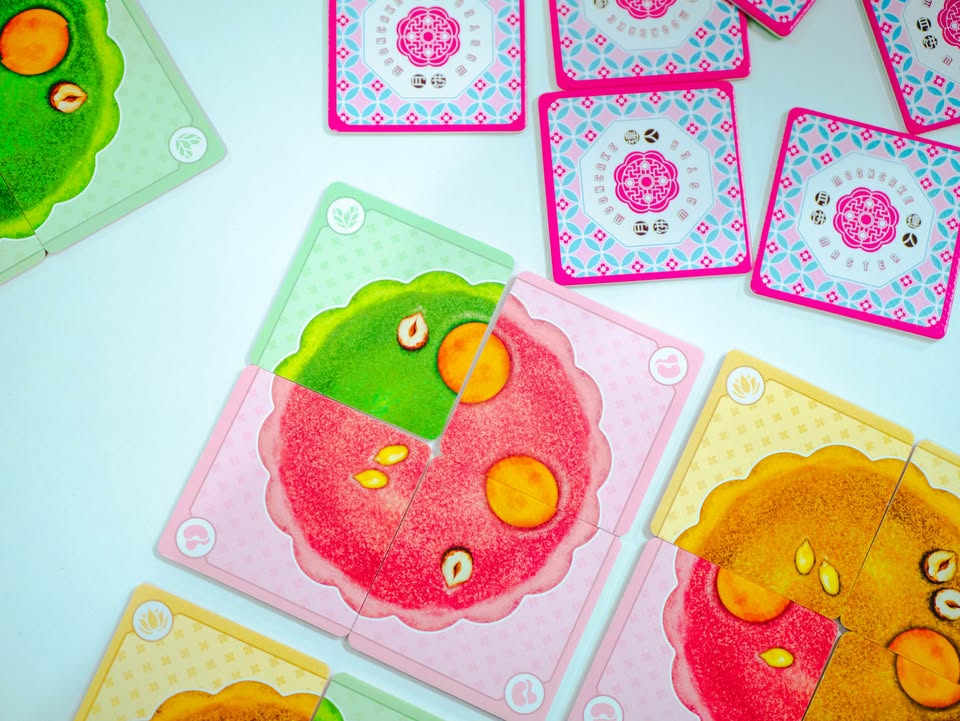
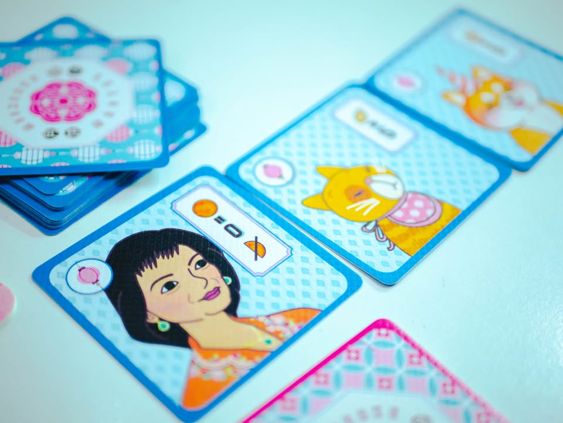
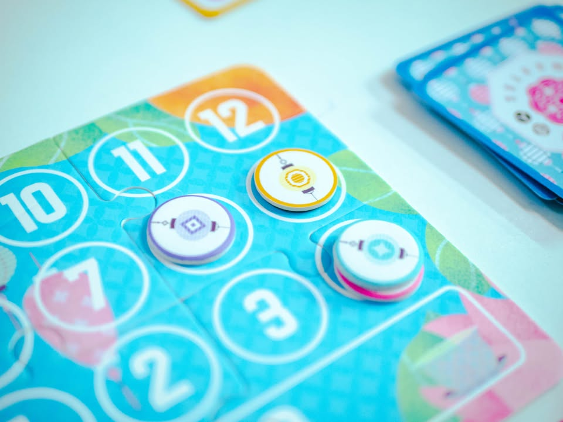
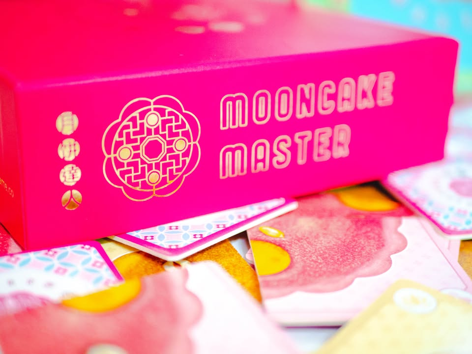

🌙 Mooncake Master #bite_size

▪️เกมเบาระดับคั่นเวลาระหว่างสั่งกาแฟแล้วรอเค้าทำมาส่ง
 
 
▪️ไอเดียคือเราต้องทำขนมไหว้พระจันทร์สามชิ้น แต่ล่ะชิ้นจะเกิดจากไทล์เล็กๆสี่อัน ถ้าประกอบแล้วได้ตรงสี หรือมีไข่แดงครบลูก หรือมีเมล็ดแตงโมหรือเฮเซลนัทตามเงื่อนไขก็จะได้แต้มความอร่อยแตกต่างกันไป ซึ่งแต้มความอร่อยจะเป็นตัวกำหนดอีกทีว่าเราจะได้ 'แต้มเทศกาล' ซึ่งเป็นแต้มจริงๆที่ใช้วัดแพ้ชนะเท่าไร (ใครเคยเล่น Millennium Blades ก็แบบนั้นแหละ)
 
 
▪️ตานึงเล่นแค่จั่วมาสามไทล์ เลือกเก็บไว้เองใบนึง ที่เหลือส่งให้คนทางซ้ายและขวา เปิดมาพร้อมกันแล้วก็จัดเรียง มีกิมมิคว่าจะมีการจั่วลูกค้าที่จะมาคอยบอกเงื่อนไขว่าถ้าขนมของเราชิ้นไหนได้ตรงตามเงื่อนไขก็จะได้แต้มเพิ่ม
 
 
▪️ตอนเล่นจริงไม่ได้วางแผนอะไรมากเพราะไม่รู้ว่าใครจะส่งอะไรมาให้ (หนึ่งรอบย่อยจะได้เลือกเอง 4 ไทล์ ส่วนอีก 8 ไทล์นี้เพื่อนข้างๆจะยัดมาให้) ส่วนมากก็เน้นเก็บของที่ตัวเองอยากได้แล้วที่เหลือแล้วแต่ดวงว่าเพื่อนจะทิ้งอะไรมาให้ พอให้คนเล่นมีภาพลวงตาว่าได้กำหนดชะตากรรมเพื่อนพอกรุบกริบ ก็พอมีอะไรขำๆเล่นระหว่างรอกาแฟมาส่ง 
 
 
▪️อนึ่งกล่องสวยดี วางไว้บนชั้นขนมนี้มีหยิบผิดแน่ๆ 

 
📌 ช่วงนี้เขียนเกมที่เหมือนจะนอกแนวทางปกติหน่อยนี้ไม่ใช่อะไร แค่อยากหัดถ่ายรูปกับอยากเล่าถึงเกมประเภทที่ปกติขี้เกียจเขียนในแง่มุมเบาๆบ้าง แบบเดิมก็ยังทำอยู่นะ

