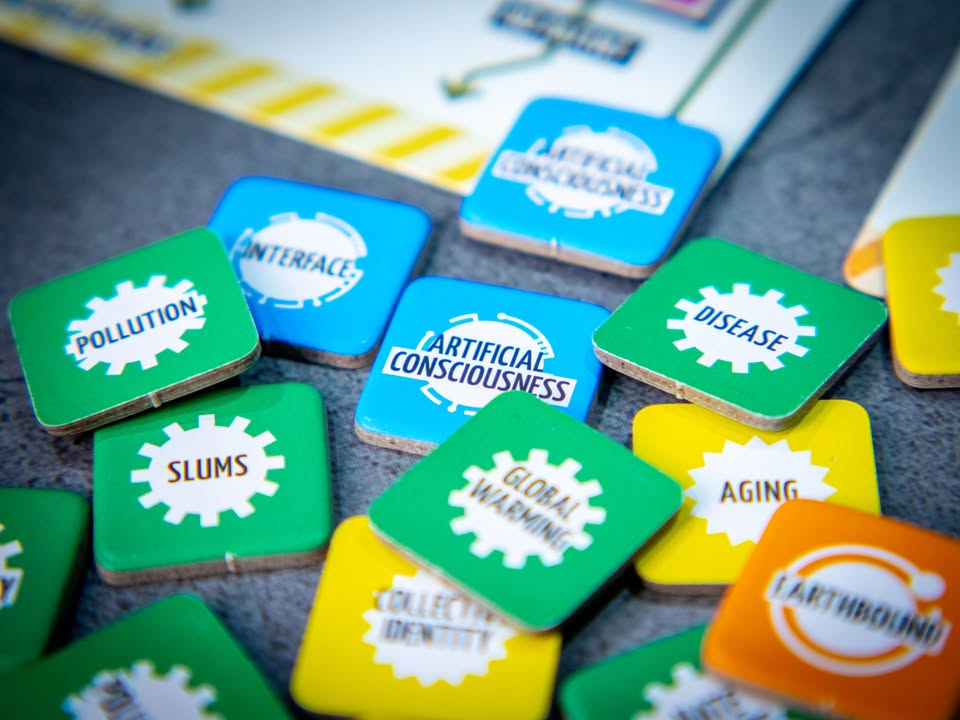
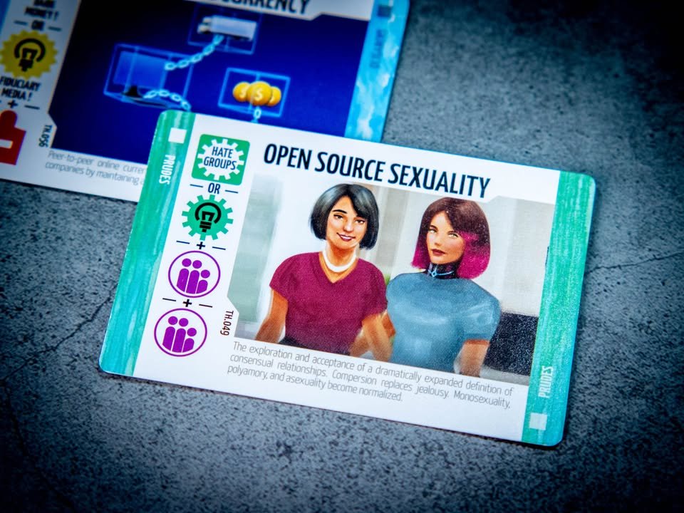

Pax Transhumanity: บทใหม่แห่งมนุษยชาติ #thought
blog link: https://wp.me/p7TSgy-2Pf

▪️เกมในซี่รี่ย์ Pax จากค่าย Sierra Madre Games ที่จะพาเราไปสำรวจโลกแห่งอนาคต ว่าหากวิทยาการที่มีอยู่สามารถก้าวหน้าไปได้อีกมันจะนำพามนุษย์ไปสู่แห่งหนใด และเราคือผู้นำพาบริษัทในเวลาอันใกล้ที่จะมาช่วยพัฒนาชีวิตของมนุษย์ในโลกยุคต่อไป ผลงานของ Matt Eklund (ลูกชายของ Phil Eklund , Pax Porfiriana, Pax Renaissance )
 
 
🖋 "เรานั้นหรือคือสถาปนิกแห่งพรุ่ง หาใช่ผู้เคราะห์ร้ายแห่งโชคชะตา" – R. Buckminster Fuller—
 
 
📌 อนึ่งข้อคิดเห็นนี้อคติเยอะเพราะผมเป็นติ่งค่าย และเกมของค่ายนี้เป็นเกมสไตล์ Opaque ที่มีความซับซ้อนของกติกาที่เกิดจากแต่ล่ะส่วนมีการเกี่ยวโยงกันไปมา การอธิบายสิ่งหนึ่งมักจะต้องอธิบายสองอย่างตามมาเสมอเลยอาจจะเขียนอะไรที่ดู Overview เยอะหน่อย
 
 
▪️ไอเดียหลักของเกมคือการที่เราซึ่งเป็นบริษัทเกิดใหม่ที่พยายามนำเสนอไอเดียและพัฒนาแนวคิดเพื่อช่วยแก้ปัญหาให้กับโลก ซึ่งการจะผลักดันแนวคิดออกมาเป็นสินค้าได้ เราต้องเริ่มตั้งแต่ออกเงินลงทุนในไอเดีย รวมไปถึงพัฒนาสิทธิ์บัตรที่ทำเป็น และยังต่อข้ามผ่านแรงต้านจากปัญหาภายนอกในพื้นที่การลงทุน
 
 
▪️แกนของเกมเป็นการแตกสายมาจาก Pax Emancipation อีกที โดย 'เงิน' ของเราจะมาในรูปของ cube บนบอร์ดที่นอกจากจะมีสภาพเป็นเงินแล้วเรายังต้องส่งมันออกไปเป็น 'คนงาน' เพื่อจับจองไอเดีย จากนั้นก็เตรียมการส่งคนไปพื้นที่เพื่อทำการผลิต 'งาน' ซึ่งงานก็จะนำไปสู่การวิจัยและการนำไอเดียมาเป็นการค้าอีกที
 
 
▪️ความซับซ้อนระดับแรกของเกมคือการที่เราจะต่อยอดไอเดียที่เราจองไว้ให้ใช้งานได้จริงเนี่ย มันต้องเตรียมตัวมาก่อนไม่ว่าจะต้องทำการวิจัยเอง หรือว่าจะต้องสะสมสิทธิบัตรเก็บเอาไว้ หรือไม่ก็ต้องรอให้ 'สังคมมนุษย์' ที่ได้รับการพัฒนาจนมีพื้นฐานความพร้อมที่จะเรียนรู้ไอเดียใหม่ๆของเรา ซึ่งการสั่งสมที่ว่าก็มาจากความรู้ที่ทำการผลิตมาจากรอบก่อนๆหน้านั้นเอง
 
 
▪️แต่การค้าที่เราพยายามทำมากลับไม่ใช่ปลายทางสูงสุด แต่เราทำเพื่อเล่นเอา effect การ์ดที่จะปรับเปลียนภูมิทัศน์ทางความคิดที่ต่อยอดไปสู่การสร้างยุคสมัยของมนุษย์ที่นำไปสุดจุดจบที่แตกต่างกัน 5 แบบ ซึ่งแต่ล่ะแบบนับคะแนนไม่เหมือนกัน! ตั้งแต่นับคะแนนจากผู้ที่แก้ปัญหาได้เยอะที่สุดไปจนถึงคนที่ลงทุนไปกับทิศทางของโลกได้ดีที่สุด
 
 
▪️ถ้าพูดแบบการ์ดเกมที่เวลาจะลงการ์ดใบนึงที่แทนที่จะจ่ายค่าร่ายแล้วใช้ effect เอาผล แต่ในเกมนี้การจะได้มาซึ่ง 'ค่าร่าย' จะมีความซับซ้อนโดนแยกออกเป็นอีกเกมหนึ่งได้เลย
 
 
▪️ซึ่งตรงนี้ฉากจบนี้ก็นับเป็นหัวใจของ Series Pax มานาน ที่เราปั้นเกมมาจากความไม่รู้อะไร จนไปถึงกลางเกมเราค่อยหาทางปรับจุดจบให้เข้ากับจุดแข็งของเรา หรือถ้าทำไม่ได้ก็ต้องปรับตัวให้เข้ากับจุดจบที่กำลังจะมาแทน
 
 
-------------------------------------------------------
[🐸 Family, เหล่านักคิดผู้มองไปยังอนาคต]

🔹 ผมชอบคำกล่าวของ Daniel Thurot (Bgg user ที่เป็นติ่งค่ายนี้อีกคนหนึ่ง) ที่พูดถึงเกมซีรี่ย์นี้ว่า "มันคือขุมสมบัติสำหรับคนที่ชอบที่จะใช้เวลาทั้งคืนไปกับการกดลิงค์สีฟ้าใน Wikipedia จากหัวข้อหนึ่งไปสู่อีกหัวข้อหนึ่ง"
 
 
🔹เช่นเดียวกับทุกเกมที่ออกมาจากค่ายนี้มันเป็นเกมที่ผมสนุกไปกับมันไม่ใช่เพียงเพราะตัวเกม แต่มันรวมไปถึงแนวคิดที่สอดแทรกอยู่เต็มที่ในทุกจุดของกติกาและแอคชั่น เป็นเกมที่ผมอ่านคู่มือช้ามากเพราะมั่วแต่สนุกไปกับการอ่านเชิงอรรถและจมไปกับความรู้ที่ไม่ได้จำเป็นต้องรู้ซักนิดในการเล่นเกมที่กำลังอ่านอยู่ (ซึ่งเป็นส่วนหนึ่งที่ทำให้ผมชอบเกมค่ายนี้เป็นพิเศษ และก็เป็นข้อเสียที่หลายคนพากันติ)
 
 
🔹 หัวใจหลักของเกมจะอยู่ที่ 'ตลาด'ความคิดที่อยู่ในเกม เพราะนอกจากเราจะต้องคิดว่าเราอยากได้ effect อะไรแล้วเราต้องไปดูว่าเงื่อนไขการเคลมคืออะไร เราสามารถทำได้ไหม และในแต่ล่ะเงื่อนไขเราก็ต้องเตรียมทางเอาไว้ล่วงหน้าก่อน ความสนุกหลักของเกมเลยมาจากความเกี่ยวเนื่องปูทางความคิดเพื่อทำความสามารถการ์ด แต่ว่าตัวการ์ดเองก็อาจจะไม่ทำให้เราชนะถ้าเราไม่ได้เปลี่ยนเงื่อนไขจบเกมให้เข้ากับส่งที่เราปูทางไว้ อย่างเราลงทุนตั้งบริษัทที่ออกผลิตภัณฑ์เกี่ยวกับการแพทย์ไว้มากมาย แต่คนในโลกเค้าสนใจในเทคโนโลยีปัญญาประดิษฐ์ เราก็จะไม่มีแต้มในตอนจบเกม ซึ่งทิศทางของโลกก็คือสิ่งที่ผู้เล่นในวงร่วม (แข่งขัน) กันวิจัยพัฒนาเทคโนโลยีใหม่ๆสู่ตลาดและคนที่ทำบ่อยกว่าก็จะกลายเป็นผู้กำหนดทิศทางของโลก (ที่มีผลต่อแต้ม)
 
 
🔹 ถ้าพูดแบบกว้างๆหน่อยเกมนี้คือเกมเก็บการ์ดสี เราอยากได้ไทล์สีฟ้า ก็ต้องมองหาการ์ดที่มีแถบสีฟ้า แต่มันอาจจะไม่มีแค่สีเดียวแต่การสองสี แล้วเราก็ต้องไปหาสีตรงกันมาจ่ายซึ่งเกิดจากการเอาการ์ดพวกนั้นไปทำอีกกระบวนการหนึ่ง ซึ่งก็เตรียมการหลายขั้นตอนอยู่ เสร็จแล้วทำได้เยอะๆไม่พอต้องทำแล้วปั่นเกมให้มันไปทางที่เราชนะด้วย
 
 
🔹 ข้อดี/ข้อเสีย ถ้าเทียบกับ Pax Series อื่นคือ learning curve ค่อนข้างต่ำเทียบกับเกมอื่นในซี่รี่ย์ การ์ดในตลาดจะนิ่ง ไม่ใช่เปลี่ยนไปมาอย่างรัวเร็วจนซื้อไม่ทัน ถ้าข้ามเรื่องการเขียนกติกาไปก็เป็นเกมที่มีความเป็นเกมสูงมากไม่มีส่วนไหนที่เรียกได้ว่าเป็น simulator เหมือนเกมเก่าๆของค่าย
 
 
🔸 จุดที่คล้ายกับเกม Series Pax อื่นคือมันเป็นเกมสไตล์ที่เราไม่มีเป้าหมายอะไรในชีวิตตรงหน้าเท่าไร เป็นเกมแบบเล่นไปเรื่อยๆงงๆทำสิ่งที่พอจะทำได้ พอไปกลางๆเกมค่อยหาวิธีดึงเอาเงื่อนไขชนะมาหาตัวเองอีกที ตรงนี้ก็อาจจะเป็นจุดที่ทำให้หลายๆคนไม่คลิกกับเกมนี้นัก (แต่ส่วนตัวแล้วตรงนี้ไม่ใช่ปัญหาของผมนะ) จุดร่วมอีกอย่างคือเล่นครั้งแรกจะนานหน่อย แต่พอเล่นรอบสองสามแล้วเกมจะค่อนข้างเร็วจบในราว 60-90 นาทีถ้าไม่ AP นะ
 
 
🔸 โครงสร้างในเกมจริงๆไม่ได้ยาก ค่อนข้างเป็นเส้นตรงด้วยซ้ำ แต่ว่าการที่เราจะทำแอคชั่นปลายทางได้มันจะต้องเตรียมการผ่านระบบย่อยหลายอย่าง โดยที่แอคชั่นนั้นอาจจะไม่ทำให้เราชนะก็ได้ และด้วยที่มีขั้นตอนหลายอย่างถ้าเราไม่ตั้งใจเพียงพอก็อาจจะเกิดอาการ 'หลุด' ขึ้นมาได้ แต่ด้วยความที่แต่ล่ะขั้นตอนมันไม่จำเป็นต้องต่อเนื่องกันถ้าหลุดก็แค่มองหาทิศทางต่อยอดจากที่ทำมาแล้วได้สบายๆ
 
 
🔸 แต่แน่นอนถ้ามองจากด้านนอกเข้ามาแล้วเกมนี้มีข้อเสียเยอะมาก โดยชิ้นใหญ่คือ กติกาที่อ่านค่อนข้างยากเนื่องจากไม่สามารถอธิบายภาพรวมของเกมได้ดีพอ แต่กลับเต็มไปด้วยรายละเอียดของการทำแอคชั่นแทน แล้วเราจะมองไม่ออกว่ามันจะมาประกบติดกันได้อย่างไร ทำให้เวลาอ่านเห็นภาพยากว่าเกมมันเล่นยังไง เป็นคู่มือแบบบอกว่า How แต่ไม่บอกว่า Why
 
 
🔸 ข้อเสียลำดับต่อมาน่าจะเป็นเรื่องธีมที่อาจจะคิดตามยากซักหน่อยเทียบกับ Pax อื่นเพราะเป็นเรื่องการวิจัยไอเดียเอาคิวป์ไปวาง เอาสีมาเก็บ ถ้าเทียบแล้วลองนึกถึงเล่น Terraforming Mars แบบไม่มีกระดานวางไทล์เมืองไทล์ป่าดู ฟิลลิ่งทางเทคโนโลยีก็จะแนวๆนั้นแหละ ถ้าไม่ใช่สายอ่านการ์ดอ่านรูปอาจจะมองธีมไม่ออก แต่ถ้าอ่านรูลแบบไล่อ่าน footnote มาจะให้ความรู้สึกเค้าถึงที่เค้านำเสนออยู่นะ
 
 
👁‍🗨 ข้อสังเกตุอีกอย่างคือเกมค่ายนี้จะไม่เหมาะกับสาย competitive จ้าๆแบบมูฟต้องเป๊ะนักเพราะมันมีพื้นที่กลวงเปล่าที่ต้องลองเข้าไปเดินดูซักหน่อย จะเหมาะกับสาย casual heavy euro มากกว่า
 
 
💭 ซึ่งก็เช่นเคยที่แม้ผมจะชอบเกมค่ายนี้แต่ผมไม่คิดจะคะยั้นคะยอให้ใครเล่นเกมค่ายนี้นะถ้าไม่รู้ว่ากำลังจะเจออะไร (ยกเว้น Pax Pamir 2nd ของ Cole Wehrle ที่ทำมาคลีนมาก) แต่ในหลายๆแง่แล้วเกมนี้นับได้ว่าเป็น Pax แบบอ่านยากที่ผู้เล่นฝั่งยูโรน่าจะเข้าถึงได้ง่ายที่สุด โดยเฉพาะคนที่ชอบเล่นเกมสไตล์ interlock เยอะแบบ Vital Lacada เป็นเกมที่ถ้าเล่นเป็นแล้วจะไม่ยากอย่างที่คิด เหมือนฟันเฟื่องที่กระจัดกระจายแต่พอมาประกบติดกันแล้วดันขับเคลื่อนไปด้วยกันอย่างไม่มีสะดุด

----------------------------------------------------------
Compatible Level - เกมนี้เข้ากับคนเขียนได้ระดับไหนนะ!!

🐸 Family, อาจจะมีช่วงเวลาที่ไม่เข้าใจกันบ้างแต่ครอบครัวคือสิ่งที่จะอยู่กับเราตลอดไป นี้คือเกมที่จะมีพื้นที่ถาวรในชั้นวางแน่นอน!! แม้บางเกมจะเปรียบดั่งคุณปู่ใจดีที่ได้เจอกันแค่ปีล่ะครั้ง แต่อันดับในใจนั้นคือความสนุกในช่วงเวลาที่เล่น หาใช่การได้เล่นซ้ำไม่รู้เบื่อเพียงอย่างเดียว [ex. กบโปรด, กบชอบ]

🐸 Hang out friend, เพื่อนกินเที่ยว ถ้าไม่ติดธุระอันใดก็พร้อมจะออกไปพบเจอ สนุกยามได้พบปะ แต่จะให้เจอกันบ่อยๆคงใช่ที - เกมสนุกที่อยากเล่นในระดับที่อยากจะหยิบกางเป็นบางครั้ง สลับสับเปลี่ยนไปเรื่อยตามจังหวะและโอกาส แต่เราก็ไม่ได้อยากซ้ำต่อเนื่องรัวๆ [ex. กบโอเค]

🐸 Someone I know, หากบังเอิญพบเจอ ก็คงได้ทักทายไต่ถาม หากแต่ในยามปกติมิอาจนึกชื่อออก ยืนคุยก็ได้ แต่คงไม่ได้เอื่อนเอ่ยนัดกินข้าว - บางเกมเราก็ไม่ได้อยากชวนเล่น แต่ถ้าไม่มีอะไรทำแล้วมีคนชวนก็เล่นก็ได้ [ex. กบเฉย]

🐸 I Turn left, You Turn Right - เธอชอบกินเผ็ด เราชอบกินอาหารญี่ปุ่น เธอชอบคนคารมดีพาไปกินที่หรู แต่เราชอบเล่นเกมอยู่กับบ้าน แม้จะได้คุยเป็นบางคราแต่คงไม่อาจพัฒนาความสัมพันธ์ - บางเกมแม้ว่าจะดีแค่ไหน แต่ถ้ารสนิยมมันไปด้วยกันไม่ได้ก็ไม่รู้จะเล่นไปทำไม [ex. กบไม่เล่น]

อนึ่ง : เป็นความรู้สึกในความ "อยากจะหยิบมาเล่นไหม?" ของผมเอง ไม่ได้เกี่ยวอะไรกับคุณภาพของเกม ไม่อิงมาตราฐานอื่นใดนอกจากตัวเองเท่านั้น ดูให้เป็นแค่ "อีกความคิดเห็นหนึ่ง" เท่านั้นก็พอนะครับ :)

