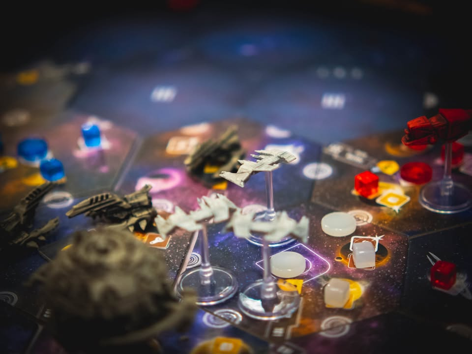
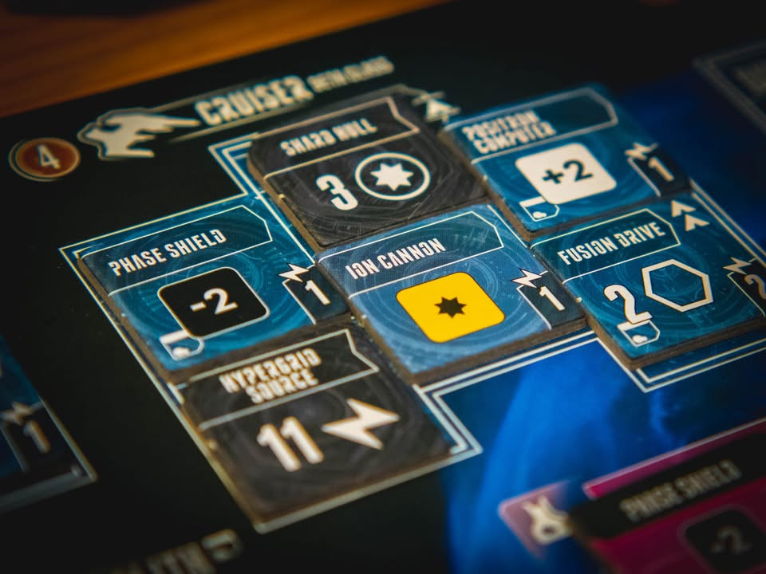

Eclipse: Second Dawn for the Galaxy #not_a_review

▪️เนื่องจากผมเคยเขียนเกี่ยวกับฉบับตีพิมพ์ครั้งแรกไว้แล้ว คงไม่เขียนซ้ำ เลยจะขอเขียนสรุปส่วนที่แตกต่างพร้อมข้อเสนอแนะกับคนที่สนใจครับ
 
 
▪️ข้อเขียนเกี่ยวกับฉบับพิมพ์ครั้งแรก Eclipse: สงครามอวกาศ - https://wp.me/p7TSgy-2y6
 
 
▪️โดยภาพรวมแล้วเกมนี้มี Direct Conflict สูงอันเกิดจากการต่อสู้และแย่งชิงพื้นที่ สัดส่วนของดวงมีสูงเนื่องจากการใช้ลูกเต๋าแบบมีการจัดสรรเทคโนโลยีเพื่อลดดวง (หรือแก้ทางการลดดวงของฝ่ายตรงข้าม) การเจรจาจะอยู่ในรูปแบบการเมืองผ่านอาวุธ ที่แต่ล่ะฝ่ายจะเลือกวิจัยและปรับแต่งยานของตัวเองเพื่อแก้ทางยานของอีกฝ่าย และใช้เวลาเล่นขั้นต่ำอย่างน้อยสามชั่วโมง  ทักษะที่จำเป็นนอกจากดวงแล้วเกมยังเน้นการบริหารทรัพยากรที่มีอยู่จำกัดอย่างยิ่งยวด
.
แน่ล่ะว่ามันค่อนข้างห่างไกลจากคำว่าเกมสำหรับทุกคน อย่าลืมศึกษาข้อมูลก่อนนะครับ :)
 
 
📌 หนึ่งในคีย์สำคัญที่อยากสรุปไว้เลยคือ การมาของ 2nd edition ไม่ได้ทำให้ 1st edition ล้าหลังหรือเล่นไม่ได้แต่อย่างใดเพราะภาพรวมเกมไม่ได้เปลี่ยนไปมาก จะเน้นไปที่การปรับจูนเล็กน้อยตรงนั้นตรงนี้หลายจุดเป็นหลัก กติกาหลายจุดสามารถปรับใช้กับตัวแรกได้ทันที แต่ถ้าจะหาซื้อ 1st edition ก็ควรซื้อตัวเสริม Rise of The Ancient มาด้วย เพื่อปรับส่วนที่ไม่ balance บางจุดของตัวหลัก (ซื้อตัวเสริมอื่นด้วยก็ดี แต่ว่า Rise of The Ancient นี้ส่วนตัวคิดว่า The Must)
 
 
💬 ถ้าสนใจเกมนี้ควรเล็งซื้อ edition ไหน ?
.
👁‍🗨 ถ้ามีงบจัดตัว 2nd edition ก็ถือว่าจบในตัวดีครับ (แต่ยังทำเผ่าออกมาไม่เท่าตัวแรก) แต่ถ้าหา 1st edition + rise of the ancient + organized tray ในช่วง 3xxx - 5xxx บาทได้ก็ถือเป็นดีลที่ดีครับ (2nd แบบครบ set มี mini-expansion + human ship นี้ค่าเกมรวมส่งและภาษีเริ่มที่ 8xxx - 9xxx ) แต่ไม่แนะนำให้เล่นเพียง 1st edition โดดๆ เพราะถ้าไม่เก็ทว่าจะรับมือบางท่ายังไงอาจจะมี comment ทำนองว่าเกมมันหลุด balance เกินไป
 
 

💬 ถ้าคุณสนใจว่าต่างกันอย่างไร
.
👁‍🗨 โดยภาพรวมแล้วกติกาเกมไม่มีอะไรเปลี่ยนเลย จุดเปลี่ยนส่วนมากจะอยู่ในรูปแบบขนาดเล็กที่ทำให้เกมกระชับขึ้นเล็กน้อยและมีการปรับความสมดุลย์ขึ้นนิดหน่อย
.
..▪️ รวมเอาเทคโนโลยีและลูกเล่นจากตัวเสริมอันเก่ามาให้ตั้งแต่แรก (แต่ไม่ได้เอาเผ่าใหม่เข้ามาให้ ต้องรอตัวเสริมใหม่)
..▪️ปรับเพิ่ม/ลด ค่าวิจัยเทคโนโลยีที่เก่ง/อ่อน
..▪️ปรับ balance ไทล์อวกาศ ลดไทล์ที่คุณค่าต่ำออกไปเพื่อแก้ปัญหาเปิดไทล์เหงาๆ
..▪️ลดรอบการเล่นลงเหลือ 8 จากเดิม 9
..▪️ปรับกติกาให้หยิบ discovery ไทล์ได้ทันทีโดยไม่ต้องวาง disc
..▪️เพิ่มเทคโนโลยีพิเศษบางแบบ 
..▪️Missile ต้องจ่ายไฟเลี้ยง
..▪️ผ่านคนแรกได้เงินสองหน่วย
..▪️กติกาเรื่องคนทรยศ ที่ถ้าบินผ่านไม่จอดก็ไม่ถือเป็นการทรยศ
..▪️ เทคโนโลยีเพิ่มหน้าเต๋าไม่ได้ช่วยให้เราได้ยิงก่อน ทำให้ผู้เล่นต้องไปหาเอาจากการพัฒนาเครื่องยนต์ เป็นผลให้การเดินทางในเกมมีความสำคัญเพิ่มขึ้น
. 
. 
ส่วนพวก Cosmatic อย่างยานอวกาศของแต่ล่ะฝ่าย ถ้าคุณมี 1st edition แล้วคุณอาจจะยังพอหา Ship Pack 1 ที่ใช้โมเดลยานเดียวกันเป๊ะได้อยู่ (จากใจจริงผมไม่ชอบ design ยานเกมเลย ดูตลกๆ แต่ก็เอานะ) อย่างอื่นก็คือ Tray ที่ทำมาได้สวยงามดี ถ้ามี 1st edition แนะนำมากว่าให้หามาเพิ่มเพราะจะช่วยเรื่องเวลาในการเล่นและจัดเก็บเยอะมาก เนื่องจากเกมมีชิ้นส่วนการอัพเกรดยานอยู่เต็มไปหมด
 
 
👁‍🗨 จุดสำคัญคือการปรับแก้ 'Broken' aspect 'สำหรับมือใหม่' อย่าง Missile 
.
👁‍🗨 สำหรับคนที่เล่นแต่ภาคหลัก เราจะได้ยินเสียงบ่นเรื่องนี้กันมาก เพราะ Missile ในเกมนี้จะได้ยิงก่อน มีพลังรุนแรง และไม่จำเป็นต้องโมยานเพื่อรองรับอะไรเพราะไม่ต้องจ่ายไฟให้ (เกมนี้ยานต้องประกอบไปด้วยเครื่องจ่ายไฟ เครื่องยนต์ และปืน ซึ่งต้องมีพลังงานมาเลี้ยง) แค่วิจัยของแพงๆมาก็พร้อมบู๊ แน่นอนว่าวิธี counter มีมากมายสำหรับคนที่เล่นเป็น แต่ตรงนั้นไม่ใช่เรื่องสำคัญเท่าไรเพราะถ้าไม่ได้เตรียมตัวไว้ก่อนก็ถือว่าค่อนข้างจะโดนถล่ม 'เละ' อยู่
.
.
ซึ่งใน 2nd จะปรับโดย Missile ต้องจ่ายไฟแล้ว ทำให้ไม่สามารถละเลยการวิจัยเทคโนโลยีจ่ายไฟร่วมไปด้วยได้ (เพิ่มต้นทุน) และตัวเทคโนโลยี Missile เองก็แพงขึ้น เมื่อรวมกับรอบการเล่นที่ลดลงหนึ่งรอบทำให้ 'เวลา' ในการเอาของแรงไปอาละวาดลดลงเป็นอย่างมาก
.
.
ใน 1st+RotA จะมีเทคโนโลยีพิเศษที่ทำให้เรายิงสวนหรือต่อต้าน missile โดยเฉพาะ รวมไปถึงกติกาเล็กๆน้อยๆอย่าง missile ต้องจ่ายไฟก็สามารถเอามา patch เกมเดิมได้ทันที
 
 
💬 ถ้ามี 1st edition แล้วควรจะหา 2nd edition ไหม?
.
👁‍🗨 ในมุมความคุ้มค่าผมจะตอบว่าไม่ครับ มี 1st edition เกมมันก็สนุกครบแล้ว แต่ถ้า 'ก็อยากจะได้อ่ะ' ตัว 2nd ในฐานะคนกดราคา KS ออกของครบก็คิดว่าคุ้มค่าครับ (แต่ผมขาย 1st edition ไปก่อนหน้านานพอควรอยู่)

