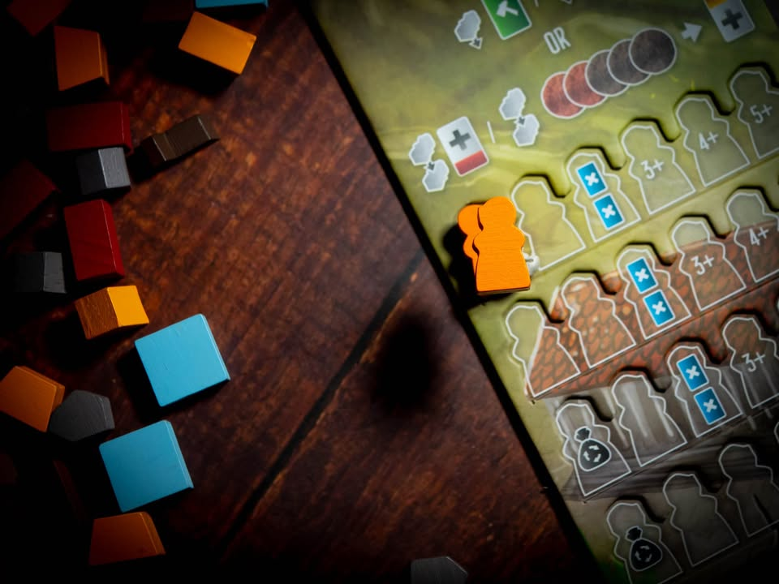

Age of Artisans #bite_size
blog link: https://wp.me/p7TSgy-2Ri  
.
สั้นๆล่ะกัน
.
ใครเล่น Architects แล้วชอบ ตัวเสริมนี้ถือเป็น no brainier จงไปซื้อซะ! นี้มันเกมตัวเติมที่โดนตัดออก (ผมไม่ได้มีส่วนได้ส่วนเสียกับยอดขายเกมของใครนะ ) 

  
▪️ แบบยาวหน่อย เกมเพิ่มโมดูลหลักมาตัวหนึ่งเป็นการ์ดชนิดใหม่ชื่อสมาคมช่างฝีมือ ซึ่งมีวิธีการซื้อหลักๆคือเอาคนงานเราไปซ้อนสองคนงานตัวเดิมที่ใช้สร้างตึกไปแล้ว (ในกล่องมีบอร์ดตึกใหม่ไว้วางทับของเดิมให้ด้วย) ตัวการ์ดใหม่นี้มีสองฝั่งที่เราต้องหยิบไปเสียบเพิ่มความสามารถลูกจ้างที่เราจ้างมา หรือเอาไปเสียบต่อเติมเพิ่มแต้ม(พร้อมโบนัสนิดหน่อย) ในตึกที่เราสร้างแล้วก็ได้
 
 
▪️ นอกจากการจำนวนผู้เล่นให้เล่นได้เพิ่มอีกคนแล้ว(กลายเป็นเกมหกคน) ก็เพิ่มคนงานชนิดใหม่ที่ตัวใหญ่กว่าเดิมมาให้คนล่ะตัว เอาไว้เวลาลงครั้งแรกให้นับสองตัวแทนที่จะเป็นตัวเดียว กับด้วยความเก๋าอย่างไรไม่ทราบถ้าเอาไปลงช่องที่ต้องเสียชื่อเสียงก็ไม่ต้องเสียอันนึงซะอย่างนั้น
 
 
▪️ สรุปว่าเพิ่มลีลาให้เล่นมากขึ้นอีกนิดโดยที่ไม่ได้เพิ่ม downtime อะไร คนงานตัวใหญ่นี้เป็นส่วนเสริมบางๆที่มีแล้วแอบฟีลกู๊ดเล็กๆเวลาโดนล้างช่อง ทำให้เร่งเก็บของที่จำเป็นมากๆได้ไวขึ้น ส่วนระบบสมาคมก็ทำให้เราอยากจะจ้างคนงานบ่อยขึ้น จากเดิมที่พอมีแค่ครบสามชนิดก็มักไม่อยากจ้างล่ะเพราะเวลาอัพเกรดแล้วมีแต้มเพิ่มพร้อมความสามารถเสริม
 
 
▪️ ที่รู้สึกว่าขาดคือส่วนสร้างวิหารยังแบนเหมือนเดิมคิดว่าตัวเสริมหน้าคงมาบวกตรงนี้ล่ะมั้ง
 

--------------------------------
หมวด Bite Size (พอดีคำ) นี้กะว่าจะเขียนอะไรสั้นๆประมาณนี้ล่ะกัน ใหม่บ้าง ซ้ำบ้าง เกมที่ขี้เกียจเขียนบ้าง เขียนๆไว้ก่อนเผื่อมีอารมณ์อาจจะขยายไปลง Thought บ้าง จริงๆอยากเขียนสั้นกว่านี้ แต่ยังอดไม่ได้ที่จะต้องอธิบายอะไรเพิ่มตามนิสัย เดี๋ยวค่อยๆปรับไปล่ะกัน

