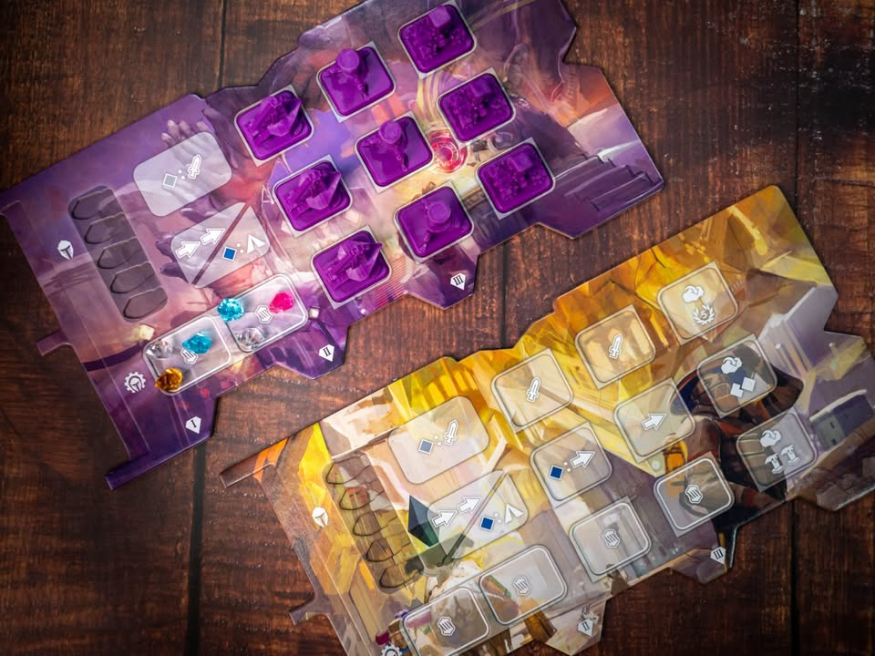
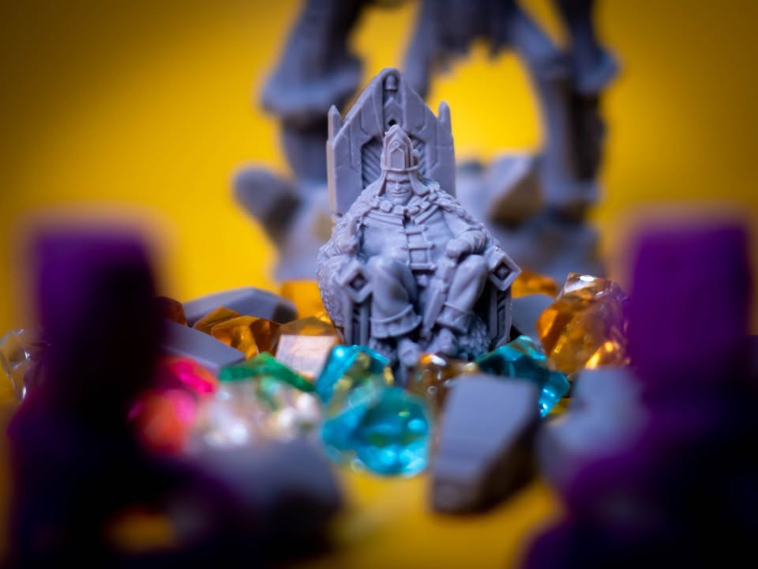
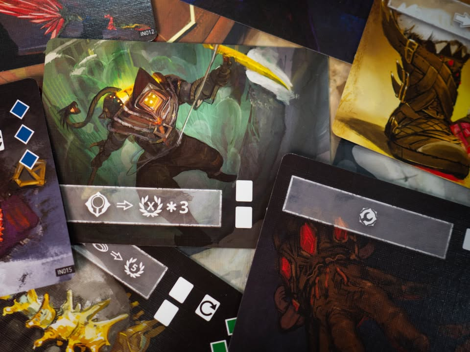

Icaion #thought
blog link: https://wp.me/s7TSgy-icaion

▪️ เกมยูโรระดับกลางในจักรวาลของ Mysthea  ที่เราคือเหล่านักสำรวจที่ได้รับการจ้างวานให้ท่องเข้าไปบุกเบิกดินแดน จัดตั้งเครื่องจักรกลเพื่อขุดค้นทรัพยากร กำจัดปรสิตที่กัดกินดินแดนรวมไปถึงบุกสำรวจสิ่งมีชีวิตลึกลับขนาดยักษ์ที่เดินท่องอยู่ในดินแดนเบื้องล่างแห่ง Icaion
.
.
▪️ แผนที่ในเกมจะแบ่งออกเป็นหลายโซนมี 5 ชนิดกระจายตัวกัน เชื่อมกันด้วยทางเดินตามรอยต่อของดินแดน แต่ล่ะรอบจะมีระบบที่จะ 'เติมของ' ซึ่งเป็นคริสตัสสีตามพื้นที่ งานหลักของเราก็คือการไปเก็บเกี่ยวทรัพยากรพวกนี้มาใช้งาน และแน่นอนว่ามีจำนวนจำกัด เราจะควบคุมตัวละครคนล่ะตัวซึ่งก็มีความสามารถแตกต่างกันไป
.
.
▪️ ตาหนึ่งค่อนข้างสั้น สิ่งที่เราต้องทำคือเลือกว่าจะเดินหรืออยู่กับที่โดยการจ่ายทรัพยากร (เกมออกแบบให้เราเดินตลอด) แล้วเลือกทำแอคชั่นหลักไม่กี่อย่าง โดยหลักๆคือสร้างโรงงานในพื้นที่ติดกัน , สั่งเก็บเกี่ยวทรัพยากร, กำจัดพาราไซด์ที่อาจจะทำให้เกิดความเสียหาย ,เลือกเคลมไทล์โบนัส หรือไปสกัดหินแต้มจาก The Colosus โกเล็มตัวใหญ่ที่เดินไปมาในแผนที่ ก็วนๆไปแบบนี้จนจบเกม
.
.
▪️ ไอเดียโดยรวมจะเป็นอะไรที่ออกไปทาง Engine Building ประมาณหนึ่ง แต่เครื่องจักรในการทำคะแนนของเราจะเกิดจากการที่เราไปวางโรงงานตามแผนที่ซึ่งนอกจะ unlock ความสามารถให้เราแล้วยังช่วยเพิ่มศักยภาพในการหาทรัพยากรให้เราด้วย ตอนเล่นก็ต้องเลือกว่าจะเปิดแถวไหน เพราะแต่ล่ะแถวจะเสริมความสามารถระหว่างเล่นไม่เหมือนกัน (มีตีเก่งขึ้น เดินไกลขึ้น และเก็บของได้มากขึ้น)
.
.
▪️ เกมเล่นกันสามรอบใหญ่ (สามปีในเกม) ระหว่างนั้นจะมีรอบย่อยราวๆ 5 ถึง 8 รอบ แต้มจะเป็นแนว point salad หน่อยๆ เพราะเราต้องแข่งสร้างของเอาไปหยิบเอาไทล์คูณแต้มตรงกลาง แต่ก็ต้องไม่ลืมที่จะต้องกำจัดตัวพาราไซด์ด้วยเพราะมันเอาไว้วัดแต้มผลงานตอนจบปี

----------------------------------------------------------
[🐸 Someone I know ]
----------------------------------------------------------

🔹 เกมนี้ได้เรทกบๆประมาณนี้ด้วยเหตุผลว่าเกมเบากว่ารสนิยมปกติ  (ปกติผมเล่นเกมแถวๆ 3.5+ เกมนี้ผมมองว่าอยู่แถว 3.0) แต่ในเชิงภาพรวมจากกรอบกว่านี้คือเกมยูโรระดับกลางแล้วผมก็คิดว่ามันเล่นได้เพลินดีนะ แอคชั่นคลีน เดินเกมไว downtime ต่ำ
.
.
🔹จุดสนุกของเกมจะอยู่ที่เงื่อนไขการสร้างของตึกบนพื้นที่ คือมันมีกฎว่าห้ามวางซ้ำสีและซ้ำชนิด ถ้าเล่นสี่ห้าคนพื้นที่จะเต็มเร็วสร้างของได้ยาก ทำให้เราต้อง weight การตัดสินใจว่าจะเดินไปทางไหนแล้วทำอะไรต่อดีเพื่อให้คุ้มมากที่สุด พร้อมกับความขัดใจเวลาเพื่อนมาสร้างของตรงที่ใกล้เราว่าเมิงจะมาทำมายยยยยยย
.
.
🔹จุดน่าสนใจในเชิงออกแบบคือเกมมันนำเสนอ Puzzle เชิง optimized แบบเล็กๆให้เราคิดบ่อยดี เพราะมันมีท่ากดเสริมพลังที่เราเล่นได้สองตาติดบ่อย มีการ reset เป็นระยะทำให้ต้องมองหาจังหวะที่เราเล่นท่าเบิ้ลแล้วคุ้มตลอด
.
.
🔸 จุดที่ไม่ชอบคือความหลากหลายของความสามารถผู้เล่นมันน้อยไปนิด ไม่รู้สึก asymmetric จ้าๆตามที่เกมพยายามจะสื่อ คือตัวบอร์ดเรามีฮีโร่หลายตัวจับคู่กับอาวุธหลายแบบก็จริง แต่ความสามารถมันไม่ได้แหกเกมอะไรขนาดนั้น (บางตัวก็ใช้ได้ไม่กี่ที) บอร์ดแต่ล่ะคนเปิดมาก็เหมือนๆกันซึ่งตอนท้ายๆก็จะเปิดออกมาคล้ายๆกันอยู่แล้วทำให้ไม่รู้สึกว่าเรา 'แตกต่าง'
.
.
🔸ซึ่งจากจุดไม่ชอบด้านบน แต่ตัวเกมก็มีความสุ่มมากพอที่จะเล่นแล้วไม่รู้สึกว่าเกมซ้ำซากแม้แผนที่จะเดิมๆนะ เพราะมันมีการ์ดความสามารถ และการเปิดการ์ดสุ่มเติมของ การออกจังหวะเดินแย่งพื้นที่ในการขุดทรัพยากรของผู้เล่นคนอื่น รวมไปถึงโบนัสในการเคลมตัวคูณแต้ม 
.
.
👁‍🗨เกมนี้จะมีอะไรที่คล้ายๆ cube เชื้อโรคใน pandemic แต่เป็นตัวพาราไซด์ซึ่งถ้าเติมเกินจำนวนที่กำหนดมันจะระเบิดแล้วทำให้ hero ในบริเวณนั้นเจ็บ ซึ่งเจ็บซึ่งผมคิดว่ามันค่อนข้าง 'นุ่มนิ่ม' ไปหน่อย (แต่ก็ตาม weight อ่ะนะ) คือก็แค่ทิ้งการ์ดใบหนึ่ง หรือถ้ายอมเจ็บก็แค่เสียโอกาสใช้ท่าไปนิดนึง (แต่ก็มีอยู่เกมหนึ่งที่ผมโดนกับดักจากเพื่อนอัดซ้ำรัวๆทำให้เสียจังหวะทำแต้มไปเหมือนกัน) แต่พาราไซด์เกมนี้แทบไม่ได้ระเบิดตัวเพราะว่าการกำจัดมันนั้นได้แต้ม คนก็แห่กันไปคิลให้อยู่ดี
.
.
🔸จุดที่ไม่ชอบอีกอันน่าจะเป็น lore ที่ทำมาแล้วไม่ค่อยอินเท่าไร คืออย่าง Mysthea เนี่ยโอเคเกาะลอยฟ้าเราต้องไปยึดพื้นที่ ต้องไปตีมอนสเตอร์ เล่าเรื่องแล้วมีที่มาที่ไป แต่มาอันนี้เราเป็นอะไรฟระ บอกเป็น Seeker จ้างไปสำรวจ แต่เอาจริงๆก็เดินๆวางโรงงาน กับเดินเก็บของซะมากกว่า มีแย่งคิลพาราไซด์นิดนึง อารมณ์เป็นเจ้าของกิจการเดินสั่งงานลูกน้องมากกว่าจะเป็นนักผจญภัยตะลุยดงเถื่อน ตัวตึกกับธีมก็ดูจะประกอบกันประดักประเดิดไปซักหน่อย คือเล่นแล้วไม่รู้สึกว่าความรุ่มรวยของเรื่องราวมันช่วยอะไรกับการสร้างบรรยากาศในเกม
.
.
🔸อย่าง The Colosus นี้ตอนแรกโอ้วเย้ตัวอย่างใหญ่ นึกว่าจะให้ไปบู๊ แต่ปล่าวเลยเดินไปเคาะๆสกัดจั่วหินมาทำแต้มเฉยๆ ซึ่งตรงนี้ผมคิดว่ามันหยุมหยิมไปซักหน่อย เพราะหินแต้มไม่เท่ากันและต้องหาทรัพยากรที่มาจ่าย ในเชิงเกมอยู่ใกล้ๆไอ้ตัวนี้อาจจะโดนมันเหยียบให้เจ็บ แต่อย่างที่บอกคือพอเจ็บมันไม่แรงก็ทำให้เราไม่รู้สึกว่าน่าลุ้นเสี่ยงอะไรขนาดนั้น 
.
.
ในแง่ pacing ของเกมผมคิดว่าชวนให้คิดถึงเกมอย่าง Scythe จางๆ (แค่จังหวะความคิดบางอย่างนะ เพราะเกมนี้ไม่ใช่เพราะแนว 4X) ในแง่ว่าเราต้องเดินอยู่กับที่ไม่ได้ (อยู่ได้แต่ต้องจ่าย) ต้องเดินไปทำแอคชั่นในจุดที่แตกต่างกัน เป็นเกมที่รอบการเล่นหนึ่งไม่มีอะไรซับซ้อน เดิน แล้วทำแอคชั่น วนๆไปเรื่อยๆ ของที่ให้ทำก็มีแค่ เก็บของ แล้วเอาของไปสร้างตึก มีแวะทำของบางอย่างนิดหน่อยตามสถานะการณ์หน้างาน
.
.
💬 ถ้าคุณคาดหวังอะไรที่คล้ายๆ Mysthea ก็อาจจะผิดหวังนิดๆ เพราะเกมนี้เบากว่าขั้นหนึ่ง ซึ่งไม่ใช่ข้อเสีย แค่มันคนล่ะกลุ่มตลาด แต่ด้วยความที่กติกามันค่อนข้างคลีนและใช้เวลาสั้นกว่าก็อาจจะทำให้มีโอกาสได้กางบ่อยกว่า 
.
.
💬ในแง่หนึ่งหลายคนอาจจะคิดว่าเกมมัน overproduction เกินไปแต่ผมคิดว่ามันมีตลาดของมันอยู่แล้ว นั้นคือกลุ่มคนที่ชอบเกมระดับกลางกติกาไม่ยากชวนปวดหัวแต่ได้เกมที่มีของสวย เอาไปสอนเพื่อนก็ไม่เหนื่อยนัก อย่างพวก Scythe, Blood Rage, Kemet, Empyreal, Vindication ไรงี้ แต่เกมจะเป็นสไตล์ยูโรที่ไม่มีบรรกาศของการโจมตีกันตรงๆ (แต่การ์ดแกล้งกันก็มีอยู่พอควร) ก็สไตล์แข่งกันทำแต้มสไตล์ point salad หน่อยๆแทน เหมาะกับคนที่ชอบยูโรกลางๆ ที่มองหาอะไรที่ไม่แห้งไร้วิญญาณแบบยูโรตามขนบ... (แต่ผมไม่มีปัญหากับยูโรแห้งๆนะ :D )

------
💬 ขอขั้นฉากซักนิดคือเกมนี้มีข้อชวนซื้อข้อหนึ่งอยู่ว่าถ้าคุณมี Mysthea (อีกเกมในจักรวาลเดียวกันที่ออกมาก่อนหน้า เป็นแนว Area Control ระดับกลางหนัก) คุณจะเอาอุปกรณ์สองเกมมารวมกันเป็นเกมที่สามชื่อ The Fall ซึ่งจะกลายร่างเป็นเกม Tower Defended ที่เหล่าโกเล็มจะมาบุกเข้าเมืองซึ่งเป็นเกม co-op ที่เราจะเอา hero/seeker ของทั้งสองเกมมาเดินไปเก็บทรัพยากร สกัดการบุกรุก กับระหว่างนั้นก็ต้องแบ่งเวลาไปล้มบอส ก็ไปแข่งกันว่าเราจะตายก่อนไหม 
.
.
💬ข้อดีคือซื้อสองเกมแต่ได้สาม (เกมมันไม่ได้ทำมาลวกๆ หลอกขายของ) ข้อเสียคือตอนเก็บกับตั้งกระดานจะวุ่นวายหน่อยเพราะต้องแยกสองกล่อง อิงจาก mock up หลายมือเล่นคนเดียวก็ weight 3 กลางนี้แหละ มีสุ่ม setup hero/monster หลายแบบอยู่ แต่ด้วยลักษณะ depth และธรรมชาติ co-op ก็ต้องระวังพวก Alpha ไว้เช่นเคย
------

----------------------------------------------------------
Compatible Level - เกมนี้เข้ากับคนเขียนได้ระดับไหนนะ!!

🐸 Family, อาจจะมีช่วงเวลาที่ไม่เข้าใจกันบ้างแต่ครอบครัวคือสิ่งที่จะอยู่กับเราตลอดไป นี้คือเกมที่จะมีพื้นที่ถาวรในชั้นวางแน่นอน!! แม้บางเกมจะเปรียบดั่งคุณปู่ใจดีที่ได้เจอกันแค่ปีล่ะครั้ง แต่อันดับในใจนั้นคือความสนุกในช่วงเวลาที่เล่น หาใช่การได้เล่นซ้ำไม่รู้เบื่อเพียงอย่างเดียว [ex. กบโปรด, กบชอบ]

🐸 Hang out friend, เพื่อนกินเที่ยว ถ้าไม่ติดธุระอันใดก็พร้อมจะออกไปพบเจอ สนุกยามได้พบปะ แต่จะให้เจอกันบ่อยๆคงใช่ที - เกมสนุกที่อยากเล่นในระดับที่อยากจะหยิบกางเป็นบางครั้ง สลับสับเปลี่ยนไปเรื่อยตามจังหวะและโอกาส แต่เราก็ไม่ได้อยากซ้ำต่อเนื่องรัวๆ [ex. กบโอเค]

🐸 Someone I know, หากบังเอิญพบเจอ ก็คงได้ทักทายไต่ถาม หากแต่ในยามปกติมิอาจนึกชื่อออก ยืนคุยก็ได้ แต่คงไม่ได้เอื่อนเอ่ยนัดกินข้าว - บางเกมเราก็ไม่ได้อยากชวนเล่น แต่ถ้าไม่มีอะไรทำแล้วมีคนชวนก็เล่นก็ได้ [ex. กบเฉย]

🐸 I Turn left, You Turn Right - เธอชอบกินเผ็ด เราชอบกินอาหารญี่ปุ่น เธอชอบคนคารมดีพาไปกินที่หรู แต่เราชอบเล่นเกมอยู่กับบ้าน แม้จะได้คุยเป็นบางคราแต่คงไม่อาจพัฒนาความสัมพันธ์ - บางเกมแม้ว่าจะดีแค่ไหน แต่ถ้ารสนิยมมันไปด้วยกันไม่ได้ก็ไม่รู้จะเล่นไปทำไม [ex. กบไม่เล่น]
 
 
อนึ่ง : เป็นความรู้สึกในความ "อยากจะหยิบมาเล่นไหม?" ของผมเอง ไม่ได้เกี่ยวอะไรกับคุณภาพของเกม ไม่อิงมาตราฐานอื่นใดนอกจากตัวเองเท่านั้น ดูให้เป็นแค่ "อีกความคิดเห็นหนึ่ง" เท่านั้นก็พอนะครับ :)

