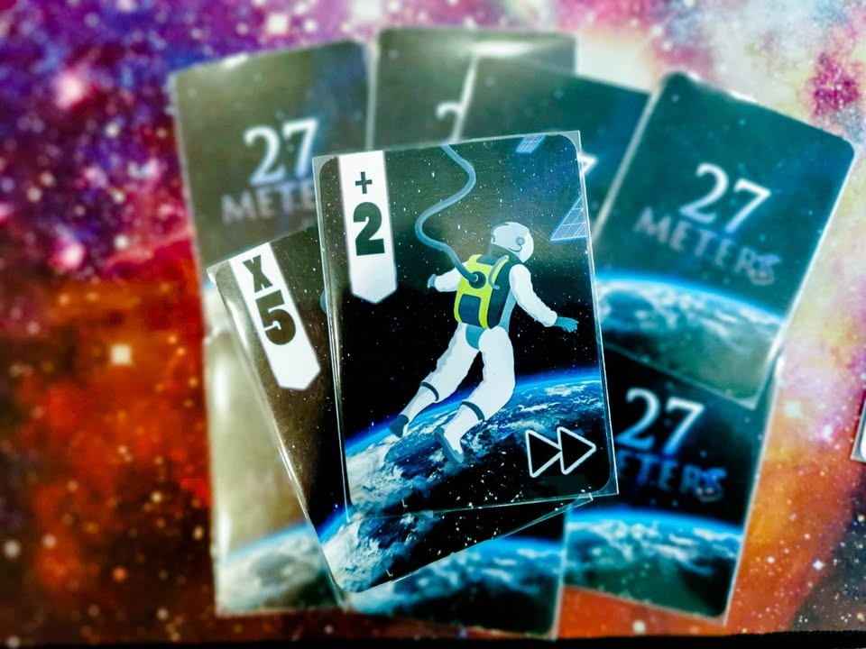
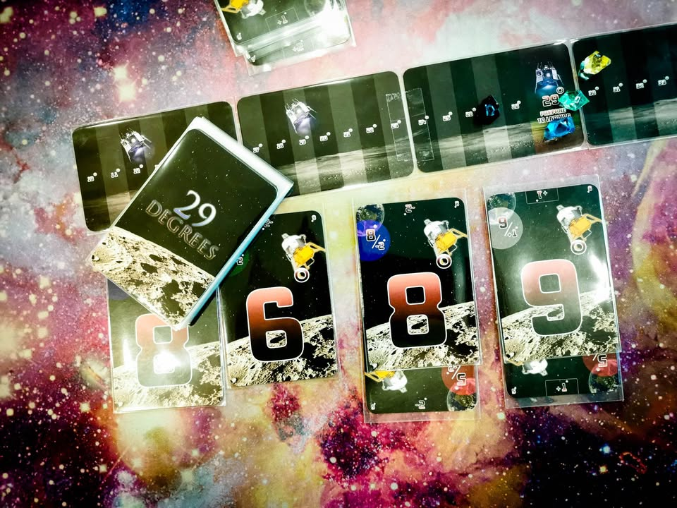

▪️ พึ่งได้ลองเกมรุ่นทดสอบ (prototype) สามเกมจาก อาร์ม (The Coding) แล้วคิดว่าเป็นเกมคั่นเวลาที่คุณภาพความสนุกพร้อมขายแล้วมากๆทั้งสามเกมเลย
.
.
▪️ เกมมาในซี่รี่ย์ตัวเลขที่ธีมไม่ได้เกี่ยวอะไรกันซักเท่าไรคือ 27 เมตร, 28 วัน และ 29 องศา โดย setting ที่ใช้ตอนทดสอบจะเป็นแนวอวกาศทั้งสามเกม และแน่นอนว่านี้เป็นตัวทดสอบ อาจจะมีอะไรเปลี่ยนแปลงได้อีก รูปก็แค่ dummy นะ
.
.
▪️ ขอพูดไม่เรียงเลข แต่เรียงตามความซับซ้อน
.
.
🔹 27 เมตร - เป็นเกม Push Your Luck ไร้เนื้อหาที่สุดในสามเกม แต่ว่าเล่นแล้วตลกดีมาก คือสัดส่วนความตลก, ความง่ายในการเล่น กับความลุ้นมันไปด้วยกันดีนะ ธีมแปะหลวมๆไว้ว่ามนุษย์อวกาศต้องออกไปซ่อมยาน แต่สายอ๊อกซิเจนถ้าปล่อยยาวถึง 27 เมตรก็จะขาด เพราะงั้นเราเลยต้องมาผลัดกันลงเลขในมือให้บวกกับคูณแล้วรวมๆไม่ให้ถึงเลขที่ว่า ถ้าเกินก็มนุษย์อวกาศจะตายและเราก็ต้องหาคนใหม่มาทำหน้าที่แทน (ฮา) ใครปล่อยเพื่อนตายครบสามครั้งก็แพ้ไป
.
.
🔹 เกมมันตลกตรงก็ผลัดเล่นการ์ดโหมโรงไปนั้นแหละ แต่หลังๆตอนมันอยู่ปลายๆจะกลายเป็นเกมผลัดกันลงเลข ศูนย์บ้าง หรือตั้งใจเร่งคูณแต้มแกล้งเพื่อนบ้าง เกมมีกิมมิคว่าตอนจั่วต้องเปิดดูอีเว้นท์ของการ์ดด้วยซึ่งมันจะมีหลายใบที่เปิดแล้วเรา 'เผลอ' ปล่อยสายทำให้ระยะที่นึกว่าหยุดพอดีดันเลยไปซะได้......ปกติเล่นเกมพวกนี้ผมจะไม่ค่อยชอบนัก เพราะส่วนมากมันจะลีลาเกินจำเป็น แต่อันนี้ผมคิดว่าทำมาค่อนข้างดีนะ
.
.
🔹 เกมตลกแบบเรียบง่ายดี ลีลาพอประมาณไม่ค้างคา แต่ก็อยากให้มีกิมมิคยื้อๆเยอะกว่านี้อีกหน่อยเหมือนกันนะ
.
.
🔹 (จริงๆถ้าบดเอา บวก ลบ คูณ หาร มาใส่ดีๆอาจจะฮากว่า Last Hand Standing ก็ได้ ....เรื่องเสี้ยมเราก็รับ....)
.
.
🔸 29 องศา - ยานอวกาศของแต่ละคนกำลังร่อนลงจอดบนดวงจันทร์ แต่ยังทำมุมไม่ได้ขาดอีก 29องศา เราเลยปรับระดับยานซักหน่อย เกมก็ให้เราเล่นการ์ดเลขเพื่อบวกตัวเองไปข้างหน้า แต่ละใบสามารถเล่นแบบเป็นการ์ดเสริมที่บวกลบเลขเล็กๆเพื่อปรับมุมละเอียดได้ ตรงนี้ก็ไม่มีอะไร 
.
.
🔸 แต่พอเราจะลงจอดได้เท่านั้นแหละ เพื่อนในวงก็สามารถที่จะเอาการ์ดลงจอดที่เลขตรงกันมาพังการ์ดเราได้ ด้วยจำนวนการ์ดตัวเลขที่มีจำกัดแค่อย่างล่ะสิบใบ จำนวนการ์ดที่ลง กับการ์ดที่เอามาระเบิดมันได้ก็จะมีจำกัด ในเกมยังมีกติกาที่จะป้องกันให้การ์ดบางใบของเราไม่สามารถถูกทำลายได้อีก ก็เลยกลายเป็นเกม take that ที่มีสัดส่วนของการบริหารความเสี่ยง รวมไปถึงโบ๊ยให้เพื่อนจัดการแทนในขณะที่เราเองกำลังจะเข้าวินแบบเนียนๆดี
.
.
🔹28 วัน - เนื้อเยอะสุดในสามเกม (แต่ยังอยู่ในระดับคั่นเวลา) ธีมเล่าถึงบริษัทที่ลงไปลงทุนขุดทรัพยากรในดาวอังคาร (คุ้นๆ....) โดยมีเวลาลงทุนเพียง 28 วัน แต่เราไม่ได้ลงไปเองแค่ไปซื้อหุ้นเค้าเฉยๆ 
.
.
🔹 เป็นเกมสไตล์แบ่งออกเป็นสองช่วง คือช่วงเก็บการ์ดและช่วงเอาการ์ดไปใช้ (นีกถึง For Sale ไว้) ช่วงแรกจะมีสุ่มเปิดการ์ดที่มันจะพาตัวเองไปหนึ่งในสามกอง ผู้เล่นก็เลือกว่าจะย้ายกองลงทุน หรือจะเปิดการ์ดเพิ่มก็ได้ พอกองไหนเข้าเงื่อนไข (ที่ถูกสุ่มมาอีกที อาจจะกองแรกที่มีการ์ดครบห้าใบ) ผู้เล่นที่ลงทุนถูกกองจะได้แบ่งของในกองกัน จากนั้นก็จะเปลี่ยนเงื่อนไขใบใหม่ ก็ทำไปเรื่อยๆ
.
.
🔹การ์ดที่เราเก็บมาเนี่ยจะมีคุณสมบัติอยู่สี่แบบ (ก็มีธีมติดมานิดหน่อย ธาตุอะไร บริษัทอะไรขุดไรงี้) ในช่วงที่สองจะเป็นการสุ่มเปิดการ์ดรางวัลว่าใครเก็บอะไรซักอย่างเยอะที่สุด ก็จะมาบอกกันใครเยอะสุดได้แต้มไป แต่ต้องทิ้งการ์ดใบนึง ถ้าเท่ากันต้องเอาการ์ดมาประมูล ความยากมันเลยอยู่ที่มีการ์ดหลายหมวด ทิ้งใบนี้แล้วหมวดนั้นจะเหลือพอชนะไหม อ่ะเราเก็บมาสี่เพื่อนเก็บมาเท่าไร บลาๆ
.
.
🔹 เกมน้ำมีเนื้อจากเกมลุ้นๆที่เหมือนจะไม่มีอะไรแต่จริงๆต้องแอบนับตลอดว่าคนอื่นเก็บการ์ดแบบไหนไปแล้วเท่าไร ในแง่หนึ่งก็คือเกมไม่อะไรเลยดำเนินตัวตามเกมไปเรื่อยอีกเกมหนึ่งแต่มีเรื่องราวที่ดึงให้คนเล่นติดไปกับเกมได้เรื่อยๆโดยไม่เบื่อ (ไม่ใช่ข้อเสียนะ) ความลีลาคือมันก็เกม Majority Control เนี่ยล่ะแต่กว่าจะได้การ์ดแต่ล่ะใบมันยากนัก ไหนจะต้องรอสุ่ม ไหนจะต้องไปลงทุน ไหนต้องลุ้นให้มันสำเร็จจะได้แบ่งของกันไรงี้ เป็นเกมที่เล่นรอบแรกอ้อหลายครั้งมาก เพราะฟังแล้วไม่เก็ทว่าเกมเล่นยังไง แต่ตอนเล่นก็สนุกสนานดี
.
.
💭 แน่นอนว่าสามเกมนี้ไม่ใช่เกมแนวกบๆเนื่องจาก 'เบา' เป็นเกมคั่นเวลา แต่ถ้าตั้งกรอบมองจากที่มันเป็นแล้วก็คิดว่าเป็นสามเกมที่น่าจะเหมาะกับการคั่นเวลาเล่นสไตล์ช่วงพักกลางวัน หรือเกมเฮฮาเล่นตามร้านสอนไม่ยากได้ เพราะสัดส่วน luck ที่ใส่เข้าไปในแต่ล่ะเกมมันค่อนข้างทำให้เกมสนุกตามกรอบกลุ่มปาร์ตี้แกล้งๆนิดๆลุ้นๆหน่อยๆดี
.
.
💭คิดว่าซี่รี่ย์ตัวเลขนี้น่าจะมีทำขายออกเป็นชุดไรงี้อยู่นะ ก็หวังว่าจะได้ทำออกมา พวกสไตล์ค่าย Oink, Small Box Games, Adlung-Spiele งี้ ผมมีโอกาสได้เล่นเกมกำลังทดสอบดีๆหลายเกม หลายครั้งก็ดีกว่าเกมที่ผลิตออกมาแล้วเยอะมาก (เกมออกขายแล้วแบบ.....อิหยั่งว่ะนี้เจอประจำ) น่าเสียดายเหมือนกันที่หลายครั้งเกมพวกนี้ไม่ได้ถูกทำออกมาขาย (แต่เห็นเค้าคิดเกม 26 ที่ธีมใต้น้ำออกมาล่ะ)
.
.
📌disclaimer : ถึงจะรู้จักกันแต่ผมไม่มีเหตุผลอะไรที่จะไม่พูดเรื่องที่ไม่ผมชอบนะ ขอยืนยันว่าเวลาเขียนผมเขียนสิ่งที่ผมรู้สึกจริงๆ ซึ่งอาจจะตรงหรือไม่ตรงกับความรู้สึกใคร แต่ไม่โกหกนะ :) (ไม่รู้เพราะงี้หรือปล่าวเลยไม่ค่อยมีใครอยากเอาเกมมาให้ลองด้วย ฮาๆ)

