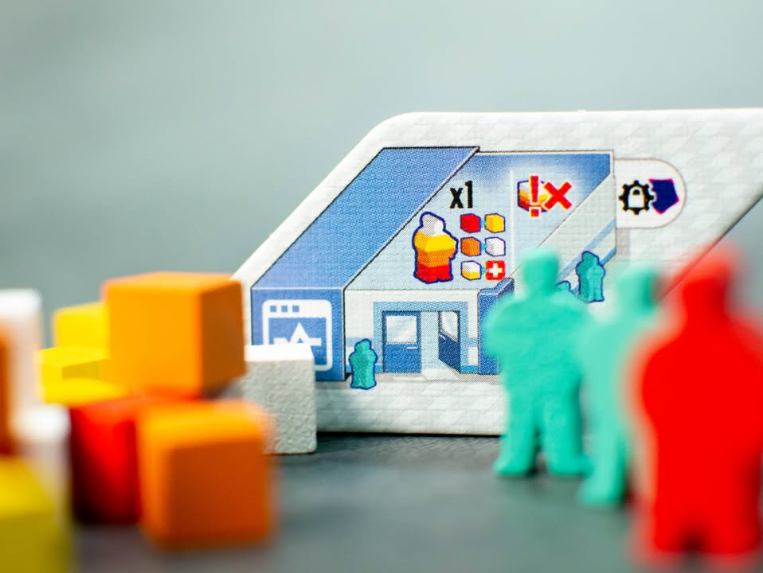
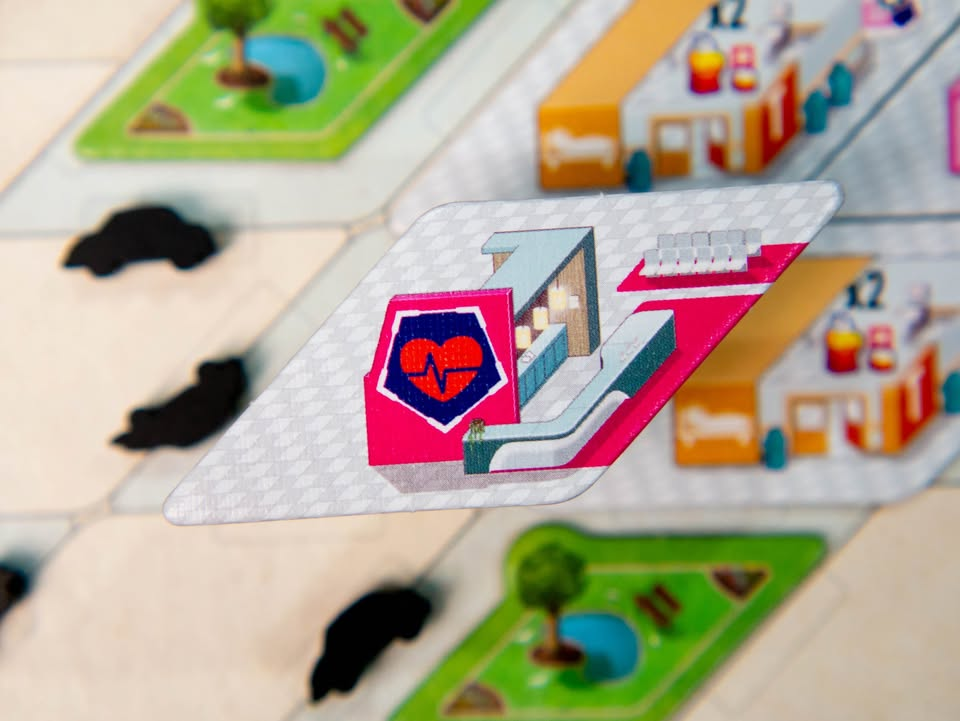
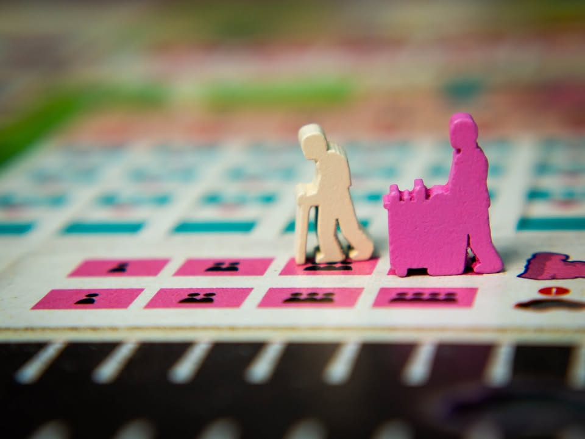
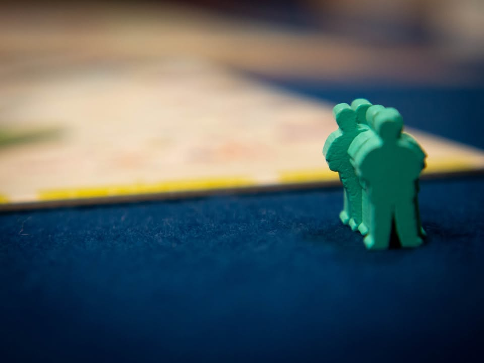

Clinic: Deluxe Edition #bite_size #rerun_reprint
.
▪️ จริงๆแล้วเกมนี้ไม่ใช่เกมใหม่ แต่เป็นฉบับ Mass Production ของเกมฉบับทำมือที่ทำมาตอนปี 2014  (ตอนนั้นทำมาแค่ 3 รอบ รวม 750 ชุด) โดยระบบเกมแล้วไม่มีอะไรต่างจากเดิมแต่ว่าปรับปรุงอุปกรณ์ใหม่ให้สมกับเป็นเกมระดับระดมทุน
.
.
▪️ เนื่องจากเกมนี้เคยเขียนถึงไปแล้ว อ่านของเดิมได้เลย เกมเหมือนเดิมเป๊ะ  อันเก่าทำมือไม่ค่อยทน แต่ก็เก็บไว้เตือนใจว่าครั้งหนึ่งเคยสั่งเกมทำมือราคาหลายพันมาแล้ว (ซื้อตัวเสริมด้วย) https://tinyurl.com/yykdys98
.
.
▪️ ถ้าจะเล่าเพิ่มอีกซักหน่อยคือตอนจะเล่นเกมนี้ถ้ามองว่ามันเป็นเกม 'resources management' จะเหมาะกว่าคิดว่ามันคือเกม 'hospital building' เพราะเกมนี้แม้ผังจะมีข้อกำหนดเยอะแยะ แต่สุดท้ายคุณก็สามารถคิดสุดยอดผังส่วนตัวแล้วเอามาใช้ได้อยู่ดี (แต่คุณจะมีเวลาลองผิดลองถูกหาโครงสร้างที่ชอบอีกพักใหญ่) 
.
.
▪️ คือถ้ามองเป็นเกมสร้างตึกแล้วเกมนี้ค่อนข้าง weak ไปจนถึงอาจจะไม่มันส์ เพราะข้อจำกัดจุกจิกเยอะสำหรับการเล่นครั้งแรก แถมแต้มถ้าบวกเลขเป็นก็จะเห็นเลยว่าไม่ค่อยคุ้มแถมถ้ายังต้องกังวลกับการมี efficiency ที่ไม่อยากให้คนเดินไปมาเยอะๆให้เสียแต้มอีก เลยจะกลายเป็นว่ามันออกท่าตึกได้ค่อนข้าง fixed พอดู ซึ่งตอนลองท่าก็สนุกอยู่หรอกแต่ผมคิดว่ามันไม่ใช่จุดแข็งของระบบการเล่นเท่าไร
.
.
▪️ แต่ถ้า mindset คุณกลับมาที่ความเป็นเกมบริหารทรัพยากรแล้วสิ่งสำคัญของเกมเลยจะกลายเป็นการตัดสินใจว่าจะรีบเก็บคนไข้ หรือจะไปสร้างตึกตามแผนที่คิดมาจากบ้านต่อ เพราะคนไข้ในเกมนี้หายาก หมดไว การรีบหยิบเพื่อมาบ่มเลี้ยงไข้ให้ใกล้ตายแล้วค่อยรักษาโดยที่เรายังบริหารศักยภาพของหมอเอาไว้ได้ โดยที่จอดรถยังไม่เต็มไปซะก่อน ก็จะเป็นไอเดียหลักของเกมนี้
.
.
▪️ ส่วนตัวเสริมมีคนถามมาหลายคนเหมือนกัน หลักๆคือผมคิดว่าไม่ค่อยจำเป็นนัก เพราะมันเป็น sub-module ที่เอาไว้ให้ใส่แบบผสมทุกอัน คือถ้าเล่นไม่บ่อยไม่ค่อยได้ใช้หรอก ก็ไป mix & match เอาตามชอบ ซึ่งในตัวหลักก็มีมาให้ประมาณนึงแล้ว  (ข้อเสียของนักออกแบบคนนี้คือเพ้อเจ้อเก่งชอบทำโมดูลล้นๆที่ตอนเล่นจะรู้สึกว่าไม่ค่อยคุ้มจนทำให้ไม่สนุก )
.
.
▪️ แต่ถึงจะพูดอย่างนั้นโมดูลที่ผมชอบมันก็ดันอยู่ในกล่องตัวเสริมนะ (จานเคเบิ้ลทีวี กับ เสาไว้ขึ้นชั้นสองโดยไม่ต้องสร้างฐานก่อน) แต่ก็แนะนำให้เล่นตัวหลักก่อนค่อยตัดสินใจ
.
.
▪️ ตอนนั้นเขียนสมัยยังไม่มีเรตติ้งก็เลยขอแจ้งไว้ว่าเป็นเกม [🐸 Family] ครับ (ก็ขนาดซื้อซ้ำสองรอบนะ!) แต่มันก็ไม่ใช่เกมสำหรับทุกคนนะ :)
.
--------------------------------
หมวด Bite Size (พอดีคำ) นี้กะว่าจะเขียนอะไรสั้นๆประมาณนี้ล่ะกัน ใหม่บ้าง ซ้ำบ้าง เกมที่ขี้เกียจเขียนบ้าง เขียนๆไว้ก่อนเผื่อมีอารมณ์อาจจะขยายไปลง Thought บ้าง จริงๆอยากเขียนสั้นกว่านี้ แต่ยังอดไม่ได้ที่จะต้องอธิบายอะไรเพิ่มตามนิสัย เดี๋ยวค่อยๆปรับไปล่ะกัน

