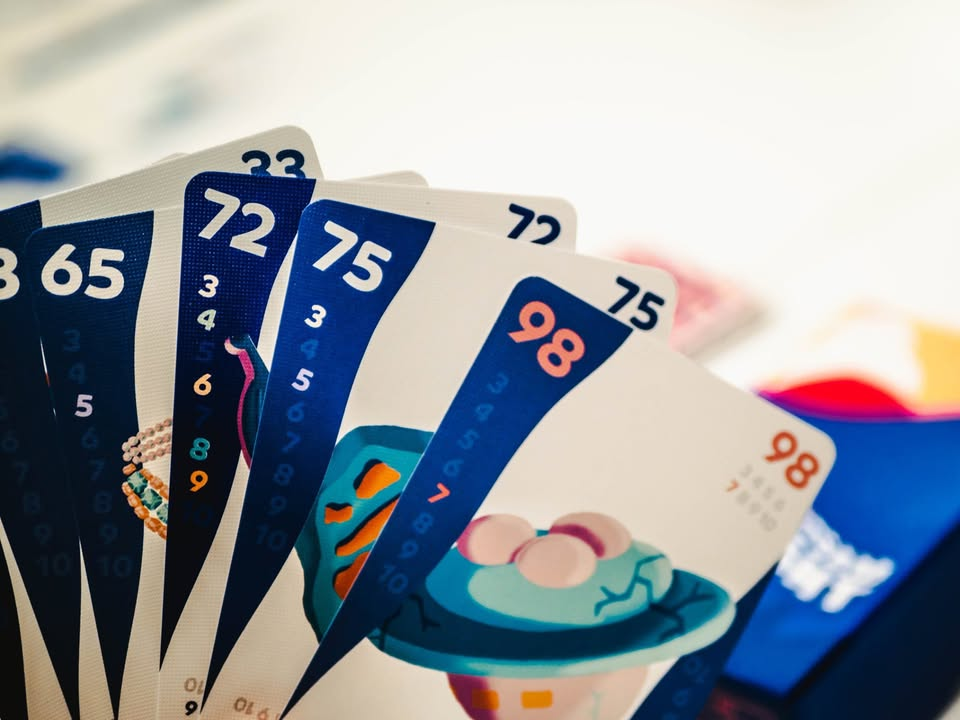

Flotsam Fight #bite_size
blog link: https://wp.me/p7TSgy-2Pw
 
▪️เกมสั้นคั่นเวลาธีมเล่าถึงเหล่านักล่าสมบัติเรือแตกที่ต้องแบ่งสมบัติที่ได้มาลงเรือเล็ก ของที่เหลือนั้นถือเป็นรางวัลติดตัว แต่หากโลภไปเก็บของแพงไว้กับตัวล่ะก็จะโดนลงโทษ เป็นเกมกล่องเล็กจาก Oink เช่นเคย ออกแบบโดย Tomoyuki Maruta
 
 
▪️เอาจริงๆธีมก็ไม่ได้มีอะไร พูดโดยแกนมันก็คือเกมทิ้งไพ่ออกจากมือเนี่ยล่ะ กิมมิคคือเกมจะมีไทล์เรือแทนที่ช่องให้เราทิ้งของการ์ด มีกฎว่าการ์ดที่เราทิ้งต้องหารด้วยเลขเรือลงตัว และเลขต้องมากกว่าเลขเดิม 
 
 
▪️เมื่อทุกคนผ่านหมดก็จะเคลียร์เรือให้ แล้วก็วนจนกว่าจะมีใครคนหนึ่งทิ้งการ์ดใบสุดท้าย เกมจะจบลงทันทีและคนที่มีการ์ดเลขน้อยที่สุดจะได้แต้มบวกส่วนคนที่มีเลขมากสุดก็ติดลบไป
 
 
▪️แน่นอนว่าฟังเฉยๆมันก็เกมแข่งกันทิ้งไพ่ธรรมดาๆ ไม่มีอะไรซับซ้อน แต่ระหว่างเล่นตัวเกมมันก็แฝงแนวคิดสนุกๆหลายอย่าง อย่างเช่นการรีบลงเลขเยอะออกไปก่อนในตาแรกๆเพื่อรอเก็บใบเล็กไว้รอบหลัง หรือจะเก็บใบเยอะไว้รอบหลังเพื่อรีบลงป้องกันให้คนอื่นทิ้งการ์ดลงไม่ได้ 
 
 
▪️จุดน่าสนใจในเชิง UI คือทำมาดีและใส่ใจมาก ทั้งตัวช่วยดูว่าการ์ดนี้ลงเรือลำไหนได้ การ์ดนี้เลขสูงสุดของสายเลขนั้นหรือยัง รวมไปถึงการใช้สีสองเฉดเพื่อไกด์คนเล่นว่าเบอร์ไหนเหมาะที่จะเล่นในรอบแรกหรือรอบหลัง (ซึ่งเรื่องพวกนี้ไม่ได้บอกในคู่มือนะ เพื่อนในวงผมตั้งขอสังเกตุมา)
 
 
▪️โดยรวมคือเพลินกว่าที่คิดไว้ น่าจะหลอกสายเล่นไพ่มาเล่นได้ไม่ยากเย็นนัก

--------------------------------
หมวด Bite Size (พอดีคำ) นี้กะว่าจะเขียนอะไรสั้นๆประมาณนี้ล่ะกัน ใหม่บ้าง ซ้ำบ้าง เกมที่ขี้เกียจเขียนบ้าง เขียนๆไว้ก่อนเผื่อมีอารมณ์อาจจะขยายไปลง Thought บ้าง จริงๆอยากเขียนสั้นกว่านี้ แต่ยังอดไม่ได้ที่จะต้องอธิบายอะไรเพิ่มตามนิสัย เดี๋ยวค่อยๆปรับไปล่ะกัน

