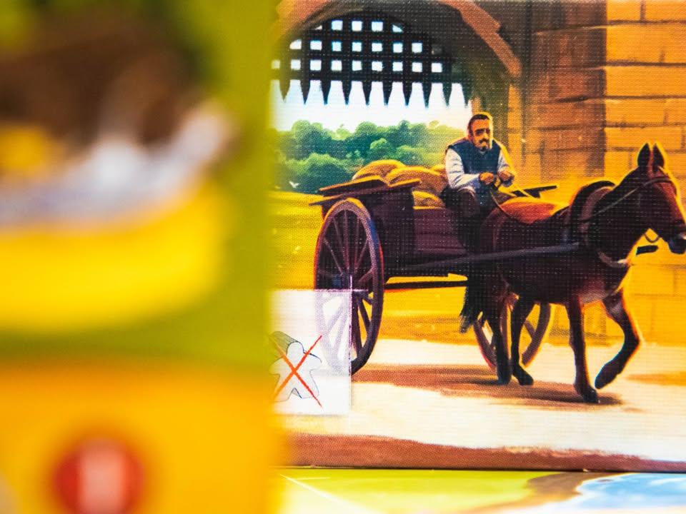
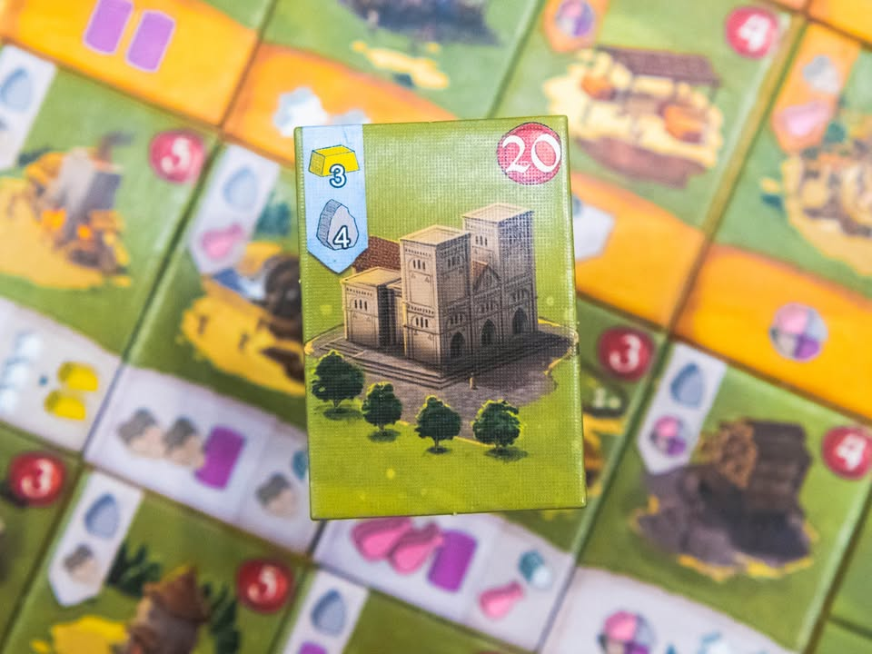
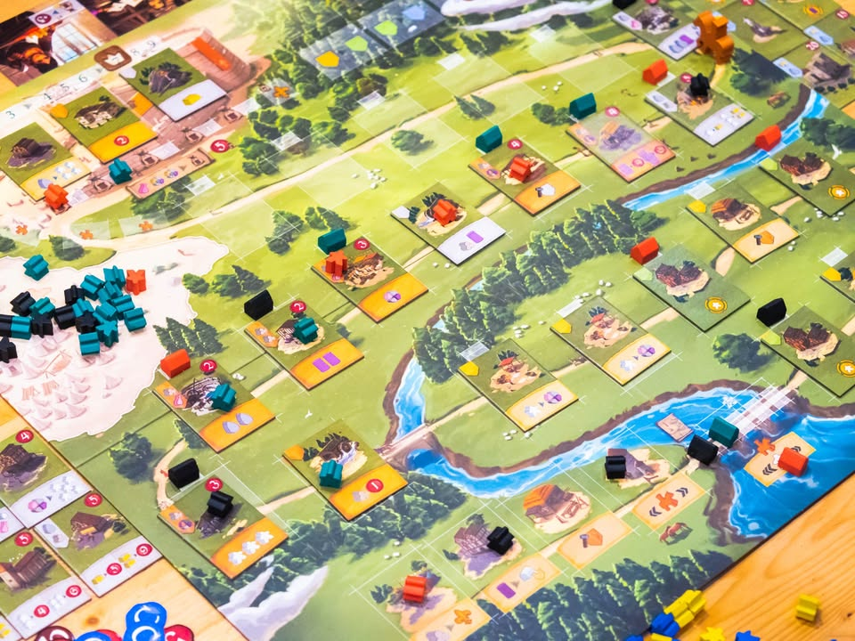
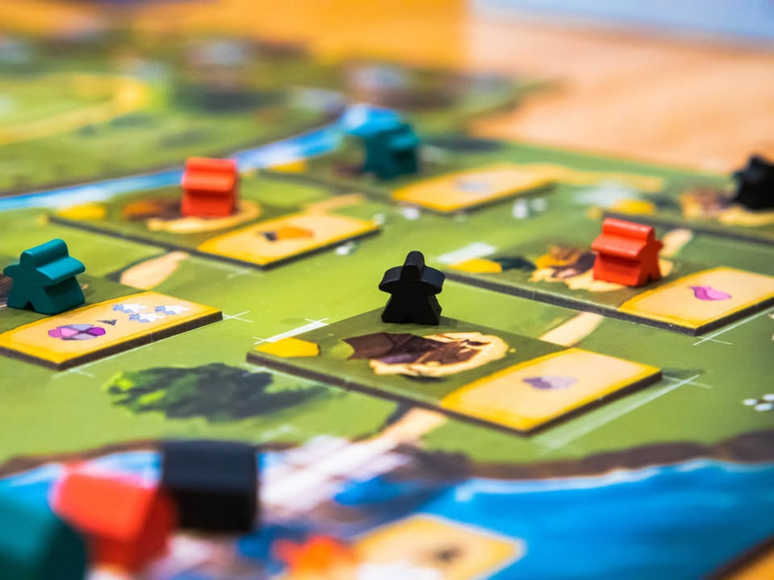
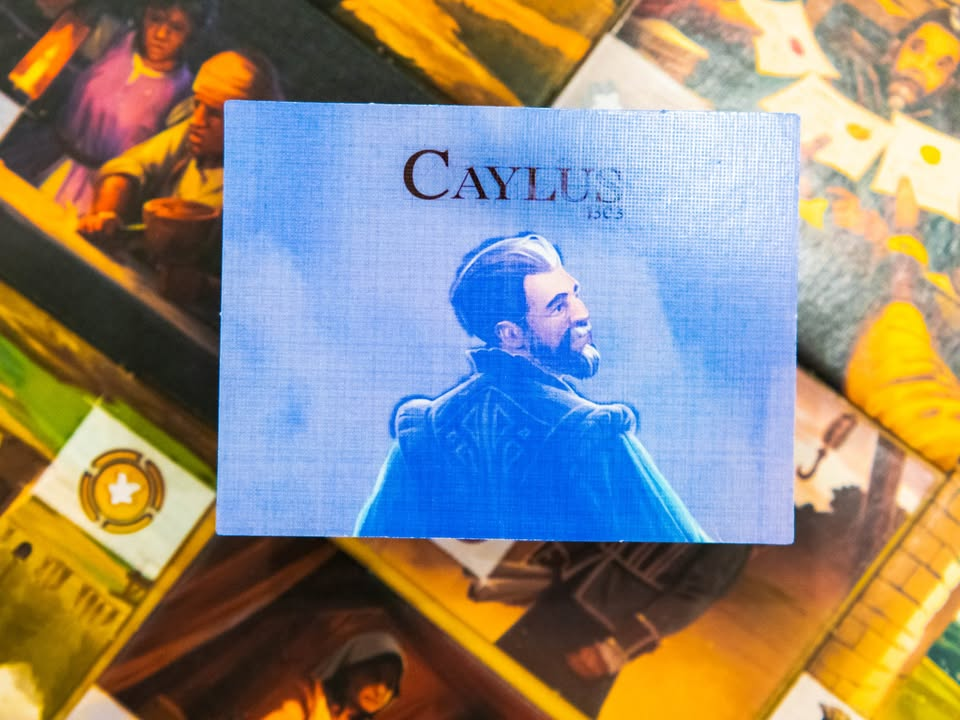
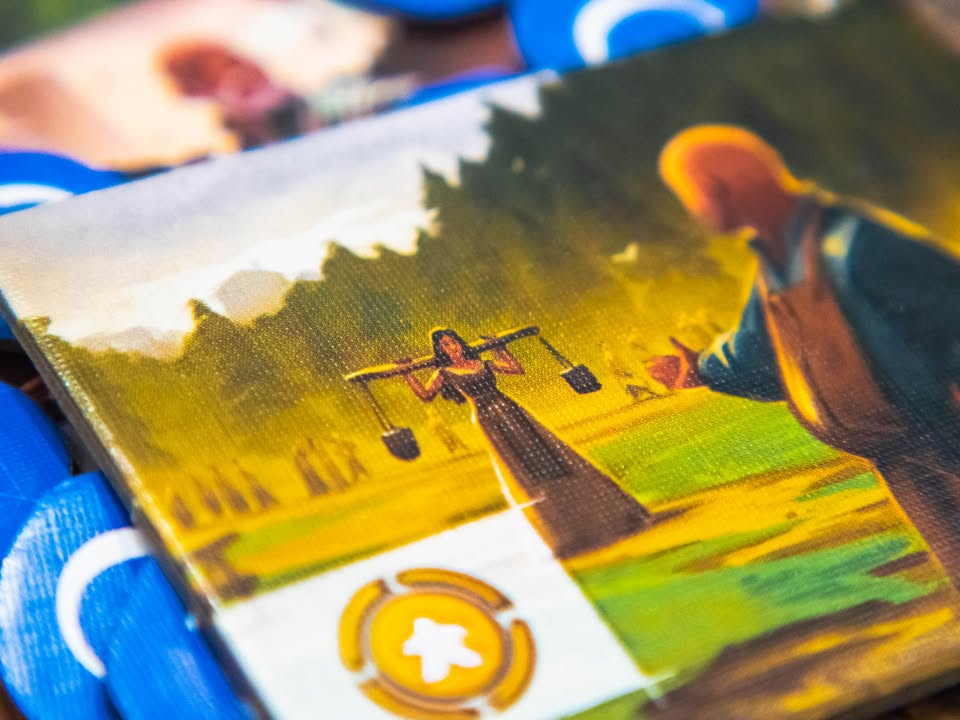

Caylus 1303 #thought
blog link: https_://wp.me/p7TSgy-2PB
 
▪️การกลับมาเกิดใหม่ของเกมระดับคลาสสิคอย่าง Caylus อันเป็นหนึ่งในเกม Worker Placement ยอดเยี่ยมตลอดกาลสำหรับผม รอบนี้เรามาเป็นเหล่าคณะช่างผู้ต้องมาช่วยเหลือปรับปรุงปราสาทหลังเดิมที่เสียหายจากการศึก ผลงานจากนักออกแบบผู้ให้กำเนิดตันฉบับ William Attia
 

📌 TL;DR - ถ้าคุณรู้จัก Caylus ดีอยู่แล้ว เกมนี้ก็เล่นคล้ายๆกันนั้นแหละแต่ตัด Prestige แทรคออกไป แล้วแทนที่ด้วยระบบความสามารถพิเศษและโบนัสแบบสุ่ม กับไม่มีเงินแล้ว แต่เอาไปรวมร่างกับจำนวนคนงานที่มีไม่เท่ากันใช้แทนเงิน รวมไปถึงตึกโรงแรม ที่ปกติต้องไปสร้างตึกทนายก็ทำให้มันสร้างง่ายขึ้น โดยรวมบรรยากาศเกมไม่เปลี่ยนแต่อธิบายกติกาจบไวขึ้นนิดหน่อย
 
 
▪️สำหรับคนที่ไม่เคยสัมผัสเกมนี้มาก่อน ไอเดียของเกมนี้ Worker Placement แบบพื้นฐานที่ (เสริมให้อีกนิดว่าเกม Caylus นั้นถือเป็น worker placement เกมแรกๆ ถัดจาก Keydom และ Bus) ผู้เล่นจะผลัดเอาคนงานไปลงยังช่องตึกก่อสร้างที่เมื่อจบรอบเราจะได้ทรัพยากร โดยระหว่างเกมผู้เล่นสามารถสร้างตึกชนิดใหม่เข้าไปในกระดาน เมื่อใครมาใช้ตึกของเรา เราก็จะได้แต้มด้วย ตรงนี้ทำให้ demand / supply ของเกมแปรเปลี่ยนไปตามแต่ผู้เล่นในวงจะสร้างอะไรออกมาเมื่อไร 
  
  
▪️หนึ่งในระบบอันเป็นเอกลักษณ์ที่ไม่มีใครยอมทำเลียนแบบใน Caylus คือระบบ 'ผู้ตรวจการ' ในเกมนี้ผู้เล่นจะทำการสร้างตึกเรียงไปตามเส้นทางถนนมุ่งสู่ปราสาท แต่คนงานเกมนี้ค่อนข้างขี้เกียจถ้าแอบอู้ได้ก็ต้องอู้ไว้ก่อน ผู้เล่นจะได้รับผลผลิตจากเฉพาะตึกที่ ผู้ตรวจการเดินผ่านเท่านั้น และตัวเกมก็เปิดโอกาสให้ผู้เล่น 'ช่วยกัน' ขยับตัวผู้ตรวจการเดินหน้าถอยหลังกันตามแต่มติมวลมหาประชาชน คนงานที่ไปยืนอยู่ปลายถนนมากเกินไปก็อาจจะโดนเพื่อนๆรุมติดสินบนให้ผู้ตรวจการเดินไม่ถึงจนอดได้ทรัพยากรก็เป็นได้ (แต่เจ้าของตึกเก็บแต้มอิ่มไปละนะ) แปลว่าถ้าอยากจะใช้งานตึกที่พึ่งสร้างใหม่ก็ต้องเตรียมเงินและ 'เตรียมใจ' ไว้เยอะหน่อย
 
 
▪️นอกจากสร้างตึกแล้วก็ยังมีการทำแต้มจากการส่งทรัพยากรไปช่วยซ่อมปราสาท ข้อดีนอกจากแต้มแล้วเรายังจะได้ค่าความดีความชอบเลือกได้ว่าจะเป็นโบนัส หรือไปดึงตัวผู้ช่วยซึ่งมีความสามารถพิเศษแตกต่างกัน แต่ล่ะรอบจะสุ่มมาไม่เหมือนกัน ซึ่งนอกจากผู้ช่วยที่ให้หยิบจากส่วนกลางแล้วเราก็สามารถไป 'แย่ง' ดึงตัวผู้ช่วยคนอื่นมาไว้กับเราได้ด้วย
 
 
▪️ความสนุกหลักอีกอย่างคือการบริหารทรัพยากรคนงานในมือ ซึ่งคนงานในเกมเราจะได้รับมาเพียงตาล่ะสามตัวเก็บสะสมไว้ได้ แต่ถ้าเมื่อใดมีผู้เล่นเลือกที่จะ 'หยุด' การเล่นในรอบนั้นคนที่เหลือจะต้องเสียคนงานเพิ่มนัยว่าเพื่อนเค้าหยุดงานแล้วคนงานเริ่มขี้เกียจเลยต้องจ่ายโอทีเสียหน่อย รวมไปถึงการที่จะติดสินบนผู้ตรวจการก็ต้องใช้คนงานเช่นกัน แปลว่าเรามักจะอยากใช้คนงานมากกว่าที่เราได้รับมาเสมอ ตรงนี้ทำให้การตัดสินใจว่าเราอยากจะทำอะไรบ้างเป็นเรื่องสำคัญในเกม (ตรงนี้ต่างจาก Caylus เดิมตรงจ่ายมากสุดแค่ 2 ไม่ต้องจ่ายทบเรื่อยๆตามจำนวนคนผ่าน)
  
  
▪️ไอเดียความกดดันระหว่างเล่นคือตึกพื้นฐานให้ของด๋อยๆจะค่อยๆหายและกลายเป็นรากฐานให้กับตึกพิเศษที่ให้แต้มเยอะแก่ผู้เล่น ผลกระทบของมันทำให้ช่องทรัพยากรบางอย่างหายไป กดดันให้ผู้เล่นต้องสร้างตึกผลิตของ ถ้าในวงขาดหิน ผู้เล่นที่สร้างตึกผลิตหินออกมาย่อมเป็นที่ต้องการของผู้เล่นอื่น นอกจากแต้มของตัวตึกแล้วทุกครั้งที่มีคนมาใช้งานตึกเรา เราก็จะได้แต้มมาด้วย แต่มันจะคุ้มกันไหมนะกับการที่คนอื่นมีทรัพยากรเพิ่ม? เราจะวางแผนออกลำดับคนงานอย่างไรถึงจะได้ใช้ตึกที่เราอุตส่าห์สร้างมา นั้นก็เป็นเรื่องที่เราต้องวางแผนกัน
  
 
▪️ก็วนๆสร้างตึกส่งของไปแบบนี้ 9 รอบจบเกม
 
 ----------------------------------------------------------
[🐸 Hang out friend, จากแม่สู่ลูก ลูกไม้หล่นไม่ไกลต้นแถมแม่ก็ยังสดใสแข็งแรงมันเลยยากซักนิดที่จะละสายตามามองลูกสาว]

🔹 เป็นเกมยูโรหนักแน่นเล่นง่ายมีปฎิสัมพันธ์ระหว่างผู้เล่นในสัดส่วนที่น่าสนใจอีกเกมหนึ่ง ข้อดีคือกติกาคลีนเข้าใจง่าย แต่ได้เกมที่สนุกในเวลา 60-90 นาที ตัวเกมทำจังหวะการคิดสวย ไม่มีจังหวะไหนของเกมที่รู้สึกว่าน่าเบื่อ และมีน้ำหนักการตัดสินใจที่ดี
 
  
🔹 ในฐานะเกมที่จูนมาจาก Caylus แล้วเราก็ได้เห็นพัฒนาการใหม่ๆที่เอาความรู้จากยุคสมัยที่ผ่านไปมาปรับใช้ในตัวเกม ระบบการบริหารเงินและคนงานถูกยุบรวมเข้าด้วยกัน ระบบการเปิดตึกแต้มระดับสูงที่ลดทอนให้เข้าใจง่ายขึ้น ตัวผู้ตรวจการเองก็ลดความซับซ้อนในการเดินให้เข้าใจง่ายและเหมาะสมกับจำนวนรอบ รวมไปถึงกิมมิคความสามารถพิเศษที่ทำแต่ล่ะเกมไม่เหมือนกันซะทีเดียว ทำให้ได้เกมที่ผมเชื่อว่าสนุกสำหรับคนเล่นเกมยูโรทุกระดับตั้งแต่ Gateway ไปจนถึง Advance
 
 
🔸 สำหรับผมข้อเสียจริงๆของเกมนี้มีเพียงข้อเดียว คือเกมนี้แทบไม่มีที่ยืนในโลกที่มี Caylus อยู่แล้ว โอเคอาจจะฟังดูเว่อร์ไปหน่อย แต่ประเด็นของผมคือถ้าผมมี Caylus อยู่แล้วผมนึกไม่ออกเลยว่าจะได้หยิบตัว Caylus 1303 มากางทำไม? แต่ต้องบอกไว้ก่อนว่า Caylus 1303 เป็นเกมที่ดีมากเกมหนึ่งนะ
 
 
🔸 เพราะว่า Caylus 1303 แม้ว่าจะอธิบายได้ง่ายก็จริง แต่มันก็ไม่ได้น้อยไปกว่า Caylus ซักเท่าไร ทั้ง rule set เองก็ใกล้เคียงกันมาก รวมไปถึงการตัด bonus tech tree ออกก็ทำให้ความรู้ลึกของเกมหายไปอย่างน่าเสียดายโดยที่ความซับซ้อนก็ไม่ลดลงไปเท่าไร กลายเป็นข้อดีที่เหนือกว่า Caylus สำหรับผมก็มีแค่งานศิลป์ที่ยกเครื่องมาเท่านั้นเอง หวังไว้ว่าถ้าทำตัวเสริมใหญ่ออกมามันจะพาเกมไปสู่จุดที่มีความลุ่มลึกมากกว่านี้ เพราะการจูนเล็กน้อยหลายจุดผมก็คิดว่าทำมาแก้จุดน่ารำคาญหลายจุดของตัวต้นฉบับได้ดีทีเดียว (อย่างระบบ turn order ที่ต้องวิ่งไปจองคอกม้า ความลีลาของการออกตึกระดับสาม ช่องแอคชั่นรอคนที่ไม่ค่อยได้ใช้ บลาๆ... )
  
 
🔸 เรื่องเล็กๆอีกอันที่ไม่ชอบเป็นการส่วนตัวคือการไม่ใช่ระบบแทรคแต้มแต่ใช้ระบบเหรียญด้านเดียวแทน คือมันมองยากอ่ะ ไม่ค่อยชอบเกมที่่ใช้ระบบแบบนี้เท่าไร ถึงจะเข้าใจว่าเค้าใส่ไปเพื่อลดโหลด AP กับเพิ่มความลุ้นระหว่างเล่นก็เถอะ
  
 
💭 ส่วนตัวคิดว่าถ้ามี Caylus อยู่แล้วก็ลองเล่นก่อนแต่อย่าคาดหวังความหวือหวาของเกมฉบับปรับแต่งนัก ในหลายๆแง่แล้วถือได้ว่าเป็นเกมที่ดีขึ้น ถ้ายังไม่มีจะเริ่มที่ตัว Caylus 1303 ก็ถือว่าเป็นตัวเลือกที่ดีอีกตัวหนึ่งในแง่มันเอาไปไป intro คนเล่นใหม่ได้ง่ายกว่า อธิบายน้อยกว่า อึดอัดน้อยกว่า (ลดภาระการไต่ลำดับ bonus) เล่นจบแล้วกางซ้ำได้ง่ายกว่า และจบไวกว่าเพราะกำหนดจบใน 9 รอบ 
  
  
💭 เป็นเกมที่ลำบากใจนิดนึงตรงที่มันเป็นเกมที่ดีมากอีกเกม แบกรับชื่อ Caylus ได้อย่างสมภาคภูมิ ถ้าได้ลองเล่นก็ไม่มีคำว่าพลาด แค่วัดรอยเท้าผิดเกมไปหน่อย ถ้าออกตัวเสริมมาแล้วค่อยมาดูกันอีกที!!

----------------------------------------------------------
Compatible Level - เกมนี้เข้ากับคนเขียนได้ระดับไหนนะ!!

🐸 Family, อาจจะมีช่วงเวลาที่ไม่เข้าใจกันบ้างแต่ครอบครัวคือสิ่งที่จะอยู่กับเราตลอดไป นี้คือเกมที่จะมีพื้นที่ถาวรในชั้นวางแน่นอน!! แม้บางเกมจะเปรียบดั่งคุณปู่ใจดีที่ได้เจอกันแค่ปีล่ะครั้ง แต่อันดับในใจนั้นคือความสนุกในช่วงเวลาที่เล่น หาใช่การได้เล่นซ้ำไม่รู้เบื่อเพียงอย่างเดียว [ex. กบโปรด, กบชอบ]

🐸 Hang out friend, เพื่อนกินเที่ยว ถ้าไม่ติดธุระอันใดก็พร้อมจะออกไปพบเจอ สนุกยามได้พบปะ แต่จะให้เจอกันบ่อยๆคงใช่ที - เกมสนุกที่อยากเล่นในระดับที่อยากจะหยิบกางเป็นบางครั้ง สลับสับเปลี่ยนไปเรื่อยตามจังหวะและโอกาส แต่เราก็ไม่ได้อยากซ้ำต่อเนื่องรัวๆ [ex. กบโอเค]

🐸 Someone I know, หากบังเอิญพบเจอ ก็คงได้ทักทายไต่ถาม หากแต่ในยามปกติมิอาจนึกชื่อออก ยืนคุยก็ได้ แต่คงไม่ได้เอื่อนเอ่ยนัดกินข้าว - บางเกมเราก็ไม่ได้อยากชวนเล่น แต่ถ้าไม่มีอะไรทำแล้วมีคนชวนก็เล่นก็ได้ [ex. กบเฉย]

🐸 I Turn left, You Turn Right - เธอชอบกินเผ็ด เราชอบกินอาหารญี่ปุ่น เธอชอบคนคารมดีพาไปกินที่หรู แต่เราชอบเล่นเกมอยู่กับบ้าน แม้จะได้คุยเป็นบางคราแต่คงไม่อาจพัฒนาความสัมพันธ์ - บางเกมแม้ว่าจะดีแค่ไหน แต่ถ้ารสนิยมมันไปด้วยกันไม่ได้ก็ไม่รู้จะเล่นไปทำไม [ex. กบไม่เล่น]
 
 
อนึ่ง : เป็นความรู้สึกในความ "อยากจะหยิบมาเล่นไหม?" ของผมเอง ไม่ได้เกี่ยวอะไรกับคุณภาพของเกม ไม่อิงมาตราฐานอื่นใดนอกจากตัวเองเท่านั้น ดูให้เป็นแค่ "อีกความคิดเห็นหนึ่ง" เท่านั้นก็พอนะครับ :)

