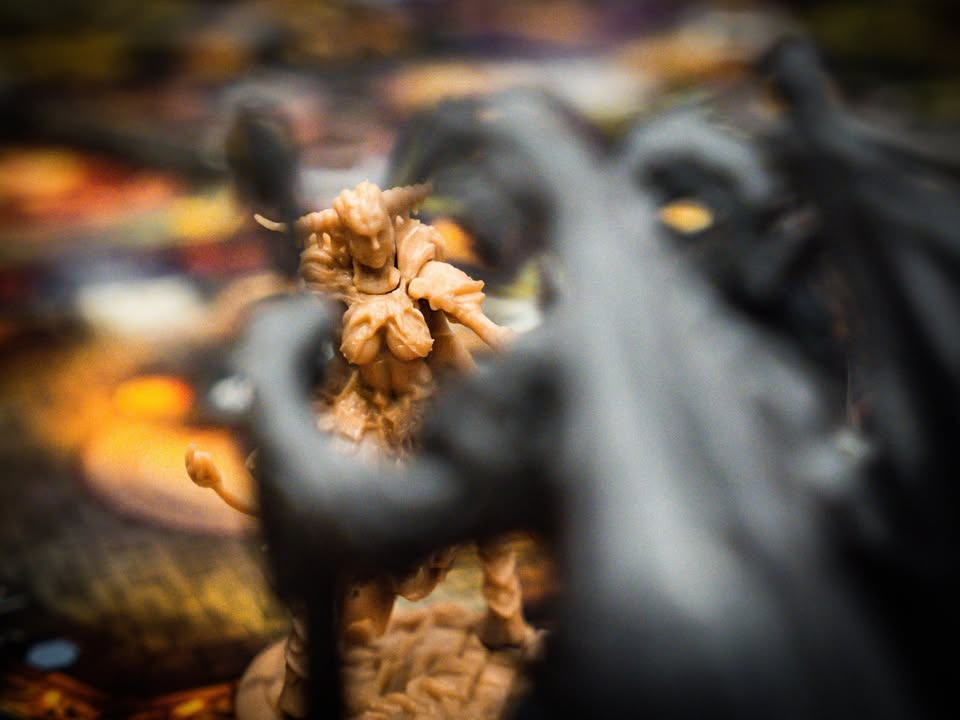
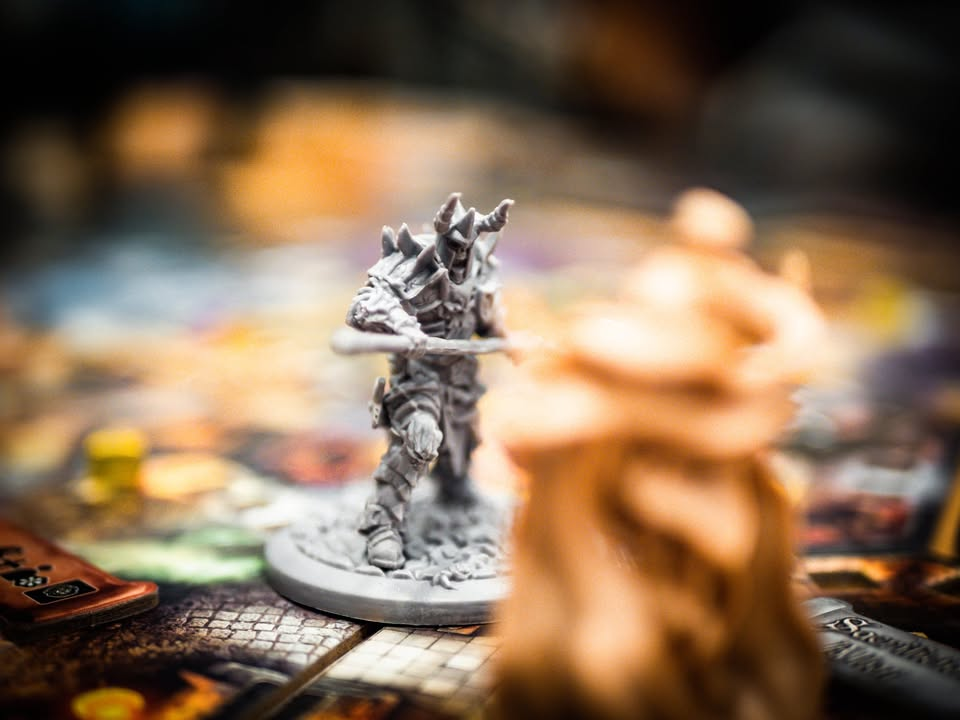
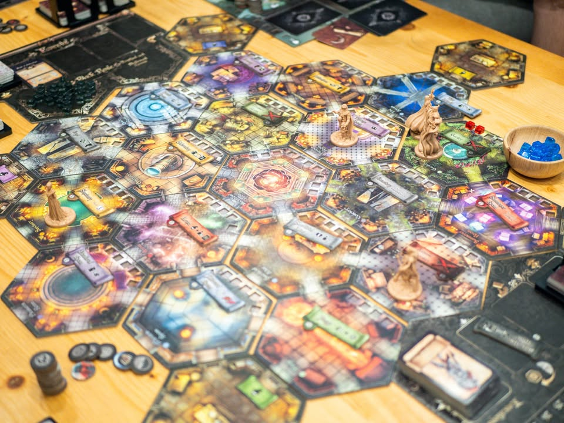
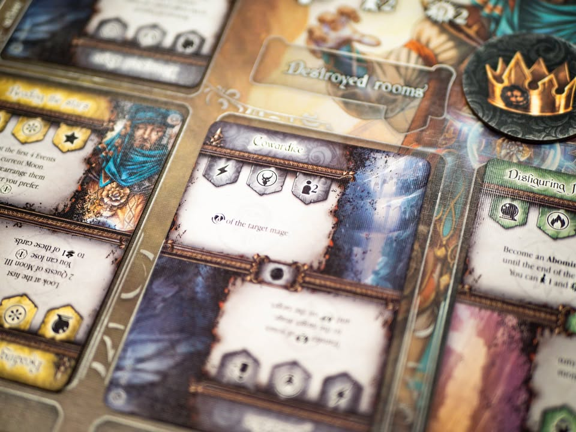
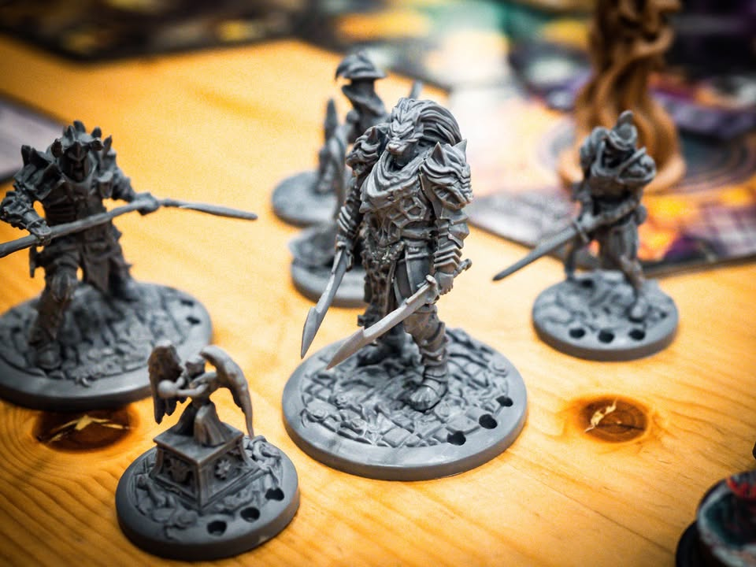
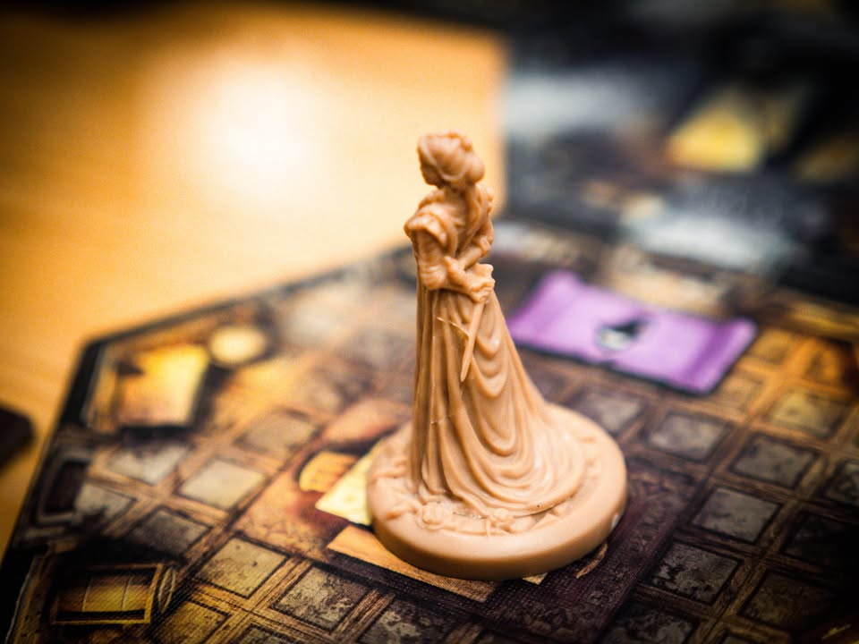
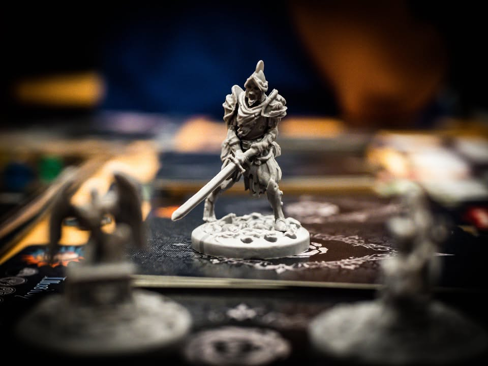

Black Rose Wars #bite_size
blog link: https://wp.me/p7TSgy-2PY
  
▪️เกมแนวลูกผสมระหว่างอเมริเทรชและยูโรระดับกลางหนักที่จะให้เราสวมบทบาทเป็นจอมเวทย์เข้ามาห่ำหันกันในสนามประลองเวทย์มนต์เพื่อความเป็นหนึ่งในสงครามกุหลาบนิลแห่งนี้ ผลงานของ Marco Montanaro
 
  
▪️ไอเดียตอนฟังอาจจะนึกถึงเกม Free for All ลงไปซัดกันตูมๆ แต่โดยแกนแล้วใช้แนวคิดแบบยูโร ที่เราต้องตระเตรียมเวทย์ที่จะใช้ไว้ล่วงหน้า เดินไปตามห้องเพื่อใช้ความสามารถห้อง สร้างความเสียหายให้ห้อง  และแน่นอนเอาเวทย์ไปยิงคนอื่น
 
 
▪️การ์ดเวทย์ในเกมมีหลายหมวดหลายสาย แต่ล่ะอันก็มีธีมของตัวเอง ระหว่างเล่นเราจะจั่วกองไหนมาก็ได้ แต่ละใบจะมีวิธีใช้สองแบบ เราอยากจะใช้ด้านไหนก็หมุนไว้ตรงหน้าเรา เพราะว่าในแต่ละตาเราต้องใช้เวทย์เนี่ยเรียงคว่ำตามลำดับที่จัดไว้ แต่อาจจะคั่นฉากด้วยการเดินก็ได้ ตรงนี้เลยต้องอ่านการ์ดและวางแผนการใช้งานซักหน่อย ตัวภาษาก็เกรดการ์ดเกมอ่านไม่ยากอะไร แต่จะต้องหมุนๆอ่านไปมาสองรอบต่อใบ กับตอนคว่ำไว้ต้องเอามาเปิดอ่านบ่อยๆกันลืม
 
 
▪️ไอเดียการสร้างความเสียหายจะมีความเป็น Majority Control หน่อยๆคือห้องเนี่ยจะมีช่อง HP ไม่เท่ากัน ใครทำ damage ได้ก็ให้วางเม็ดสีตัวเองไว้ พอเต็มห้องระเบิดแต่ล่ะคนก็จะได้แต้มตามสัดส่วนคนทำมากน้อย ซึ่งหลักการนี้ก็เอาไปใช้เวลาไปยิงเวทย์ใส่เพื่อนเช่นกัน แต่จะให้โบนัสคนยิงปิดแต้มให้อีกหน่อย ส่วนใครตายแล้วก็แค่กลับไปจุดเกิดวิ่งออกมาเล่นต่อ ไม่ได้โดนลบออกไปจากเกม 
 
 
▪️เกมมีหลายสายให้เล่นมีทั้งสายทำเควส สายเกเรยิงเพื่อน สายพังห้อง  สายวางกับดัก บลาๆ ก็ชอบแบบไหนก็จั่วเวทย์สายนั้นบ่อยๆ ข้อดีอีกอย่างคือกติกาไม่ได้วุ่นวายอะไร การ์ดว่าไงก็ว่างั้น ลงไปใส่เวทย์ ไดนามิกจะเปลี่ยนไปเรื่อยเพราะเราไม่รู้ว่าแต่ล่ะฝ่ายลงเวทย์อะไรไว้ (อันนี้เป็นจุดกลางๆแล้วแต่คน)
 
  
▪️ส่วนตัวตอนแรกสนใจนิดๆเพราะบางแง่มุมก็ออกจะคล้าย Argent อันเป็นเกมที่ชอบมากๆเกมหนึ่ง แต่เกมนี้เล่นแล้วไม่ได้มีอารมณ์ร่วมอะไรกับเกมระดับ Argent ส่วนหนึ่งเพราะไม่ได้มีอารมณ์ว่าได้สร้าง Engine ยิ่งเล่นยิ่งเก่งตามมา เป็นแนวๆแก้ puzzle เล็กๆจากการ์ดที่จั่วได้มาตรงหน้าเป็นรอบๆไปมากกว่า กับเกมมันไม่เหี้ยมเท่าเล่นแล้วไม่ค่อยมี negative feeling เพราะมันเกมแนวแข่งทำแต้มจริงจังไม่ค่อยรู้สึกว่าโดน Take That  ในแง่หนึ่งก็อาจจะเป็นเกมสาย Hybrid ที่อยู่จุดกลางๆสำหรับผู้เล่นสายยูโรและอเมริเทรชให้มาเจอกันตรงกลางได้อยู่  แต่ถ้าคาดหวังจะมาเจออเมริเทรชจ๋าๆนี้น่าจะผิดหวังได้ ถ้าชอบบู๊แกล้งแล้วอ่านภาษาได้ Wiz-War ก็สนุกดีนะ

--------------------------------
หมวด Bite Size (พอดีคำ) นี้กะว่าจะเขียนอะไรสั้นๆประมาณนี้ล่ะกัน ใหม่บ้าง ซ้ำบ้าง เกมที่ขี้เกียจเขียนบ้าง เขียนๆไว้ก่อนเผื่อมีอารมณ์อาจจะขยายไปลง Thought บ้าง จริงๆอยากเขียนสั้นกว่านี้ แต่ยังอดไม่ได้ที่จะต้องอธิบายอะไรเพิ่มตามนิสัย เดี๋ยวค่อยๆปรับไปล่ะกัน

