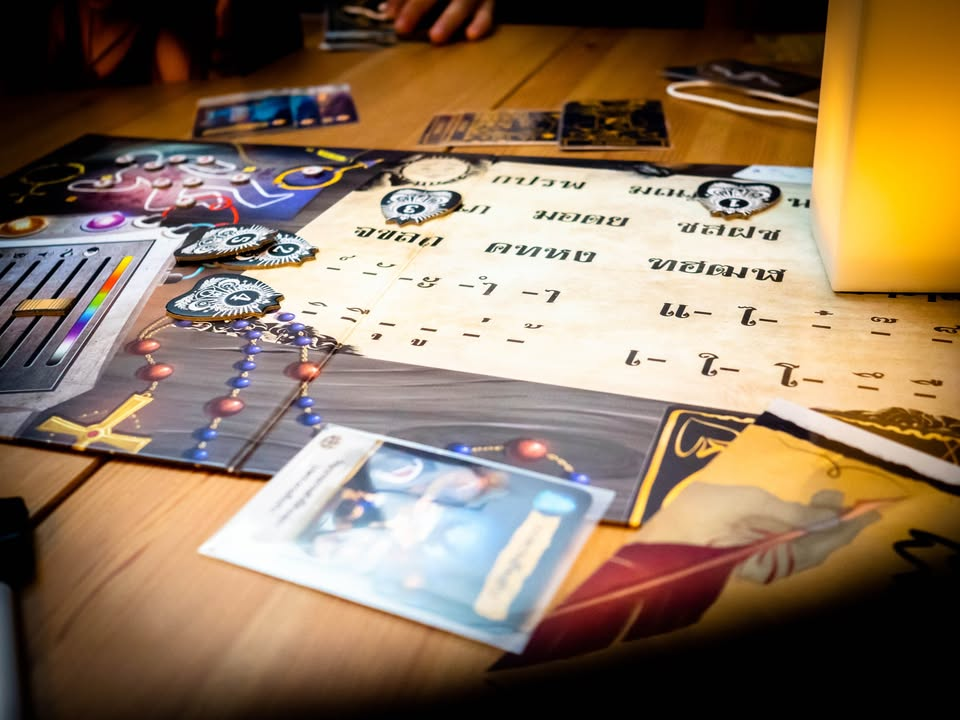
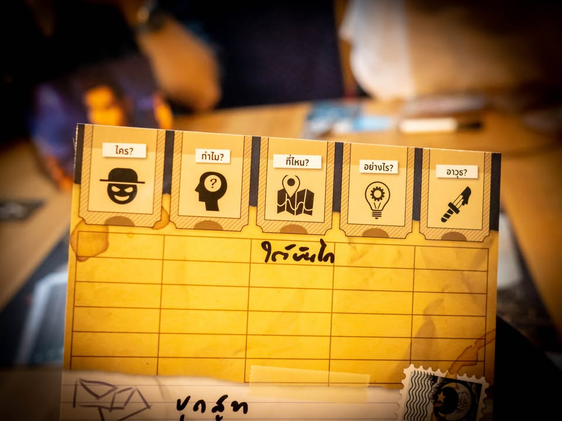
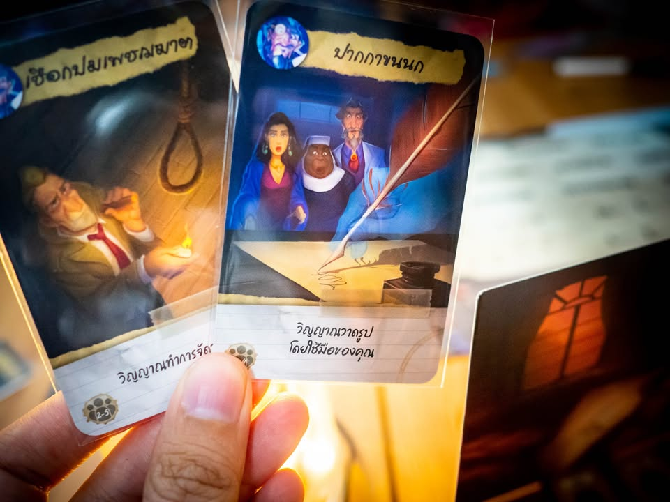

Paranormal Detectives บอกเค้าทีว่ากูตายยังไง #bite_size
blog link: https_://tinyurl.com/y4uvembo
.
.
▪️ เกมสไตล์ปาร์ตี้ว่าด้วยมีผู้เล่นคนหนึ่งต้องรับบทเป็นวิญญาณที่ตายไปแล้วมาค่อยบอกใบ้เหล่าหมอผีที่จะต้องมาตอบคำถามว่าฉันคนนี้ไปทำท่าไหนถึงได้กลายเป็นผีซะแบบนี้
.
.
▪️ ไอเดียคือเหล่าหมอผีจะต้องตอบคำถาม 5 อย่างว่าเกิดขึ้นอะไรกับผู้ตาย ใครเป็นคนฆ่า? ทำไมถึงต้องตาย? เหตุเกิดที่ไหน? ตายได้อย่างไร? และอาวุธที่ฆ่านั้นคืออะไร? ซึ่งการที่จะไปถามผีได้เนี่ยก็ต้องเล่นการ์ดที่จะสั่งให้ผีทำท่าทางบางอย่างเพื่อตอบคำถามที่เราสนใจ
.
.
▪️ ซึ่งความฮาของเกมก็อยู่ตรงนี้แหละ เพราะท่ามันจะมีตั้งแต่ขอให้วางคำในบอร์ดผีถ้วยแก้ว, เรียงไพ่เป็นรูป, จัดแต่งเชือกให้เป็นรูปร่าง, จับมือคนถามวาดออกมาเป็นรูป, ทำเสียงทำท่าทาง ฯลฯ ก็แล้วแต่คนเป็นผีจะไปสร้างสรรค์หาทางทางมาบอกหมอผีกัน
.
.
▪️ ข้อจำกัดเท่าที่เห็นคือตัวเนื้อเรื่องมัน fixed แปลว่าถ้ารู้แล้วก็จะเล่นอีกไม่ได้ (หรือเล่นได้แต่ไปเป็นผีซะ) เห็นว่าจะมีการทำเนื้อเรื่องให้โหลดเรื่อยๆ (ตอนนี้ก็มีแล้ว) แต่ในอีกแง่หนึ่งมันผมก็มองว่ามันเป็นเกมสไตล์นานๆเล่นทีไม่ซ้ำกลุ่มและไม่ใช่เกมที่มีพลังในการเล่นซ้ำต่อเนื่อง เลยคิดว่าตรงนี้ไม่น่าจะเป็นปัญหาใหญ่นะเพราะไม่ได้กางบ่อย
.
.
▪️ ที่ขัดๆจริงๆคือตอนผมเล่นเองก็มีจังหวะอิหยั่งว่ะอยู่นิดหน่อยในแง่ว่าการตีความของคำมันค่อนข้างสับสนได้ง่าย บางจุดอย่าง 'ใครผิด' เนี่ยมันตีความได้หลายอย่าง คนแบบอยู่ๆตายเองจะบอกว่าไม่มีใครผิดหรือคนตายมันผิดเองที่โง่ไรงี้ บางทีมันเลยแอบทำคนใบ้กับคนตอบเขวไปนิดๆ 
.
.
▪️ ผมชอบไอเดียนะ สร้างสรรค์ดี แต่ก็คิดว่ามันแอบเลือกกลุ่มคนเล่นนิดๆเหมือนกัน คือในรสนิยมส่วนตัวรู้สึกว่ามันขาดความ Thrill (ระทึก) แบบเห้ยไอ้คนนี้มันจะตอบได้แล้วววววอะไรประมาณนั้น พอเราเล่นแล้วเลยรู้สึกไม่ได้อินกับเกมขนาดนั้น มีอารมณ์แบบเหมือนจะตอบถูกแต่ไม่ถูกแต่ก็ไม่ได้รู้สึกสนุกกับการหาคำตอบเท่าไรแค่บันเทิงตอนเพื่อนที่เป็นผีทำท่าเฉยๆ 
.
.
▪️ ในแง่หนึ่งอาจจะเพราะเกมมันขาดจังหวะการใช้ 'กึ๋น' ในการใบ้แบบเวลาเล่นเกมอย่าง Codename ล่ะมั้ง? (เล่นแล้วนึกถึง 27th Passenger หน่อยๆ แต่อันนั้นตัดตัวเลือกจ๋าๆเลย ) ในฐานะเกมปาร์ตี้เล่นบันเทิงออกท่าทางกับกลุ่มครอบครัวก็คิดว่าเป็นตัวเลือกที่สนุกดีครับ 
.
--------------------------------
หมวด Bite Size (พอดีคำ) นี้กะว่าจะเขียนอะไรสั้นๆประมาณนี้ล่ะกัน ใหม่บ้าง ซ้ำบ้าง เกมที่ขี้เกียจเขียนบ้าง เขียนๆไว้ก่อนเผื่อมีอารมณ์อาจจะขยายไปลง Thought บ้าง จริงๆอยากเขียนสั้นกว่านี้ แต่ยังอดไม่ได้ที่จะต้องอธิบายอะไรเพิ่มตามนิสัย เดี๋ยวค่อยๆปรับไปล่ะกัน

