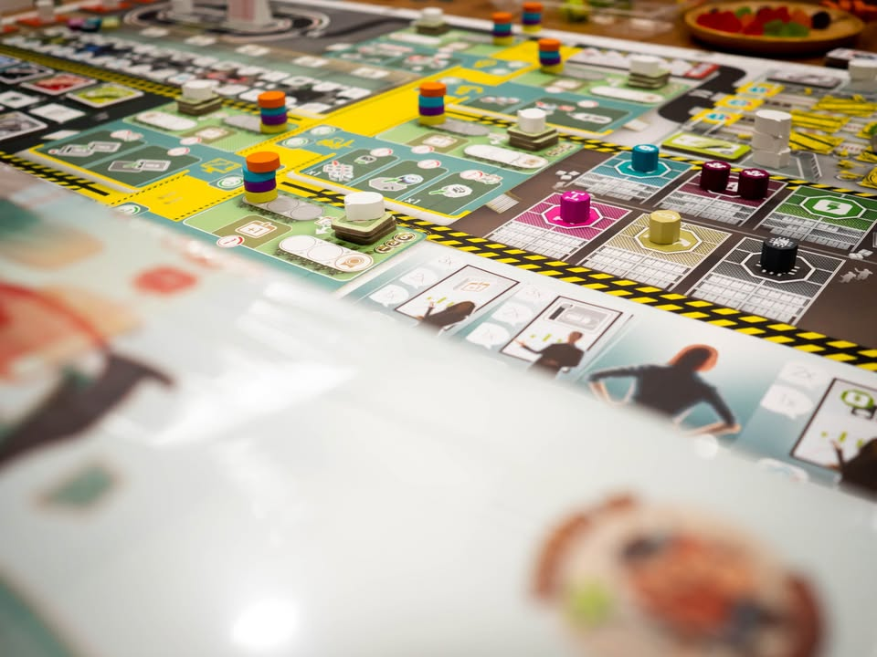
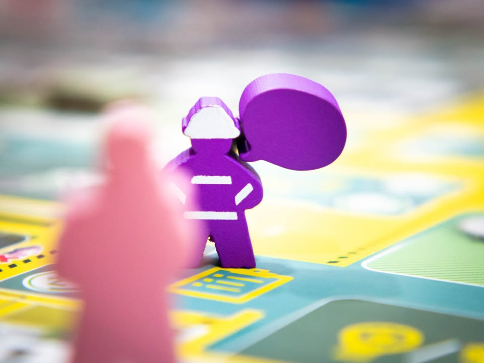
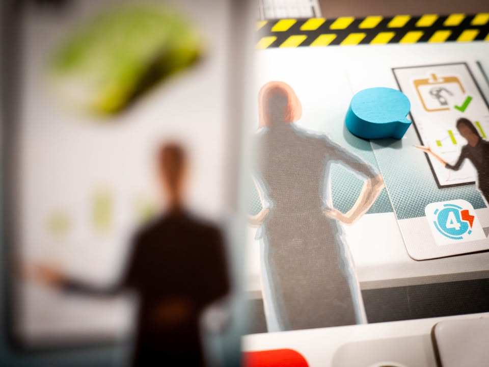
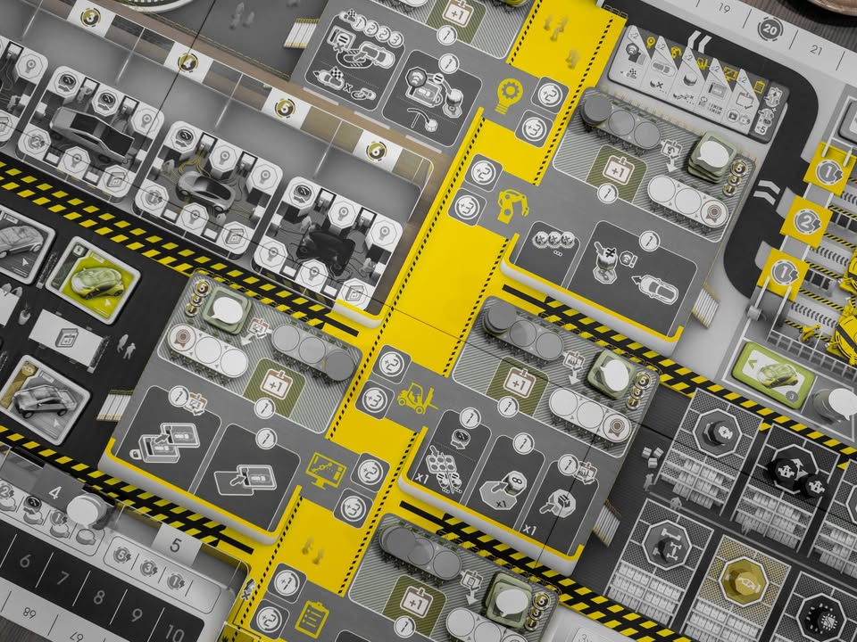
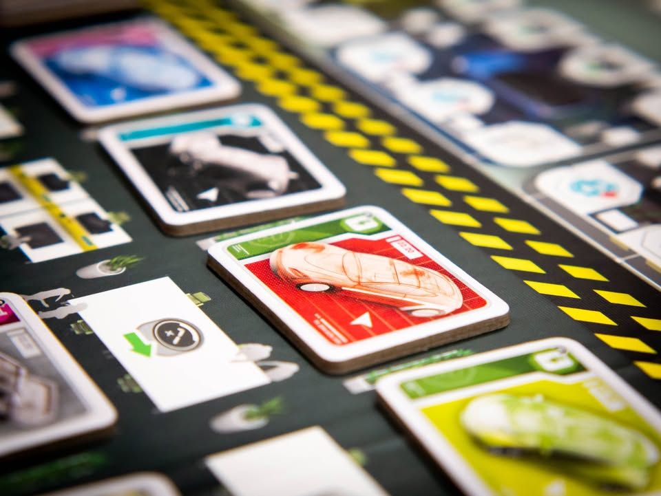
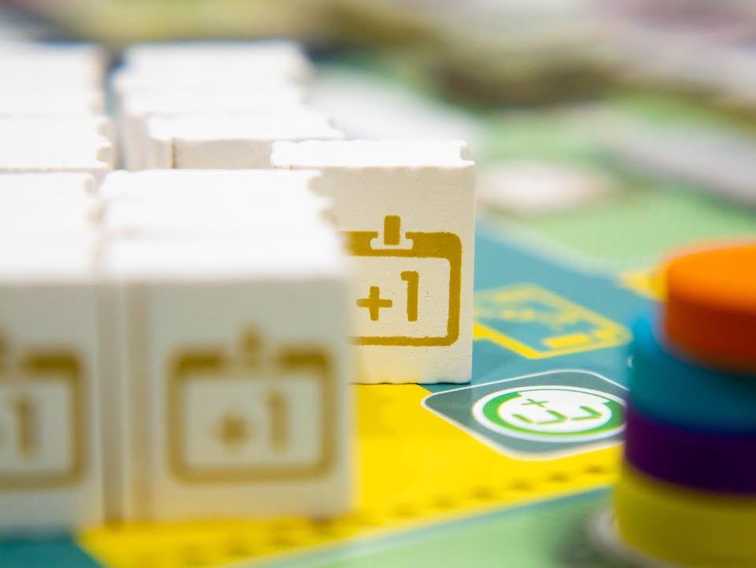
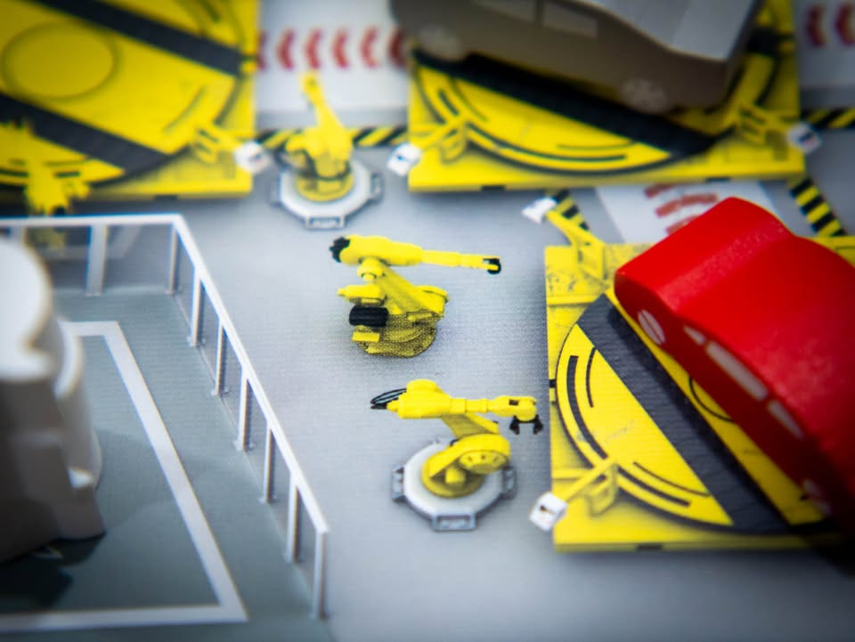
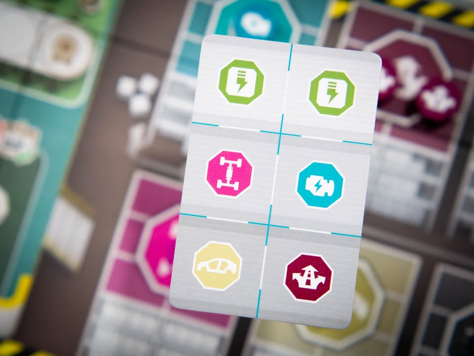

Kanban EV #bite_size
.
📌 กล่องที่ถ่ายรูปนี้เป็นตัวรุ่น KS ที่ทำการปรับปรุงงานศิลป์ใหม่และทำการเพิ่มตัวเสริมเข้าไป แต่ว่าความเห็นนี้จะพูดถึงแค่โมดูลหลักที่เหมือนกับ Kanban ภาคปกติ กล่องที่เล่นนี้เป็นตัว production demo ที่ส่งให้กับ publisher ของไทย และผมไม่ได้มีส่วนได้ส่วนเสียหรือรับสิ่งตอบแทนใดมาเพื่อทำข้อเขียนนี้
.
.
▪️ ขอเล่าอินโทรสั้นๆก่อนเผื่อไม่ทราบกัน คือส่วนตัวผมไม่ถูกโฉลกกับงานของนักออกแบบ Vital Lacerda ซักเท่าไร เพราะเป็นนักออกแบบที่สร้างเกมที่คนที่มีลำดับความคิดแบบผมไม่ถนัดนัก คือเป็นเกมแบบที่เกือบทุกโมดูลของเกมมีความทับซ้อนต่อเนื่องส่งต่อกันในบางแง่มุม โดยที่คุณไม่อาจจะขยับบางโมดูลเดี่ยวๆไปได้ดั่งใจถ้าหากไม่กระทำอีกโมดูลหนึ่งเสียก่อน และโมดูลนั้นก็จะเกี่ยวโยงกับโมดูลอื่นไปอีก ซึ่งถ้าอิงจากชื่อเสียงของเค้าแล้วก็ต้องพูดได้เลยว่า คนจำนวนมาก 'สนุก' กับระบบความคิดแบบนี้ (แค่บังเอิญไม่ใช่ผม) เพราะงั้นจะออกแนวเล่าให้ฟังเฉยๆว่าเกมมันประมาณไหนไปเป็นข้อมูลละกัน
.
.
▪️ ธีมของเกมคือเราจะต้องมาแข่งกันมาบริหารโรงงานผลิตยานยนต์ (โดยที่ลืมๆคำว่า Kanban ที่หมายถึงระบบการจัดการ just-in-time  อันลื่อลั่นของ Toyota ไปก่อน) ตัวเกมเดินด้วยระบบ Worker Placement ที่เราจะส่งตัวเราไปทำงานตามแผนกต่างๆในโรงงาน ก็มีหยิบแปลนรถ, ผลิตชิ้นส่วน, เดินสายการผลิต, ทดสอบและพัฒนายานยนต์ เกมก็มีแค่ 4 แผนกให้ทำวนๆกันไป ในแง่ระบบการเล่นแล้วแต่ละแผนกและโครงสร้างการเล่นถือว่าราบเรียบเข้าใจง่าย
.
.
▪️ ความเข้มข้นของเกมจะอยู่ที่แต่ล่ะแผนกจะมีที่ว่างจำกัด และเกมก็จะมีคุณซานดร้าซึ่งเป็นโทเคนผู้จัดการคอยเดินตรวจตามแผนก ถ้าใครมีผลงานในแผนกนั้นๆไม่ดีก็จะโดนแต้มลบไป แล้วเจ๊แกก็เดินมันทุกรอบพร้อมกับเราเนี่ยล่ะ ไล่ตรวจผลงานกันจริงจัง นอกจากนี้ลำดับการทำแอคชั่นในแต่ละแผนกที่แตกต่างกัน รวมไปถึงสิทธิ์ในการเลือกแผนกในรอบต่อไปก็ขึ้นอยู่กับแผนกที่เราลงตานี้ด้วย ซึ่งต้องวางแผนหลายจังหวะอยู่เพราะเราไม่สามารถทำแอคชั่นในแผนกเดิม และถ้าเล่นแผนกที่ resolve ช้าหรือเร็วไปเราก็อาจจะไม่มีที่วางในแผนกที่เราหมายตาไว้เหลืออยู่
.
.
▪️ ความซับซ้อนที่ซ้อนทับของเกมส่วนหนึ่งจะอยู่ที่การส่งต่อข้อมูลระหว่างแผนก เนื่องจากมันโยงกันได้หลายแบบแล้วแต่สายการเล่น จะขอยกบางมุมมาเล่า คืออย่างเช่นเราอยากได้รถมาเก็บไว้กับตัวเพราะมันจะมีแต้มให้ตอนจบ การจะได้รถมาเนี่ยเราต้องไปเก็บแปลนรถสีตรงกันมาก่อน จากนั้นค่อยไปเก็บรถที่วิ่งอยู่ในแผนกสนามทดสอบรถ โอเคไม่ยากใช่มะ?
.
.
▪️ แต่การที่เรามีมีรถมาวิ่งเล่นสนามต้องมึใครซักคนไปทำงานแผนกประกอบยานยนต์เพื่อดันรถสีนั้นๆออกมาก่อน โดยแรงจูงใจคือแต้มที่เกมจะสุ่มมาให้ ซึ่งความยากคือ 'มันไม่มีใครอยากจะดันรถมาให้คุณ' และ 'คุณเองก็ไม่สามารถดันรถออกมาเองแล้วหยิบเอง' ได้เช่นกันเพราะมันแอคชั่นคนละแผนก ซึ่งตรงนี้ก็จะต้องไปกั๊กไปวางแผนจัดการเอาในเกม
.
.
▪️ คือสำหรับบางคนเกมนี้มันจะมีโมเม้นแบบคนไม่ใช่ทำอะไรก็ผิดอยู่ตลอดเวลาเพราะถ้าคุณพลาดจังหวะบางช่วงไปแล้วกระแสเกมมันจะไม่กลับมาหาเราอีก คิดเยอะไปลืมมองว่าเจ๊มาตรวจงานอ้าวเสียแต้มอีก ฯลฯ ซึ่งก็เป็นหนึ่งในตัวแปรที่ทำให้เกมนี้เป็นเกมหนัก (แต่ซับซ้อนระดับกลาง) และเกมมันยังมี flow ทางความคิดอีกหลายอย่างให้ลองไปสำรวจกัน
.
.
▪️ จุดที่ขัดใจผมมากที่สุด (ซึ่งส่วนหนึ่งน่าจะมาจากระบบความคิดผมเอง) คือระบบการส่งข้อมูลในเกมที่มีทรัพยากรชื่อว่าแปลนรถยนต์ คือเกมนี้จะหยิบรถมาทำแต้มก็ต้องใช้แปลนสีตรง จะอัพเกรดแปลนเพื่อเพิ่มแต้มทรัพยากรก็ต้องสีตรง จะพัฒนารถที่เราหยิบมาแล้วไปคูณแต้มก็ต้องใช้แปลนสีตรง แต่ของมันใช้แล้วทิ้ง แปลว่าเราต้องเดินไปๆมาๆเพื่อหาทางเก็บแปลนสีตรงแล้วเอาไปจ่ายแล้วเดินวนกลับมา แล้วแปลนมันมีจำนวน fixed แปลว่าก็ต้องไปมองอีกว่าคนอื่นหยิบอะไรไปบ้างแล้ว หรือถ้ายังไม่มีก็ต้องรอของมันวนกลับมา ซึ่งตัวผมชอบเกมแบบหยิบของมากองไว้แล้วรอจ่ายมากกว่า อันนี้มันลีลาโยงเยอะเล่นแล้วไม่ค่อยตรงจริตนัก ส่วนระบบ resolve turn order แม้ว่าจะมี depth ที่น่าสนใจดี แต่ก็ไม่คลิกกับคนที่ชอบอะไรตรงไปตรงมาอย่างผมเท่าไร ซึ่งตรงนี้หลายคนก็อาจจะชอบนะ
.
.
▪️ ข้อดีคือมันแลดูมีอะไรให้ทำหลายสิ่ง แต้มได้มาจากหลายทาง ตัวเกมมีระบบช่วยแลกเปลี่ยนทรัพยากรที่ค่อนข้างยืดหยุ่นทำให้เราสามารถโฟกัสกับการวางแผนและออกลำดับขั้นตอนได้มากขึ้น มีแผนระยะกลางอย่างการ์ดเป้าหมายประจำไตรมาสที่มีทั้งส่วนกลางและความลับส่วนตัว ในอีกแง่คือในเชิงระยะสั้นเกมนี้ forgiven ค่อนข้างสูง คือมีที่ให้ใช้แอคชั่นไปทำอะไรสักอย่างตลอด (แม้อาจจะไม่มีประสิทธิภาพ) คือถ้าชอบเกมอื่นของนักออกแบบคนนี้ก็น่าจะชอบแหละ แต่ส่วนตัวผมนั้นก็เอาไปราดน้ำมันเรียบร้อย 
.
.
--------------------------------
หมวด Bite Size (พอดีคำ) นี้กะว่าจะเขียนอะไรสั้นๆประมาณนี้ล่ะกัน ใหม่บ้าง ซ้ำบ้าง เกมที่ขี้เกียจเขียนบ้าง เขียนๆไว้ก่อนเผื่อมีอารมณ์อาจจะขยายไปลง Thought บ้าง จริงๆอยากเขียนสั้นกว่านี้ แต่ยังอดไม่ได้ที่จะต้องอธิบายอะไรเพิ่มตามนิสัย เดี๋ยวค่อยๆปรับไปล่ะกัน

