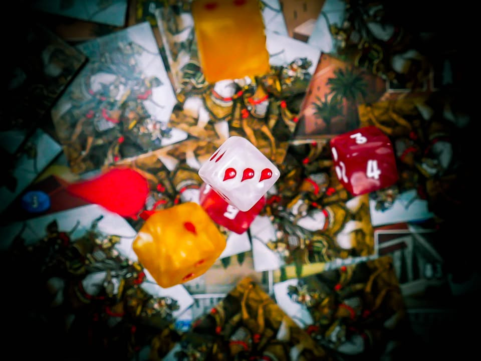
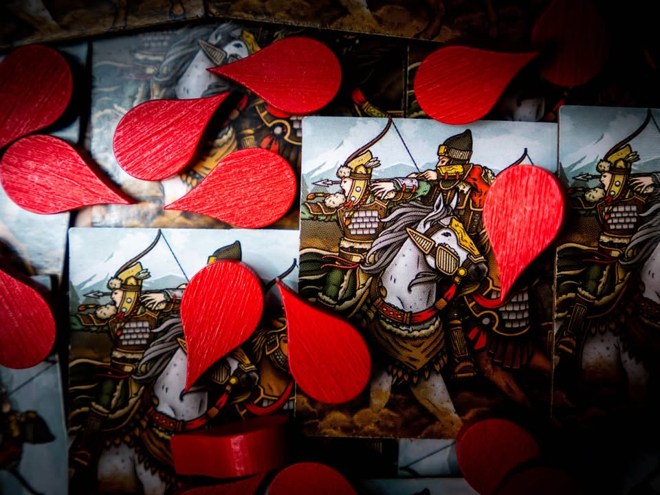
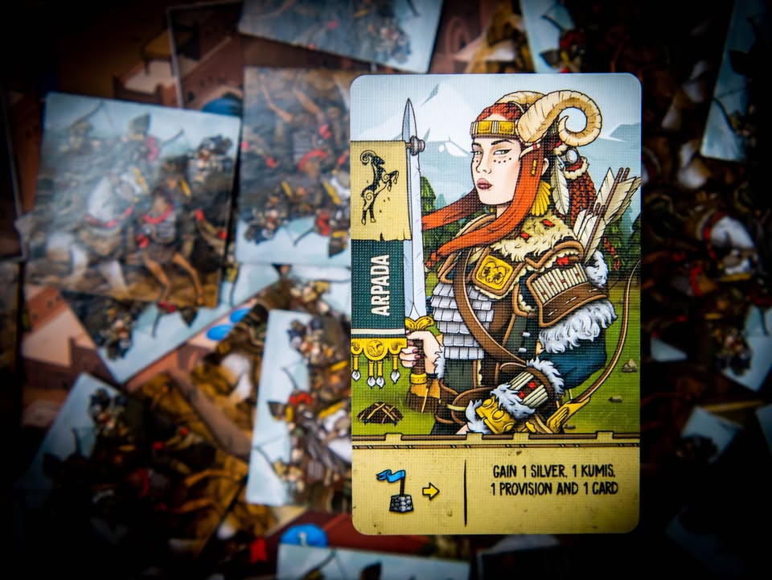
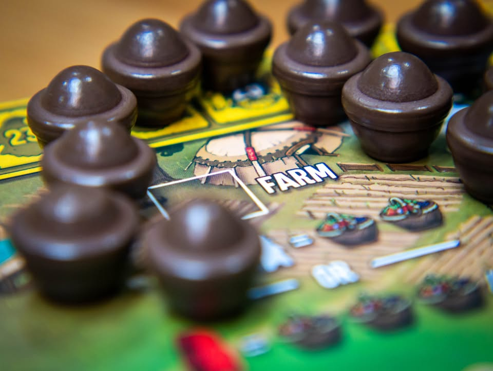
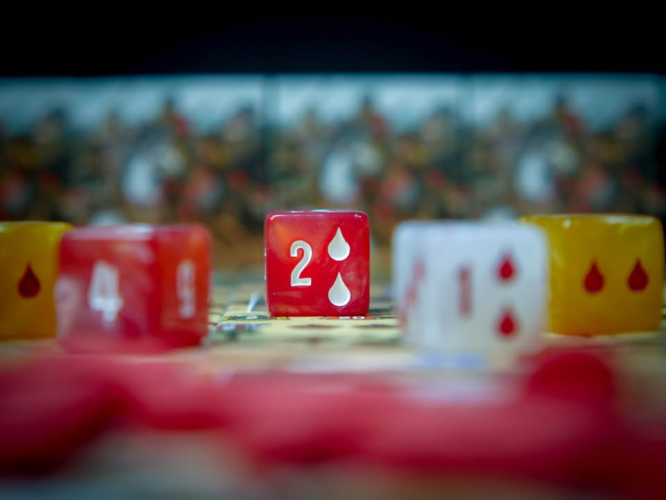
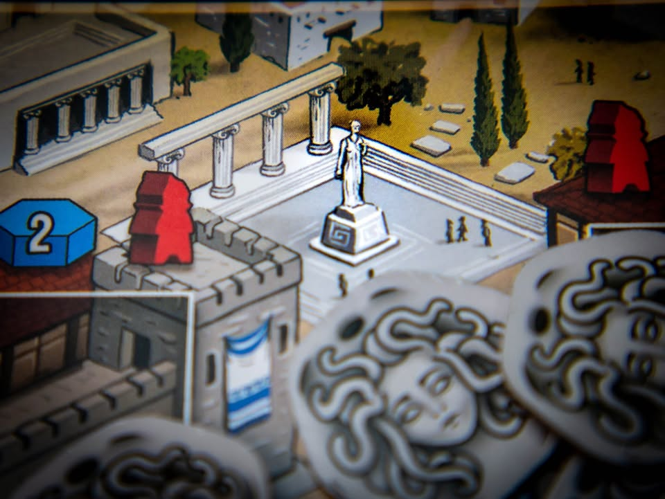
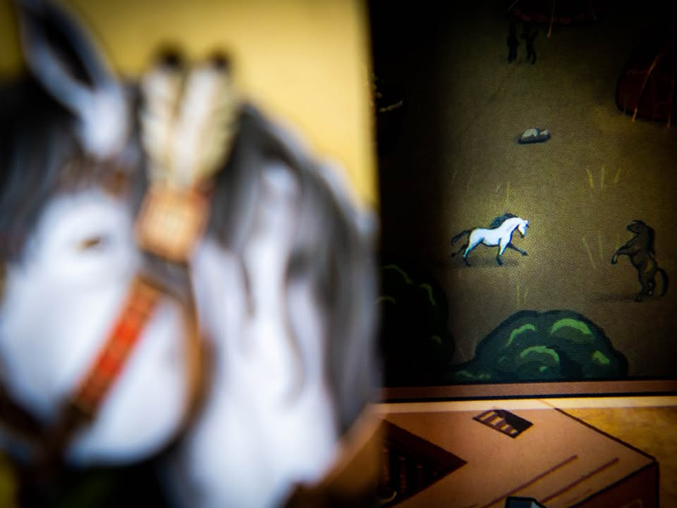
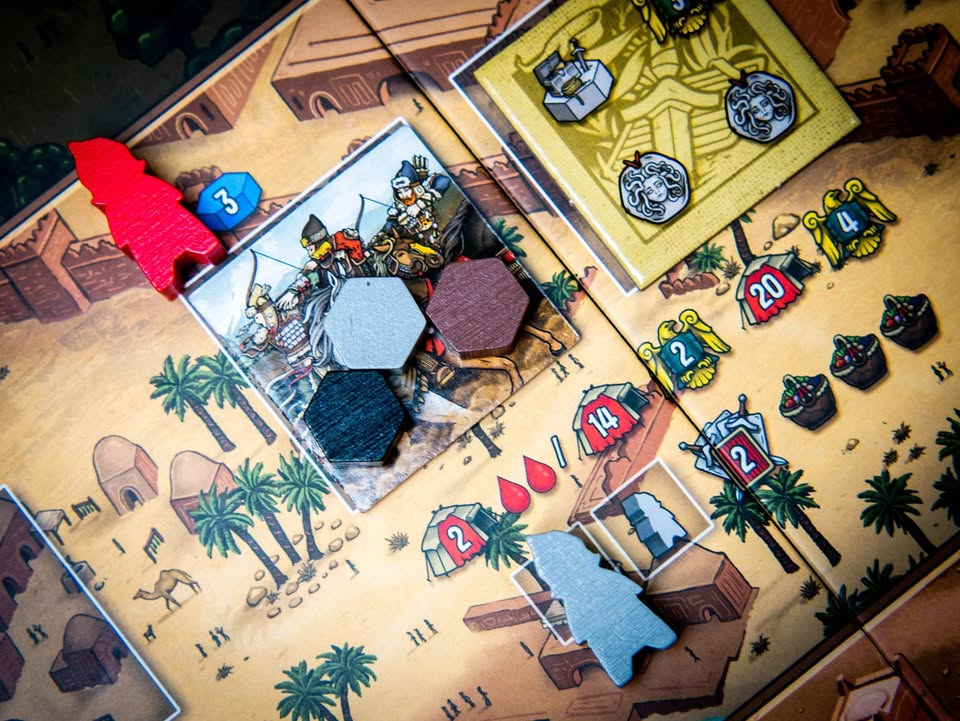
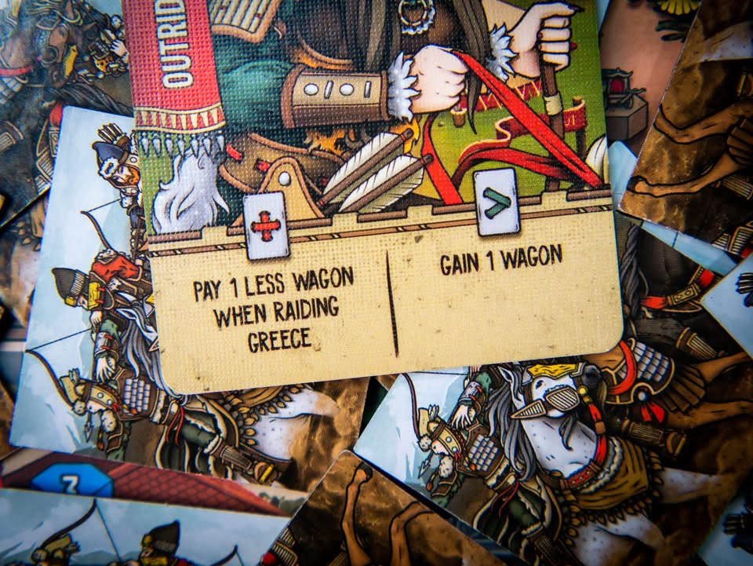

Raider of Scythia #thought #bite_size
blog link: https_://boardnbon.wordpress.com/2020/10/13/raiders-of-scythia/
.
.
▪️ เกมยูโรระดับกลางเบาเล่าถึงชาวไซเทียชนเผ่าเร่ร่อนที่มีชื่อเสียงระบือไกลตั้งแต่ทะเลดำจรดเมืองจีน เชี่ยวชาญการรบบนหลังม้าและยิงธนู ผลงานของ Shem Phillips (Raiders of the North Sea, Architects of the West Kingdom, Paladins of The West Kingdom)
.
.
▪️ ใครเคยเล่น RotNS หรือเล่น RofNS+2Exp มาแล้วข้ามไปอ่านสรุปด้านล่างเลยก็ได้ ถ้าพูดแบบสรุปเลยเกมนี้ก็คือ Raiders of The North Sea  ฉบับ 1.5  เพราะมันเหมือนเอา RotNS + 2Exp มาเปลี่ยนธีมแล้วลดทอน/ปรับจูนบางโมดูลทำให้เป็นกล่องที่สมบูรณ์ในตัวโดยไม่ต้องพึ่งตัวเสริมอีก (แต่ใครจะรู้ตัวเสริมอาจจะงอกมาอีกก็ได้ เพราะมีฐานที่แตกต่างกันไปล่ะ)
.
.
▪️ ไอเดียเกมของเราคือจะต้องสะสมพรรคพวกเข้ากองทัพ จัดหาเงินและทรัพยากรที่จำเป็นในการเข้าตีเพื่อปล้นทรัพยากร ยึดเมืองเสร็จก็กลับมาซ่อมแซมกองทัพจ้างทหารทดแทนพร้อมไปบุกต่อวนลูปไปเรื่อยๆ
.
.
▪️ แกนเกมเดินด้วยระบบทำแอคชั่นสองจังหวะ แบบ 'วาง-ทำ-ดึง-ทำ' ผู้เล่นเริ่มจากมีคนงานหนึ่งคนในมือ หากอยากจะทำแอคชั่นช่องไหนก็เอาคนงานไปลง จากนั้นก็ทำการ หยิบคนงานตัวอื่นที่มีวางอยู่แล้วในกระดานกลับและจะได้ทำแอคชั่นในช่องนั้นด้วย หรือนั้นก็คือได้ทำคนล่ะสองแอคชั่นนั้นเอง ในแง่นี้จะต่างจาก Worker Placement อื่นๆเพราะเราจะมีคนงานแค่คนเดียวทั้งเกมแต่หยิบสลับไปเรื่อยๆ ตรงนี้จะมีผลต่อจังหวะและลำดับการได้ของบางอย่าง อย่างเช่นบางทีอยากเอาเงินแล้วไปจ้างคนเลยก็จะทำไม่ได้ถ้าดันมีคนวางอยู่ตรงช่องเงินแล้วไรงี้ ก็เป็น noise เล็กๆที่ทำให้ขัดใจบ่นเพื่อนได้เป็นบางที
.
.
▪️ เกมค่อนข้างง่ายตรงไปตรงมา แต่ลีลาจุดหลักที่ทำให้แต่ล่ะเกมแตกต่างกันก็คือเหล่าการ์ดลูกน้องเราจะจั่วได้ระหว่างเกมซึ่งก็มีความสามารถสองแบบ คือแบบหนึ่งจะมีผลต่อเมื่ออยู่บนบอร์ดเราและอีกแบบคือมีผลต่อเมื่อทิ้งไป ทำให้ต้องบริหารความอยากใช้ให้ดีเพราะใช้อันนึงก็จะเสียอีกอันหนึ่ง
.
.
▪️ พอสะสมกำลังทรัพพอเราก็จะไปลงแอคชั่นตีเมือง ที่ในแต่ล่ะช่องจะมีข้อจำกัดบอกไว้ว่าต้องมีลูกน้องอย่างน้อยกี่คน ต้องจ่ายค่าอาหารเดินทัพเท่าไร พร้อมบอกว่าถ้าพลังโจมตีเรามีเท่าไรก็จะได้แต้มเท่านั้นเท่านี้ โดยทุกครั้งที่สู้ก็จะมีการทอยเต๋าเพื่อดูโบนัสบวกพลังและค่าบาดเจ็บที่ทหารเราต้องโดน (ค่อนข้างการันตีว่าโดนแน่ๆ) ทุกครั้งที่บุกตีชนะเควสประจำพื้นที่จะเปิดให้เราสามารถเอาของไปแลกทำแต้มได้
.
.
▪️ ทหารที่บาดเจ็บเนี่ยถ้าเลื่อดเต็มก็ตายไปต้องไปหาจ้างมาใหม่ แต่ถ้าไม่ตายเลือดก็จะมีผลทำให้พลังโจมตีลดลงทำให้เวลาไปรบรอบหน้าโอกาสได้แต้มสูงจากพลังรบที่เยอะกว่าก็จะลดลง ก็ต้องบริหารกันไปว่าจะฮีลเพราะเก่งดีหรือจะหาจังหวะปล่อยตายสวยๆแล้วหาตัวใหม่มาแทนโดยไม่เสียจังหวะพัก เพราะเมืองที่จะให้ตีได้มีจำกัด ซึ่งเกมจะมีการ์ดเสริมพลังในรูปแบบของการ์ดขี่ม้าและนกเหยี่ยวที่มีทั้งสายเพิ่มพลังบุก กับสายที่ช่วยให้เราใช้งานพลังพิเศษของลูกน้อง 
.
.
▪️ เกมจบลงเมื่อเรากวาดพื้นที่ในเกมจนราบเป็นหน้ากลองได้สำเร็จ
.
.
▪️ ก่อนที่คุณจะคิดว่ามาออก re-skin อะไรแบบนี้โปรดอย่าลืมว่า RotNS นี้เกมออกมา 6 ปีแล้วนะ และผมก็คิดว่ามันเป็นตัวเลือกที่น่าสนใจมากสำหรับคนที่ไม่เคยเล่น RotNS มาก่อน จัดตัวนี้ได้อารมณ์ครบเลยราคาถูกกว่าสามเท่า แต่เอาจริงๆรสมันก็ต่างกับ RotNS มากพอที่คนที่มีอยู่แล้วจะมาเล่นก็ไม่รู้สึกว่าซ้ำซาก แต่ถ้าจะเก็บสองปก คิดว่าถ้าไม่ใช่แฟนค่ายอาจจะถือว่าซ้ำซ้อนไปซักหน่อย แต่ถ้ามองว่าเหมือน Ticket To Ride หลากแผนที่ก็โอเคนะ
.
.
▪️ เกมนี้ถือว่าเบากว่าจริตผมไปเยอะอยู่เหมือนกัน ข้อดีคือระบบเข้าใจง่าย กระแสเกมไม่หลงทางโดยที่ยังมีตัวเลือกออกท่าทำคอมโบที่หลากหลาย ข้อเสียคือแม้เกมจะโทนสร้างทัพตบตี แต่เวลาเล่นมันค่อนข้างงึมงำทำคอมโบส่วนตัวไม่ค่อยสนเพื่อนเท่าไร และด้วยความที่ไม่มีระบบ catch up ถ้าเพื่อนคนไหนทำคอมโบประหยัดแอคชั่นได้ก่อนคนนั้นก็มักจะชนะไปได้อย่างสบายๆ
.
.
▪️ สำหรับกลุ่มที่ไม่ใช่สายดุดันแล้วภาษาไม่ใช่ปัญหาก็คิดว่าเป็นเกมที่สนุกอีกเกมครับ
.
.
▪️ สรุปก็เป็น RotNS ที
◽️ มีความ Asymmetric จากหัวหน้าเผ่าเริ่มต้น
◽️ เปลี่ยนระบบเพิ่มพลังการตีแบบทื่อๆ ไปเป็นซื้อการ์ดขี่ม้า เลี้ยงนกเหยี่ยวเพิ่มพลัง 
◽️ ใส่ระบบ Quest จาก Exp มาให้เลย โดยตัดระบบ offering ที่ซ้ำซ้อนออกไป 
◽️เอาวัลคีรี่โทเคนออก แล้วใส่ระบบเลือดจาก Exp มาเป็นแกนเลย ทุกครั้งที่บุกตีต้องเจ็บแทนที่จะตายทันที
◽️ ไม่มีระบบ Jarl ของ ตัวเสริม Fields of Fame (น่าจะเพราะมันมีความ sub-module เอกเทศเยอะไปหน่อย เล่นล่ะหลุดโฟกัส)
◽️ เพิ่มระบบที่ช่วยให้ใช้งานความสามารถใช้ครั้งเดียวทิ้งของลูกน้องทำให้สามารถวนลูปใช้ซ้ำได้
.
.
--------------------------------
หมวด Bite Size (พอดีคำ) นี้กะว่าจะเขียนอะไรสั้นๆประมาณนี้ล่ะกัน ใหม่บ้าง ซ้ำบ้าง เกมที่ขี้เกียจเขียนบ้าง เขียนๆไว้ก่อนเผื่อมีอารมณ์อาจจะขยายไปลง Thought บ้าง จริงๆอยากเขียนสั้นกว่านี้ แต่ยังอดไม่ได้ที่จะต้องอธิบายอะไรเพิ่มตามนิสัย เดี๋ยวค่อยๆปรับไปล่ะกัน

