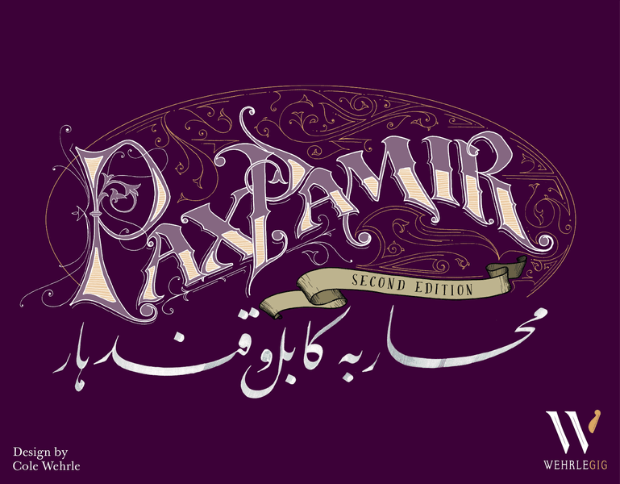

#news Golden Elephant Award รางวัลที่จัดโดย Heavy Cardboard อันเป็นกลุ่มคนที่ชื่นชอบการเล่นเกมที่ใช้ความคิดเยอะได้ประกาศเกมอันดับหนึ่งของพวกเค้าจากปี 2019 (เลื่อนประกาศเพราะติดโควิท มาเป็นวันนี้ตอนเช้าตรู่เวลาไทย)

อันดับหนึ่งคือ Pax Pamir 2nd Edition ซึ่งเป็นเกมโปรดเกมหนึ่งของผมด้วย เล่าถึงการเป็นชนเผ่าเล็กๆในอัฟกานิสถานที่ต้องเลือกข้างเข้าหามหาอำนาจที่กำลังควบคุมดินแดนในช่วงนั้น (เกมดีย์ปกสีม่วงอีกต่างหาก)

ส่วนเกมอื่นๆในลิสก็ถือว่าเป็นเกมที่น่าสนใจเช่นเดียวกัน (แต่ Pipeline นี้ผมเผาไปล่ะไม่โดนจริงจัง อันอื่นจัดว่าชอบทุกอัน ซึ่งมีเขียนถึงไว้แล้วทุกอันนอกจาก Bios:Origins ที่พึ่งเล่นไปรอบเดียวยังไม่พร้อมเขียน เกมรายละเอียดเยอะ)

Barrage

Bios: Origins (second edition)

City of the Big Shoulders

Pax Transhumanity

Pipeline

ที่มา: https_://www.youtube.com/watch?v=GAPaQicZbTo

