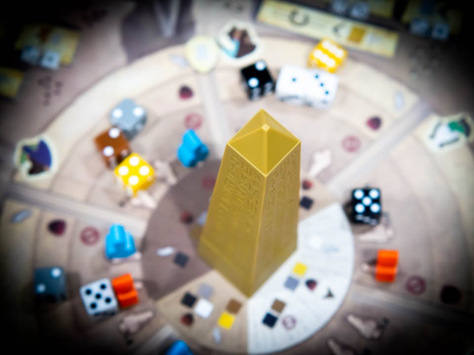
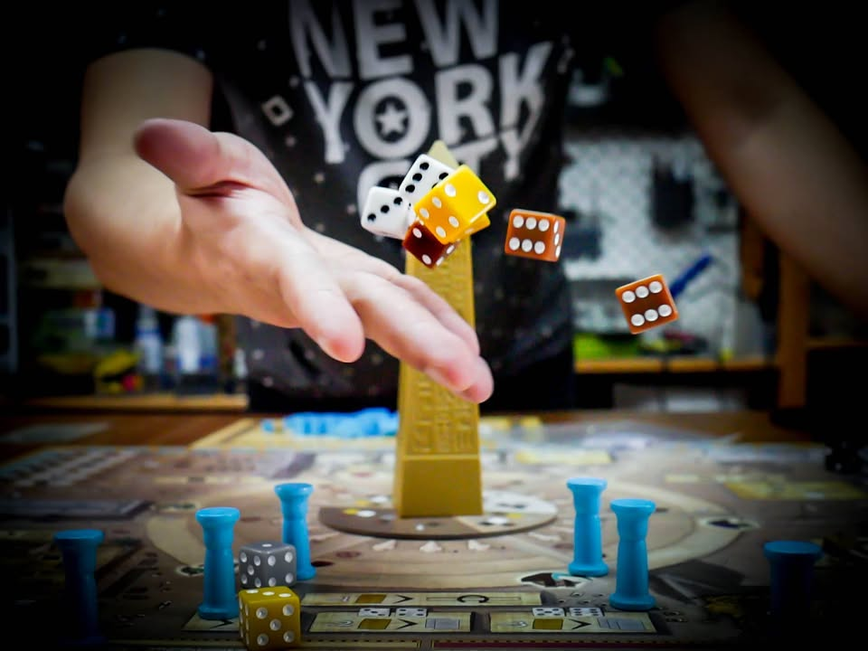
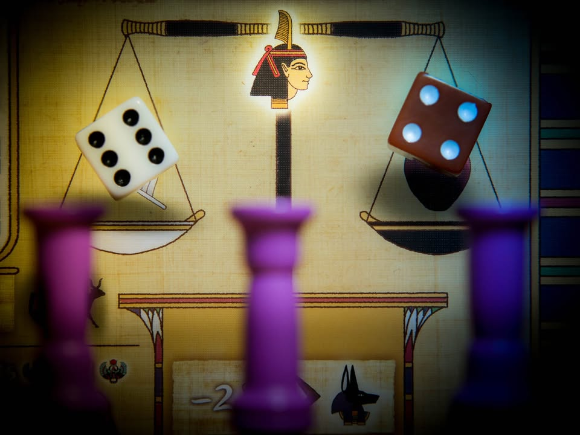
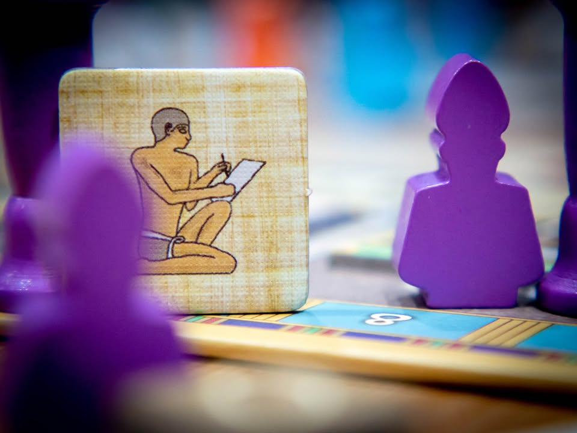
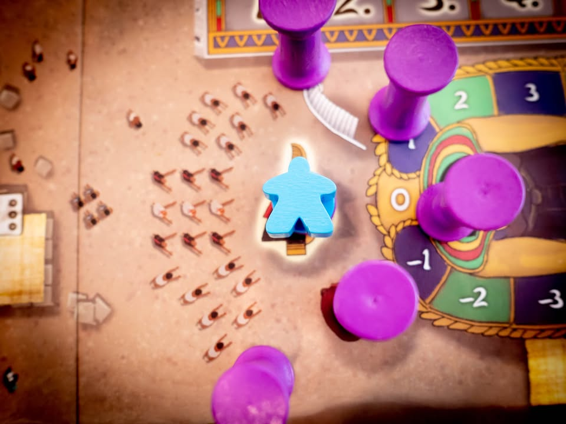
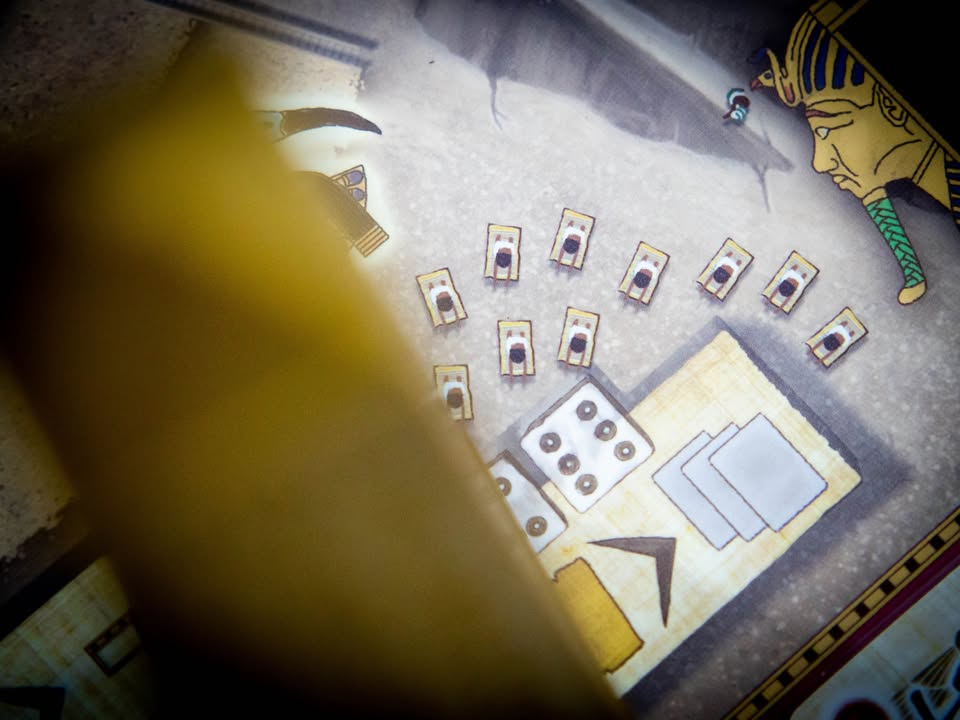
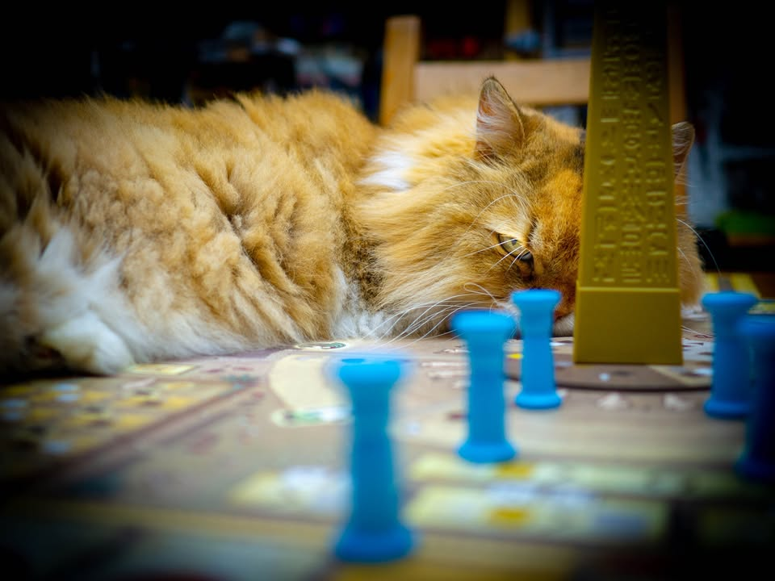

Tekhenu: Obelisk of the Sun #thought
blog link: https://boardnbon.wordpress.com/2020/10/22/tekhenu-obelisk-of-the-sun/
.
▪️ เกมยูโรระดับกลางหนักที่จะให้เรามาก่อสร้างวิหารเทพเจ้าในอียิปต์โบราณ ผลงานของ Daniele Tascini (Tzolk'in, Teotihuacan, The Voyages of Marco Polo ) และได้ Dávid Turczi มาช่วยทำ Solo Mode ให้
.
.
▪️ แกนหลักของเกมเป็น Dice Drafting ที่เราจะผลัดกันหยิบลูกเต๋าหลากสีมาทำแอคชั่นโดยเต๋าจะทุกสุ่มเติมเข้าไปในพื้นที่หกส่วนแทนหกแอคชั่นรอบแท่นโอเบลิสก์ อยากทำแอคชั่นไหนก็ให้หยิบเต๋าออกจากช่องนั้นเอา โดยแต่ล่ะแอคชั่นก็จะมีธีมเทพองค์นั้นอยู่จางๆ ตัวเลขหน้าเต๋าก็มีผลในแต่ล่ะช่องแตกต่างกันไป ถ้าพูดกว้างๆแล้วก็สไตล์เกมยูโรที่ให้เราไปสร้างสิ่งปลูกสร้างเอาโบนัส หรือเพิ่มศักยภาพในด้านต่างๆ เพื่อทำแต้มไปเรื่อยๆ
.
.
▪️ สิ่งที่ทำให้เกมซับซ้อนนั้นมาจากหลายเลเยอร์เริ่มจากทั้ง 6 แอคชั่นของเกมจะมีพื้นที่แสงตก, เงามืด และที่ร่ม อันเกิดจากธีมว่าลูกเต๋าโดนเสาโอเบลิสก์บังแดดอยู่  ที่นี้ลูกเต๋าแต่ล่ะสีจะมีการกำหนดเอาไว้แล้วว่าหากอยู่ในสภาพแดดแบบไหนมันจะมีคุณสมบัติเป็น ความดี, ความเลว และห้ามใช้ ที่แตกต่างกัน ซึ่งสภาพแสงนี้จะมีการหมุนเปลี่ยนเป็นระยะ หมายความว่าเราต้องวางแผนเผื่อสภาพการใช้งานเต๋าไว้ล่วงหน้าด้วย เพราะถ้าลืมคิดไปวนมารอบหน้าอ้าวเต๋าที่เล็งไว้โดนล๊อกซะแล้ว....
.
.
▪️ ระบบความดี-เลวของลูกเต๋าคือเมื่อหยิบลูกเต๋าไปจะต้องวางไว้บนรูปตาชั่งในบอร์ดส่วนที่แบ่งออกเป็นสองข้าง ทุกๆช่วงเวลาหนึ่งในเกม ก็จะให้เราเอาผลต่างของลูกเต๋ามาชั่งเทียบกันโดยผู้เล่นที่ค่าความดีเลวใกล้เคียงกันก็จะได้เล่นก่อน แต่ถ้าใครทำชั่วหนักมือไปนิดก็จะโดนแต้มลบพอให้มีธีม ซึ่งช่วงนี้ดึงมาจากธีมความเชื่อว่าเมื่อเราตายไปแล้ว เทพี Maat จะเอาคนขนนกที่แทนความดีของเรามาชั่งเทียบกับความชั่วนั้นเอง
.
.
▪️ คีย์สำคัญอีกอย่างหนึ่งคือนอกจากเต๋าจะเอาไปทำแอคชั่นแล้วเรายังต้องแบ่งไปสีของลูกเต๋าเพื่อผลิตทรัพยากรด้วย โดยจะได้ของตามสีและหน้าเต๋า แต่มีเงื่อนไขว่าถ้าผลิตเกินที่เรามีศักยภาพก็จะโดนเอาของส่วนเกินไปถ่วงตาชั่งแทน ของก็ไม่ได้แถมความโลภก็ไปถ่วงชีวิตหลังความตายอีก
.
.
▪️ เกมจะจบลงเมื่อทุกคนทำไปคนล่ะ 16 แอคชั่น (หยิบเต๋า 16 ครั้ง)
.
.
----------------------------------------------------------
🐸 Someone I know - หญิงสาวสวยที่จะชวนกินข้าวทีก็ดูจะต้องมีพิธีรีตองกับจานชามช้อนส้อมเป็นหนักหนา
----------------------------------------------------------
.
.
🔹 ผมคิดว่ามันเป็นเกมที่ดีนะ มีการใช้ความคิดที่ค่อนข้างสนุกเลย แต่ไม่ค่อยอยากจะกางเล่นเท่าไรด้วยเหตุผลว่ามันมี Interlock ในแบบที่เกินรสนิยมผมไปเยอะพอดู แต่ผมเชื่อว่าคนที่ชอบกลิ่นแบบ Vital Lacadar น่าจะชอบเกมนี้ได้ไม่ยาก
.
.
🔹 คือคุณจะเจอความรู้สึกประมาณว่า ถ้าจะทำแอคชั่นนี้ แต่จริงๆแล้วถ้าไปทำอันอื่นก่อนอันนี้ก็จะคุ้มกว่านิหว่า อ้าวเห้ยทำแบบนี้แล้วเต๋าไม่บาลานซ์ เชี้ยแล้วเลขที่อยากได้มันไม่มี แล้วอ้าวหลายแอคชั่นถ้าหน้าเต๋าไม่เป็นใจก็ทำแอคชั่นไม่คุ้มอีก บลาๆ แล้วก็เริ่มวนลูป  ทำให้ลำดับความคิดในการเล่นครั้งแรกๆนั้นค่อนข้างสับสนได้ง่าย แต่พอเล่นประมาณครั้งที่สองขึ้นไปเมื่อเราเข้าใจการส่งต่อข้อมูลในเกมแล้วเกมก็จะสนุกขึ้นมาก
.
.
🔹 คือมันเล่นกับอารมณ์อยาก optimized ของเราเยอะจนหงุดหงิด เพราะเกมมีให้เราแค่ 16 แอคชั่นเท่านั้นเอง สุดท้ายก็ต้องตัดใจหยิบๆทำของที่ทำได้ไป ซักพักพอเวลาหมุนไปอ้าวชนิดเต๋าเปลี่ยน คือมันมีอะไรต้องให้คิดตามหลายอันทั้งๆที่จริงๆเกมก็ไม่ได้ซับซ้อนอะไร..... ซึ่งอย่างที่บอกถ้าคุณชอบอะไรแบบนี้ ตรงนี้จะถือเป็นข้อดีเลยล่ะ
.
.
👁‍🗨 ระบบหน้าถ่วงดุลเต๋าเป็นระบบที่น่าสนใจในเชิงความคิดดี แต่ตอนเล่นแล้วผมคิดว่ามันน่ารำคาญไปหน่อย คือมันสำคัญแหละเพราะมีผลต่อ Turn Order ที่จะเรียงความความเข้าใกล้ส่วนต่างศูนย์ของลูกเต๋า แต่ผมรู้สึกว่ามันกลับทำให้เรามีเลเยอร์การคิดเพิ่มโดยไม่จำเป็นนัก เพราะแค่การ optimized แอคชั่นออกท่าที่แอบยึกยักมันก็เหนื่อยพออยู่แล้ว 
.
.
🔸 จุดที่คิดว่าเป็นข้อเสียจริงจังคือเกมนี้แต้มมาเยอะจากการ์ดโบนัสประเภทเก็บ X มี Y จะได้ Z แต้มซึ่งก็มีหลากหลาย จุดดีคือมันห้ามเคลมซ้ำหมวดกันพวกดวงดีเคลมเมามัน แต่จุดเสียคือมันดวงเอามากๆ แต่ละใบยากง่ายไม่เท่ากันอย่างเห็นได้ชัดแต่แต้มดันใกล้เคียงกัน จังหวะตาแรกที่ได้ใบนี้มาฟรีถ้าได้ใบยากนี้จะเหนื่อยชีวิตมาก และการจะไปจั่วเพิ่มก็ทำแอคชั่นหลายอย่างโดยที่จำนวนตัวเลือกมีให้น้อยมาก
.
.
🔸 จุดติอื่นค่อนข้างจะเรื่องเล็กแต่ก็เป็นเรื่องของความจุกจิกเสียมากกว่า อย่างการต้องคอยระวังสภาวะของลูกเต๋าหรือการคำนวนแต้มที่ค่อนข้างชวนสับสน อย่างเกมมีให้เราสร้างวิหารและบ้านรอบๆ แล้วมันจะแบบตอนสร้างอย่างนึงได้แต้มแบบหนึ่ง ตอนคิดคะแนนก็จะอีกแบบหนึ่ง ตัว player aid ก็เขียนรวบรัดแบบไม่ได้สรุปการคิดแต้มที่วางอยู่กระจัดกระจายตามบอร์ดเท่าไร และมีอารมณ์ที่รู้สึกคือต่างคนต่างก้มหน้าทำสายตัวเองมากไปหน่อย
.
.
🔸 กับไอ้เสาโอเบลิสก์เนี่ยแม่งเกะกะฉิบหายอันโคตรใหญ่บังเต๋าอีกฝั่งหมดเลย
.
.
💬 จริงๆผมแอบชอบการนำเสนอในเกมนี้อย่างหนึ่งตรงที่มันแทบไม่ได้เล่นกับ stereotype ที่ใช้กันเกลื่อนของอียิปต์เท่าไร จำพวกพีระมิด, สฟิงซ์, ฟาโรห์, ไนล์, อูฐ ไรงี้แต่ครอบธีมนำเสนอผ่านธีมองค์เทพแทน (แต่ในอีกแง่หนึ่งเกมธีมเทพโรมันก็ใช้ทริคนี้บ่อยแล้วเหมือนกัน...ฮา)
.
.
💬 เกมดีนะ สมควรไปอยู่ตามลิสดีๆประจำปีนี้ แต่แค่สำหรับผมแล้วความลีลาของเกมมันไม่คุ้มกับความสนุกซักเท่าไรเท่านั้นเอง
----------------------------------------------------------
Compatible Level - เกมนี้เข้ากับคนเขียนได้ระดับไหนนะ!!

🐸 Family, อาจจะมีช่วงเวลาที่ไม่เข้าใจกันบ้างแต่ครอบครัวคือสิ่งที่จะอยู่กับเราตลอดไป นี้คือเกมที่จะมีพื้นที่ถาวรในชั้นวางแน่นอน!! แม้บางเกมจะเปรียบดั่งคุณปู่ใจดีที่ได้เจอกันแค่ปีล่ะครั้ง แต่อันดับในใจนั้นคือความสนุกในช่วงเวลาที่เล่น หาใช่การได้เล่นซ้ำไม่รู้เบื่อเพียงอย่างเดียว [ex. กบโปรด, กบชอบ]

🐸 Hang out friend, เพื่อนกินเที่ยว ถ้าไม่ติดธุระอันใดก็พร้อมจะออกไปพบเจอ สนุกยามได้พบปะ แต่จะให้เจอกันบ่อยๆคงใช่ที - เกมสนุกที่อยากเล่นในระดับที่อยากจะหยิบกางเป็นบางครั้ง สลับสับเปลี่ยนไปเรื่อยตามจังหวะและโอกาส แต่เราก็ไม่ได้อยากซ้ำต่อเนื่องรัวๆ [ex. กบโอเค]

🐸 Someone I know, หากบังเอิญพบเจอ ก็คงได้ทักทายไต่ถาม หากแต่ในยามปกติมิอาจนึกชื่อออก ยืนคุยก็ได้ แต่คงไม่ได้เอื่อนเอ่ยนัดกินข้าว - บางเกมเราก็ไม่ได้อยากชวนเล่น แต่ถ้าไม่มีอะไรทำแล้วมีคนชวนก็เล่นก็ได้ [ex. กบเฉย]

🐸 I Turn left, You Turn Right - เธอชอบกินเผ็ด เราชอบกินอาหารญี่ปุ่น เธอชอบคนคารมดีพาไปกินที่หรู แต่เราชอบเล่นเกมอยู่กับบ้าน แม้จะได้คุยเป็นบางคราแต่คงไม่อาจพัฒนาความสัมพันธ์ - บางเกมแม้ว่าจะดีแค่ไหน แต่ถ้ารสนิยมมันไปด้วยกันไม่ได้ก็ไม่รู้จะเล่นไปทำไม [ex. กบไม่เล่น]
 
 
อนึ่ง : เป็นความรู้สึกในความ "อยากจะหยิบมาเล่นไหม?" ของผมเอง ไม่ได้เกี่ยวอะไรกับคุณภาพของเกม ไม่อิงมาตราฐานอื่นใดนอกจากตัวเองเท่านั้น ดูให้เป็นแค่ "อีกความคิดเห็นหนึ่ง" เท่านั้นก็พอนะครับ :)

