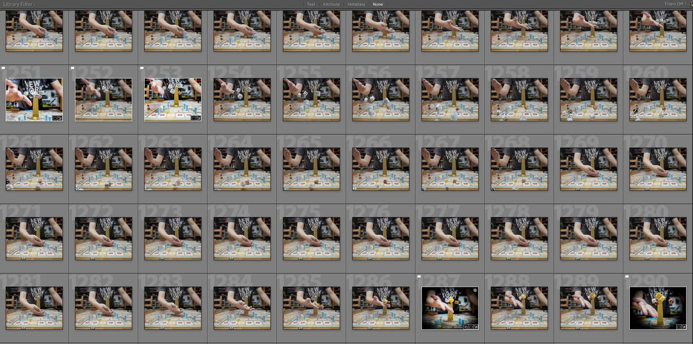
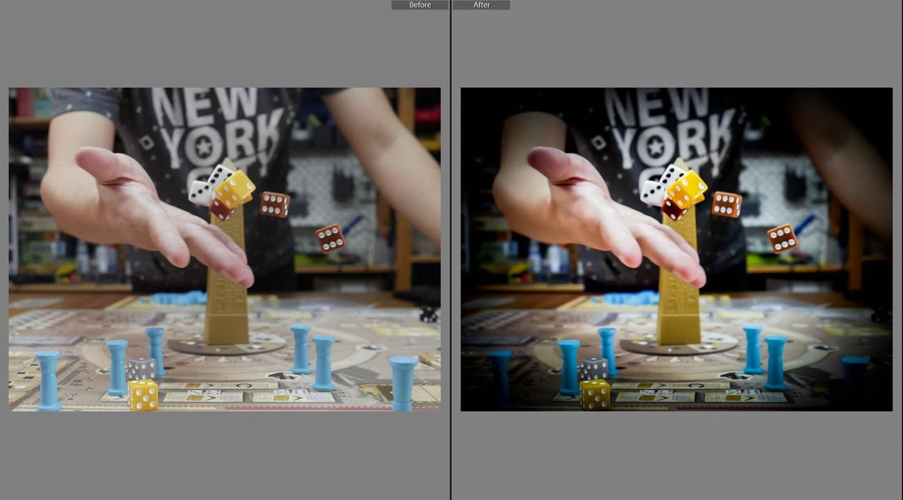
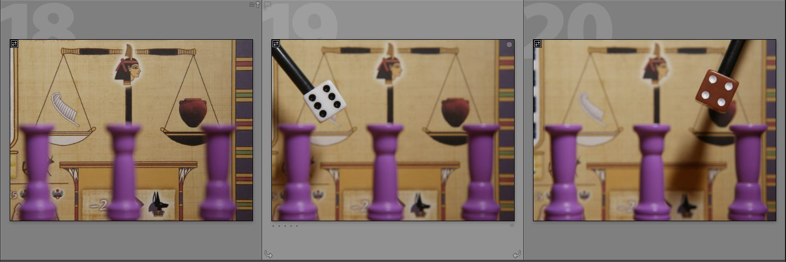
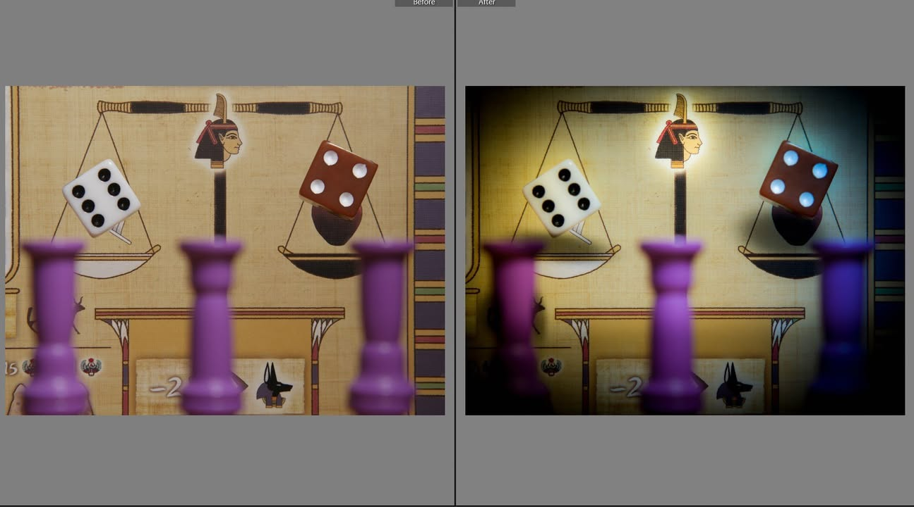

คิดๆแล้วอยากเล่าต่อจากตอนก่อนอีกนิดว่าด้วยการถ่ายของลอยกลางอากาศ

🔹 รูปโยนเต๋าเนี่ยเป็นรูปที่เลือกมาจากรูปเกือบ 2000 รูป
.
.
▪️ โดยไอเดียแล้วก็ไม่ได้ยุ่งยากอะไร จัดฉากนิดหน่อย ตั้งให้ shutter speed ให้ไวๆเข้าไว้ (ของผมใช้ 1/500) เปิดไฟให้เยอะเท่าที่จะมากได้ (เพราะ shutter speed เยอะภาพจะมืดเนื่องจากแสงเข้ากล้องน้อย) เอารีโมทต่อกล้องไว้มือนึง พอกด shutter ให้มันถ่ายไปเรื่อยๆ แล้วก็เอาอีกมือนึงโยนเต๋า แล้วค่อยมาเลือกรูปก็จบ.....
.
.
▪️ แต่ความยากของวิธีนี้คือ 'ดวง' เพราะเราจะไม่มีทางความคุมได้ว่าอันไหนจะอยู่ในตำแหน่งและความชัดที่เราต้องการ ตอนที่ถ่ายครั้งนึงเนี่ยจะได้รูปมาราวๆ 40-60 รูป โยนที่นึงก็ต้องเดินไปก้มเก็บของที่ร่วงทีนึง เช็คหลังกล้องทีนึงว่าได้ดั่งใจไหม แล้วก็วนลูปก่อนจะเอาเข้าคอมพ์มาดูภาพใหญ่อีกที ซึ่งการทำแบบนี้ติดกัน 30 รอบก็เป็นอะไรที่ใช้พลังจิตเยอะเหมือนกัน ทำคนเดียวด้วยล่ะก็จะวุ่นๆนิดนึง
.
.
▪️ แต่ก็สนุกดีนะ มันจะมีความหงุดหงิดแบบมือมันไม่ได้ เต๋ามันไม่ใช่ บลาๆประมาณหนึ่ง คือการที่เราจะเอามือวางต่ำๆแล้วโยนเต๋าให้มันกระจายเนี่ยมันยากกว่าที่ผมคิดไว้เยอะเลย ตอนถ่ายส่วนมากมีแต่มืออยู่สูงไป
.
.
🔹 รูปเต๋าบนตาชั่งเป็นรูปแรกที่ผมเอามาลงโดยผ่าน Photoshop
.
.
▪️ ที่ผ่านมาผมจะ process จบใน lightroom หมด พวกตัดภาพ จัดองค์ประกอบ ปรับสี ใส่ขอบดำ ไรงี้ แต่ลูกเต๋าบนตาชั่งเนี่ยพอดีผมไปเจอคลิปฝรั่งทำทริคโยนของแบบเฟคๆดูแล้วเออน่าลองดีก็เลยลองทำมั้ง  
.
.
▪️ จริงๆก็ไม่ได้ยุ่งยากอะไรแค่ตั้งกล้องทิ้งไว้แล้วถ่ายมุมเดิมสามครั้ง แบบมีแต่พื้นหลัง แบบมีเต๋าซ้าย และแบบมีเต๋าขวา จากนั้นก็ตัดๆเอาภาพมารวมกัน จากนั้นก็เอารูปกลับเข้ามาทำสีผ่าน lightroom แบบเดิม เน้นทำสีให้ดูด้านมืดมันเหมือนกลางคืนหน่อยๆด้วยสีน้ำเงิน กับใส่ให้เทพีดูเรื่องๆนิดนึง
.
.
▪️ ข้อดีคือถ่ายเสร็จจบในสามแชะ ที่เสียดายจริงๆก็คือมันดูไม่ค่อยเหมือนเต๋ากำลังลอยอยู่แบบที่อยากให้เป็นเท่าไร เหมือนวางไว้เฉยๆมากกว่า น่าจะเป็นเพราะทำตำแหน่งไฟไม่ค่อยดีเท่าไร แต่เสาที่วางด้านหน้าให้เป็น foreground ก็ดูจะช่วยเพิ่มเรื่องมิติภาพได้ดี 
.
.
▪️ ซึ่งทริคแบบนี้น่าจะต้องไปฝึกทำ photoshop อีกเยอะเลย มี mindset ที่ยังไม่ได้เรียนรู้อีกเยอะมาก เพราะดูแล้วก็เหมือนเอาภาพมาแปะโง่ๆอยู่ แม้จะแอบใส่เงาหลอกใน lightroom ไปหน่อย
.
.
🔹 ผมไม่ได้เป็นสายถ่ายภาพจ๋าๆอะไรขนาดนั้น ถ้ามีข้อแนะนำก็บอกกันได้นะครับ :)
.
.
คลิปที่ว่า NEXT LEVEL PRODUCT PHOTOGRAPHY - Peter McKinnon  https_://youtu.be/S032w8H6f-A

