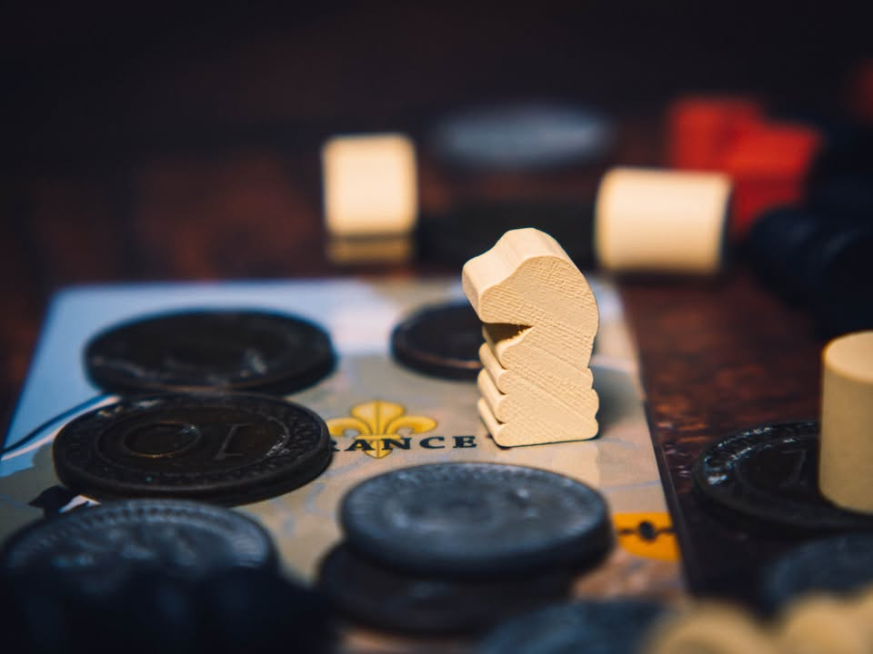
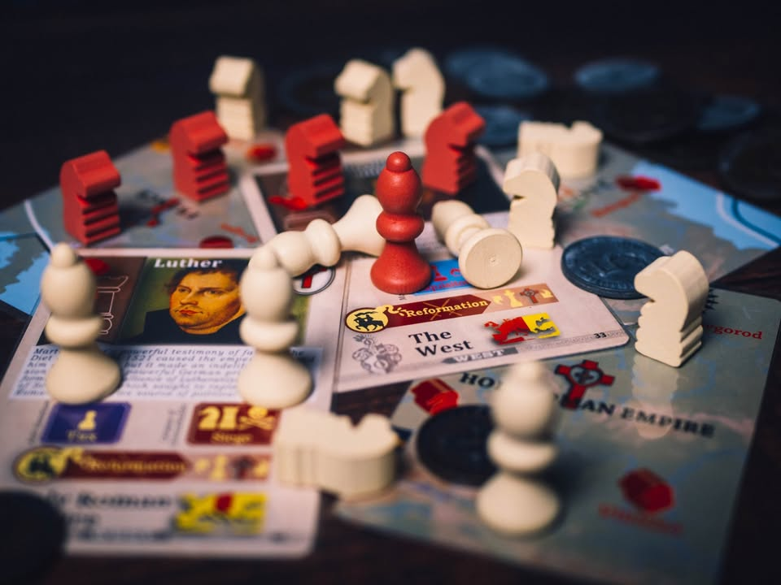

🔹 Pax Renaissance เป็นเกมที่ให้พื้นการเล่าเรื่องผ่านการปฎิวัตินับครั้งไม่ถ้วนของรัฐยุโรปในช่วงสองร้อยปีของศตวรรษที่ 14-16 #หยิบบางมุมมาเล่า #bite_size
.
.
▪️ บทบาทสมมุติของเราคือนายธนาคารยุคบุกเบิกผู้หอบหิ้วเงินถุงถังเอาไปหว่านซื้อการ์ดเหตุการณ์ในประวัติศาสตร์เพื่อขับเคลื่อนเหล่าขุนนางแลขุนศึกของสามศาสนารวมถึงเหล่าเส้นทางการค้าและเศรษฐกิจให้ขยับแปรเปลี่ยนไปตามกระแสเงินตรา
.
.
▪️ ทุกครั้งที่มีชนชั้นสูงหน้าใหม่เข้ามาประจำการที่หัวเมืองใหญ่ผ่านการชักใยของเหล่ามือที่มองไม่เห็น เหล่าผู้เสียอำนาจเก่าก็มิได้ห่างหาย หากแต่คอยเร้นกายอยู่ซอกหลืบที่แสงไฟสาดส่องไม่ถึง ประสาอันใดเล่ากับเหล่าพ่อค้าวานิชที่ถือครองสัมปทานการค้าระหว่างรัฐที่หากถูกสับเปลี่ยนกรรมสิทธิ์ที่ได้รับ พวกเค้านั้นก็จำต้องระเห็จสู่หลังม่านแห่งความรุ่งโรจน์ดุจเดียวกัน
.
.
▪️ ยามเหล่าผู้โกรธแค้นต่อรัฐถูกสั่งสมจนมากพอ สิ่งที่จำเป็นก็ย่อมเป็นแรงผลักของเหตุการณ์ที่เหล่านายธนาคารเก็บงำเอาไว้รอแต่โอกาสปล่อยให้อุบัติ ฉนวนแห่งการเปลี่ยนแปลงย่อมผลักดันให้เหล่าผู้ถูกกดขี่ให้กระทำการล้มล้างผู้มีอำนาจในกาล และผลประโยชน์ย่อมตกอยู่สู่นายธนาคารที่ชักใยอยู่เบื้องหลัง แม้เค้าผู้นั้นจะไม่ได้มีส่วนร่วมในการปลุกปั่นความเกลียดชังแต่เก่าก่อน ก็แน่นอนล่ะว่าคนที่ฉกฉวยโอกาสได้ดีที่สุดยอมเป็นผู้ที่ได้ลิ้มรสผลไม้แห่งอำนาจ แม้มันมิอาจยั่งยืนนักก็ตาม
.
.
▪️ ยามการปฎิวัติได้ลุล่วง นายธนาคารนั้นเองจักเป็นผู้เลือกกษัตริย์องค์ใหม่มาปกครองรัฐ และท่านผู้นั้นย่อมต้องโอนอ่อนต่อคำของผู้อุปถัมภ์แก่กาลก่อน เพราะอำนาจของราชันใช่จะสลักอยู่บนหินผา จะร้องขอให้กษัตริย์ทรงกรีฑาไปโจมตีประเทศเพื่อนบ้าน หรือจะล่อลวงให้ประเทศอ่อนไหวเพื่อก่อการปฎิวัติอีกคราพลิกนำพาประเทศสู่สาธารณรัฐนั้นก็แล้วแต่กลิ่นหอมหวนแห่งอำนาจจะนำพาไป
.
.
▪️ เหตุการณ์เหล่านี้จะถูกถ่ายทอดออกมาให้เห็นอยู่ร่ำไปและแทบไม่ซ้ำกันทุกครั้งที่เล่นเกมนี้ จริงๆแล้วเกมยังมีมิติอื่นในสัมผัสอีกมากมาย ทั้งการแต่งงานทางการเมือง ก่อสงครามศาสนา อุปถัมภ์นักสำรวจโลก หรือกระทั้งเปลี่ยนเส้นทางการค้าทาสที่ทำให้แหล่งเงินตราเปลี่ยนแปลงไปยังถุงหนังใบใหม่
.
.
▪️ และนี้เป็นเกมที่เล่าประวัติศาสตร์ช่วงหนึ่งของโลกที่ผมชอบมากเกมหนึ่งครับ แต่ก็เป็นเกมที่จะไม่อยู่ๆยกมาเล่นกับใครถ้าไม่ร้องขอ หรือแนะนำให้ใครซื้อตามเพราะเกมมันมีกลิ่นและรูปแบบเฉพาะทางมาก มีความอลม่านแบบที่เหมือนจะควบคุมได้แต่กลับสับสนจนเหมือนเกมต่างหากที่เล่นเกมแทนเรา เหมาะกับมนุษย์สายอ่าน wiki แล้วชอบกดลิงค์ต่อลิงค์ไปเรื่อยๆ เกมเล่นไม่ยากมากก็จริงแต่อ่านแล้วรับร้องว่ามีท้อกันบ้างแหละ
.
.
▪️ ฉบับที่เป็นรีวิวกว่านี้เคยเขียนไว้ที่ :  Pax Renaissance : เงินตราขับเคลื่อนโลก - https_://tinyurl.com/yxwjtbnm
--------------------------------
หมวด Bite Size (พอดีคำ) นี้กะว่าจะเขียนอะไรสั้นๆประมาณนี้ล่ะกัน ใหม่บ้าง ซ้ำบ้าง เกมที่ขี้เกียจเขียนบ้าง เขียนๆไว้ก่อนเผื่อมีอารมณ์อาจจะขยายไปลง Thought บ้าง จริงๆอยากเขียนสั้นกว่านี้ แต่ยังอดไม่ได้ที่จะต้องอธิบายอะไรเพิ่มตามนิสัย เดี๋ยวค่อยๆปรับไปล่ะกัน

