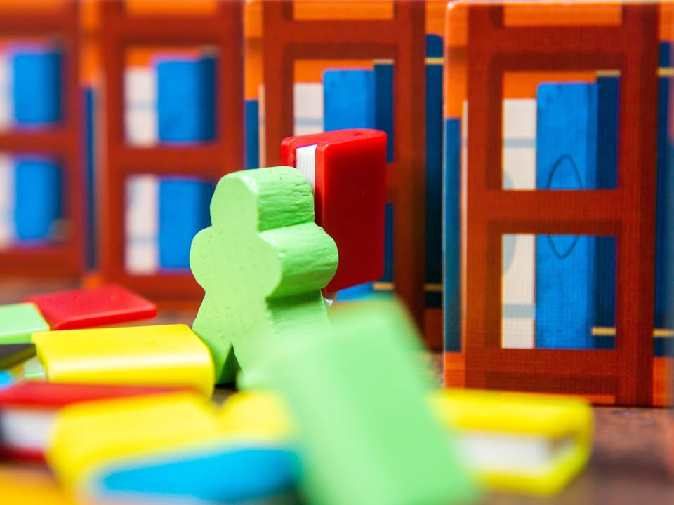
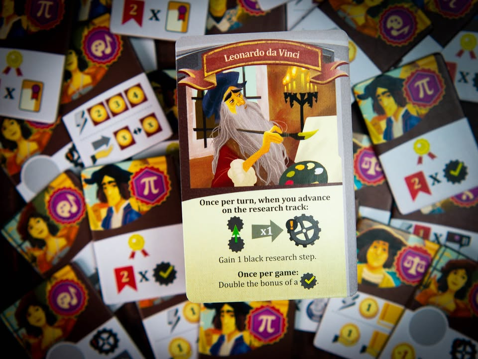
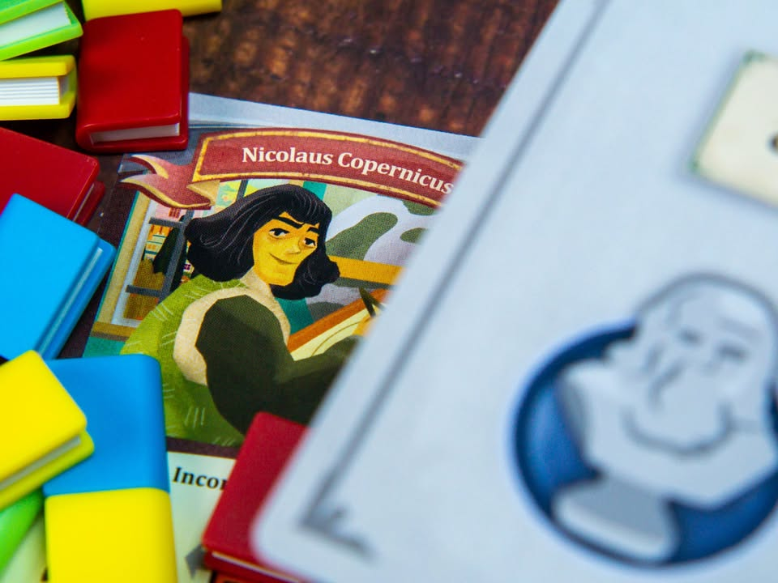
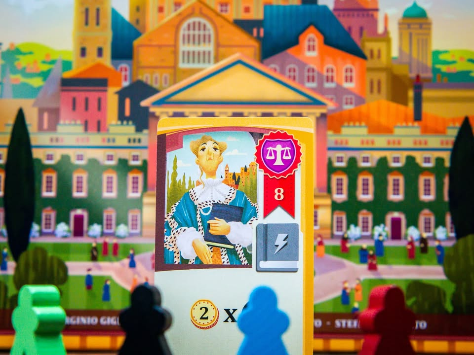
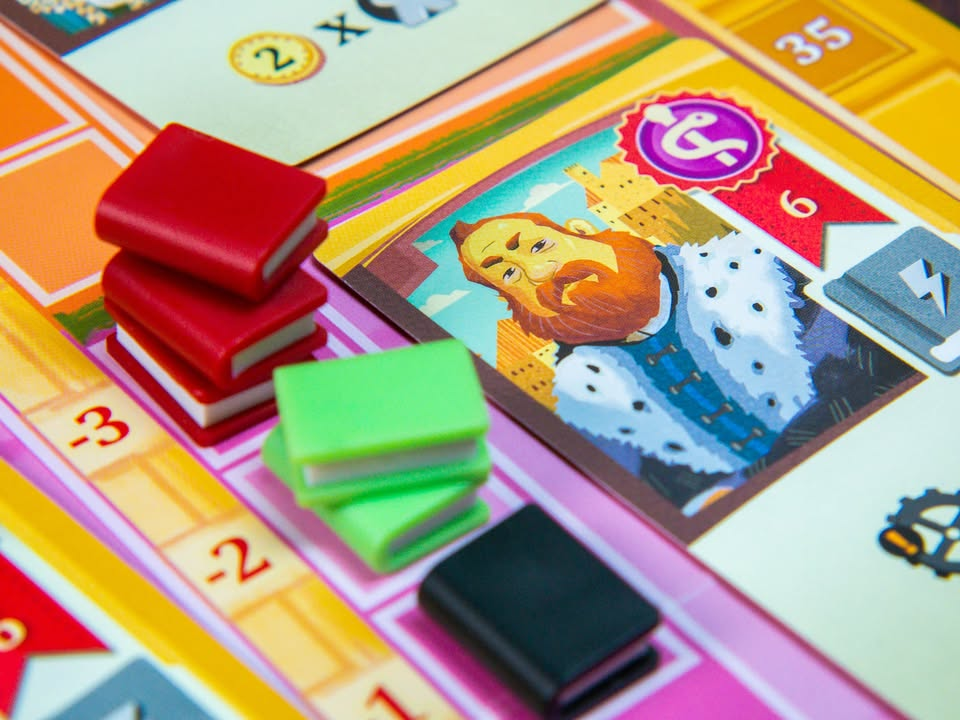
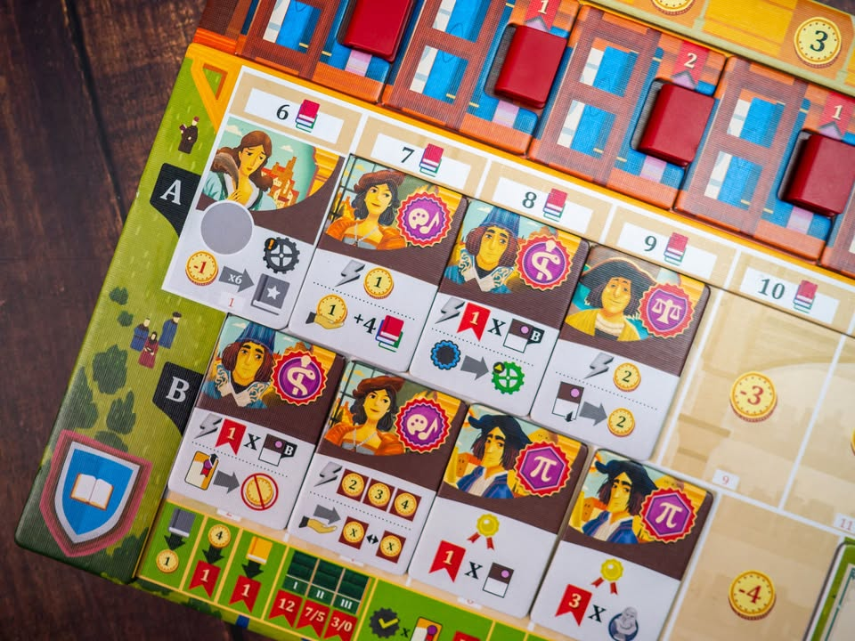

Alma Mater #thought 
blog link: https_://tinyurl.com/y6fvcphe
.
▪️ เกมยูโรระดับกลางหนัก ที่ให้เรารับบทเป็นเหล่าอาจารย์ใหญ่มาพัฒนามหาวิทยาลัยให้เป็นหนึ่งในยุโรป ผลงานของแก๊งอิตาเลี่ยนทีม Acchittocca (ภาษาอิตาเลี่ยนแปลว่า ตาใครแล้ว?....ว่ะ - "Who’s turn is it?" ) ห้าคนที่มีผลงานติดอันดับมากมายอย่าง Terramara, Coimbra, Lorenzo il Magnifico, Grand Austria Hotel
.
.
▪️ แกนเกมเดินด้วยระบบ Worker Placement ที่จะให้เรานำเหล่าอาจารย์ของเราไปลงช่องแอคชั่นผลิตทรัพยากรกับแลกของไปตามเรื่อง โดยที่ความเข้มข้นจะอยู่ในรูปที่เราสามารถลงช่องแอคชั่นซ้ำคนอื่นได้ แต่ว่าต้องเสียคนงานเพิ่ม ทำให้ลำดับความคิดว่าอยากจะลงตรงไหนก่อนหลังก็ยังสำคัญอยู่
.
.
▪️ ไอเดียน่าสนใจของเกมคือระบบเศรษฐกิจที่เดินเกมด้วย 'หนังสือ' อันเป็นทรัพยากรที่ผู้เล่นแต่ละคนสามารถผลิตได้แค่สีของตัวเอง แต่เวลาจ่ายต้องใช้หลายสี แปลว่าเราต้องไปซื้อของคนอื่นมาด้วย แต่สิ่งที่ขับเคลื่อนระบบในเกมนี้คือหนังสือมี 'คุณค่า' (ไม่ใช่มูลค่าหรือราคา) ในระหว่างเล่นไม่เท่ากัน
.
.
▪️ โดยที่ระหว่างเล่นผู้เล่นสามารถลงทุนวิจัยเพื่อเพิ่มระดับคุณค่าหนังสือของตัวเองได้ ซึ่งจะมีผลต่อการหยิบไทล์นักเรียน (เรียกว่าเป็น Tech Tree ก็ไม่ผิดนัก) ที่จำเป็นต้องใช้หนังสือในแรงค์ที่หลากหลาย ถ้าเราทำให้หนังสือเราแรงค์สูงกว่าคนอื่นได้ก็จะได้เปรียบกว่าเพราะว่าของที่เราผลิตเองมันต้นทุนต่ำกว่าซื้อเยอะ และคนอื่นก็ต้องมาซื้อของเราด้วย
.
.
▪️ ซึ่งระบบหนังสือยังลามไปถึงการซื้อการ์ดความสามารถพิเศษด้วย โดยผู้เล่นคนแรกที่ซื้อจะได้กำหนด 'ค่าใช้จ่าย' ของการ์ดใบนั้นๆเอง โดยการจ่ายหนังสือหลายสีในจำนวนที่ระบุ ซึ่งก็แน่นอนว่าถ้าเราเป็นคนกำหนดแล้วเลือกหนังสือตัวเองได้ คนอื่นอยากใช้ก็ต้องมาซื้อหนังสือเราเยอะๆ และพอมีเงินมันก็เอาไปต่อยอดวิจัยทำให้คุณค่าหนังสือเราพุ่งขึ้นไปอีก 
.
----------------------------------------------------------
🐸 Hang out friend - สาวงามเพรียบพร้อมแต่ขาดไฝทรงเสน่ห์
----------------------------------------------------------
.
.
🔹 ผมคิดว่ามันเป็นเกมที่แน่นมากเกมหนึ่ง คนงานน้อยแต่ของอยากทำเยอะ เล่นแล้วชอบ สอนไม่ยาก แต่ส่วนตัวแล้วเหมือนมันขาดเสน่ห์บางอย่างไปนิดอารมณ์แบบที่จะฮุกให้กลับไปสำรวจเลยไม่ค่อยแรงเท่าไร อีกนิดน่าจะอยู่ระดับชอบล่ะ ก็คงคล้ายๆอาหารชั้นดีที่ขาดน้ำจิ้มหรือเครื่องเทศเครื่องเคียงที่ถูกปาก
.
.
👁‍🗨 เกมนี้หลัง setup แล้วจะไม่มีดวงมาเกี่ยวข้องอีก และ pooling ของที่สุ่มได้มีค่อนข้างจำกัด ไทล์นักศึกษานี้คือ fixed เหมือนกันทุกเกม แต่ของที่สุ่มเยอะหน่อยก็จะเป็นการ์ดอาจารย์สอนและการ์ดโบนัสกลางที่มีการสุ่มวิธีปลดล๊อก ในแง่นี้เกมมันจะมีท่ามีคอมโบที่เตรียมรอไว้แล้ว แต่ความฉลาดเชิง replayability ของเกมนี้คือแม้จะรู้ท่าแต่การได้มามันไม่นิ่งเหมือนกันทุกครั้ง เพราะคนกำหนดราคาคือผู้เล่นคนแรกที่ซื้อรวมไปถึงมูลค่าที่เปลี่ยนไปตามการแข่งขันของของในวง 
.
.
👁‍🗨 จุดสังเกตอีกอย่างคือเกมมันค่อนข้างเป็นสไตล์ทุกคนต้องทำทุกอย่างในแบบที่คล้ายๆกันเพราะตัวคูณมีอยู่ทุกที่ ไม่ได้เป็นเกมแบ่งสายจ๋าๆแบบที่ผมชอบ ตรงนี้คนเล่นมาก่อนจะได้เปรียบพอประมาณเพราะมองคอมโบออก และด้วยความที่เกมนี้ไม่มีระบบ Catch up เลย (จริงๆมีแต่บางเบามาก) คนที่เดินตามรอยเท้ามาทีหลังก็ยากที่จะกลบส่วนต่างได้ง่ายๆ เลยเป็นเกมที่แข่งกัน 'ทำก่อนให้ได้' เพื่อชิงความได้เปรียบประมาณหนึ่ง
.
.
👁‍🗨 Economic เกมถือว่าแปลกนิดๆตรงที่จริงๆแล้วเราก็ไม่ได้อยากขายหนังสือเราให้คนอื่นหรอก แต่ถ้าไม่ทำละก็เราก็จะไม่มีเงินมาวิจัยเพิ่มมูลค่าให้คนอื่นอยากซื้อ การวางแผนว่าเมื่อไรจะเลิก feed หนังสือเข้าตลาดก็น่าสนใจดีเหมือนกัน แต่ส่วนตัวคิดว่ามันแอบต้องใช้ mindset ที่ประดักประเดิดแบบบอกไม่ถูกนิดๆ คือจะกัํกก็ไม่กั๊ก จะปั๊มสแปมตลาดหรือทำกำไรก็ไม่ได้ไรงี้ ไม่ค่อยมีอารมณ์เหี้ยมหรือแร้นแค้นจัดๆ
.
.
💬 จุดที่ส่วนตัวไม่ชอบนิดหน่อยคือตัวเสริมที่เป็นนักเรียนให้สุ่มสลับเพิ่มความหลากหลายดันทำมาขายแยกทั้งๆที่ควรจะใส่มาให้เลย เกมกล่องก็ไม่ถูก พวกการ์ดหลายหมวดก็ pooling น้อยไปหน่อยน่าจะสุ่มได้เยอะกว่านี้ 
.
.
💬 ส่วนตัวคิดว่าเกมนี้มันให้อารมณ์ นางงาม Top 8 ไร้ขอกังขาที่เหมือนยังขาด 'อะไรบางอย่าง' ทำให้อดเข้าชิง ขั้นต่ำนี้คิดว่ายากนะที่คนเล่นยูโรจะไม่ชอบ (มากน้อยอีกเรื่อง) เพราะรูปแบบการคิดและเทคนิคเอามาผสมกันค่อนข้างลงตัวแต่ก็มีความแปลกใหม่ในที แค่พอดีก่อนเล่นผมได้ยินเสียงร่ำลือว่ามันระดับ The Must ก็เลยมีอคติหน่อยๆว่ามันก็ไม่ถึงขนาดนั้นป่าวว่ะ? แต่ยังไงก็เกมสมระดับค่าเฉลี่ย BGG 7/10 ควรค่าแก่ลองเล่น
.
---------------------------------------------------------
Compatible Level - เกมนี้เข้ากับคนเขียนได้ระดับไหนนะ!!

🐸 Family, อาจจะมีช่วงเวลาที่ไม่เข้าใจกันบ้างแต่ครอบครัวคือสิ่งที่จะอยู่กับเราตลอดไป นี้คือเกมที่จะมีพื้นที่ถาวรในชั้นวางแน่นอน!! แม้บางเกมจะเปรียบดั่งคุณปู่ใจดีที่ได้เจอกันแค่ปีล่ะครั้ง แต่อันดับในใจนั้นคือความสนุกในช่วงเวลาที่เล่น หาใช่การได้เล่นซ้ำไม่รู้เบื่อเพียงอย่างเดียว [ex. กบโปรด, กบชอบ]

🐸 Hang out friend, เพื่อนกินเที่ยว ถ้าไม่ติดธุระอันใดก็พร้อมจะออกไปพบเจอ สนุกยามได้พบปะ แต่จะให้เจอกันบ่อยๆคงใช่ที - เกมสนุกที่อยากเล่นในระดับที่อยากจะหยิบกางเป็นบางครั้ง สลับสับเปลี่ยนไปเรื่อยตามจังหวะและโอกาส แต่เราก็ไม่ได้อยากซ้ำต่อเนื่องรัวๆ [ex. กบโอเค]

🐸 Someone I know, หากบังเอิญพบเจอ ก็คงได้ทักทายไต่ถาม หากแต่ในยามปกติมิอาจนึกชื่อออก ยืนคุยก็ได้ แต่คงไม่ได้เอื่อนเอ่ยนัดกินข้าว - บางเกมเราก็ไม่ได้อยากชวนเล่น แต่ถ้าไม่มีอะไรทำแล้วมีคนชวนก็เล่นก็ได้ [ex. กบเฉย]

🐸 I Turn left, You Turn Right - เธอชอบกินเผ็ด เราชอบกินอาหารญี่ปุ่น เธอชอบคนคารมดีพาไปกินที่หรู แต่เราชอบเล่นเกมอยู่กับบ้าน แม้จะได้คุยเป็นบางคราแต่คงไม่อาจพัฒนาความสัมพันธ์ - บางเกมแม้ว่าจะดีแค่ไหน แต่ถ้ารสนิยมมันไปด้วยกันไม่ได้ก็ไม่รู้จะเล่นไปทำไม [ex. กบไม่เล่น]
 
 
อนึ่ง : เป็นความรู้สึกในความ "อยากจะหยิบมาเล่นไหม?" ของผมเอง ไม่ได้เกี่ยวอะไรกับคุณภาพของเกม ไม่อิงมาตราฐานอื่นใดนอกจากตัวเองเท่านั้น ดูให้เป็นแค่ "อีกความคิดเห็นหนึ่ง" เท่านั้นก็พอนะครับ :)

