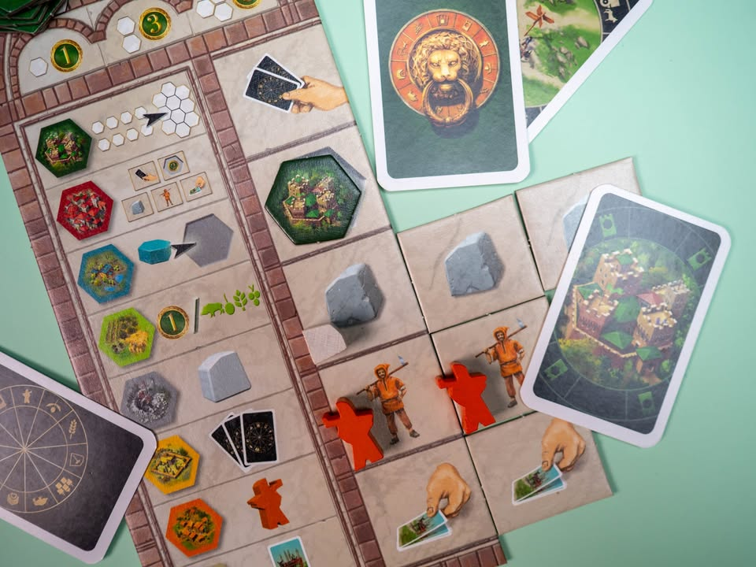
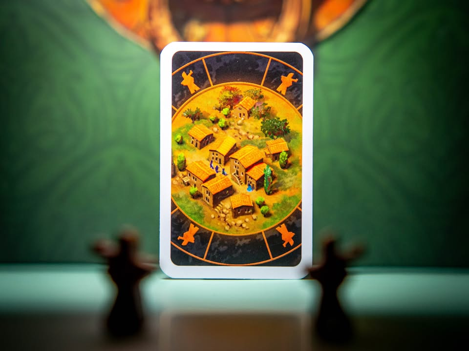
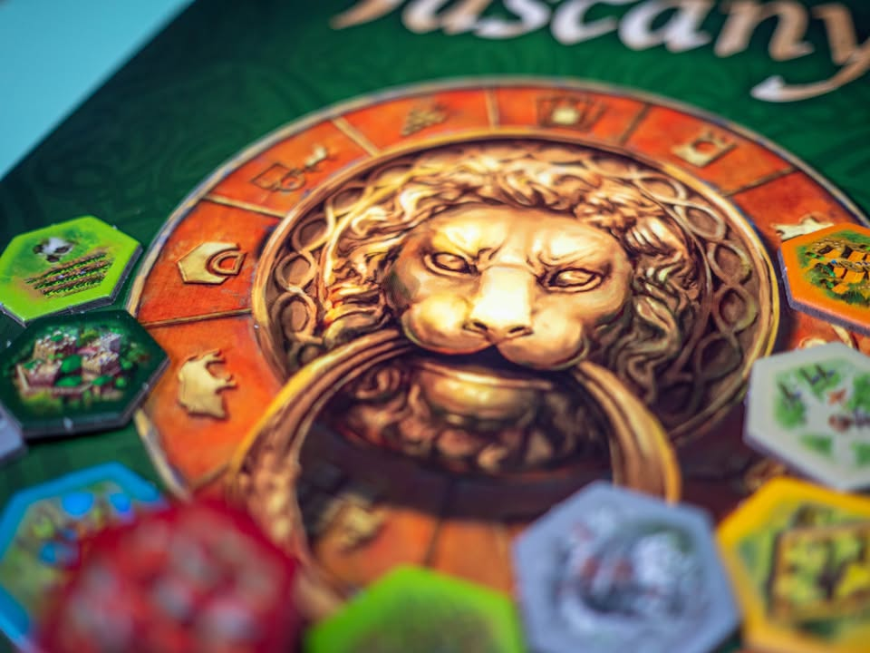

The Castles of Tuscany #bite_size
blog link: https://tinyurl.com/yywutcqm
.
▪️ เกมยูโรระดับเบาจากนักออกแบบขึ้นหิ้ง Stefan Feld และเป็นเกมลำดับสามของ ซี่รีย์ Alea Revised Big Box ที่เอาเกมมาทำปกสวยวางเรียกกันเป็นเลข (ตอนนี้มี Las Vegas Royale, The Castles of Burgundy  และเดี๋ยว Puerto Rico กำลังจะตามมา ) 
.
.
▪️ ไอเดียคือเกมหยิบไทล์พัฒนาที่ดินแบบต่างๆมาสร้างยังดินแดนของเรา ไทล์แต่ล่ะแบบก็มีตอนวางก็จะมีผลที่แตกต่างกันไป ตาหนึ่งก็เลือกระหว่างหยิบไทล์มาพักไว้ หรือเล่นไทล์โดยการทิ้งการ์ดสีเหมือนกันสองใบ หรือจั่วการ์ดเพิ่ม ขั้นตอนเล่นก็ง่ายๆแค่นี้เลย มีของเล่นเพิ่มความสามารถอีกนิดหน่อย
.
.
▪️ ระบบแต้มถือว่าแอบลีลานิดๆ คือแทนที่จะเดินเติมให้จบเป็นครั้งๆไป เกมนี้จะแบ่งแต้มเป็นสองกลุ่มคือแต้มจริง และ 'เครื่องจักรผลิตแต้ม' โดยที่เวลาเราได้แต้มก็ให้เราเดินแต้มเครื่องจักรนี้แหละ แต่พอจบรอบมีการคิดแต้มเราค่อยบวกแต้มจริงอีกที (ถ้าอ่านแล้วงงก็เอาเป็นว่า เกมนี้เล่นสามรอบ คะแนนที่ทำในรอบแรกมีค่าสามเท่า เพราะจะถูกคิดสามรอบ)
.
.
▪️ ถ้าพูดแบบหนึ่งแล้วมันก็คือเกมที่หยิบเอาไทล์ The Castles of Burgundy มาย่อยให้เข้าใจง่ายและเล่นไวขึ้นนั้นแหละ แต่มันก็เป็นเกมของตัวเองไม่ได้เหมือน Burgundy ขนาดนั้นนะ ระบบกิมมิคเล็กๆน้อยๆหลายจุดทำออกมาเพลินๆตาม weight โดยที่ไม่ได้ทำให้เกมซับซ้อนอธิบายยากแบบเกมของ Stefan Feld เกมอื่น (แต่ยัง setup เยอะเป็นเอกลักษณ์เหมือนเดิม)
.
.
▪️ ส่วนตัวคิดว่าเพลินๆดีเหมาะกับกลุ่มที่พึ่งเล่นเกมสาย Gateway ตามร้าน แต่สำหรับคนที่เลยตรงนั้นมาแล้วเกมมันค่อนข้างเบา เอาจริงๆคือถ้าไม่ติดว่ามันเป็น series number ที่ผมตั้งใจจะซื้อเก็บแล้วก็น่าจะส่งต่อไปแล้ว เพราะในเชิงเกมผมชอบ Burgundy กว่าเยอะ (แต่ตัวนี้ก็สำหรับผู้เล่นคนล่ะกลุ่มนะ)
.
--------------------------------
หมวด Bite Size (พอดีคำ) นี้กะว่าจะเขียนอะไรสั้นๆประมาณนี้ล่ะกัน ใหม่บ้าง ซ้ำบ้าง เกมที่ขี้เกียจเขียนบ้าง เขียนๆไว้ก่อนเผื่อมีอารมณ์อาจจะขยายไปลง Thought บ้าง จริงๆอยากเขียนสั้นกว่านี้ แต่ยังอดไม่ได้ที่จะต้องอธิบายอะไรเพิ่มตามนิสัย เดี๋ยวค่อยๆปรับไปล่ะกัน

