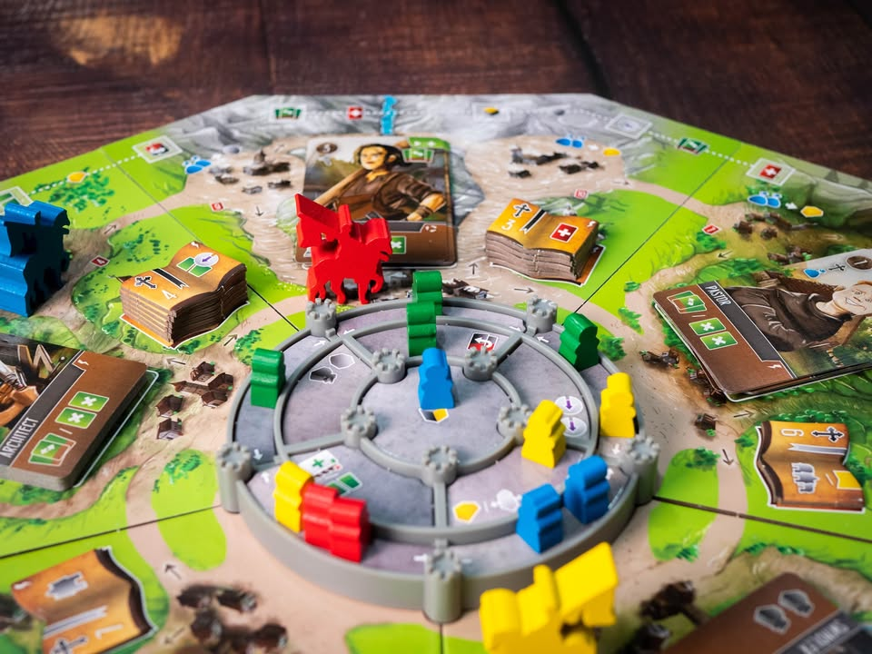
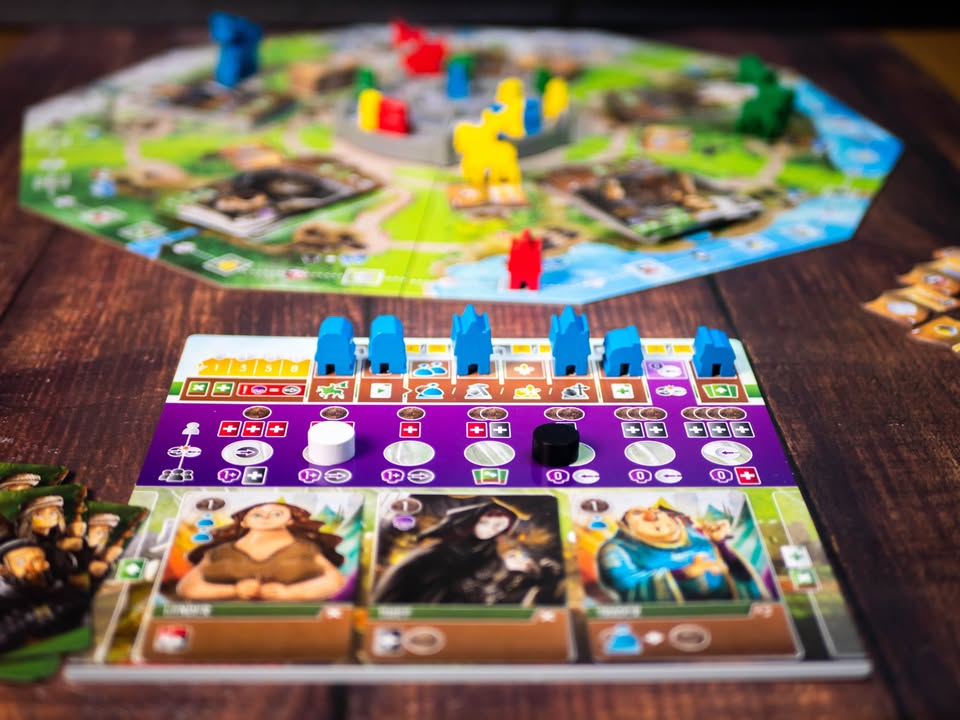
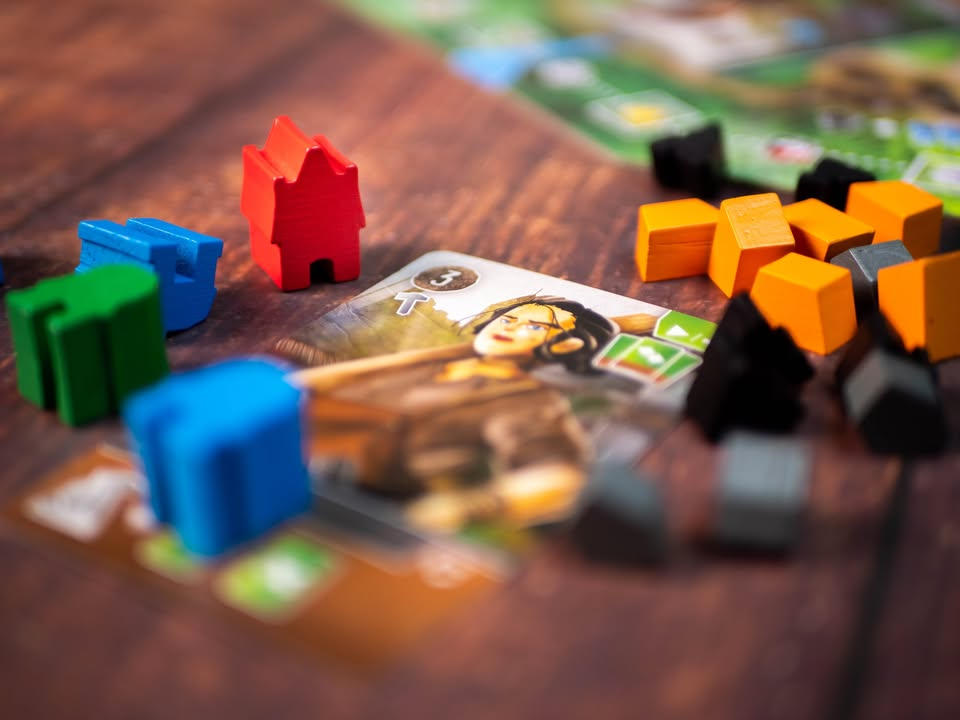
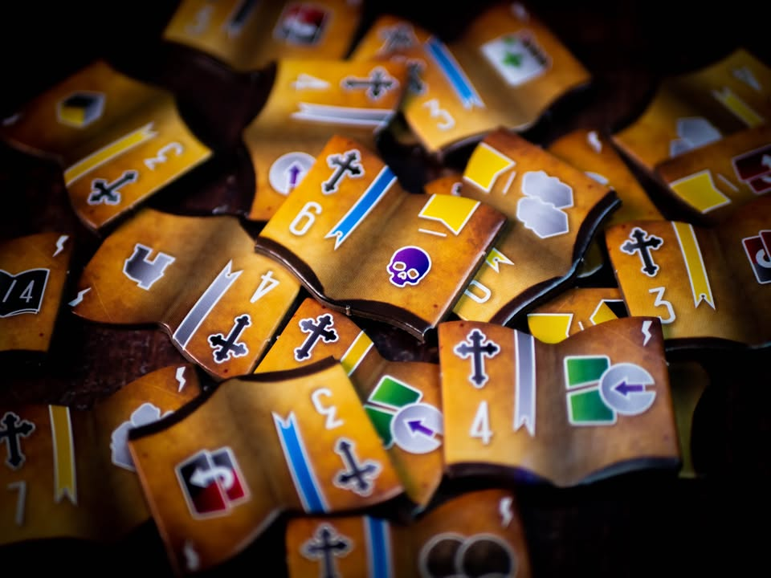
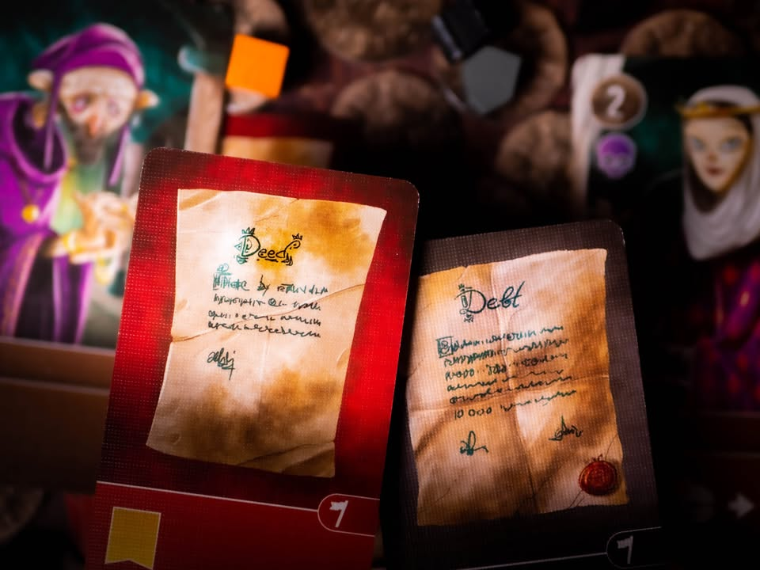

Viscounts of the West Kingdom 
blog link: https_://tinyurl.com/y4z6w23n

▪️ เกมยูโรระดับกลางหนัก ลำดับที่สามของซีรี่ย์อาณาจักรตะวันตกกล่องแดง จากผู้สร้าง เหล่าคนเถื่อนแห่งแดนเหนือ Shem Phillips, S J Macdonald โดยรอบนี้เราจะมาเล่นเป็นขุนนางที่ต้องเดินทางไปทั่วดินแดนเพื่อสร้างฐานอำนาจให้มั่นคงก่อนอาณาจักรจะล่มสลาย
.
.
📖 [ Viscount (ไวส์เคานท์) - ตำแหน่งชนชั้นขุนนางระดับล่างในยุโรป ถ้าในอังกฤษจะเรียงจาก Duke > Marquess > Earl > Viscount > Baron  กำเนิดในปี 1440 โดย  King Henry VI แต่เดิมเป็นตำแหน่งขุนนางที่ไม่ได้อยู่ในระบบขุนนางสืบตระกูล (มอบให้แต่ไม่ส่งต่อให้ลูกหลาน) ก่อนที่จะปรับมาเป็นการสืบตระกูลในปี 1838 บางครั้งก็นำไปใช้เพื่อมอบให้กับลูกชายคนรองของขุนนางระดับสูงกว่า]
.
.
▪️ แกนเกมเดินด้วยระบบ Deck Building ในการสร้างทรัพยากร ผสมกับระบบเลือกแอคชั่นแบบ Rondel ที่เราจะต้องนำตัวท่านเคานต์ของตัวเองเดินเป็นวงกลมรอบแผนที่เพื่อเลือกทำแอคชั่นหรือจ้างคนงานที่อยู่ในกระดานมาเสริมศักยภาพ
.
.
▪️ ในช่วงเวลาหนึ่งๆเราจะมีการ์ดคนงานตรงหน้าสามใบ ตาหนึ่งเราจะต้องลงการ์ดหนึ่งใบพร้อมกับดีดใบที่อยู่มานานสุดลงกองทิ้ง จากนั้นก็ทำแอคชั่นที่มีอยู่สี่อย่าง โดยที่ศักยภาพของแต่ละแอคชั่นจะขึ้นอยู่กับจำนวนไอคอนบนการ์ดสามใบที่เราวางค้างไว้บวกกับทรัพยากรที่เราจ่ายเพิ่ม ซึ่งแอคชั่นก็คือการส่งคนไปชิงอำนาจในปราสาท, ศึกษาหนังสือ, สร้างสิ่งปลูกสร้าง และหาซื้อทรัพยากรที่จะช่วยบูสศักยภาพของไอคอนคนงานเวลาทำแอคชั่น
.
.
▪️ เราก็เดินๆวนๆทำแอคชั่นไปรอบบอร์ดนั้นแหละ มีจ้างคนมาใส่เป็นระยะเพื่อจูนเด็คเราให้เหมาะกับสายที่เราอยากจะเล่น พอกองจั่วหมดก็จะสับกองทิ้งมาจั่วใหม่ตามระบบ deck building ส่วนการ์ดคนงานนอกจากไอคอนทำแอคชั่นแล้วก็ยังมีความสามารถหยิบย่อยตอนซื้อ, ตอนระหว่างเกม และตอนทิ้งอีก แต่ถ้าจ้างมาเยอะเกินไปเด็คจะบวมจนจั่วไม่เจอแทน
.
.
▪️ ระบบความดีเลวยังคงเป็นหนึ่งในแกนหลักที่มีอยู่ทุกภาคของเกมนี้ ความน่าสนใจของภาคนี้คือมันเป็นทริคเกอร์จบเกมด้วย ระหว่างเล่นเราจะมีแต้มความดี/เลว อยู่สองฝั่งที่มีโทเคนเป็นของตัวเอง เวลาเดินก็แยกกันจากคนละฝั่ง เมื่อมาบรรจบกันก็จะเช็คว่าเราเอียงไปฝั่งไหนเยอะก็จะต้องจั่วการ์ดความดีหรือว่าหนี้สินไปตามกรรมที่ทำมา
.
.
▪️ แน่นอนว่าเป็นโจรนี้ยังไงก็ดีตาม concept ของเกมอื่นในซีรี่ย์ เพราะคนงานสายโจรนั้นแทนไอคอนอะไรก็ได้ แลกกับการจั่วหนี้บ่อยหน่อย แต่ถ้าเลือกคนงานมาได้เหมาะสมการล้างหนี้สินก็ไม่ได้ยากนัก 
.
.
----------------------------------------------------------
🐸 Someone I know น้องชายคนกลางพูดน้อยผู้เพียบพร้อมมุ่งมั่น
----------------------------------------------------------
.
.
🔹 ผมชอบเกมนี้ตรงที่แม้จะเป็นเกม Deck Building งึมงำ ( DB ไม่ใช่ระบบที่ผมชอบเล่นนัก) แต่มันหน่วงจังหวะในการสร้าง engine ให้ทิ้งไว้ระยะหนึ่งจากการที่การ์ดจะวางข้างหน้าสามใบ และค่อยๆมีการเปลี่ยนออกไปทีละใบ ไม่เข้ามือแล้วหายไปทันทีเลยแบบ DB ดั้งเดิม มีของส่วนกลางที่ต้องแย่งกับชาวบ้านตลอดทำให้เกมไม่สงัดและจมอยู่กับตัวเองเกินไป โดยทั่วไปแล้วผมคิดว่าคนที่ชอบเกมสไตล์ DB น่าจะโอเคกับเกมนี้นะ แต่สัดส่วนความงึมงำคนเดียวก็มีตามสไตล์กลไก 
.
.
🔹 interaction ระหว่างผู้เล่นจะเป็นแบบทางอ้อม (indirect conflict) ที่เราไม่ได้จ้องขัดใครตรงๆ แค่พอดีมันทับสายกันเฉยๆ ถ้าใครมองหาเกมตัดกันแบบใน Architects ก็ผิดหวังแน่นอน แต่เท่าที่เล่นรู้สึกว่าคนที่เลือกสายไม่ซ้ำคนอื่นนั้น getaway แต้มนำไปค่อนข้างง่าย เพราะไม่ต้องเบียดแย่งของกับใคร แปลว่าถ้าในวงไม่เก็ทเกมนักก็จะมีคนชนะง่ายๆอยู่
.
.
🔸 จุดที่ขัดใจนิดหน่อยน่าจะเป็นความรู้สึกว่าเกมแอบจบเร็วไปนิด engine ยังวนไม่ทันมันส์ก็จบซะล่ะ ยิ่งถ้าอยู่ในวง mindset เอียงไปทางฝั่งเดียวกันหมดนี้จะจบไวเข้าไปอีก แถมเกมมีกลไกเร่งเกมเวลาเราเล่นสายลีนเดคอีก (remove การ์ดออกจากกองให้บาง จะได้วนการ์ดบ่อย )  คืออยากให้มีช่วงเวลาเครื่องจักรเบ่งบานนานกว่านี้อีกนิด กับการ์ดรู้สึกมันคล้ายๆกันมากไปหน่อย ไม่ได้มีผลอย่างมีนัยยะสำคัญต่อคอมโบของเรา ณ ตอนซื้อ แต่ไอ้ความที่เดี๋ยวใบนั้นทำงานเฟสนี้ ใบนี้ทำงานเฟสโน้นก็มีผลต่อลำดับความคิดระหว่างเล่นเยอะเหมือนกัน
.
.
🔹 จุดเล็กๆที่ชอบอีกอย่างคือคู่มือ มันเป็นแบบที่อธิบายเรื่องที่จำเป็นต้องรู้ก่อน พร้อมขยายความบอกว่าตรงนี้อาจจะยังไม่ make sense (คู่มือส่วนมากปล่อยกูงงต่อไปว่าอะไรว่ะเนี่ย) หรือบางจุดที่อธิบายทริคหรือคำถามย้อนที่ผู้เล่นหลายคนตอนสอนจะถามขึ้นมาให้เรียบร้อย
.
.
👁‍🗨 ก็นับเป็นเกมที่ผสมกลไกอย่างล่ะนิดอย่างล่ะหน่อยมารวมกันได้อย่างลงตัวเกมหนึ่ง ใส่ระบบย่อยเล็กๆเข้าไปหลายอย่างโดยที่ไม่รู้สึกว่าโดดออกมา ถ้าแยกมาดูจะเห็นได้ทันทีว่าเป็นเกมที่ sub mechanic เยอะเหมือนกันแต่ตอนเล่นจะไม่รู้สึกว่ามัน 'เยอะ'
.
.
💬 ในบรรดาสามเกมของซี่รี่ย์นี้สำหรับกลุ่มเกมเมอร์ผมชอบ Viscount มากกว่า Paladin นะ ส่วน Architects มันสำหรับกลุ่มที่เบาลงไปอีกหน่อย (แต่เอาจริงๆน่าจะได้กาง Architects บ่อยกว่าเพราะมันง่ายดี......)  ตรงที่มันเป็นเกมสไตล์เดินไปข้างหน้าในเส้นทางที่ตัวเองเลือก ในขณะ Paladin จะเป็นเกมแบบต้องขยับตรงนั้นตรงนี้หลายทิศทาง  (ซึ่งตรงนี้แล้วแต่รสนิยมแต่ผมไม่ค่อยถนัดการคิดแบบ 'ขยัก' เท่าไร) ถึงจะรู้สึกว่าเกมมันครบในตัวแล้วแต่ก็ยังแอบคิดว่ามันก็พอมีที่เหลือให้งอกตัวเสริมอยู่เหมือนกันเพราะ balance มันยังไม่ค่อยสมดุลย์นัก ไม่เหมือน Architects ที่เล่นแล้วรู้เลยว่ามีรูว่างรอตัวเสริมมากลบ
.
----------------------------------------------------------
Compatible Level - เกมนี้เข้ากับคนเขียนได้ระดับไหนนะ!!

🐸 Family, อาจจะมีช่วงเวลาที่ไม่เข้าใจกันบ้างแต่ครอบครัวคือสิ่งที่จะอยู่กับเราตลอดไป นี้คือเกมที่จะมีพื้นที่ถาวรในชั้นวางแน่นอน!! แม้บางเกมจะเปรียบดั่งคุณปู่ใจดีที่ได้เจอกันแค่ปีล่ะครั้ง แต่อันดับในใจนั้นคือความสนุกในช่วงเวลาที่เล่น หาใช่การได้เล่นซ้ำไม่รู้เบื่อเพียงอย่างเดียว [ex. กบโปรด, กบชอบ]

🐸 Hang out friend, เพื่อนกินเที่ยว ถ้าไม่ติดธุระอันใดก็พร้อมจะออกไปพบเจอ สนุกยามได้พบปะ แต่จะให้เจอกันบ่อยๆคงใช่ที - เกมสนุกที่อยากเล่นในระดับที่อยากจะหยิบกางเป็นบางครั้ง สลับสับเปลี่ยนไปเรื่อยตามจังหวะและโอกาส แต่เราก็ไม่ได้อยากซ้ำต่อเนื่องรัวๆ [ex. กบโอเค]

🐸 Someone I know, หากบังเอิญพบเจอ ก็คงได้ทักทายไต่ถาม หากแต่ในยามปกติมิอาจนึกชื่อออก ยืนคุยก็ได้ แต่คงไม่ได้เอื่อนเอ่ยนัดกินข้าว - บางเกมเราก็ไม่ได้อยากชวนเล่น แต่ถ้าไม่มีอะไรทำแล้วมีคนชวนก็เล่นก็ได้ [ex. กบเฉย]

🐸 I Turn left, You Turn Right - เธอชอบกินเผ็ด เราชอบกินอาหารญี่ปุ่น เธอชอบคนคารมดีพาไปกินที่หรู แต่เราชอบเล่นเกมอยู่กับบ้าน แม้จะได้คุยเป็นบางคราแต่คงไม่อาจพัฒนาความสัมพันธ์ - บางเกมแม้ว่าจะดีแค่ไหน แต่ถ้ารสนิยมมันไปด้วยกันไม่ได้ก็ไม่รู้จะเล่นไปทำไม [ex. กบไม่เล่น]
 
 
อนึ่ง : เป็นความรู้สึกในความ "อยากจะหยิบมาเล่นไหม?" ของผมเอง ไม่ได้เกี่ยวอะไรกับคุณภาพของเกม ไม่อิงมาตราฐานอื่นใดนอกจากตัวเองเท่านั้น ดูให้เป็นแค่ "อีกความคิดเห็นหนึ่ง" เท่านั้นก็พอนะครับ :)

