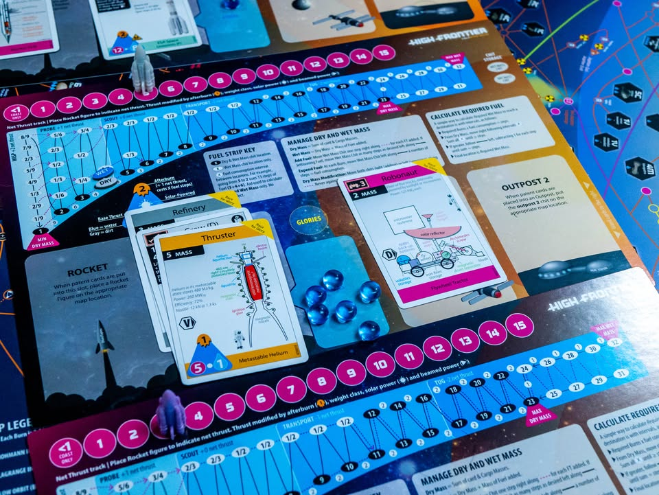
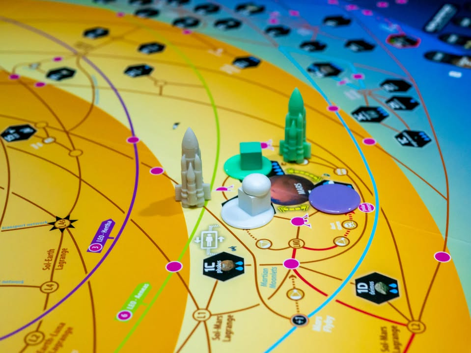
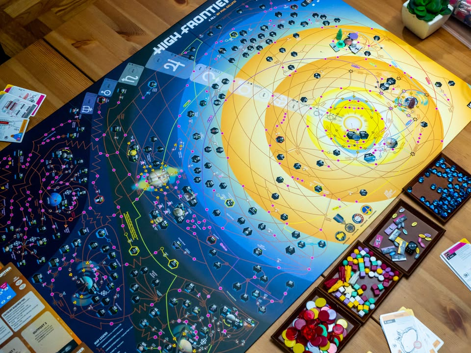
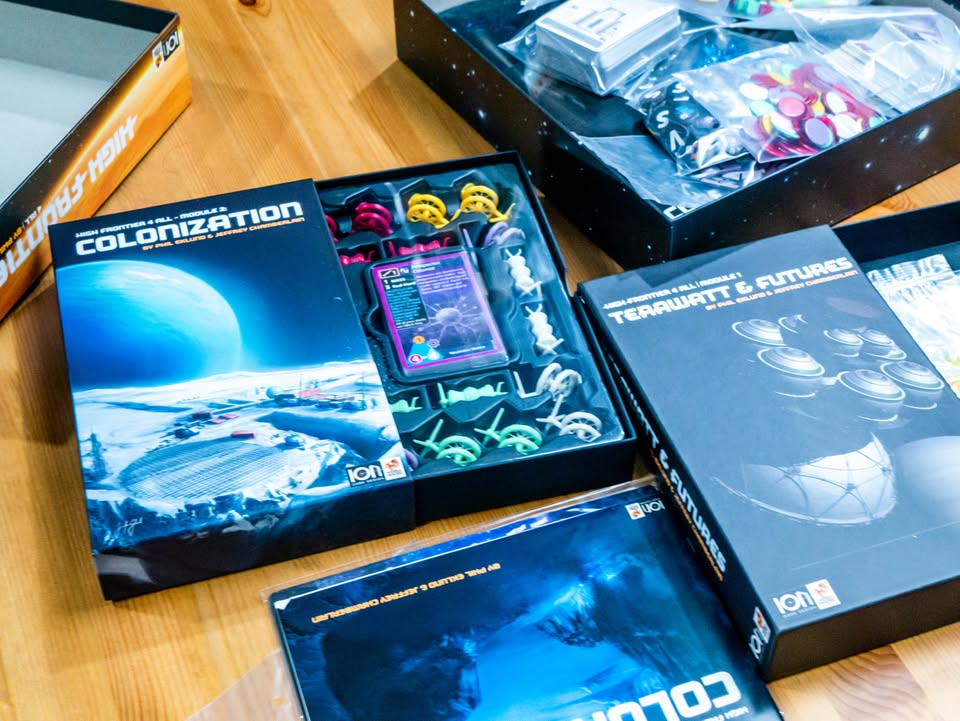
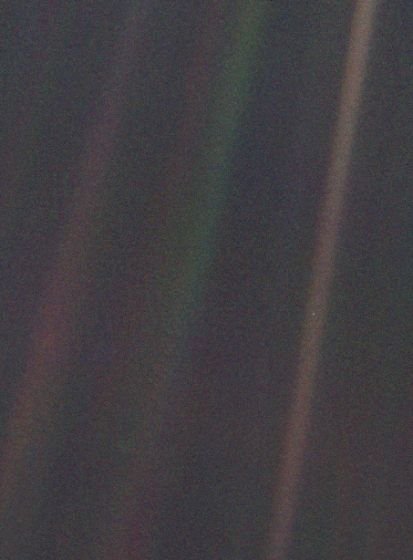

High Frontier 4 all (4th edition) #ไม่ใช่รีวิวแต่มาเล่าให้ฟัง

🔹 ในวันวาเลนไทน์ปี 1990 ยานสำรวจ Voyager 1 ของ NASA ที่ตอนนั้นอยู่ห่างจากดวงอาทิตย์ราว 6 พันล้านกิโลเมตร ได้ถ่ายภาพหนึ่งส่งกลับมายังโลก เป็นภาพจุดสีฟ้าอ่อน (Pale Blue Dot) ท่ามกลางอวกาศที่เวิ้งว้าง
.
และนั้นคือภาพของ 'โลก' ที่เราอาศัยอยู่ และมันช่างกระจ้อยร่อยเสียเหลือเกินเมื่อเทียบกับความไพศาลของจักรวาล น้อยนิดจนระยะทางเพียงเท่านี้ก็เหลืออยู่เพียงแค่ pixel เดียวในภาพถ่าย
.
.
.
◾️ ผมพึ่งลอง 'เล่น' ตัว tutorial ของเกมนี้จบเลยคิดว่าน่าจะหยิบมาเล่าสู่กันฟัง เพราะยังไม่รู้จะได้กางตัวเต็มเมื่อไร แต่ถึงจะเรียกว่าเล่นแต่จริงๆก็แค่ขยับๆ senario ที่คู่มือทำร่ายยาวตั้งแต่ต้นจนจบเกมฉบับสั้นให้นั้นแหละ
.
.
◾️ ตัวเกมเป็นแนว Sandbox สไตล์ near-future ที่ให้เราเล่นเป็นบริษัทยักษ์ใหญ่ของโลกที่จะออกมาพาเมล็ดพันธ์แห่งโลกให้ออกไปสู่ระบบสุริยะจักรวาลของเราเนี่ยล่ะ (ไม่ต้องสำรวจเพราะเอาจริงๆเราก็รู้จักตำแหน่งมันเกือบหมดอยู่แล้ว) ก็ประมูลเอาเทคโนโลยี ส่งจรวดไปจอดโน้นนี้ ตั้งโรงงานบ้าง ส่งคนไปโคโลนีบ้าง แผนที่ในเกมน่าจะนับได้ว่าเนิร์ดที่สุดเท่าที่เกมกระดานจะเคยทำมา เส้นสายวงโคจรของดวงดาว และจำนวนเชื้อเพลิงที่ใช้นี้อิงจากความเป็นจริง
.
.
◾️ ในแง่ความเป็นเกมแล้วส่วนที่ทำให้คุณสนุกก็คือความรู้สึกว่าได้ทำแผนการใหญ่ลุล่วงไปของเกมนี้มันค่อนข้างรู้สึกดีนะ จำนวนครั้งในการจุดระเบิดเพื่อไปยังแต่ละจุด ความท้าทายสำคัญก็คือจัดการเงินทุนและบริหารพลังงานในการเดินทางแต่ละครั้ง แต่ถ้าคุณไม่ชอบอะไรลีลาแบบมองเห็นอะไรไม่ค่อยชัดก็อาจจะเกลียดเกมนี้ไปได้ง่ายๆ เพราะมีหลายครั้งที่เหมือนต้องหยิบการ์ดมาทิ้งเป็นเงินแบบส่งๆอยู่  ซึ่งก็แปลกตรงปกติผมก็ไม่ชอบเหมือนกัน แต่พอมีความเรียลแน่นๆใส่มาแบบอัดแน่นแล้วดันชอบเฉยเลย (แต่ไม่แนะนำให้เชื่อผม เพราะผมเป็นติ่งค่ายกับนักออกแบบ) 
.
.
◾️ กติกาค่อนข้างหยุบหยับตามสไตล์ค่าย แต่ตัว Tutorial ทำมาดีมาก เป็นสไตล์ไม่ต้องรู้อะไรก้มหน้าก้มตาทำไปเดี๋ยวเก็ทเอง ซึ่งถ้าเรียนรู้เองแค่กติกาหลักนี้ก็ต้องยอมรับว่ากว่าจะกล้ากางคงอีกหลายเดือน ตัวโครงสร้างเกมพอข้ามเรื่องกติกาไปแล้วก็ไม่ได้ยากขนาดนั้น ก็แค่ประมูลชิ้นส่วนจรวดแล้วหาตังเติมน้ำมันให้บินไปถึงซักทีก่อนคนอื่นเท่านั้นเอง ซึ่งไอ้ชิ้นส่วนเนี่ยล่ะคือคีย์ของเกม เพราะมันมีเรื่องอัตราพลังงาน กับตัวแปรว่ามันจะเหมาะกับการไปลงจอดที่ไหนถึงจะดีเข้ามาเกี่ยวอีก การ์ดดูซับซ้อนชวนงงมีข้อมูลที่ใช้งานเชิงเกมแค่ไม่กี่จุด แล้วก็ใช้ซ้ำๆกัน (ในแง่นี้การ์ดในเกมซับซ้อนน้อยกว่า Terraforming Mars อีก)
.
.
◾️ ตัวเกมมีความเป็น simulation ค่อนข้างสูงเนื่องจากแผนที่มัน fixed ส่วนที่แตกต่างก็จะเป็นพวกการ์ดเหตุการณ์ สินค้าที่จะโผล่มาให้ประมูลแล้วไรงี้ กับแผนที่ที่ใหญ่โคตรกับโมดูลเสริมที่อัดความเนิร์ดเข้าไปได้อีกเพียบก็น่าจะทำให้ความกังวลว่าเกมนี้จะ replayability ต่ำนี้หายไปได้เลย แต่ถ้าคุณต้องการความเป็นเกมจ๋าๆ ก็อาจจะมีโมเม้นอิหยั่งว่ะ? โผล่มาประปราย อย่างใน tutorial เองก็ยังมี section ประเภท ทำแบบนี้ก็ไม่ชนะแต่ player A ก็น่าจะดีใจที่จบเกมมีเงินเยอะกว่า B ไรงี้......
.
.
◾️ ความเห็นแบบเอาแค่ mock up play เนี่ยผมคิดว่าคนที่ชอบการสำรวจอวกาศน่าจะว้าวกับเกมนี้ได้สบายๆนะ ขนาดผมไม่ได้รู้อะไรนัก (ดาวเหนืออยู่ไหนยังไม่รู้ , สุริยุปราคาเอย ดาวตก ดาวหางเอย ก็ไม่เคยคิดจะเสียเวลาไปดู) ยังรู้สึกแบบเห้ยอินได้หว่ะ แต่ก็แน่นอนว่าเสียเวลาชีวิตไปกับการอ่านรูลสามย่อหน้าแล้วแวะไปเปิด wiki อีกสามสิบนาทีอยู่ตลอด
.
.
◾️ เทียบกับ Leaving Earth แล้วเกมนี้จัดได้ว่าค่อนข้างฟุ้งกว่าเพราะแผนที่ใหญ่แล้วมันไม่ได้ห้ามทำอะไร ไม่เน้นต้องคิดเลขแม่นๆซับซ้อนทุกขั้นตอนแบบ Leaving Earth (แต่นั้นก็คือจุดสนุกมากของ Leaving Earth นะ สนุกแบบครูสอนเลขทุกคนจะต้องดีใจ...... เสียดายเกมดีแค่ค่ายนี้บริการหลังการขายอย่างเหี้ย.....) แต่ด้วย Scale ที่ใหญ่กว่าเยอะทำให้การวางแผนระยะยาวเนี่ยสำคัญมาก ถ้าผู้เล่นแต่ละคนเข้าใจเกมกันหมดเนี่ยบรรยากาศ Space Race นี้มาเต็ม
.
.
◾️ และ tutorial ที่เล่นกันแค่โลกไปดาวอังคาร ซึ่งใช้พื้นที่แค่ราวๆ 1/20 ของกระดานเท่านั้นเองนะ และยังไม่รวมกติกาอีกหลายชุดในตัว core และโมดูลเสริมอีก
.
.
◾️ ขอตัวไปอ่าน Core Rule ต่อก่อน

