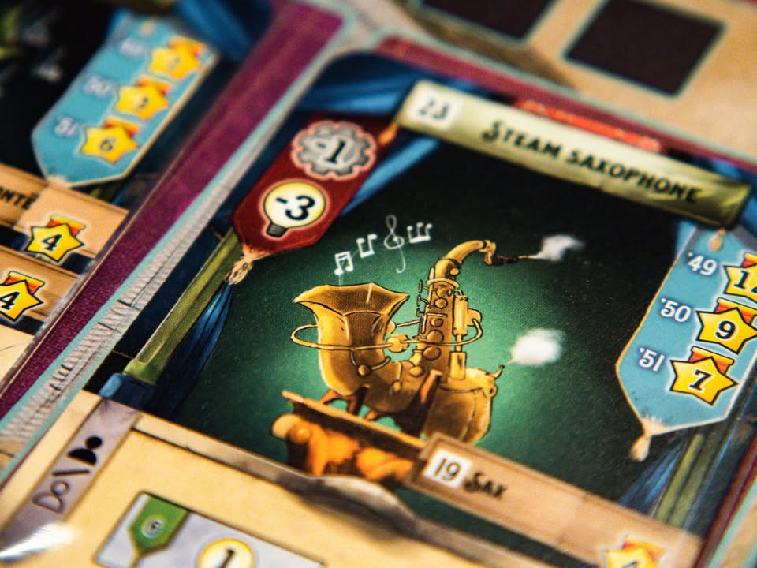
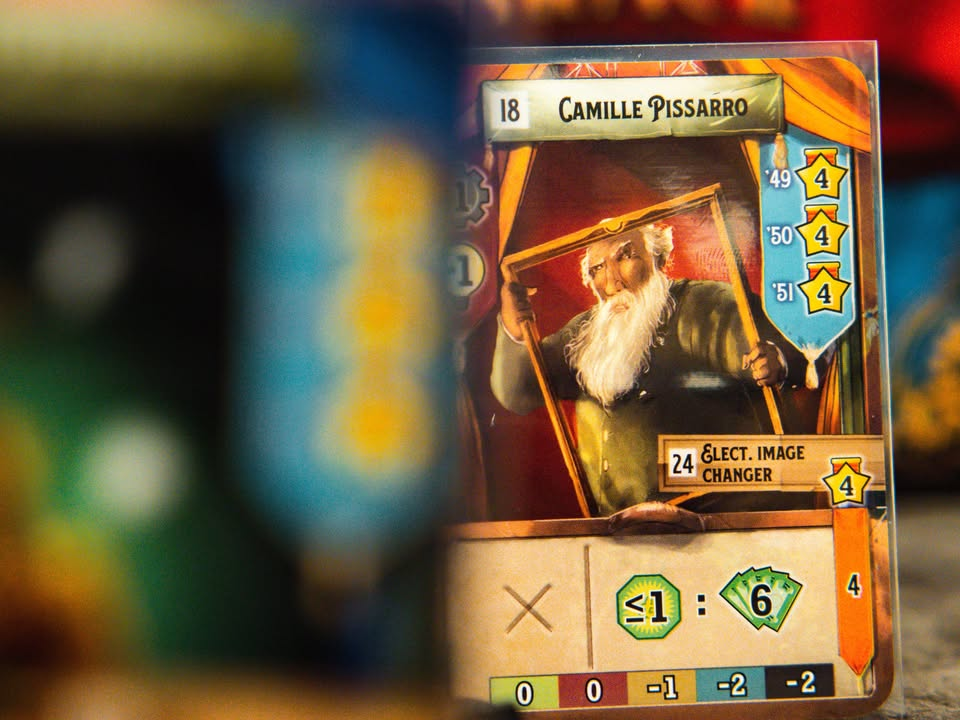
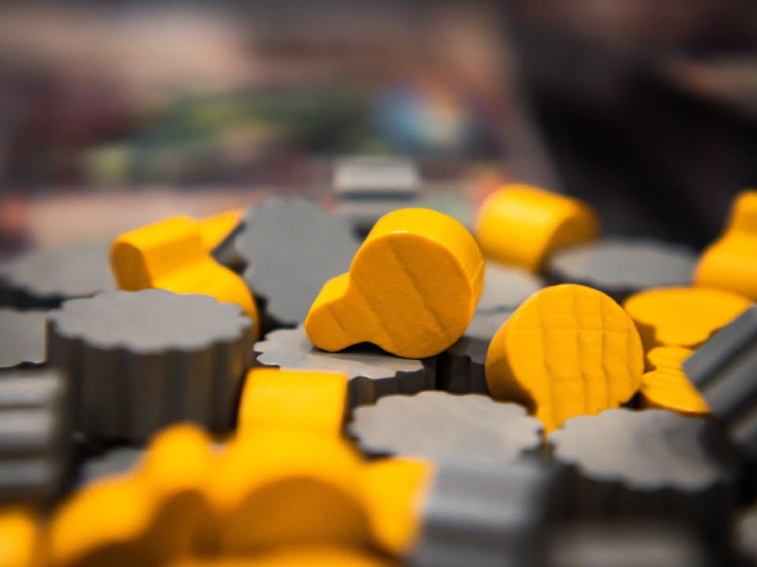
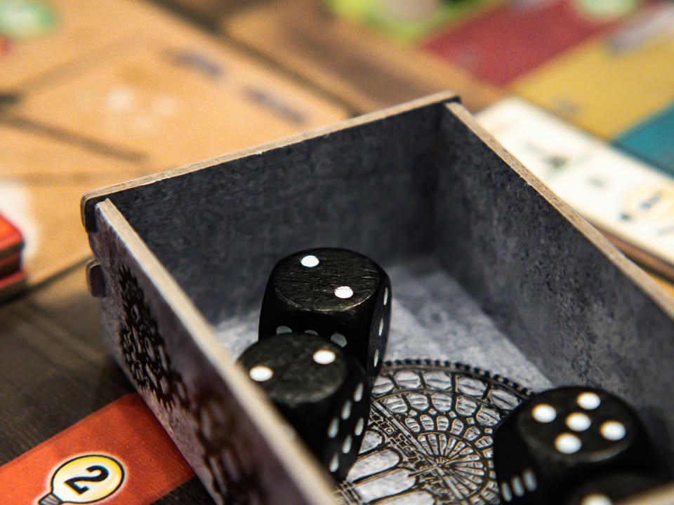
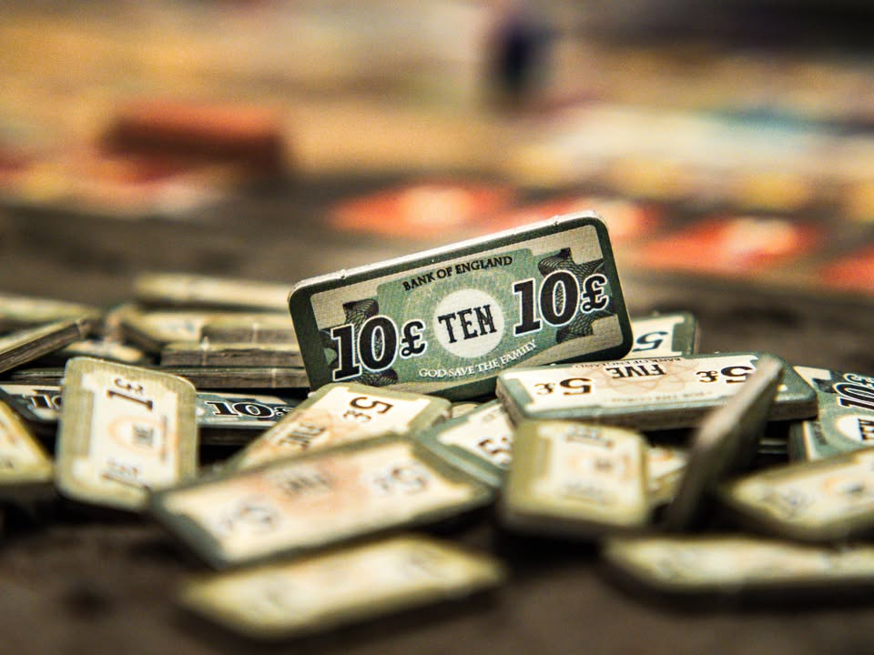
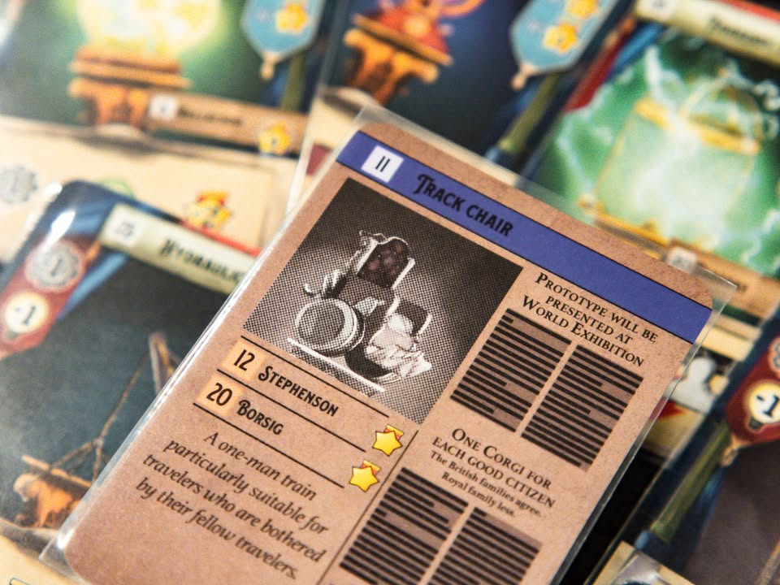
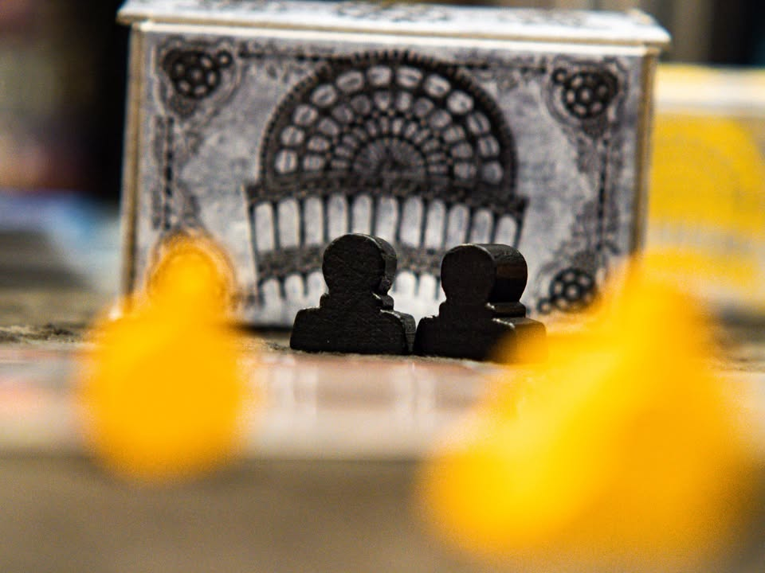
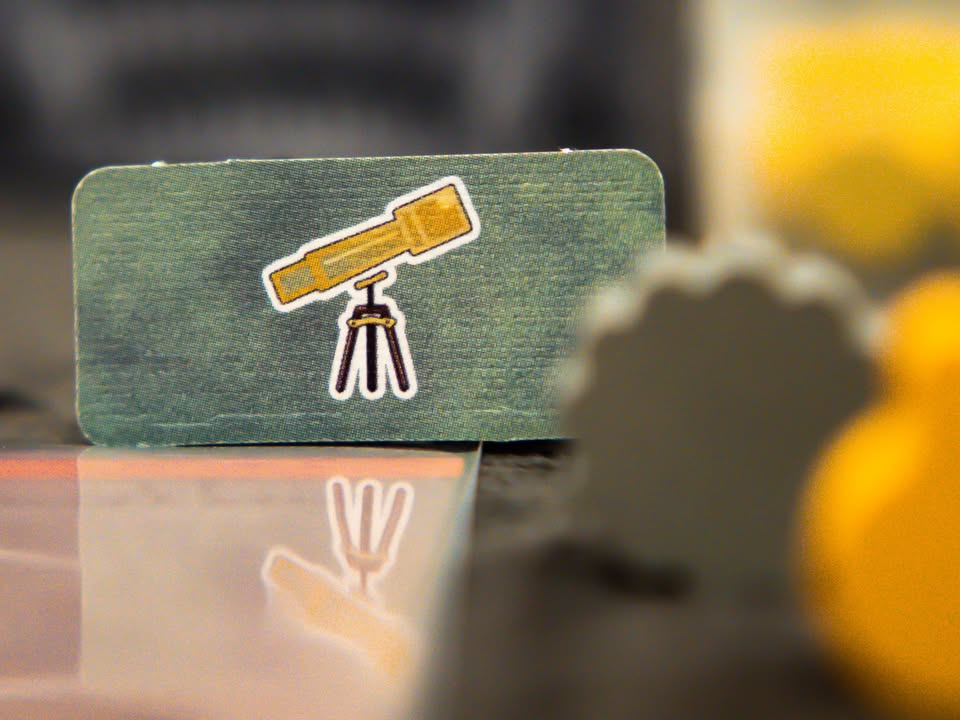
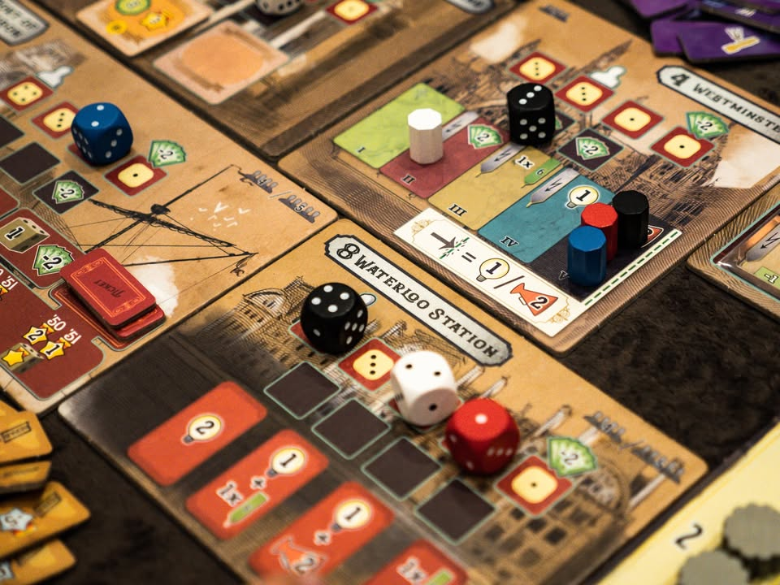

Crystal Palace #thought
blog link: https_://wp.me/p7TSgy-2Qh

▪️ เกมยูโรระดับกลางหนักสไตล์ Dice Placement ที่จะนำเราไปกระทบไหล่นักประดิษฐ์ชื่อดัง ในงานประกวดสุดสร้างสรรค์ ณ เทศกาล World Fair ประเทศอังกฤษ ทั้งของใช้งานได้จริงอันน่าตื่นเต้นไปจนถึงของที่มองแล้วต้องเอียงคออย่าง เครื่องนับแก้วเบียร์ ผลงานของ Carsten Lauber
  
 
▪️แกนเกมนี้ใช้ระบบ Dice Placement ที่เราจะต้องผลัดกันวางลูกเต๋าซึ่งเปรียบเสมือนคนงานที่มีพลังแตกต่างกันไปตามสถานที่ในเกม แต่ล่ะช่องมีพื้นที่วางจำกัด และลูกเต๋าคนงานที่พลังเยอะที่สุดจำนวนหนึ่งเท่านั้นที่จะได้ทำแอคชั่นในแต่ล่ะพื้นที่ตอนจบรอบ 
 
 
▪️โดยที่ความสนุกสำคัญของเกมนี้คือเต๋าไม่ได้เอาไว้ทอย แต่ผู้เล่นจะต้องเลือกหน้าเต๋าเองตั้งแต่ต้นรอบแล้วเปิดพร้อมกัน
 
 
▪️ เพื่อเป็นการจัดสมดุลย์ในเกม แม้ลูกเต๋าแต้มเยอะที่สุดจะช่วยให้เรามีโอกาสได้ทำแอคชั่นเยอะแต่มันก็แลกมากับการที่เราจะต้อง 'จ่าย' เงินค่าเลี้ยงดูตามหน้าเต๋าที่เราเลือก ยิ่งแต้มรวมเยอะก็ยิ่งจ่ายแพง ตรงนี้เราเลยต้องวางกลยุทธ์ให้ดีว่าจะกระจายแต้มเต๋าแบบไหนดี เพราะนอกจากจำนวนหน้าเต๋าแล้ว แต่ละพื้นที่จะมีช่องที่ต้องการหน้าเต๋าขั้นต่ำที่แตกต่างกัน ด้วยเงินที่มีจำกัดทำให้เราต้องแบ่งน้ำหนักของการอยากได้หน้าเต๋าเยอะๆเอาไว้เล่นบางแอคชั่นก่อนแต่ว่าจ่ายแพง หรือจะเล่นหน้าเต๋าแบบพอดีลงช่องได้แต่ต้องไปลุ้นว่าอาจจะได้วาง แต่ดันแต้มไม่เยอะพอที่จะได้ทำแอคชั่น
 
 
▪️ส่วนที่เหลือจะค่อนข้าง abstract ธีมหลวมๆตามสไตล์เกมยูโร แต่ไอเดียหลักคือการหยิบการ์ดสิ่งประดิษฐ์, การ์ดนักประดิษฐ์ กับช่องทรัพยากรที่จะช่วยให้เราเล่นการ์ดทั้งสองชนิดนี้ ซึ่งแต่ล่ะการ์ดก็จะให้ผลประโยชน์ตอนเล่นที่แตกต่างกันออกไป รวมไปถึงจังหวะการเล่นจะได้แต้มในแต่ละยุคไม่เท่ากัน

----------------------------------------------------------
[🐸 Hang out friend, เพื่อนสายประดิษฐ์ไอเทมคุยด้วยก็สนุกดีแต่หลายทีก็งงว่ามันเพ้อเจ้ออะไรของมัน] 

🔹 เป็นเกมที่ต้องยอมรับว่ารู้สึก mixed bag นิดหน่อยคือเล่นรอบแรกแล้วงงมากว่าเกมบ้าอะไรว่ะ วุ่นวายฉิบ (ส่วนหนึ่งอาจจะเพราะไม่ได้อ่านเอง) แต่พอเล่นรอบสองสามแล้วก็ อ่ะสนุกดีได้นั่งลองท่าไปเรื่อย จริงๆน่าจะอยู่แถว Family แต่มาคิดแล้วเล่นไปห้าหกรอบแล้วรู้สึก replayability ยังไม่ใช่แบบที่เรา 'คลิก' ขนาดนั้น แล้วเรื่องประหลาดคือเกมนี้มีจุดประเภท ข้อดีกับข้อที่รำคาญในเกมนี้ดันเป็นเรื่องเดียวกันหลายจุด
 
 
🔹ความเจ๋งและความสดใหม่ของเกมนี้ก็คือระบบเลือกแต้มเต๋าเองนี้แหละ โดยจุดนี้จะเสริมให้เด่นด้วยการที่เงินเกมนี้มีค่อนข้างอัตคัดในระดับที่ทุกคนน่าจะต้องโดนบังคับให้ 'กู้' กันเป็นปกติ ทำให้การนั่งคิดเลขหน้าเต๋าต้องใช้สมองกันซักหน่อย แต่ในอีกแง่ตรงนี้อาจจะเป็นจุดอ่อนเพราะต้องมาเลือกหน้าเต๋าเอง ไม่เหมือนหลายๆเกมที่ให้ทอยเต๋าแล้วมีระบบเปลี่ยนหน้าเต๋าให้ หลายๆรอบมีแอบขี้เกียจเลือกก็ใช้วิธีทอยๆไปก่อนแล้วมาปรับหน้าเต๋าเองก่อนเปิด 
 
 
🔹 ข้อดีตามสไตล์เกมแบบนี้คือ phase ค่อนข้างชัดเจนทำงานเป็นลำดับขั้นสอนตาม Player aid ได้เลย ถึงแม้เกมจะแอบมีอะไรให้เราต้องแทรคหลายจุดอยู่แต่ก็ใช้ไอคอนอธิบายได้ดีเป็นส่วนมาก (คือมันก็แอบมีจุดที่ไม่คลีนบ้างแหละ แต่เล็กน้อย ผ่านเกมแรกไปแล้วก็ไม่น่าจะงงเท่าไร)
 
 
🔹 flow การเลือกแอคชั่นเพื่อไปเก็บทรัพยากรและเอาไปใช้จ่าย รวมไปถึงการใช้ประโยชน์จากการที่เคลมมาค่อนข้างน่าสนใจ เพราะเกมมีลักษณะของการเล่นเป็นสายที่ค่อนข้างชัด ซึ่งแต่ล่ะแอคชั่นมันก็ส่งเสริมให้เราทำแต้มต่างกันไป
 
 
🔹 อย่างการ์ดนักประดิษฐ์นี้มีความสามารถให้แต่ล่ะรอบก็จริงแต่ต้องจ่ายเงินเดือนให้มันด้วย และเงินเดือนก็มีเรทแตกต่างกันไปขึ้นอยู่กับค่าความสัมพันธ์ของเรากับรัฐบาล ซึ่งบางคนยิ่งเราเดินแทรคเยอะจ่ายถูก แต่บางคนก็กลับกัน เวลาเลือกจ้างก็ต้องดูเทียบกันดีๆหน่อย
 
 
🔸 ตัวการ์ดทั้งสิ่งประดิษฐ์และคนทำนี้จะมีการคอมโบกันด้วยอย่างเช่นถ้าสร้างอันนี้แล้วมีอันโน้นก่อนหน้าจะได้แต้มเพิ่ม ซึ่งฟังเหมือนจะดีแต่เล่นจริงแล้วกลับเป็นส่วนที่ไม่ชอบที่สุดในเกมนี้เพราะทุกอย่างมันเปิดมาแบบสุ่ม แล้วเราต้องมาคอยมองว่าอันไหนมันคอมโบกับของเราไหมนะ? แถมแต้มก็น้อยนักขนาด เลยส่งผลให้ออกไปทางรำคาญมากกว่าจะรู้สึกสนุกที่ได้เรียงลำดับออกการ์ดได้อย่างสวยงาม 
 
 
🔸 อีกอันที่ไม่ค่อยชอบนิดๆคือแผ่นแอคชั่นมันทำมาเป็นไทล์ ไม่ได้เป็นกระดาน แล้วขนาดมันไม่เท่ากัน!! วางเรียงก็ไม่สวย ดูแล้วรกหูรกตามาก 
 
 
🗯 ถ้าพูดรวมๆแล้วถามว่าสนุกไหมก็บอกได้ว่าสนุกนะ คิดว่าสายยูโรน่าจะชอบกันเป็นส่วนมาก แต่แอบอธิบายยากจริงๆว่ามันสนุกยังไงเพราะแต่ล่ะส่วนมันออกไปทางเป็นโมดูลของมัน ตอนเล่นก็เล่นตามสายที่ตัวเองคิดไว้ แต่ก็ยังต้องแอบมาเบียดๆกันอยู่ดีเพราะเกมมันบังคับให้เราต้องไปทำแบ่งแอคชั่นเบียดๆกันผ่านระบบในเกม  แต่ส่วนตัวเล่นจบแล้วไม่ค่อยรู้สึกแบบอยากกลับไปนอนคิดท่ามาแก้มือเท่าไร อาจจะเพราะการ์ดมันสุ่มกับสายไม่ชัดเนี่ยแหละ

----------------------------------------------------------
Compatible Level - เกมนี้เข้ากับคนเขียนได้ระดับไหนนะ!!

🐸 Family, อาจจะมีช่วงเวลาที่ไม่เข้าใจกันบ้างแต่ครอบครัวคือสิ่งที่จะอยู่กับเราตลอดไป นี้คือเกมที่จะมีพื้นที่ถาวรในชั้นวางแน่นอน!! แม้บางเกมจะเปรียบดั่งคุณปู่ใจดีที่ได้เจอกันแค่ปีล่ะครั้ง แต่อันดับในใจนั้นคือความสนุกในช่วงเวลาที่เล่น หาใช่การได้เล่นซ้ำไม่รู้เบื่อเพียงอย่างเดียว [ex. กบโปรด, กบชอบ]

🐸 Hang out friend, เพื่อนกินเที่ยว ถ้าไม่ติดธุระอันใดก็พร้อมจะออกไปพบเจอ สนุกยามได้พบปะ แต่จะให้เจอกันบ่อยๆคงใช่ที - เกมสนุกที่อยากเล่นในระดับที่อยากจะหยิบกางเป็นบางครั้ง สลับสับเปลี่ยนไปเรื่อยตามจังหวะและโอกาส แต่เราก็ไม่ได้อยากซ้ำต่อเนื่องรัวๆ [ex. กบโอเค]

🐸 Someone I know, หากบังเอิญพบเจอ ก็คงได้ทักทายไต่ถาม หากแต่ในยามปกติมิอาจนึกชื่อออก ยืนคุยก็ได้ แต่คงไม่ได้เอื่อนเอ่ยนัดกินข้าว - บางเกมเราก็ไม่ได้อยากชวนเล่น แต่ถ้าไม่มีอะไรทำแล้วมีคนชวนก็เล่นก็ได้ [ex. กบเฉย]

🐸 I Turn left, You Turn Right - เธอชอบกินเผ็ด เราชอบกินอาหารญี่ปุ่น เธอชอบคนคารมดีพาไปกินที่หรู แต่เราชอบเล่นเกมอยู่กับบ้าน แม้จะได้คุยเป็นบางคราแต่คงไม่อาจพัฒนาความสัมพันธ์ - บางเกมแม้ว่าจะดีแค่ไหน แต่ถ้ารสนิยมมันไปด้วยกันไม่ได้ก็ไม่รู้จะเล่นไปทำไม [ex. กบไม่เล่น]
 
 
อนึ่ง : เป็นความรู้สึกในความ "อยากจะหยิบมาเล่นไหม?" ของผมเอง ไม่ได้เกี่ยวอะไรกับคุณภาพของเกม ไม่อิงมาตราฐานอื่นใดนอกจากตัวเองเท่านั้น ดูให้เป็นแค่ "อีกความคิดเห็นหนึ่ง" เท่านั้นก็พอนะครับ :)

