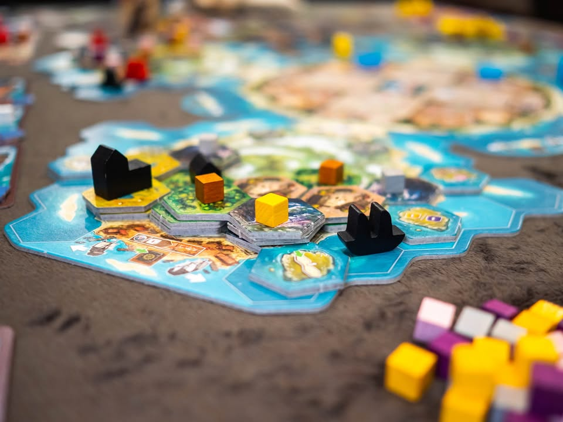
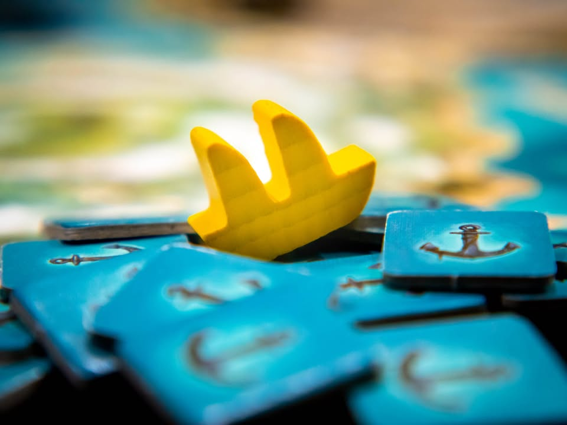
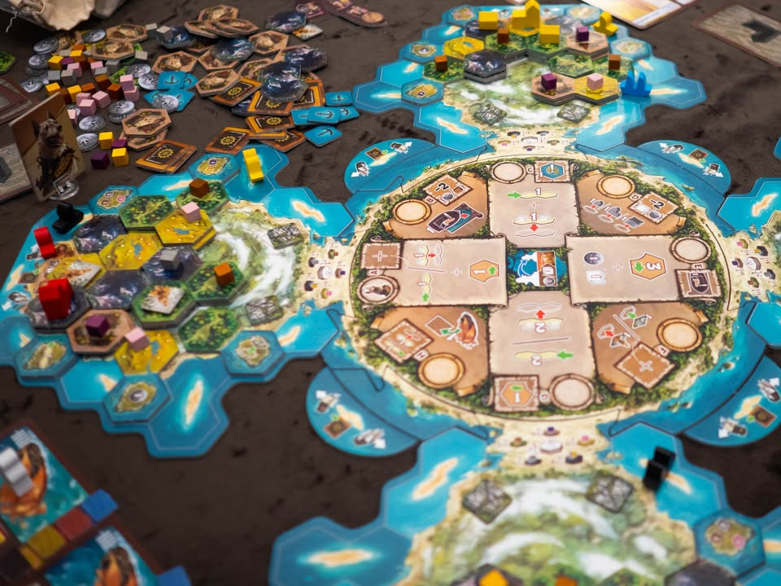
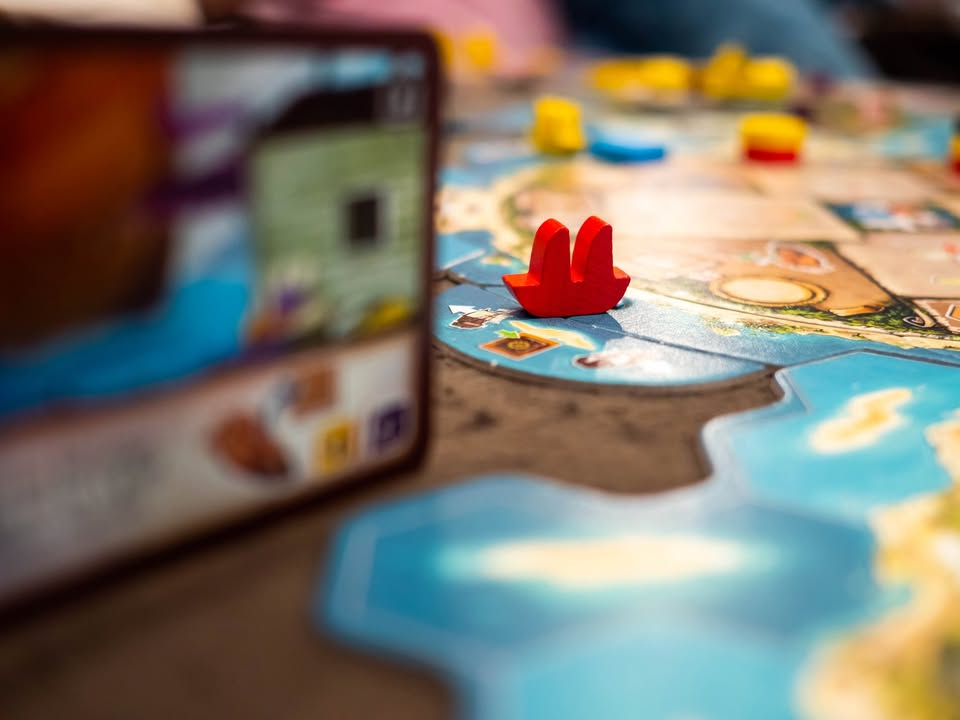
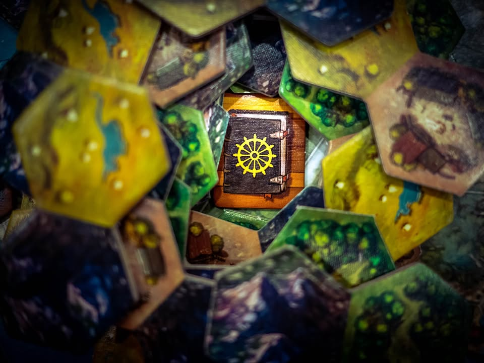

Cooper Island #thought
blog link: https://wp.me/p7TSgy-2Qz
 
▪️เกมยูโรระดับหนักว่าด้วยการสำรวจและพัฒนาเกาะคูเปอร์ อันเป็นชื่อหมาของนักออกแบบที่เอามาแต่งเรื่องว่าเป็นคนเจอเกาะตอนล่องเรือสำรวจดินแดน..... ผลงานจากนักออกแบบสายหยิบเกมชาวบ้านมายำ Andreas "ode." Odendahl (La Granja, Solarius Mission)
 
 
▪️สิ่งหนึ่งที่อยากจะบอกเลยคือเกมนี้จะไม่ทำให้คุณรู้สึก 'หนัก' อย่างที่ตัวเลขใน BGG บอกคุณแน่นอน ถ้าเล่นเกมแถว weight 3.0 ได้ก็เล่นเกมนี้ได้สบายๆ
 
 
▪️แผนที่ในเกมจะเป็นเกาะแห่งหนึ่งที่มีคาบสมุทรยื่นออกไปเท่ากับจำนวนผู้เล่น (บอร์ดเป็นแบบ puzzle ปรับตามจำนวนคนเล่น) ซึ่งระหว่างเล่นเราก็ต่างคนต่างพัฒนาบอร์ดตัวเองเนี่ยแหละไม่ไปยุ่งกับคนอื่น แกนเกมเดินด้วยระบบ Worker Placement  ที่เราจะผลัดกันส่งคนงานไปทำแอคชั่นบนกลางเกาะ 
 
 
▪️แกนหลักเพื่อหาทรัพยากรของเกมจะมาในรูปของการวางไทล์ซ้อนกันเป็นชั้นสามมิติทุกครั้งที่วางไทล์บนพื้นที่เราก็จะมี cube ทรัพยากรเกิดขึ้นมา เราก็ต้องเอา cube นี้ไปใช้จ่ายสร้างของทำเครื่องจักรทำคะแนนส่วนตัวของเราไป ไอเดียของเกมจะอยู่ที่ไทล์แต่ล่ะชนิดต้องสร้างทับแบบเดิมเท่านั้น และด้วยการที่ไทล์มันมีหลายชนิด เราก็ต้องแก้ปัญหาหน้างานในการเลือกซักหน่อยว่าจะวางอันไหนให้เยอะดี
 
 
▪️ลูกเล่นที่คิดว่าออกแบบมาฉลาดมากของเกมนี้คือเราจะวางไทล์ทับ cube ไม่ได้ต้องเอาไปใช้ก่อน และ cube จะไม่โผล่มาถ้าไม่วางไทล์ ทำให้เราต้องบริหารทรัพยากรตลอด รวมไปถึงสิ่งปลูกสร้างในเกมนี้เวลาสร้างมันจะต้องวางบนไทล์ที่สูงที่สุดที่ยังว่างอยู่ ณ ตอนนั้น ทำให้พอเราสร้างตึกแล้วมันก็มักจะจำกัดการวางไทล์ทำให้เราเล่นยากขึ้นอีกนิด กับตัวตึกในเกมไม่มีความสามารถแน่นอน พอสร้างทีก็ต้องจั่วการ์ดแล้วเลือกความสามารถอีกที
 
 
▪️ระบบ worker placement ของเกมนี้เป็นแบบ friendly คือไม่บล๊อกกัน เราสามารถวางทับคนอื่นได้ แต่ว่าต้องจ่ายทรัพยากรของเราให้กับผู้เล่นคนนั้น และเกมนี้แอคชั่นที่ให้ทำได้มีแค่ไม่กี่อย่าง เป็นวางไทล์ไปซะครึ่งหนึ่ง ส่วนอีกครึ่งก็เป็นการใช้จ่ายสร้างของผลิตแต้มในสไตล์ที่ต่างกัน
 
  
▪️ความน่าสนใจอีกอย่างของเกมนี้คือระบบเดินแต้มแบบไม่มีตัวเลขที่ทำออกมาได้เรียบง่ายแต่สวยมาก คืออย่างที่บอกว่าบอร์ดผู้เล่นทุกคนนี้คือเกาะใหญ่เกาะเดียว แล้วผู้เล่นก็อยู่คนล่ะฝากเกาะ เกมจะมีเรือให้เราสองลำตรงท่าเรือเราลำนึงเดินซ้ายลำนึงเดินขวา ตอนที่เราได้แต้มเราก็เลือกได้ว่าจะเดินเรือไปทางไหน กิมมิคคือทุกๆห้าครั้งจะได้มาร์คเกอร์แต้มมาเก็บไว้ และพอเราเดินไปโผล่แถวๆบอร์ดเพื่อนบ้าน เราก็จะได้รับสิทธิ์ประโยชน์จากไทล์โบนัสของคนอื่นด้วย คือไทล์โบนัสที่เราใช้เร่งเกมตัวเองต้นเกมก็อาจจะกลายเป็นตัวช่วยให้ผู้เล่นคนอื่นตอนเค้าแวะมาหาด้วย วิธีทำแต้มลบก็เจ๋งดีคือแทนที่จะให้เดินถอยหลังหรือเก็บ token เกมจะให้เราเอาไทล์สมอเรือไปวางไว้ที่เรือแทน เวลาเดินหน้าก็ต้องถอนสมอออกแทนการติดลบแต้ม
 
--------------------------------------------------

[🐸 Family, แม้ตัวจะโดดเดี่ยวแต่ใจเรานั้นเชื่อมถึงกัน]

🔹 เกมนี้ถ้าเล่นปีที่แล้วจะอยู่ติด top 10 แบบไม่ต้องคิดแน่นอน เล่นแล้วประทับใจส่วนหนึ่งน่าจะเป็นเพราะต้องวางไทล์ซ้อนเป็นสามมิติ (ซึ่งเอาจริงๆแล้วไม่ได้เกี่ยวอะไรขนาดนั้นแค่พอดีชอบเกมที่มีกิมมิคแบบนี้ อย่าง Taluva ไรงี้) 
 
  
🔹ความน่าสนใจคือเกมนี้เป็นเกมที่ให้อารมณ์ solitaire สูงเกมหนึ่ง ซึ่งปกติผมจะไม่ค่อยคลิกนัก ตัวอย่างก็อย่าง Paladin of The West Kingdom ที่ interaction ของเกมมันเกิดในรูปแบบที่ถ้าคุณมองมันก็มี แต่ถ้าคุณไม่แคร์ก็เหมือนเล่นคนเดียว แต่ว่าเกมนี้เล่นแล้วผมสนุกกับการกลับบ้านไปตีลังกาคิดท่าที่จะมาเล่นในรอบต่อไป
 
  
🔹 เหตุผลที่เป็นแบบนั้นเพราะมันเป็นเกมที่มี puzzle ที่ค่อนข้าง clean และมี state ของความไม่แน่นอนในระดับที่ไม่ตายตัวจนเกินไปนัก รวมไปถึงมี path ในการทำแต้มที่หลากหลาย ซึ่งถ้าพูดง่ายๆก็แบบ solid euro ที่ผมชอบนั้นเอง
 
 
🔹 ข้อดีสำหรับผมจะอยู่ที่เกมค่อนข้างสอนง่าย สำหรับเกมที่มีส่วนประกอบย่อยๆแบบนี้ ตัวเกมแบ่งเฟสค่อนข้างคลีนและ player board ช่วยอธิบายแอคชั่นได้ดี อารมณ์การวางเลย์เอ้าเหมือนพวกเกมของ Stefan Feld ที่ตอนแรกจะงงๆหน่อย แต่พอรู้ว่าจะดูอะไรแล้วก็จะมีประโยชน์มาก
 
 
👁‍🗨 จุดกลางๆก็อยู่ที่เกมมันอยู่ตัวคนเดียวเป็นหลัก interaction ที่คนอื่นทำแล้วมีผลกับเราจริงๆก็คือโบนัสไทล์ที่เราอยากจะเดินเรือไปหา กับอารมณ์บล๊อกกระจึ๋งเดียวจากการที่เราต้องไปจ่ายทรัพยากรให้เค้าถ้าต้องลงทีหลัง ซึ่งเกมมันมีแอคชั่นไม่กี่อย่าง สุดท้ายก็เหมือนจ่ายไปจ่ายกลับไม่โกง แต่พูดโดยรวมคือเกมมันไม่มีการบล๊อกหรือแย่งอะไรกัน เป็นแนวนั่งคิดท่าของตัวเองไป
 
 
👁‍🗨 จุดกลางๆอีกจุดคือ noise ในเกมนี้ผมคิดว่ามีน้อยไปนิด แต่ล่ะเกมก็จะเป็นแนวไปคิดท่ามาจากบ้านก่อน แล้วไปปรับเปลี่ยนท่าเอาจากความสามารถตึกที่จั่วได้ แต่ด้วยสายที่มีหลายแบบให้ลองท่า อย่างน้อยๆผมก็มองตัวเองเล่นเกมนี้ได้ซักสิบรอบก่อนที่จะต้องพักเบรคทิ้งไว้ซักพักก่อนกลับมาเล่นใหม่นะ แต่ถ้าออกตัวเสริมเพิ่มจำนวน noise อีกหน่อยก็น่าจะดีมากเลย
 
 
🔸 ถ้าพูดถึงจุดที่ไม่ชอบนี้ยังนึกไม่ค่อยออกเท่าไร แต่คิดว่าหลักๆน่าจะเป็นไทล์โบนัสกับ engine มันพอดีเกินไปหน่อย อยากให้มีเยอะกว่านี้ กับการ์ดสิ่งปลูกสร้างเกมนี้เป็นแบบสุ่ม แล้วเราไม่รู้จนกว่าจะสร้างแล้วค่อยไปจั่วดู เลยทำให้เกมมันดูดวงๆไปซักนิดถ้าการ์ดตึกมันไม่ส่งเสริมกับสายที่เรากำลังจะทำ (แต่ค่อนข้าง minor นะเพราะยังไม่เจออันที่รู้สึกว่าโกง)
 
 
🔸 จุดที่ยังไม่แน่ใจนักน่าจะเป็นการที่เราจะปลดล๊อกเพิ่มคนงานในเกมนี้เราต้องไปทำเงื่อนไข mission ในเกม ซึ่งมันก็คือต้องไปสร้างของในเกมเนี่ยล่ะ กลายเป็นว่าถ้าอยากจะเปิดคนงานหมดเราก็ต้องไปทำท่าจับฉ่ายเพราะ mission มันไปคนล่ะทางเลย แต่ถ้ามุ่งทำสายเดียวคนงานเราก็จะน้อย ซึ่งตรงนี้มีจุดที่น่าสนใจอีกว่าเราเลือกได้ว่าจะเพิ่มจำนวนคนงานหรือจะยกระดับคนงานเดิมให้ทำช่องแอคชั่นแล้วได้ส่วนลดก็ได้
 
 
👁‍🗨 จุดที่คิดว่าทำให้เกมนี้คนรู้สึกว่ายากคือแอคชั่นมีน้อย... น้อยโคตรๆ คนงานมีแค่สองตัวแต่เล่นแค่ห้ารอบ แต่ต้องทำอะไรล้านแปด ซึ่งเล่นเกมนี้ครั้งแรกกว่าคุณจะรู้สึกเหมือนได้ทำอะไรซักอย่างก็ไปโน้นรอบสาม....(เกมเล่นห้ารอบ) แต่พอเริ่มเข้าใจก็จะสามารถออกท่าทำแต้มได้ง่ายขึ้น
 
 
🗯 ถ้าคุณชอบเกมสไตล์ยูโรใช้ความคิด กติกาไม่ยุ่งยากเงื่อนไขแยะ มีวิธีชนะหลายทางและไม่มีปัญหากับเกมที่แทบไม่มี conflict เลย หรือถ้าชอบเกมที่มีกลิ่น point salad อย่างพวกเกมของ  Stefan Feld เกมนี้ก็อยากแนะนำอีกเกมครับ

----------------------------------------------------------
Compatible Level - เกมนี้เข้ากับคนเขียนได้ระดับไหนนะ!!

🐸 Family, อาจจะมีช่วงเวลาที่ไม่เข้าใจกันบ้างแต่ครอบครัวคือสิ่งที่จะอยู่กับเราตลอดไป นี้คือเกมที่จะมีพื้นที่ถาวรในชั้นวางแน่นอน!! แม้บางเกมจะเปรียบดั่งคุณปู่ใจดีที่ได้เจอกันแค่ปีล่ะครั้ง แต่อันดับในใจนั้นคือความสนุกในช่วงเวลาที่เล่น หาใช่การได้เล่นซ้ำไม่รู้เบื่อเพียงอย่างเดียว [ex. กบโปรด, กบชอบ]

🐸 Hang out friend, เพื่อนกินเที่ยว ถ้าไม่ติดธุระอันใดก็พร้อมจะออกไปพบเจอ สนุกยามได้พบปะ แต่จะให้เจอกันบ่อยๆคงใช่ที - เกมสนุกที่อยากเล่นในระดับที่อยากจะหยิบกางเป็นบางครั้ง สลับสับเปลี่ยนไปเรื่อยตามจังหวะและโอกาส แต่เราก็ไม่ได้อยากซ้ำต่อเนื่องรัวๆ [ex. กบโอเค]

🐸 Someone I know, หากบังเอิญพบเจอ ก็คงได้ทักทายไต่ถาม หากแต่ในยามปกติมิอาจนึกชื่อออก ยืนคุยก็ได้ แต่คงไม่ได้เอื่อนเอ่ยนัดกินข้าว - บางเกมเราก็ไม่ได้อยากชวนเล่น แต่ถ้าไม่มีอะไรทำแล้วมีคนชวนก็เล่นก็ได้ [ex. กบเฉย]

🐸 I Turn left, You Turn Right - เธอชอบกินเผ็ด เราชอบกินอาหารญี่ปุ่น เธอชอบคนคารมดีพาไปกินที่หรู แต่เราชอบเล่นเกมอยู่กับบ้าน แม้จะได้คุยเป็นบางคราแต่คงไม่อาจพัฒนาความสัมพันธ์ - บางเกมแม้ว่าจะดีแค่ไหน แต่ถ้ารสนิยมมันไปด้วยกันไม่ได้ก็ไม่รู้จะเล่นไปทำไม [ex. กบไม่เล่น]
 
 
อนึ่ง : เป็นความรู้สึกในความ "อยากจะหยิบมาเล่นไหม?" ของผมเอง ไม่ได้เกี่ยวอะไรกับคุณภาพของเกม ไม่อิงมาตราฐานอื่นใดนอกจากตัวเองเท่านั้น ดูให้เป็นแค่ "อีกความคิดเห็นหนึ่ง" เท่านั้นก็พอนะครับ :)

