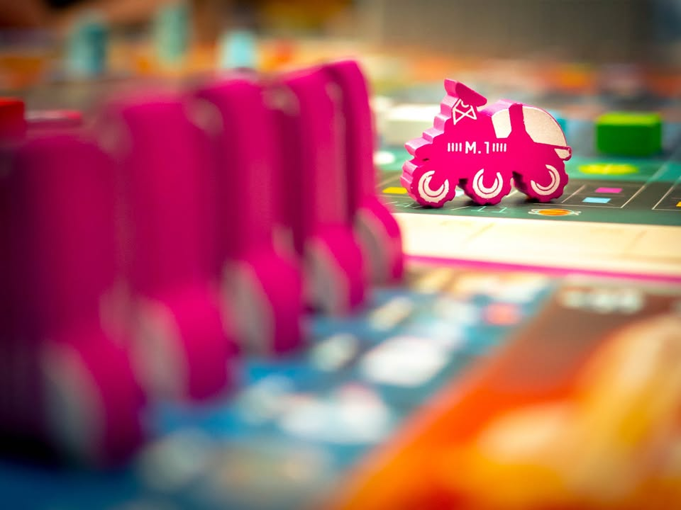
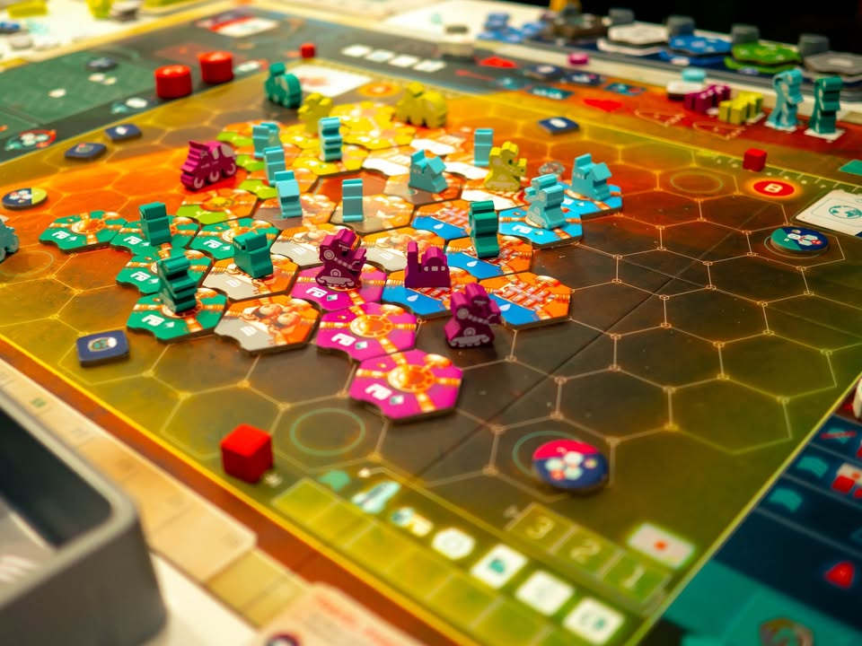
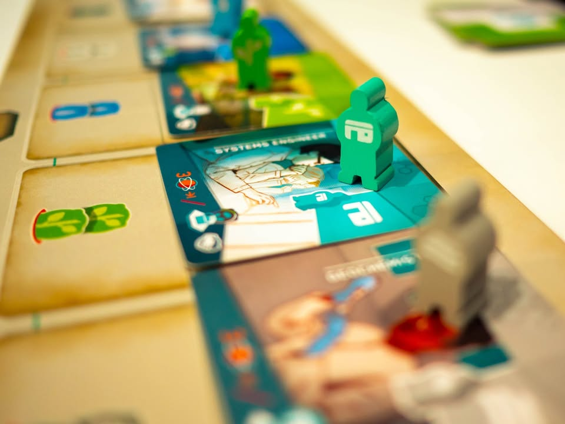

On Mars #บ่นไปเรื่อย #โปรดอย่าเรียกว่ารีวิว
blog link: https://wp.me/p7TSgy-2QN
 
▪️เกมนี้พึ่งเล่นไปครั้งเดียว ไม่รู้จะได้เล่นอีกไหม แต่อยากยกมาเล่าสู่กันฟัง เพราะถ้าใครตามเพจนี้มาประมาณนึงจะทราบว่าผมรู้สึกกับผลงานการออกแบบของ Vital Lacerda แบบไหน.... (อัตราเผาไหม้ 90%)
  
  
▪️หนึ่งในเรื่องใหญ่สำหรับบอร์ดเกมของผมเนี่ยคือ 'การสอน' มันจะมีเกมแบบที่ผมรู้เลยว่าถ้าผมเป็นคนสอนผมจะไม่ชอบ (งงเด้... ) หรือเกมที่ถ้าคนสอนอธิบายไม่ได้แนวที่ผมย่อยได้ก็จะไม่ชอบ (เป็นความอ่อนด้อยส่วนตัว) บลาๆ ซึ่งทำให้ผมค่อนข้างเรื่องมากพอดูกว่าจะจองคิวคนมาสอนเกมนี้ผมได้ เพราะนี้มันคือเกมจากนักออกแบบที่ผมไม่ได้คลิกกับจริตการออกแบบประสบการณ์การใช้สมองนัก เลยอยากเลือกสภาพแวดล้อมที่ดีไว้ก่อน
  
  
▪️ผมเป็นคนชอบเกมที่มันส่งต่อโมดูลกันแบบคลีนๆ ไม่ชอบอะไรแบบยึกยัก สรุปแบบรวบรัดคือจากกรอบนั้นแล้ว On Mars เป็นเกมยูโรที่ผมเล่นแล้วรู้สึกสนุกกับการได้แก้ puzzle ออกท่าสร้างของ 'เป็นเกมแรก' ของนักออกแบบคนนี้ 
  
  
▪️ธีมก็ตามชื่อพัฒนาสร้างโคโลนีดาวอังคารกันไป วิธีทำแต้มมีหลายสาย และหลายขยัก อันที่เห็นแล้วเข้าใจง่ายๆคือการวางไทล์ผลิตทรัพยากรในกระดานกลาง เกมมันก็ให้เราเอาหุ่นยนต์วิ่งไปมาเล็งทีไว้ก่อนแล้วค่อยทำแอคชั่นจ่ายทรัพยากร ซึ่งก็มีเงื่อนไขเรื่องตำแหน่งและขนาดกลุ่มนิดหน่อย ที่เหลือก็แนวยูโรแต้มบานทั่วไปสร้างนั้นนี้โน้นเดี๋ยวแต้มมาเอง มีสายให้ทำเพื่อเร่ง engine แต้มที่มีระยะทำคะแนนที่แตกต่างกัน
  
  
▪️ความน่าสนใจของเกมนี้ที่ผมคิดว่าเจ๋งมากคือระบบ 'ยืมเทคโนโลยี' คือแอคชั่นหลายอย่างในเกมนี้ถ้าไม่มีไทล์เทคโนโลยีก็จะสร้างไม่ได้ หรือบางแอคชั่นถ้ามีเทคโนโลยีก็จะบูสได้อีก เกมนี้ถ้าเราไม่มีเองก็ชี้ว่าจะใช้ของคนอื่นก็ได้ แลกกับการที่เจ้าของเค้าจะเลือกได้ว่าจะได้พัฒนาเทคที่คนมายืมใช้ฟรีๆ หรือจะเอาทรัพยากรฟรีก็ได้ โดยทีคนไปยืมใช้ไม่ต้องจ่ายอะไรเลย
 
 
▪️ซึ่งตรงนี้มันเจ๋งตรงมันช่วยปลดล๊อก mindset บางอย่างของคนคิดเยอะ กับความเหนื่อยหน่ายประเภทอันนี้ก็ไม่ได้ อันโน้นก็ไม่มีได้ดีมาก รวมไปถึงสร้างบรรยากาศการที่ต้องไปชะโงกดูผู้เล่นอื่นแบบไม่ฝืนจนเกินไป  (แบบ Trismegistus นี้ผมไม่ชอบมาก)
   
   
▪️ความน่าสนใจ (และยากถ้าเล่นพลาดแล้วจะพังยาวจนจบเกม) อีกอย่างของระบบเกมนี้คือมันแบ่งแอคชั่นเป็นสองฟากคือส่วนวงโคจร กับส่วนบนผิวดาว ซึ่งเราจะ active ตัวเองอยู่ได้แค่ฝั่งใดฝั่งหนึ่งเท่านั้น เกมจะมีจังหวะให้เราย้ายฟากเป็นระยะ ซึ่งช่วงต้นเกมจะย้ายได้บ่อยแต่ช่วงท้ายจะต้องค้างอยู่ฝั่งหนึ่งนานขึ้น ถ้าตัดสินใจย้ายฟากพลาดหรือนับจังหวะไม่ดีก็อาจจะต้องติดค้างกับแอคชั่นที่ไม่อยากทำนานจนเซง (ซึ่งเกมก็มีตัวช่วยนิดนึงนะ ไม่ใช่เรื่องคอขาดบาดตายขนาดนั้น)
 
 
▪️จุดที่เราอาจจะขัดๆอยู่บ้างคือมันก็ยังแอบมีข้อกำหนดจุกจิกเล็กๆที่ต้องคอยระวังอยู่หลายที่เหมือน แบบตอนนี้เก็บของได้แค่นี้ เฟสนี้ยังสร้างจรวดได้แค่เท่าโน้น แต่โดยรวมถ้าเล่นจบไปรอบสองรอบก็ค่อนข้างโอเคละนะ กับอีกอันคือด้วยความที่บอร์ดมันใหญ่ การ์ดแอคชั่นพิเศษนี้อยู่คนละฝั่งกับผมพอดี แล้วมันมองยากลายตามากว่ามันทำอะไรได้ ตอนแรกเลยข้ามสายนั้นไปเลย กลับมาแอบซื้อบ้างตอนท้ายเกม
 
 
▪️เนื่องจากเล่นรอบเดียวคงให้เกรดอะไรจริงจังไม่ได้ แต่ในภาพรวมอยู่ใน ระดับชอบปริ่มๆ-โอเคปลายๆ นะ เป็นเกมที่เล่นแล้วสนุกดี เป็นเกมของ Vital ที่ลงตัวมาก ไม่มี interlock ขันแน่น ใส่ตัวช่วยทำให้เกมคล่องในจุดที่ควร จังหวะออกคะแนนหลายจังหวะพอให้ลุ้นว่าแต้มจะแซงไหม สัดส่วนการวางแผนระยะสั้นและไกลค่อนข้างลงตัว ส่วนตัวไม่คิดว่ามันเป็นเกมที่เล่นยากและซับซ้อนเชิงปวดหัวนะรู้สึกเหมือนเล่นเกม 3 ปลายมากกว่าจะเป็น 4+ (ถ้าสอนดี)
 
 
 ▪️ในกลุ่มใช้เวลาเล่น 4 คนรวมสอนอยู่ที่สองชั่วโมงกลาง (เป็นมือใหม่สอง) เล่นแบบสั้น (เพราะถ้ากบเผาจะได้ดีดตัวไว) ที่ไม่ได้เยอะกว่านี้น่าจะเพราะเล่นแล้วยังไม่ตราตรึงแบบอยากจะซ้ำๆ ทั้งๆที่ไม่ได้รู้สึกล้าอะไร แต่เกมก็มีพื้นที่ในการกลับมาเล่นซ้ำเยอะทีเดียวนะ เพราะแผนหน้างานต้องปรับบ่อยเวลาโดนแย่งสร้าง แล้วก็เทคโนโลยีที่เราและเพื่อนมี 
  
  
▪️อนึ่ง....ถ้าเล่นเกมนี้กับวง AP นี้ขอบายนะ เกมมีอะไรให้คิดได้หลากหลายมาก พอดีผมมีทักษะ no care ของที่ไม่จำเป็นต้องรู้เลยไม่รู้สึกว่าเกมมันโหลด (อย่างตอนเล่น Feudum งี้ ของที่เราไม่ได้ทำก็อย่าไปสนสิฟระเล่นแต่เรื่องตัวเองไป!! คล่องก่อนค่อยไปสู่รู้)
 
 
▪️ กับ....มัวแต่คิดเลยไม่ได้จัดของถ่ายภาพ .... ซึ่งก็น่าจะบอกได้กลายๆว่าเล่นค่อนข้างเพลินนะไม่มีเวลาไปนั่งจับของจัดฉาก :D
 
 
▪️ และ... ขอบคุณคุณแบงค์จาก งงเหลือหลาย เล่นอะไรก็สนุก คนสอนมาก เพราะเล่นแล้วการันตีได้ว่าเกมนี้อยู่ผิดวงนี้มีเผา.....

